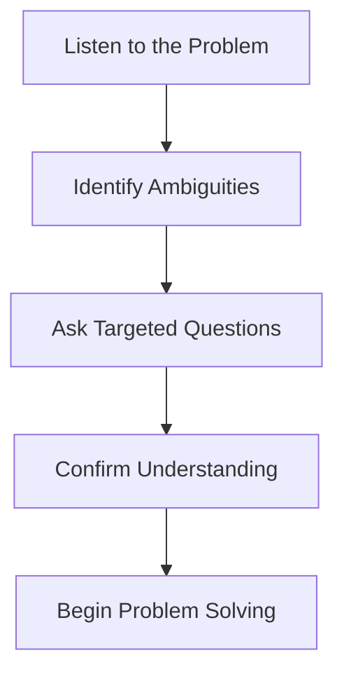

# Asking Clarifying Questions

## Introduction

When faced with a technical problem during an interview, your first instinct might be to start coding immediately. However, rushing into implementation without fully understanding the problem can lead to wasted time and incorrect solutions. This is where the skill of asking clarifying questions becomes crucial.

Asking clarifying questions serves multiple purposes:

- Ensures you understand the problem correctly
- Demonstrates your analytical thinking process
- Reveals your communication skills
- Helps you identify edge cases and constraints
- Shows that you approach problems methodically

This guide will teach you how to ask effective clarifying questions during programming interviews, with examples and practical applications.

## Why Asking Questions Matters

Interviewers often intentionally provide vague or incomplete problem statements to assess how you handle ambiguity. By asking thoughtful questions, you:

1. **Demonstrate critical thinking** - You show that you can identify assumptions and gaps in requirements
2. **Build rapport** with the interviewer through meaningful dialogue
3. **Save time** by avoiding work on solutions that don't meet the actual requirements
4. **Reduce anxiety** by gaining a clearer picture of what you need to solve

## Types of Clarifying Questions

### 1. Input Clarification Questions

```javascript
// Example problem: "Write a function to reverse a string"

// Questions to ask:
// - What type of input should I expect? Only strings?
// - Can the input be empty or null?
// - Does the input contain special characters or just alphanumeric?
// - Should I handle Unicode characters?

function reverseString(str) {
  // Handling null/undefined input based on clarification
  if (str === null || str === undefined) {
    return "Invalid input";
  }
  
  return str.split('').reverse().join('');
}

// Example usage:
console.log(reverseString("hello")); // "olleh"
console.log(reverseString("")); // ""
console.log(reverseString(null)); // "Invalid input"
```

### 2. Output Clarification Questions

```javascript
// Example problem: "Write a function to find duplicate numbers in an array"

// Questions to ask:
// - Should I return all duplicates or just the first one?
// - What format should the output be in? (array, object, etc.)
// - Should I return the duplicate values or their indices?
// - Should I modify the original array or return a new one?

function findDuplicates(nums) {
  const duplicates = [];
  const seen = new Set();
  
  for (const num of nums) {
    if (seen.has(num)) {
      duplicates.push(num);
    } else {
      seen.add(num);
    }
  }
  
  return duplicates;
}

// Example usage:
console.log(findDuplicates([1, 2, 3, 1, 4, 2])); // [1, 2]
```

### 3. Constraint Clarification Questions

```javascript
// Example problem: "Sort an array of integers"

// Questions to ask:
// - What's the expected time/space complexity?
// - How large is the input array?
// - Is there a specific sorting algorithm you'd like me to implement?
// - Are there any constraints on memory usage?

// Solution optimized for time complexity after clarification
function sortArray(nums) {
  // Using built-in sort for O(n log n) time complexity
  return [...nums].sort((a, b) => a - b);
}

// If interviewer wants custom implementation:
function customMergeSort(nums) {
  if (nums.length <= 1) return nums;
  
  const mid = Math.floor(nums.length / 2);
  const left = customMergeSort(nums.slice(0, mid));
  const right = customMergeSort(nums.slice(mid));
  
  return merge(left, right);
}

function merge(left, right) {
  const result = [];
  let i = 0, j = 0;
  
  while (i < left.length && j < right.length) {
    if (left[i] <= right[j]) {
      result.push(left[i++]);
    } else {
      result.push(right[j++]);
    }
  }
  
  return result.concat(left.slice(i)).concat(right.slice(j));
}
```

### 4. Edge Case Clarification Questions

```javascript
// Example problem: "Write a function to divide two numbers"

// Questions to ask:
// - How should I handle division by zero?
// - Should I round the result or return a floating-point number?
// - What's the expected behavior for very large numbers?
// - How should I handle negative numbers?

function divide(a, b) {
  // Handle division by zero
  if (b === 0) {
    throw new Error("Cannot divide by zero");
  }
  
  // Return exact result as floating-point
  return a / b;
}

// Example usage:
console.log(divide(10, 2)); // 5
console.log(divide(7, 2)); // 3.5
try {
  console.log(divide(5, 0));
} catch (error) {
  console.log(error.message); // "Cannot divide by zero"
}
```

## A Structured Approach to Asking Questions

To ask questions effectively, follow this four-step process:

<div className="mermaid">

</div>

### Step 1: Listen Carefully to the Problem

Before asking any questions, make sure you've listened attentively to the problem statement. Take notes if necessary.

### Step 2: Identify Potential Ambiguities

Look for:
- Vague terms or requirements
- Missing information about inputs or outputs
- Unspecified constraints
- Potential edge cases

### Step 3: Ask Targeted Questions

Frame your questions to be specific and relevant:

- "Could you clarify what format the input will be in?"
- "Should I handle edge cases such as...?"
- "Are there any performance constraints I should be aware of?"
- "What should happen if the input is invalid?"

### Step 4: Confirm Your Understanding

After receiving answers:
- Summarize the problem in your own words
- Discuss your approach at a high level
- Get confirmation before proceeding to code

## Real-World Interview Scenario

Let's walk through a complete example of how to apply this process in an interview setting.

**Interviewer:** "Write a function that finds the most frequent element in an array."

**Candidate's Clarifying Questions:**

1. **Input Clarification:**
   "What types of elements will the array contain? Integers, strings, or any data type?"

2. **Edge Cases:**
   "How should I handle an empty array? What if there are multiple elements with the same highest frequency?"

3. **Performance Expectations:**
   "Are there any constraints on time or space complexity I should optimize for?"

**Interviewer's Responses:**
- "The array will contain only integers."
- "Return null for an empty array. If there are multiple elements with the same frequency, return any one of them."
- "Try to optimize for time complexity."

**Candidate's Solution After Clarification:**

```javascript
function findMostFrequent(arr) {
  // Handle empty array case
  if (arr.length === 0) return null;
  
  // Create frequency map
  const frequencyMap = {};
  let maxFrequency = 0;
  let mostFrequentElement;
  
  // Count occurrences of each element
  for (const num of arr) {
    frequencyMap[num] = (frequencyMap[num] || 0) + 1;
    
    // Update most frequent element if needed
    if (frequencyMap[num] > maxFrequency) {
      maxFrequency = frequencyMap[num];
      mostFrequentElement = num;
    }
  }
  
  return mostFrequentElement;
}

// Example usage:
console.log(findMostFrequent([1, 2, 3, 2, 4, 2, 5])); // 2
console.log(findMostFrequent([])); // null
console.log(findMostFrequent([1, 1, 2, 2])); // Either 1 or 2
```

## Common Pitfalls to Avoid

1. **Asking too many questions**
   - Focus on questions that are truly necessary for solving the problem
   - Prioritize questions about critical ambiguities

2. **Asking overly generic questions**
   - Be specific about what you need to clarify
   - Avoid questions with obvious answers

3. **Not listening to the answers**
   - Pay close attention to the interviewer's responses
   - Take notes if necessary

4. **Forgetting to confirm understanding**
   - After receiving clarification, summarize your understanding
   - Make sure you're on the same page before coding

## Practice Exercise: Clarifying Questions

To practice this skill, try the following exercise:

1. For each of these vague problem statements, write down at least 3 clarifying questions:
   - "Create a function to validate a password"
   - "Implement a cache"
   - "Design a function to parse CSV data"
   - "Write an algorithm to detect cycles"

2. For each question you wrote, consider:
   - What information are you trying to uncover?
   - How would different answers affect your solution?
   - Is this question necessary to solve the problem?

## Summary

Asking clarifying questions is a crucial skill that sets apart great candidates in technical interviews. By taking the time to fully understand the problem before diving into code, you demonstrate thoughtfulness, communication skills, and a methodical approach to problem-solving.

Remember these key points:
- Questions about inputs, outputs, constraints, and edge cases are essential
- Follow a structured approach: listen, identify ambiguities, ask targeted questions, confirm understanding
- Practice this skill alongside technical preparation
- Use the clarification phase to build rapport with your interviewer

The ability to ask good questions doesn't just help you in interviews—it's a valuable skill throughout your programming career that will help you write better, more robust code and collaborate effectively with teammates.

## Additional Resources

- Practice with a friend who can intentionally give you vague problems
- Record yourself in mock interviews to assess your questioning technique
- Read interview experiences on platforms like LeetCode and HackerRank to see how others handle ambiguity
- Join coding interview prep groups where you can role-play interviewer and candidate