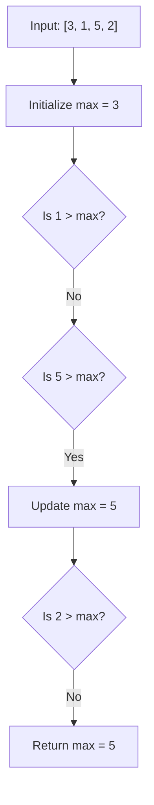
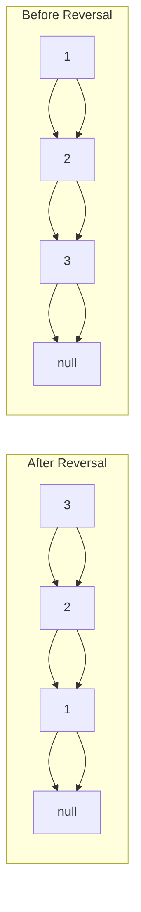

# Testing Your Solutions

## Introduction

When solving programming problems during interviews or real-world development, writing code is only half the battle. The other crucial half is ensuring your solution works correctly across all possible inputs. Thorough testing is what separates professional developers from novices, and it's often a key factor that interviewers look for in candidates.

This guide will walk you through systematic approaches to test your solutions effectively, helping you catch bugs before your interviewer does and building confidence in your code.

## Why Testing Matters

Consider this scenario: you've just spent 20 minutes in an interview solving a problem. Your interviewer asks, "Does your solution work?" Without proper testing, your answer might be uncertain.

Testing your solutions:

- Validates that your code works as expected
- Helps identify edge cases you might have missed
- Demonstrates thoroughness and attention to detail to interviewers
- Builds your confidence in the solution
- Prevents embarrassing bugs from being discovered by others

## Systematic Testing Approach

### 1. Start With Small Test Cases

Begin with simple, easy-to-verify examples to check basic functionality.

```javascript
// Problem: Write a function to find the maximum value in an array

function findMax(arr) {
  if (!arr || arr.length === 0) return null;
  
  let max = arr[0];
  for (let i = 1; i < arr.length; i++) {
    if (arr[i] > max) {
      max = arr[i];
    }
  }
  return max;
}

// Simple test case
const test1 = [1, 3, 5, 2, 4];
console.log(findMax(test1)); // Expected output: 5
```

### 2. Test Edge Cases

Edge cases are inputs at the extremes of the possible range. They often reveal bugs in otherwise functional code.

Common edge cases include:

- Empty inputs (empty arrays, strings, etc.)
- Single-element inputs
- Very large or very small values
- Negative numbers (when relevant)
- Inputs with duplicate values
- Inputs at size limits (minimum/maximum array length, etc.)

```javascript
// Testing edge cases for our findMax function
console.log(findMax([])); // Expected: null
console.log(findMax([42])); // Expected: 42
console.log(findMax([-5, -10, -15])); // Expected: -5
console.log(findMax([5, 5, 5, 5])); // Expected: 5
```

### 3. Trace Through Your Algorithm

For complex problems, manually trace through your algorithm with a small input, tracking variable values at each step. This helps identify logical errors.



### 4. Use Visualization

For algorithms involving data structures like trees, graphs, or complex operations, drawing out the state at key points can help verify correctness.

For example, when testing a function that reverses a linked list:



### 5. Create Comprehensive Test Suites

For more complex problems, creating a set of test cases covering different scenarios helps ensure thoroughness.

```javascript
function testFindMax() {
  // Test case 1: Normal array
  console.log(findMax([1, 3, 5, 2, 4]) === 5 ? "PASS" : "FAIL");
  
  // Test case 2: Empty array
  console.log(findMax([]) === null ? "PASS" : "FAIL");
  
  // Test case 3: Single element
  console.log(findMax([42]) === 42 ? "PASS" : "FAIL");
  
  // Test case 4: Negative numbers
  console.log(findMax([-5, -10, -15]) === -5 ? "PASS" : "FAIL");
  
  // Test case 5: Duplicates
  console.log(findMax([5, 5, 5, 5]) === 5 ? "PASS" : "FAIL");
  
  // Test case 6: Mixed positive and negative
  console.log(findMax([-5, 10, -15, 20]) === 20 ? "PASS" : "FAIL");
}

testFindMax();
```

## Real-World Example: Testing a String Reversal Function

Let's look at how we might systematically test a function that reverses a string:

```javascript
function reverseString(str) {
  if (!str) return "";
  return str.split('').reverse().join('');
}

// Testing approach
function testReverseString() {
  // Regular case
  console.log("Test 1:", reverseString("hello") === "olleh" ? "PASS" : "FAIL");
  
  // Edge case: Empty string
  console.log("Test 2:", reverseString("") === "" ? "PASS" : "FAIL");
  
  // Edge case: Single character
  console.log("Test 3:", reverseString("a") === "a" ? "PASS" : "FAIL");
  
  // Edge case: String with spaces
  console.log("Test 4:", reverseString("hello world") === "dlrow olleh" ? "PASS" : "FAIL");
  
  // Edge case: Palindrome
  console.log("Test 5:", reverseString("racecar") === "racecar" ? "PASS" : "FAIL");
  
  // Edge case: Special characters
  console.log("Test 6:", reverseString("a!b@c#") === "#c@b!a" ? "PASS" : "FAIL");
  
  // Edge case: Null input
  console.log("Test 7:", reverseString(null) === "" ? "PASS" : "FAIL");
}

testReverseString();
```

## Interview-Specific Testing Strategies

### Time Management

In interviews, time is limited. Here's a structured approach to testing within time constraints:

1. **First 60-70% of time**: Understand the problem and develop a solution
2. **Next 20-30% of time**: Implement your solution
3. **Last 10% of time**: Test your solution

### Verbalize Your Testing Process

Talk through your testing process out loud. This shows interviewers your thought process:

"Now that I've implemented the solution, let's test it with a few examples to verify it works correctly. First, I'll try a simple case..."

### Be Proactive With Edge Cases

Identify potential edge cases before the interviewer asks about them:

"I should also check how the function handles empty input, extremely large values, and negative numbers..."

## Common Patterns for Testing Different Algorithms

### Testing Search Algorithms

- Element exists at the beginning, middle, and end
- Element doesn't exist in the array
- Multiple occurrences of the target element
- Empty array

### Testing Sorting Algorithms

- Already sorted array
- Reverse sorted array
- Array with duplicate values
- Array with a single element or empty array

### Testing Tree Operations

- Empty tree
- Tree with only a root node
- Balanced vs. unbalanced trees
- Operations on leaf nodes vs. internal nodes

## Debugging When Tests Fail

When a test fails, follow these steps:

1. **Don't panic!** Test failures are a normal part of development
2. **Review the failing input** and expected output
3. **Trace through your algorithm** step by step with the failing input
4. **Use print statements** to track variable values if necessary
5. **Fix the issue** and rerun all tests to ensure no regressions

```javascript
function buggyMax(arr) {
  if (!arr || arr.length === 0) return null;
  
  let max = arr[0];
  // BUG: Starting loop from index 0 instead of 1
  for (let i = 0; i < arr.length; i++) {
    if (arr[i] > max) {
      max = arr[i];
    }
  }
  return max;
}

// Debugging process
const testArr = [1, 3, 5, 2];
console.log("Input:", testArr);
console.log("Output:", buggyMax(testArr));
console.log("Expected:", 5);

// Fixed function
function fixedMax(arr) {
  if (!arr || arr.length === 0) return null;
  
  let max = arr[0];
  // Fixed: Starting loop from index 1
  for (let i = 1; i < arr.length; i++) {
    console.log(`Comparing max=${max} with arr[${i}]=${arr[i]}`);
    if (arr[i] > max) {
      max = arr[i];
      console.log(`Updated max to ${max}`);
    }
  }
  return max;
}
```

## Testing Complex Solutions: Divide and Conquer

For complex algorithms, test each component separately before testing the entire solution.

Example: Testing a solution that finds the k-th largest element in an array:

```javascript
// Main function
function findKthLargest(nums, k) {
  // Sort the array in descending order
  const sorted = sortDescending(nums);
  // Return the k-th element
  return sorted[k-1];
}

// Helper function
function sortDescending(nums) {
  return [...nums].sort((a, b) => b - a);
}

// Test helper function first
function testSortDescending() {
  console.log(sortDescending([3, 1, 4, 2])); // Expected: [4, 3, 2, 1]
  console.log(sortDescending([])); // Expected: []
  console.log(sortDescending([5])); // Expected: [5]
}

// Then test the main function
function testFindKthLargest() {
  console.log(findKthLargest([3, 1, 4, 2], 2) === 3 ? "PASS" : "FAIL");
  console.log(findKthLargest([5, 5, 5, 5], 1) === 5 ? "PASS" : "FAIL");
  console.log(findKthLargest([7], 1) === 7 ? "PASS" : "FAIL");
}
```

## Summary and Best Practices

Effective testing is a skill that improves with practice. Remember these key points:

1. **Start simple**, then test edge cases
2. **Be systematic** in your approach
3. **Verbalize your testing** process during interviews
4. **Create test cases** that cover different scenarios
5. **Manage your time** efficiently, reserving time for testing
6. **Debug methodically** when tests fail

By incorporating thorough testing into your problem-solving routine, you'll not only perform better in interviews but also develop habits that will serve you well throughout your programming career.

## Practice Exercises

1. Take a solution you've already written and develop a comprehensive test suite for it
2. Identify all possible edge cases for a function that:
   - Finds the median of an array
   - Checks if a string is a valid palindrome
   - Merges two sorted arrays
3. Find a bug in a function by writing tests that expose the issue

## Additional Resources

- **Unit Testing Frameworks**: Learn basics of Jest, Mocha, or other testing frameworks
- **Test-Driven Development (TDD)**: A methodology where tests are written before the solution
- **Mock Interview Platforms**: Practice testing your solutions on platforms like LeetCode, HackerRank, or CodeSignal
- **Debugging Techniques**: Learn to use debugging tools in your preferred IDE or browser

Remember, the goal of testing isn't just to verify your solution works, but to build confidence in your code and demonstrate your thoroughness as a developer.