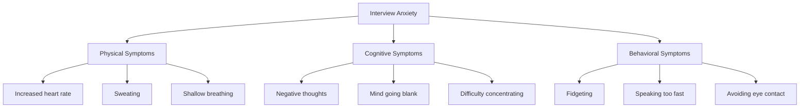

# Interview Anxiety Management

## Introduction

Technical interviews can be stressful experiences, especially for beginners. The combination of technical challenges, time pressure, and evaluation can trigger anxiety that may prevent you from showcasing your true abilities. This guide explores the nature of interview anxiety, its common symptoms, and provides practical strategies to manage it effectively so you can perform at your best during programming interviews.

## Understanding Interview Anxiety

Interview anxiety is a normal physiological and psychological response to the perceived pressure of being evaluated. In the context of programming interviews, this anxiety can be particularly intense due to the technical nature of the assessment.



### Why Programming Interviews Feel Different

Programming interviews often combine multiple stressors:

1. **Technical challenges**: Solving problems under time pressure
2. **Communication demands**: Explaining your thinking process
3. **Performance evaluation**: Being judged on both your solution and approach
4. **Imposter syndrome**: Feeling like you don't deserve to be there

## Preparation Strategies to Reduce Anxiety

The most effective way to reduce interview anxiety is thorough preparation. Here are specific strategies:

### 1. Master the Fundamentals

Anxiety often stems from uncertainty. By strengthening your understanding of core concepts, you build confidence in your abilities.

```javascript
// Example: Understanding scope in JavaScript
function outer() {
  let outerVar = "I'm outside!";
  
  function inner() {
    let innerVar = "I'm inside!";
    console.log(outerVar); // Can access outer variable
    console.log(innerVar); // Can access its own variable
  }
  
  inner();
  // console.log(innerVar); // Would cause an error - can't access inner variable
}

outer();

// Output:
// I'm outside!
// I'm inside!
```

### 2. Practice Mock Interviews Regularly

Simulate the interview environment to desensitize yourself to its pressures. Practice with:

- Friends or peers
- Online platforms like LeetCode or HackerRank
- Mock interview services

### 3. Create a Study Plan

A structured approach reduces feeling overwhelmed:

```javascript
const studyPlan = {
  week1: {
    topics: ["Arrays", "Strings"],
    problems: 15,
    mockInterviews: 1
  },
  week2: {
    topics: ["Linked Lists", "Stacks", "Queues"],
    problems: 15,
    mockInterviews: 1
  },
  // Continue for your preparation timeline
};
```

## In-the-Moment Anxiety Management

Even with thorough preparation, you might experience anxiety during the interview. Here are techniques to manage it:

### 1. Controlled Breathing

```javascript
function breathingExercise() {
  // 4-7-8 Breathing Technique
  console.log("Inhale through nose for 4 seconds");
  console.log("Hold breath for 7 seconds");
  console.log("Exhale through mouth for 8 seconds");
  console.log("Repeat 3-5 times");
}
```

### 2. Reframe Your Thinking

Challenge negative thoughts with more realistic and helpful ones:

| Negative Thought | Reframed Thought |
|------------------|------------------|
| "I'll completely freeze up." | "I've prepared well and can navigate through challenges." |
| "They'll think I'm incompetent." | "This is one opportunity to demonstrate what I know." |
| "If I make a mistake, it's over." | "Mistakes happen; what matters is how I recover." |

### 3. The "Think Aloud" Protocol

Verbalize your thought process, which serves multiple purposes:

```python
def find_maximum(array):
    """
    Example of thinking aloud during a coding problem.
    """
    # Think aloud: "Let me understand the problem first. I need to find the maximum value in this array."
    
    if not array:
        # Think aloud: "I should check for edge cases. What if the array is empty?"
        return None
    
    current_max = array[0]
    # Think aloud: "I'll start by assuming the first element is the maximum."
    
    for number in array[1:]:
        # Think aloud: "Now I'll compare each element with my current maximum."
        if number > current_max:
            # Think aloud: "I found a larger number, so I'll update my current maximum."
            current_max = number
    
    # Think aloud: "After checking all elements, I've found the maximum value."
    return current_max

# Example usage
input_array = [3, 7, 2, 9, 1, 5]
maximum = find_maximum(input_array)
print(f"Maximum value: {maximum}")

# Output:
# Maximum value: 9
```

Benefits of thinking aloud:
- Slows down your thinking, reducing panic
- Shows interviewers your approach even if you don't complete the problem
- Makes it easier for interviewers to provide hints
- Demonstrates communication skills

## Common Interview Scenarios and How to Handle Them

### Scenario 1: Mind Going Blank

```javascript
// Strategy: Use the STAR method to buy thinking time
const STAR = {
  Situation: "Let me understand the context of this problem...",
  Task: "So I need to accomplish...",
  Action: "My approach would be to...",
  Result: "This should give us the expected output because..."
};
```

### Scenario 2: Getting Stuck on a Problem

```javascript
const unstuckStrategies = [
  "Break the problem into smaller parts",
  "Solve a simpler version first",
  "Work through a concrete example",
  "Consider edge cases",
  "Ask clarifying questions"
];
```

### Scenario 3: Making a Mistake

```python
# Example: Recovering from a mistake
def calculate_average(numbers):
    # Initial implementation with a bug
    total = 0
    for num in numbers:
        total += num
    return total  # Forgot to divide by length
    
    # Noticing the mistake during testing
    """
    Interviewer: "Let's test with [1, 2, 3]"
    You: "That gives 6... wait, that's the sum, not the average.
         Let me fix that by dividing by the length of the array."
    """
    
    # Corrected implementation
    total = 0
    for num in numbers:
        total += num
    return total / len(numbers)  # Fixed by dividing
```

## Real-World Success Stories

### Case Study: From Freezing Up to Flowing Through

Aisha, a bootcamp graduate, struggled with severe interview anxiety that caused her to freeze during technical questions. She implemented these strategies:

1. **Preparation**: Created a structured study plan covering fundamentals
2. **Practice**: Scheduled 15 mock interviews with peers and mentors
3. **Mindset**: Developed personalized anxiety management techniques
4. **Communication**: Practiced thinking aloud while solving problems

Result: Successfully navigated her next interview by managing anxiety triggers and secured a junior developer position.

## Building Long-Term Interview Confidence

Interview anxiety management is a skill that improves with practice. Consider these approaches for lasting confidence:

### Create Your Personal Feedback Loop

```javascript
function interviewRetrospective(interview) {
  const analysis = {
    technicalStrengths: [],
    technicalWeaknesses: [],
    anxietyTriggers: [],
    effectiveStrategies: [],
    improvementPlan: {}
  };
  
  // Fill this out after each interview or mock interview
  // Use insights to refine your preparation and anxiety management
  
  return analysis;
}
```

### Track Your Progress

Monitor improvements in both technical skills and anxiety management:

```python
def track_progress(week_number):
    """
    Example progress tracking function
    """
    metrics = {
        "problems_solved": 0,
        "concepts_mastered": [],
        "anxiety_level": {
            "before_practice": 0,  # 1-10 scale
            "after_practice": 0    # 1-10 scale
        },
        "confidence_level": 0      # 1-10 scale
    }
    
    # Update weekly and observe trends
    return metrics
```

## Summary

Interview anxiety is a common challenge for programmers at all levels, but particularly for beginners. By understanding its nature and implementing specific preparation and management strategies, you can significantly reduce its impact on your performance.

Remember that:
- Thorough preparation builds confidence
- Practice desensitizes you to interview pressure
- In-the-moment techniques can help manage acute anxiety
- A growth mindset turns each interview into a learning opportunity

The goal isn't to eliminate anxiety completely—some tension can actually improve performance—but to manage it effectively so you can showcase your true abilities during technical interviews.

## Additional Resources

### Practice Exercises

1. **Anxiety Baseline Assessment**: Rate your anxiety in different interview scenarios and identify specific triggers
2. **Mock Interview Schedule**: Create a 4-week plan with progressively challenging practice interviews
3. **Personalized Coping Strategies**: Develop and test 3-5 strategies that work for your specific anxiety symptoms

### Recommended Reading and Tools

- Books on technical interview preparation
- Mindfulness and anxiety management resources
- Online platforms for mock interview practice
- Communities for peer support during interview preparation