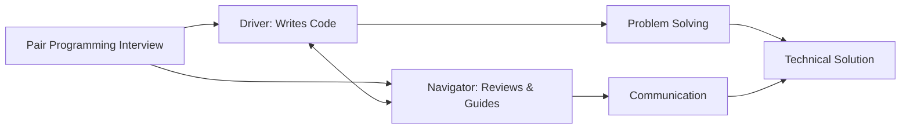

# Pair Programming Simulation

## Introduction

Pair programming is a software development technique where two programmers work together at one workstation. One programmer, the "driver," writes the code while the other, the "navigator," reviews each line of code as it's written. This technique has become increasingly popular in technical interviews as it helps assess not only your coding skills but also your communication and collaboration abilities.

This guide will help you understand what pair programming interviews are, how to prepare for them, and how to excel in them through practical simulations.

## What is a Pair Programming Interview?

A pair programming interview simulates real-world collaborative coding scenarios. During this type of interview:

- You work directly with an interviewer on a coding problem
- You take turns being the "driver" (writing code) and the "navigator" (reviewing and guiding)
- The focus is on your problem-solving approach and communication, not just the final solution



## Key Roles in Pair Programming

### The Driver

As the driver, you are responsible for:

- Writing the actual code
- Implementing the agreed-upon approach
- Focusing on the tactical details of syntax and implementation

### The Navigator

As the navigator, you are responsible for:

- Reviewing code as it's written
- Thinking about the strategic direction
- Spotting potential issues or bugs
- Suggesting improvements or alternatives

## Pair Programming Simulation Example

Let's walk through a practical example of how a pair programming session might unfold during an interview.

### Problem Statement

> Write a function that finds the longest substring without repeating characters in a given string.

### Simulation Dialogue

#### Initial Discussion

**Interviewer (Navigator):** "Let's think about this problem. We need to find the longest substring without any repeated characters. What approach do you think might work here?"

**You (Driver):** "I'm thinking we could use a sliding window approach with a hashmap or set to keep track of characters we've seen. Does that sound reasonable?"

**Interviewer:** "Yes, that sounds like a good approach. Would you like to start implementing it?"

#### Implementation Phase

**You (Driver):**

```javascript
function longestSubstringWithoutRepeats(s) {
  let maxLength = 0;
  let start = 0;
  const charMap = new Map();
  
  for (let end = 0; end < s.length; end++) {
    const currentChar = s[end];
    
    if (charMap.has(currentChar)) {
      // Move start pointer to position after the last occurrence of currentChar
      // Note: Math.max is needed in case the previous occurrence is before the current start
      start = Math.max(start, charMap.get(currentChar) + 1);
    }
    
    // Update the position of currentChar
    charMap.set(currentChar, end);
    
    // Update maxLength if current window is larger
    maxLength = Math.max(maxLength, end - start + 1);
  }
  
  return maxLength;
}
```

**Interviewer (Navigator):** "That looks good. Let's trace through this with an example input to make sure it works correctly. Can we try with the string 'abcabcbb'?"

**You (Driver):** "Sure, let's trace through it..."

#### Testing Phase

**You (Driver):** 
"Let's trace the execution:
1. For `a`: `charMap = {'a' → 0}`, `maxLength = 1`
2. For `b`: `charMap = {'a' → 0, 'b' → 1}`, `maxLength = 2`
3. For `c`: `charMap = {'a' → 0, 'b' → 1, 'c' → 2}`, `maxLength = 3`
4. For `a`: We've seen 'a' before at position 0, so `start = 1`, `charMap = {'a' → 3, 'b' → 1, 'c' → 2}`, `maxLength = 3`
5. And so on..."

**Interviewer (Navigator):** "Great, that looks correct. What's the time and space complexity of this solution?"

**You (Driver):** "The time complexity is O(n) where n is the length of the string, as we're only traversing the string once. The space complexity is O(min(m, n)) where m is the size of the character set and n is the length of the string."

## Tips for Successful Pair Programming Interviews

### Communication is Key

- **Think aloud:** Share your thought process as you work through the problem
- **Ask clarifying questions:** Ensure you understand the requirements fully
- **Discuss trade-offs:** Talk about alternative approaches and their pros/cons

### Collaborative Problem-Solving

- **Welcome feedback:** Be open to suggestions from your interviewer
- **Build on ideas:** Treat the process as collaborative, not competitive
- **Find balance:** Know when to listen and when to contribute

### Technical Preparation

- **Practice common algorithms:** Sort, search, graph traversal, dynamic programming
- **Know your language well:** Be comfortable with syntax and standard libraries
- **Understand time/space complexity:** Be ready to analyze and optimize your code

## Common Challenges and How to Handle Them

### Getting Stuck

If you get stuck during a pair programming interview:

- **Don't panic:** It's normal and expected
- **Break it down:** Try to solve a simpler version of the problem first
- **Ask for hints:** It's better to make progress with a hint than to remain stuck

```javascript
// Example of breaking down a complex problem
// Instead of directly solving the entire problem:

// 1. First, just check if a string has any repeating characters
function hasRepeatingCharacters(s) {
  const charSet = new Set();
  for (const char of s) {
    if (charSet.has(char)) return true;
    charSet.add(char);
  }
  return false;
}

// 2. Then build up to finding the longest substring
```

### Debugging Under Pressure

When your code has bugs during the interview:

- **Stay calm:** Debugging is a normal part of coding
- **Use test cases:** Trace through with specific examples
- **Narrow down the issue:** Use console logs or breakpoints if allowed

## Role Reversal Exercise

Practice switching between driver and navigator roles with a friend:

1. Choose a medium-difficulty coding problem
2. Set a timer for 10 minutes
3. One person starts as the driver, the other as navigator
4. Switch roles after the timer goes off
5. Continue until the problem is solved

This exercise helps you develop skills for both roles and improves your adaptability.

## Sample Pair Programming Problems

Here are some problems you can practice with a partner:

1. **String Manipulation:** Implement a function to check if a string is a palindrome
2. **Array Processing:** Find all pairs in an array that sum to a given target
3. **Data Structure Implementation:** Build a simple LRU cache
4. **Algorithm Design:** Implement a function to find the kth largest element in an array

### Example Problem Walkthrough

Let's see how you might approach the palindrome problem in a pair programming setting:

```javascript
// Driver writes:
function isPalindrome(str) {
  // Remove non-alphanumeric characters and convert to lowercase
  const cleanStr = str.replace(/[^a-zA-Z0-9]/g, '').toLowerCase();
  
  // Navigator might suggest:
  // "We could check if the reversed string equals the original"
  
  // Driver continues:
  const reversedStr = cleanStr.split('').reverse().join('');
  return cleanStr === reversedStr;
}

// Testing
console.log(isPalindrome("A man, a plan, a canal: Panama")); // Output: true
console.log(isPalindrome("race a car")); // Output: false
```

## Summary

Pair programming interviews evaluate not just your coding abilities but also your communication skills and how well you collaborate with others. By practicing both the driver and navigator roles, thinking aloud, and focusing on clear communication, you can excel in these interviews.

Remember that the journey to the solution is often more important than the solution itself. Interviewers want to see how you think, how you handle feedback, and how you work with others.

## Practice Exercises

1. **Basic:** Implement a function to reverse a string using pair programming
2. **Intermediate:** Create a function that detects if two strings are anagrams of each other
3. **Advanced:** Build a simple tic-tac-toe game with a partner, alternating driver/navigator roles every 15 minutes

## Additional Resources

- Join coding communities where you can find pair programming partners
- Participate in virtual coding dojos or mob programming sessions
- Use collaborative coding platforms like CodePen, Replit, or CodeSandbox for remote practice