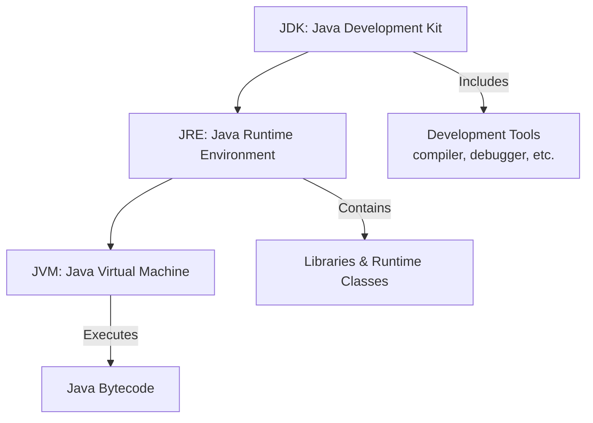
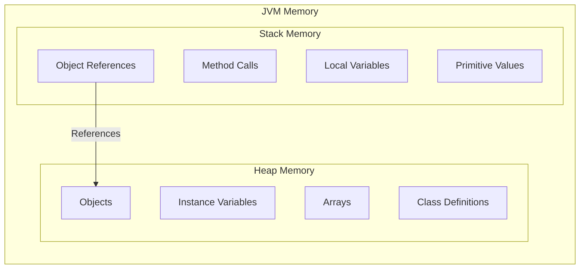
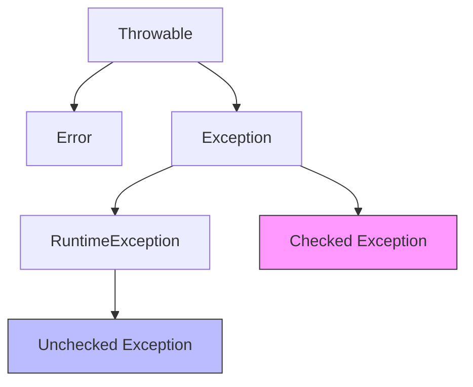
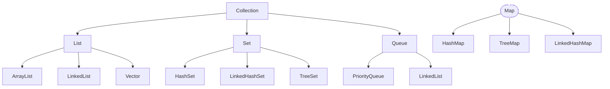

# Java Interview Questions

## Introduction

Java remains one of the most popular programming languages in the industry, making it a common subject in technical interviews. This guide covers frequently asked Java interview questions, providing clear explanations and examples to help beginners prepare for programming interviews. Understanding these core concepts will not only help you succeed in interviews but also build a strong foundation in Java development.

## Basic Java Concepts

### What is Java?

Java is a high-level, class-based, object-oriented programming language designed to have as few implementation dependencies as possible. It follows the "Write Once, Run Anywhere" (WORA) principle, meaning compiled Java code can run on all platforms that support Java without recompilation.

### What are the main features of Java?

- **Object-Oriented**: Java is based on the concept of objects that contain data and methods
- **Platform-Independent**: Java code compiles to bytecode that runs on any device with a Java Virtual Machine (JVM)
- **Robust**: Java has strong memory management and exception handling
- **Secure**: Java runs programs in a virtual machine sandbox for security
- **Multithreaded**: Java supports concurrent programming with built-in thread support
- **Architecture-Neutral**: Java is not dependent on any specific hardware

### What is the difference between JDK, JRE, and JVM?



- **JDK (Java Development Kit)**: Complete development kit including JRE, compiler, debugger, and other tools needed for Java application development
- **JRE (Java Runtime Environment)**: Contains the libraries, JVM, and other components to run Java applications, but not development tools
- **JVM (Java Virtual Machine)**: The virtual machine that runs Java bytecode, providing platform independence

### What is the Java package?

A package in Java is a namespace that organizes a set of related classes and interfaces. Packages help in avoiding name conflicts and organizing code in a modular way.

```java
// Declaring a package
package com.example.myapp;

// Importing a class from another package
import java.util.ArrayList;

public class MyClass {
    // Class code
}
```

## Object-Oriented Programming in Java

### What are the four principles of OOP in Java?

1. **Encapsulation**: Bundling data (attributes) and methods that operate on the data into a single unit (class) and restricting direct access to some components

2. **Inheritance**: The ability of a class to inherit properties and methods from another class

3. **Polymorphism**: The ability of objects to take on many forms. In Java, this is implemented through method overloading and method overriding

4. **Abstraction**: Hiding the complex implementation details and showing only the necessary features of an object

### What is the difference between an abstract class and an interface?

| Abstract Class | Interface |
|----------------|-----------|
| Can have abstract and non-abstract methods | Before Java 8, could only have abstract methods; now can have default and static methods |
| Can have constructors | Cannot have constructors |
| Can have instance variables | Can only have constants (public static final variables) |
| A class can extend only one abstract class | A class can implement multiple interfaces |
| Can have access modifiers for methods | Methods are implicitly public |

```java
// Abstract class example
abstract class Animal {
    protected String name;
    
    public Animal(String name) {
        this.name = name;
    }
    
    public abstract void makeSound(); // Abstract method
    
    public void eat() { // Non-abstract method
        System.out.println(name + " is eating");
    }
}

// Interface example
interface Flyable {
    void fly(); // implicitly public abstract
    
    // Default method (Java 8+)
    default void glide() {
        System.out.println("Gliding through the air");
    }
}
```

### What is method overloading and method overriding?

**Method Overloading**: Defining multiple methods with the same name but different parameters in the same class.

```java
public class Calculator {
    public int add(int a, int b) {
        return a + b;
    }
    
    public double add(double a, double b) {
        return a + b;
    }
    
    public int add(int a, int b, int c) {
        return a + b + c;
    }
}
```

**Method Overriding**: Defining a method in a child class that already exists in the parent class with the same signature.

```java
class Animal {
    public void makeSound() {
        System.out.println("Animal makes a sound");
    }
}

class Dog extends Animal {
    @Override
    public void makeSound() {
        System.out.println("Dog barks");
    }
}
```

## Java Memory Management

### What is the difference between Stack and Heap memory in Java?



- **Stack Memory**:
  - Stores method calls, local variables, and references
  - Follows Last-In-First-Out (LIFO) structure
  - Memory is automatically allocated and deallocated as methods execute
  - Faster access compared to heap memory
  - Limited in size

- **Heap Memory**:
  - Stores objects and JRE classes
  - Shared across multiple threads
  - Used for dynamic memory allocation
  - Managed by Garbage Collector
  - Slower access compared to stack memory
  - Larger in size

### How does Garbage Collection work in Java?

Garbage Collection is the process of identifying and removing objects that are no longer needed by the application, freeing up memory resources. Java handles this automatically.

Key points about Garbage Collection:

1. An object becomes eligible for garbage collection when there are no more references to it
2. The JVM's Garbage Collector periodically identifies and removes these unused objects
3. The `System.gc()` method suggests (but doesn't guarantee) that the JVM run garbage collection
4. Java uses different garbage collection algorithms (like Mark-Sweep, Concurrent Mark-Sweep, G1)

```java
public class GarbageCollectionDemo {
    public static void main(String[] args) {
        // Create objects
        String localString = new String("Local variable");
        
        // Nullify the reference, making the object eligible for garbage collection
        localString = null;
        
        // Suggest garbage collection (no guarantee it will run immediately)
        System.gc();
    }
    
    // finalize method is called before garbage collection
    @Override
    protected void finalize() {
        System.out.println("Object is being garbage collected");
    }
}
```

## Java Data Types and Variables

### What are primitive data types in Java?

Java has eight primitive data types:

1. **byte**: 8-bit integer (-128 to 127)
2. **short**: 16-bit integer (-32,768 to 32,767)
3. **int**: 32-bit integer (-2^31 to 2^31-1)
4. **long**: 64-bit integer (-2^63 to 2^63-1)
5. **float**: 32-bit floating-point
6. **double**: 64-bit floating-point
7. **char**: 16-bit Unicode character
8. **boolean**: true or false

```java
// Example of primitive data types
byte byteVar = 127;
short shortVar = 32767;
int intVar = 2147483647;
long longVar = 9223372036854775807L;  // Note the 'L' suffix
float floatVar = 3.14f;  // Note the 'f' suffix
double doubleVar = 3.14159265359;
char charVar = 'A';
boolean booleanVar = true;
```

### What is the difference between primitive types and wrapper classes?

| Feature | Primitive Types | Wrapper Classes |
|---------|-----------------|----------------|
| Storage | Stack memory | Heap memory |
| Nullability | Cannot be null | Can be null |
| Methods | No methods | Contain useful methods |
| Collections | Cannot be used in collections | Can be used in collections |
| Example | int, char, boolean | Integer, Character, Boolean |

```java
// Primitive
int primitiveInt = 42;

// Wrapper class
Integer wrapperInt = Integer.valueOf(42);

// Autoboxing (primitive to wrapper)
Integer autoboxed = primitiveInt;

// Unboxing (wrapper to primitive)
int unboxed = wrapperInt;

// Wrapper class methods
String intString = wrapperInt.toString();
int parsedInt = Integer.parseInt("42");
```

## Exception Handling

### What is the difference between checked and unchecked exceptions?



- **Checked Exceptions**:
  - Subclasses of `Exception` (excluding `RuntimeException`)
  - Must be either caught or declared in the method signature using `throws`
  - Detected at compile-time
  - Examples: `IOException`, `SQLException`

- **Unchecked Exceptions**:
  - Subclasses of `RuntimeException` or `Error`
  - Don't need to be explicitly caught or declared
  - Detected at runtime
  - Examples: `NullPointerException`, `ArrayIndexOutOfBoundsException`

```java
// Checked exception example
import java.io.File;
import java.io.FileNotFoundException;
import java.util.Scanner;

public class ExceptionDemo {
    // Method declares a checked exception in its signature
    public static void readFile(String filename) throws FileNotFoundException {
        File file = new File(filename);
        Scanner scanner = new Scanner(file);
        // Process file...
        scanner.close();
    }
    
    public static void main(String[] args) {
        try {
            // Calling a method that might throw a checked exception
            readFile("nonexistent.txt");
        } catch (FileNotFoundException e) {
            System.out.println("File not found: " + e.getMessage());
        }
        
        // Unchecked exception example - doesn't need to be caught
        int[] array = {1, 2, 3};
        try {
            System.out.println(array[5]); // Will throw ArrayIndexOutOfBoundsException
        } catch (ArrayIndexOutOfBoundsException e) {
            System.out.println("Array index out of bounds: " + e.getMessage());
        }
    }
}
```

### What is the try-with-resources statement?

Introduced in Java 7, the try-with-resources statement is a try statement that automatically closes resources that implement the `AutoCloseable` interface.

```java
// Before Java 7
FileInputStream fis = null;
try {
    fis = new FileInputStream("file.txt");
    // Process file
} catch (IOException e) {
    e.printStackTrace();
} finally {
    if (fis != null) {
        try {
            fis.close();
        } catch (IOException e) {
            e.printStackTrace();
        }
    }
}

// With try-with-resources (Java 7+)
try (FileInputStream fis = new FileInputStream("file.txt")) {
    // Process file
} catch (IOException e) {
    e.printStackTrace();
}
// Resource (fis) is automatically closed
```

## Java Collections Framework

### What are the main interfaces in the Java Collections Framework?



- **Collection**: Root interface for most collection types
  - **List**: Ordered collection that allows duplicates (ArrayList, LinkedList)
  - **Set**: Collection with no duplicates (HashSet, TreeSet)
  - **Queue**: Collection for holding elements for processing (PriorityQueue)
- **Map**: Maps keys to values, with no duplicate keys (HashMap, TreeMap)

### What is the difference between ArrayList and LinkedList?

| Feature | ArrayList | LinkedList |
|---------|-----------|------------|
| Implementation | Dynamic array | Doubly-linked list |
| Random access | O(1) time complexity | O(n) time complexity |
| Insertion/Deletion | Slower (O(n) in worst case) | Faster (O(1) when position is known) |
| Memory overhead | Less | More (stores prev/next references) |
| Best use case | Frequent access, rare modification | Frequent insertion/deletion |

```java
import java.util.ArrayList;
import java.util.LinkedList;
import java.util.List;

public class ListComparisonDemo {
    public static void main(String[] args) {
        // ArrayList example
        List<String> arrayList = new ArrayList<>();
        arrayList.add("Java");
        arrayList.add("Python");
        arrayList.add("JavaScript");
        
        // Fast random access
        String secondItem = arrayList.get(1); // O(1) operation
        System.out.println("Second item in ArrayList: " + secondItem);
        
        // LinkedList example
        List<String> linkedList = new LinkedList<>();
        linkedList.add("Java");
        linkedList.add("Python");
        linkedList.add("JavaScript");
        
        // Adding to the beginning is fast in LinkedList
        linkedList.add(0, "C++"); // O(1) operation
        
        // Iterating through LinkedList
        System.out.println("LinkedList items:");
        for (String language : linkedList) {
            System.out.println(language);
        }
    }
}
```

### How does HashMap work in Java?

HashMap is a data structure that implements the Map interface and stores data in key-value pairs.

**Working mechanism**:
1. When you put a key-value pair, the key's hashCode() is used to determine the bucket location
2. If multiple keys hash to the same bucket, they are stored in a linked list (or a balanced tree in Java 8+)
3. When retrieving a value, the key's hashCode() identifies the bucket, then equals() method finds the exact key

```java
import java.util.HashMap;
import java.util.Map;

public class HashMapDemo {
    public static void main(String[] args) {
        // Create a HashMap
        Map<String, Integer> scores = new HashMap<>();
        
        // Add key-value pairs
        scores.put("Alice", 95);
        scores.put("Bob", 88);
        scores.put("Charlie", 91);
        
        // Retrieve a value
        int bobScore = scores.get("Bob");
        System.out.println("Bob's score: " + bobScore);
        
        // Check if a key exists
        boolean hasAlice = scores.containsKey("Alice");
        System.out.println("Contains Alice? " + hasAlice);
        
        // Iterate through entries
        System.out.println("All scores:");
        for (Map.Entry<String, Integer> entry : scores.entrySet()) {
            System.out.println(entry.getKey() + ": " + entry.getValue());
        }
        
        // Remove an entry
        scores.remove("Charlie");
        System.out.println("After removing Charlie: " + scores);
    }
}
```

## Multithreading in Java

### What are different ways to create a thread in Java?

There are two main ways to create a thread in Java:

**1. Extending Thread class**

```java
class MyThread extends Thread {
    @Override
    public void run() {
        System.out.println("Thread running: " + Thread.currentThread().getName());
    }
}

// Usage
MyThread thread = new MyThread();
thread.start();
```

**2. Implementing Runnable interface** (preferred method)

```java
class MyRunnable implements Runnable {
    @Override
    public void run() {
        System.out.println("Thread running: " + Thread.currentThread().getName());
    }
}

// Usage
Thread thread = new Thread(new MyRunnable());
thread.start();

// Or using lambda (Java 8+)
Thread lambdaThread = new Thread(() -> {
    System.out.println("Lambda thread running: " + Thread.currentThread().getName());
});
lambdaThread.start();
```

### What is thread synchronization?

Thread synchronization is the process of coordinating the execution of multiple threads to ensure they don't interfere with each other when accessing shared resources. In Java, this is primarily achieved using the `synchronized` keyword.

```java
public class Counter {
    private int count = 0;
    
    // Synchronized method - only one thread can execute this at a time
    public synchronized void increment() {
        count++;
    }
    
    // Synchronized block - alternative way to synchronize code
    public void incrementWithBlock() {
        synchronized(this) {
            count++;
        }
    }
    
    public int getCount() {
        return count;
    }
}
```

### What are wait(), notify(), and notifyAll()?

These methods are used for thread communication:

- **wait()**: Causes the current thread to wait until another thread invokes notify() or notifyAll()
- **notify()**: Wakes up a single thread that is waiting on this object's monitor
- **notifyAll()**: Wakes up all threads that are waiting on this object's monitor

```java
public class MessageQueue {
    private String message;
    private boolean empty = true;
    
    public synchronized String receive() {
        while (empty) {
            try {
                wait(); // Wait until a message is available
            } catch (InterruptedException e) {
                Thread.currentThread().interrupt();
            }
        }
        empty = true;
        notifyAll(); // Notify that the message has been received
        return message;
    }
    
    public synchronized void send(String message) {
        while (!empty) {
            try {
                wait(); // Wait until the previous message is received
            } catch (InterruptedException e) {
                Thread.currentThread().interrupt();
            }
        }
        empty = false;
        this.message = message;
        notifyAll(); // Notify that a message is available
    }
}
```

## Java 8+ Features

### What are Lambda Expressions?

Lambda expressions are anonymous functions that can be used to implement functional interfaces (interfaces with a single abstract method) in a concise way.

```java
// Traditional anonymous class
Runnable runnable1 = new Runnable() {
    @Override
    public void run() {
        System.out.println("Traditional runnable");
    }
};

// Lambda expression
Runnable runnable2 = () -> System.out.println("Lambda runnable");

// Lambda with multiple statements
Runnable runnable3 = () -> {
    System.out.println("Lambda with multiple");
    System.out.println("statements");
};

// Lambda with parameters
Comparator<String> comparator = (s1, s2) -> s1.length() - s2.length();
```

### What are functional interfaces?

A functional interface is an interface that contains exactly one abstract method. Java 8 introduced the `@FunctionalInterface` annotation to mark such interfaces.

Common functional interfaces in Java:

1. **`Predicate<T>`**: Tests a condition on a given input (returns boolean)
2. **`Consumer<T>`**: Performs an operation on an input (returns void)
3. **`Function<T,R>`**: Transforms an input into an output of a different type
4. **`Supplier<T>`**: Provides a result with no input

```java
import java.util.function.*;

public class FunctionalInterfacesDemo {
    public static void main(String[] args) {
        // Predicate - takes an input and returns a boolean
        Predicate<String> isLongString = s -> s.length() > 5;
        System.out.println("Is 'Java' long? " + isLongString.test("Java"));
        System.out.println("Is 'JavaScript' long? " + isLongString.test("JavaScript"));
        
        // Consumer - takes an input and performs an operation (no return)
        Consumer<String> printer = s -> System.out.println("Consuming: " + s);
        printer.accept("Hello Lambda");
        
        // Function - takes an input and returns a result
        Function<String, Integer> lengthFunction = s -> s.length();
        System.out.println("Length of 'Function': " + lengthFunction.apply("Function"));
        
        // Supplier - takes no input but returns a result
        Supplier<Double> randomSupplier = () -> Math.random();
        System.out.println("Random value: " + randomSupplier.get());
    }
}
```

### What is the Stream API?

Stream API provides a way to process collections of objects in a declarative manner. Streams support sequential and parallel aggregate operations on data sources.

```java
import java.util.Arrays;
import java.util.List;
import java.util.stream.Collectors;

public class StreamAPIDemo {
    public static void main(String[] args) {
        List<String> languages = Arrays.asList("Java", "Python", "JavaScript", "C#", "C++", "Go");
        
        // Filter operation
        List<String> jLanguages = languages.stream()
                .filter(lang -> lang.startsWith("J"))
                .collect(Collectors.toList());
        System.out.println("Languages starting with J: " + jLanguages);
        
        // Map operation
        List<Integer> lengths = languages.stream()
                .map(String::length)
                .collect(Collectors.toList());
        System.out.println("Language name lengths: " + lengths);
        
        // Sort operation
        List<String> sortedLanguages = languages.stream()
                .sorted()
                .collect(Collectors.toList());
        System.out.println("Sorted languages: " + sortedLanguages);
        
        // Reduce operation
        int totalChars = languages.stream()
                .mapToInt(String::length)
                .sum();
        System.out.println("Total characters in all languages: " + totalChars);
        
        // Parallel stream
        languages.parallelStream()
                .filter(lang -> lang.length() > 3)
                .forEach(lang -> System.out.println("Processed: " + lang));
    }
}
```

## Common Programming Problems

### How do you reverse a string in Java?

```java
public class StringReversal {
    public static void main(String[] args) {
        String original = "Hello, World!";
        
        // Method 1: Using StringBuilder
        String reversed1 = new StringBuilder(original).reverse().toString();
        System.out.println("Reversed (StringBuilder): " + reversed1);
        
        // Method 2: Using char array
        char[] charArray = original.toCharArray();
        for (int i = 0, j = charArray.length - 1; i < j; i++, j--) {
            char temp = charArray[i];
            charArray[i] = charArray[j];
            charArray[j] = temp;
        }
        String reversed2 = new String(charArray);
        System.out.println("Reversed (char array): " + reversed2);
    }
}
```

### How do you find duplicate elements in an array?

```java
import java.util.HashSet;
import java.util.Set;

public class FindDuplicates {
    public static void main(String[] args) {
        int[] numbers = {1, 2, 3, 4, 2, 5, 6, 3, 7, 8};
        
        Set<Integer> uniqueNumbers = new HashSet<>();
        Set<Integer> duplicates = new HashSet<>();
        
        for (int num : numbers) {
            if (!uniqueNumbers.add(num)) {
                duplicates.add(num);
            }
        }
        
        System.out.println("Duplicate elements: " + duplicates);
    }
}
```

## Summary

This guide has covered key Java concepts commonly asked in interviews, including:

- Core Java features and language fundamentals
- Object-oriented programming principles
- Memory management and garbage collection
- Data types and variables
- Exception handling
- Collections Framework
- Multithreading
- Java 8+ features like lambdas and streams
- Common programming problems

Understanding these concepts will help you demonstrate strong Java knowledge during technical interviews. Remember that interviewers often look for not just the correct answer, but also your problem-solving approach and understanding of underlying principles.

## Additional Resources

- **Books**:
  - "Effective Java" by Joshua Bloch
  - "Java: The Complete Reference" by Herbert Schildt
  - "Head First Java" by Kathy Sierra and Bert Bates

- **Practice**:
  - Implement the concepts discussed in small applications
  - Solve coding challenges on platforms like LeetCode, HackerRank, or CodeSignal
  - Participate in mock interviews

- **Advanced Topics to Explore**:
  - Design Patterns in Java
  - Java concurrency utilities (ExecutorService, CountDownLatch, etc.)
  - Java 9+ features (Modules, Records, Sealed Classes, etc.)
  - Spring Framework
  - Microservices with Java