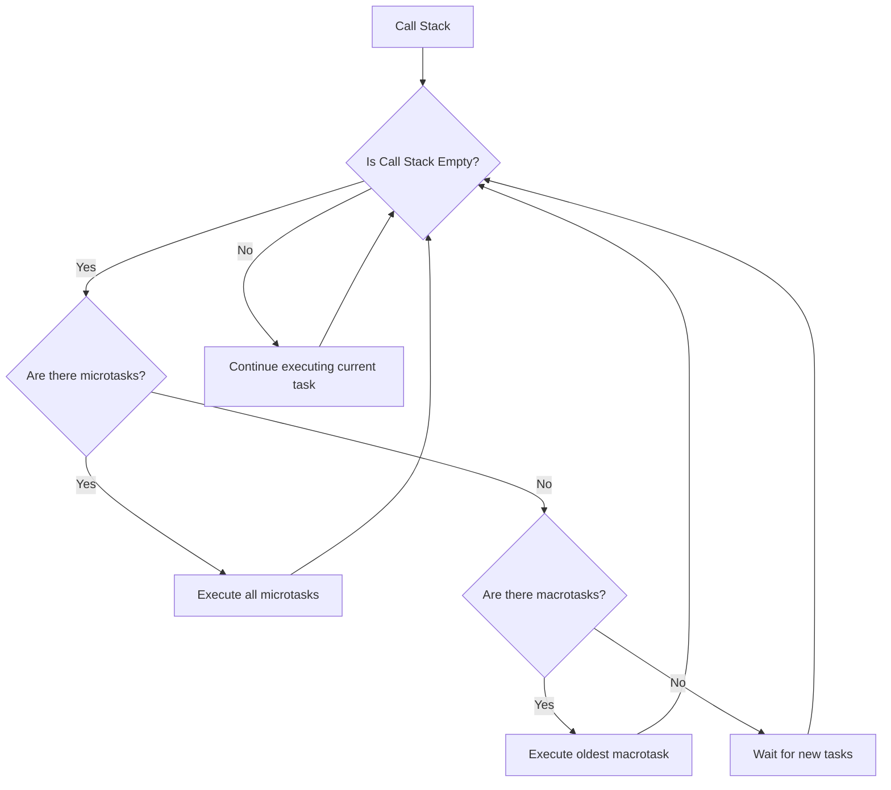

# JavaScript Interview Questions

## Introduction

JavaScript is one of the most popular programming languages in the world, powering the interactive elements of millions of websites. As a result, JavaScript knowledge is highly sought after in the job market, and you're likely to face JavaScript-specific questions in technical interviews.

This guide covers the most common JavaScript interview questions you might encounter, along with detailed explanations and examples to help you prepare effectively. Whether you're a beginner looking to land your first programming job or an experienced developer brushing up on your skills, this guide will help you navigate JavaScript interview questions with confidence.

## Fundamental JavaScript Interview Questions

### 1. What is JavaScript and how does it differ from Java?

**Answer:** JavaScript is a high-level, interpreted programming language primarily used for enhancing web pages with interactive elements. Despite the similar name, JavaScript has little in common with Java:

- JavaScript was created by Brendan Eich at Netscape in 1995, while Java was developed by James Gosling at Sun Microsystems
- JavaScript is primarily a client-side scripting language (though it can now run server-side with Node.js), while Java is a general-purpose programming language
- JavaScript is dynamically typed, while Java is statically typed
- JavaScript is prototype-based for object-oriented programming, while Java is class-based

### 2. Explain the difference between `let`, `const`, and `var`

**Answer:** These three keywords declare variables in JavaScript, but they have important differences:

**`var`** (traditional variable declaration):
- Function-scoped or globally-scoped, not block-scoped
- Can be redeclared and updated
- Hoisted to the top of its scope and initialized with `undefined`

```javascript
var x = 10;
var x = 20; // Legal redeclaration
if (true) {
  var x = 30; // Same variable, not block-scoped
}
console.log(x); // Output: 30
```

**`let`** (introduced in ES6):
- Block-scoped
- Can be updated but not redeclared in the same scope
- Hoisted but not initialized (results in ReferenceError if accessed before declaration)

```javascript
let y = 10;
// let y = 20; // Error: Cannot redeclare
y = 20; // Legal update
if (true) {
  let y = 30; // Different variable, block-scoped
}
console.log(y); // Output: 20
```

**`const`** (introduced in ES6):
- Block-scoped
- Cannot be updated or redeclared
- Must be initialized at declaration
- For objects and arrays, the contents can still be modified (only the reference is constant)

```javascript
const z = 10;
// z = 20; // Error: Assignment to constant variable
// const z = 20; // Error: Cannot redeclare

const obj = { name: "John" };
obj.name = "Jane"; // Legal: object contents can be modified
console.log(obj.name); // Output: "Jane"
```

### 3. What is hoisting in JavaScript?

**Answer:** Hoisting is JavaScript's default behavior of moving declarations to the top of their containing scope during compilation, before code execution. This means you can use variables and functions before they're declared in your code.

```javascript
console.log(hoistedVar); // Output: undefined
console.log(notHoisted); // ReferenceError: Cannot access before initialization

hoistedFunction(); // Output: "This function is hoisted"
notHoistedFunction(); // TypeError: not a function

var hoistedVar = "I'm hoisted";
let notHoisted = "I'm not hoisted";

function hoistedFunction() {
  console.log("This function is hoisted");
}

const notHoistedFunction = function() {
  console.log("This function expression is not hoisted");
};
```

Important notes about hoisting:
- Only declarations are hoisted, not initializations
- `var` variables are initialized with `undefined` when hoisted
- `let` and `const` are hoisted but not initialized (creating a "temporal dead zone")
- Function declarations are fully hoisted
- Function expressions and arrow functions are not hoisted

### 4. Explain event bubbling and event capturing

**Answer:** Event bubbling and capturing are two ways of event propagation in the HTML DOM:

**Event Bubbling:** When an event happens on an element, it first runs the handlers on it, then on its parent, and all the way up the DOM tree.

**Event Capturing:** The event is first captured by the outermost element and propagated to the inner elements.

```javascript
// Event Bubbling (default)
document.querySelector("#child").addEventListener("click", function() {
  console.log("Child element clicked - bubbling phase");
});

document.querySelector("#parent").addEventListener("click", function() {
  console.log("Parent element clicked - bubbling phase");
});

// Event Capturing
document.querySelector("#child").addEventListener("click", function() {
  console.log("Child element clicked - capturing phase");
}, true);

document.querySelector("#parent").addEventListener("click", function() {
  console.log("Parent element clicked - capturing phase");
}, true);
```

In the example above, the third parameter of `addEventListener` specifies whether to use the capturing phase (`true`) or the bubbling phase (`false`, which is the default).

## Intermediate JavaScript Interview Questions

### 5. What is closure in JavaScript?

**Answer:** A closure is a function that has access to its own scope, the outer function's variables, and global variables - even after the outer function has finished executing.

```javascript
function outerFunction(outerVariable) {
  return function innerFunction(innerVariable) {
    console.log('outerVariable:', outerVariable);
    console.log('innerVariable:', innerVariable);
  }
}

const newFunction = outerFunction('outside');
newFunction('inside');
// Output:
// outerVariable: outside
// innerVariable: inside
```

Closures are useful for:
- Data encapsulation and privacy
- Creating function factories
- Implementing module patterns

### 6. Explain prototypal inheritance in JavaScript

**Answer:** JavaScript uses prototypal inheritance, where objects can inherit properties and methods from other objects through their prototype chain.

```javascript
// Constructor function
function Person(name) {
  this.name = name;
}

// Adding a method to the prototype
Person.prototype.greet = function() {
  return `Hello, my name is ${this.name}`;
};

// Creating an instance
const john = new Person('John');
console.log(john.greet()); // Output: "Hello, my name is John"

// Inheritance
function Employee(name, position) {
  Person.call(this, name); // Call parent constructor
  this.position = position;
}

// Set up inheritance chain
Employee.prototype = Object.create(Person.prototype);
Employee.prototype.constructor = Employee;

// Add method to Employee prototype
Employee.prototype.introduce = function() {
  return `${this.greet()} and I work as a ${this.position}`;
};

const jane = new Employee('Jane', 'Developer');
console.log(jane.introduce()); // Output: "Hello, my name is Jane and I work as a Developer"
```

With ES6 classes (syntactic sugar over prototypal inheritance):

```javascript
class Person {
  constructor(name) {
    this.name = name;
  }
  
  greet() {
    return `Hello, my name is ${this.name}`;
  }
}

class Employee extends Person {
  constructor(name, position) {
    super(name);
    this.position = position;
  }
  
  introduce() {
    return `${this.greet()} and I work as a ${this.position}`;
  }
}

const jane = new Employee('Jane', 'Developer');
console.log(jane.introduce()); // Output: "Hello, my name is Jane and I work as a Developer"
```

### 7. What are Promises in JavaScript and how do they work?

**Answer:** Promises in JavaScript represent operations that haven't completed yet but are expected to in the future. They provide a cleaner way to handle asynchronous operations compared to callbacks.

A Promise can be in one of three states:
- **Pending**: Initial state, neither fulfilled nor rejected
- **Fulfilled**: Operation completed successfully
- **Rejected**: Operation failed

```javascript
// Creating a Promise
const myPromise = new Promise((resolve, reject) => {
  // Simulating an asynchronous operation
  setTimeout(() => {
    const success = true;
    if (success) {
      resolve('Operation succeeded');
    } else {
      reject('Operation failed');
    }
  }, 1000);
});

// Consuming a Promise
myPromise
  .then(result => {
    console.log(result); // Output: "Operation succeeded"
  })
  .catch(error => {
    console.error(error);
  })
  .finally(() => {
    console.log('Promise settled (fulfilled or rejected)');
  });
```

Promise methods:
- `Promise.all()`: Waits for all promises to resolve
- `Promise.race()`: Settles as soon as any promise settles
- `Promise.allSettled()`: Waits for all promises to settle (resolve or reject)
- `Promise.any()`: Resolves if any promise resolves, rejects only if all reject

### 8. Explain the concept of the event loop in JavaScript

**Answer:** The event loop is a mechanism that allows JavaScript to perform non-blocking operations despite being single-threaded. It works by continuously checking the call stack and the callback queue:

1. When the call stack is empty, the event loop takes the first event from the queue
2. Adds it to the call stack
3. Executes it until the stack is empty again

```javascript
console.log('Start'); // 1

setTimeout(() => {
  console.log('Timeout callback'); // 4
}, 0);

Promise.resolve().then(() => {
  console.log('Promise resolved'); // 3
});

console.log('End'); // 2

// Output:
// Start
// End
// Promise resolved
// Timeout callback
```

The event loop handles different types of tasks with different priorities:
1. Microtasks (Promises, queueMicrotask, MutationObserver)
2. Macrotasks (setTimeout, setInterval, I/O, UI rendering)

Microtasks have higher priority and are processed before the next macrotask.



## Advanced JavaScript Interview Questions

### 9. What are the differences between `==` and `===` operators?

**Answer:** 
- `==` (Equality): Compares values after attempting type conversion
- `===` (Strict Equality): Compares both values and types, without type conversion

```javascript
console.log(5 == '5');   // true - values equal after type conversion
console.log(5 === '5');  // false - different types

console.log(0 == false); // true - both convert to 0
console.log(0 === false); // false - different types

console.log(null == undefined); // true - they're treated as equal
console.log(null === undefined); // false - different types
```

Using `===` is generally recommended as it avoids unexpected type coercion issues.

### 10. Explain the `this` keyword in JavaScript

**Answer:** The `this` keyword refers to the object that is executing the current function. Its value depends on how the function is called:

1. **Function Invocation**: `this` refers to the global object (`window` in browsers, `global` in Node.js)
2. **Method Invocation**: `this` refers to the object that owns the method
3. **Constructor Invocation**: `this` refers to the newly created object
4. **Explicit Binding**: Using `call()`, `apply()`, or `bind()` to set `this` explicitly

```javascript
// Regular function (function invocation)
function regularFunction() {
  console.log(this); // Window or global object
}

// Object method (method invocation)
const obj = {
  name: 'Example',
  method() {
    console.log(this); // obj
  }
};

// Constructor (constructor invocation)
function Person(name) {
  this.name = name;
  console.log(this); // the new Person object
}

// Explicit binding
function greet() {
  console.log(`Hello, ${this.name}`);
}

greet.call({ name: 'Alice' }); // Output: "Hello, Alice"
```

Arrow functions are special - they don't have their own `this` context but inherit it from the enclosing lexical context:

```javascript
const arrowObj = {
  name: 'Arrow Example',
  regularMethod: function() {
    console.log(`Regular method: ${this.name}`); // "Arrow Example"
    
    const arrowFunction = () => {
      console.log(`Arrow function: ${this.name}`); // "Arrow Example"
    };
    
    arrowFunction();
  }
};

arrowObj.regularMethod();
```

### 11. What are Web Workers and how do they work?

**Answer:** Web Workers provide a way to run JavaScript in background threads, separate from the main thread. They allow for multithreading in JavaScript without blocking the UI.

```javascript
// main.js
if (window.Worker) {
  const myWorker = new Worker('worker.js');
  
  myWorker.postMessage({data: 'Hello from main thread'});
  
  myWorker.onmessage = function(e) {
    console.log('Message received from worker:', e.data);
  };
} else {
  console.log('Web Workers not supported');
}

// worker.js
self.onmessage = function(e) {
  console.log('Message received in worker:', e.data);
  
  // Do some CPU-intensive work
  const result = performComplexCalculation();
  
  self.postMessage({result: result});
};
```

Limitations of Web Workers:
- No direct DOM access
- No direct access to the `window` object or parent page functions
- Limited communication through `postMessage()`
- Separate memory space from the main thread

Types of workers:
- Dedicated Workers (used by a single script)
- Shared Workers (can be shared between multiple scripts)
- Service Workers (act as proxy servers, enabling offline access)

### 12. Explain async/await in JavaScript

**Answer:** `async/await` is a modern way to handle asynchronous operations in JavaScript, built on top of Promises. It makes asynchronous code look and behave more like synchronous code.

```javascript
// Using Promises
function fetchDataWithPromises() {
  return fetch('https://api.example.com/data')
    .then(response => response.json())
    .then(data => {
      console.log('Data:', data);
      return data;
    })
    .catch(error => {
      console.error('Error:', error);
      throw error;
    });
}

// Using async/await
async function fetchDataWithAsync() {
  try {
    const response = await fetch('https://api.example.com/data');
    const data = await response.json();
    console.log('Data:', data);
    return data;
  } catch (error) {
    console.error('Error:', error);
    throw error;
  }
}

// Calling async functions
fetchDataWithAsync().then(data => {
  console.log('Processing:', data);
});
```

Key points about async/await:
- An `async` function always returns a Promise
- `await` can only be used inside an `async` function
- `await` pauses the execution of the function until the Promise is resolved
- Error handling is done with try/catch blocks, similar to synchronous code
- You can use Promise methods like `.then()` and `.catch()` with the result of an `async` function

## Practical JavaScript Interview Questions

### 13. How would you implement debouncing in JavaScript?

**Answer:** Debouncing is a technique used to limit the rate at which a function can fire. It's especially useful for functions that might be called frequently in a short period of time, like resize or scroll event handlers.

```javascript
function debounce(func, delay) {
  let timeoutId;
  
  return function(...args) {
    const context = this;
    
    clearTimeout(timeoutId);
    
    timeoutId = setTimeout(() => {
      func.apply(context, args);
    }, delay);
  };
}

// Example usage:
const debouncedResize = debounce(() => {
  console.log('Resize event handled');
  // Update UI or perform calculations
}, 300);

window.addEventListener('resize', debouncedResize);
```

In this example, when the `resize` event fires repeatedly, the actual handler function will only execute after 300ms of "quiet time" (no new resize events).

### 14. How would you check if an object is an array in JavaScript?

**Answer:** There are several ways to check if an object is an array in JavaScript:

```javascript
const arr = [1, 2, 3];
const obj = { a: 1 };

// Method 1: Array.isArray() (preferred)
console.log(Array.isArray(arr)); // true
console.log(Array.isArray(obj)); // false

// Method 2: instanceof (can fail with multiple frames/windows)
console.log(arr instanceof Array); // true
console.log(obj instanceof Array); // false

// Method 3: Object.prototype.toString
console.log(Object.prototype.toString.call(arr) === '[object Array]'); // true
console.log(Object.prototype.toString.call(obj) === '[object Array]'); // false

// Method 4: constructor property (not reliable)
console.log(arr.constructor === Array); // true
console.log(obj.constructor === Array); // false
```

`Array.isArray()` is the most reliable method and is supported in all modern browsers.

### 15. What is the output of the following code and why?

```javascript
for (var i = 0; i < 5; i++) {
  setTimeout(function() {
    console.log(i);
  }, 1000);
}
```

**Answer:** The output will be:
```
5
5
5
5
5
```

This happens because:
1. The loop runs quickly, setting up 5 timeouts
2. By the time the timeouts execute after 1 second, the loop has completed and `i` is 5
3. All timeouts reference the same `i` variable (function scope with `var`)
4. Each timeout logs the current value of `i`, which is 5

To get the expected 0,1,2,3,4 output, you could use:

```javascript
// Solution 1: Using an IIFE to create a new scope
for (var i = 0; i < 5; i++) {
  (function(j) {
    setTimeout(function() {
      console.log(j);
    }, 1000);
  })(i);
}

// Solution 2: Using let for block scoping
for (let i = 0; i < 5; i++) {
  setTimeout(function() {
    console.log(i);
  }, 1000);
}

// Solution 3: Using the third parameter of setTimeout
for (var i = 0; i < 5; i++) {
  setTimeout(function(j) {
    console.log(j);
  }, 1000, i);
}
```

## ES6+ and Modern JavaScript Questions

### 16. Describe some key features introduced in ES6 (ECMAScript 2015)

**Answer:** ES6 introduced many significant features that modernized JavaScript:

**1. let and const declarations**
```javascript
let x = 10; // Block-scoped variable
const PI = 3.14; // Block-scoped constant
```

**2. Arrow functions**
```javascript
// Traditional function
function add(a, b) {
  return a + b;
}

// Arrow function
const add = (a, b) => a + b;
```

**3. Template literals**
```javascript
const name = 'World';
console.log(`Hello, ${name}!`); // String interpolation
```

**4. Destructuring assignment**
```javascript
// Array destructuring
const [a, b] = [1, 2];

// Object destructuring
const { name, age } = { name: 'John', age: 30 };
```

**5. Default parameters**
```javascript
function greet(name = 'Guest') {
  return `Hello, ${name}!`;
}
```

**6. Rest and spread operators**
```javascript
// Rest parameters
function sum(...numbers) {
  return numbers.reduce((total, num) => total + num, 0);
}

// Spread operator
const arr1 = [1, 2, 3];
const arr2 = [...arr1, 4, 5]; // [1, 2, 3, 4, 5]
```

**7. Classes**
```javascript
class Person {
  constructor(name) {
    this.name = name;
  }
  
  greet() {
    return `Hello, I'm ${this.name}`;
  }
}
```

**8. Modules**
```javascript
// Exporting
export const PI = 3.14;
export function square(x) {
  return x * x;
}

// Importing
import { PI, square } from './math.js';
```

**9. Promises**
```javascript
const fetchData = () => {
  return new Promise((resolve, reject) => {
    // Asynchronous operation
  });
};
```

**10. Map and Set collections**
```javascript
const map = new Map();
map.set('key', 'value');

const set = new Set([1, 2, 3, 1]); // Unique values: 1, 2, 3
```

### 17. What are Map and WeakMap in JavaScript?

**Answer:** Map and WeakMap are collection types introduced in ES6 that allow storing key-value pairs.

**Map:**
- Can use any value (primitive or object) as keys
- Maintains insertion order when iterating
- Has a size property
- Provides methods like `set()`, `get()`, `has()`, `delete()`, and `clear()`
- Iterable with `for...of`, `.forEach()`, etc.

```javascript
const userMap = new Map();

userMap.set('name', 'John');
userMap.set(42, 'Answer');
userMap.set({id: 1}, 'Object as key');

console.log(userMap.get('name')); // "John"
console.log(userMap.size); // 3

for (const [key, value] of userMap) {
  console.log(`${key}: ${value}`);
}
```

**WeakMap:**
- Only objects can be used as keys (not primitives)
- Keys are weakly referenced (can be garbage-collected if no other references exist)
- Not iterable (no methods for listing all keys/values)
- Has no size property
- Provides limited methods: `set()`, `get()`, `has()`, and `delete()`
- Useful for storing private data associated with objects or DOM elements

```javascript
const weakMap = new WeakMap();
let obj = { id: 1 };

weakMap.set(obj, 'Associated data');
console.log(weakMap.get(obj)); // "Associated data"

// If obj is later set to null, it can be garbage collected
// and the entry will automatically be removed from the WeakMap
```

WeakMaps are particularly useful for scenarios where you need to associate metadata with objects without preventing garbage collection.

### 18. Explain the concept of generators in JavaScript

**Answer:** Generators are special functions that can be paused and resumed, allowing for on-demand value generation and custom iterators. They are defined using the `function*` syntax and use the `yield` keyword to pause execution and return values.

```javascript
function* countUpTo(max) {
  for (let i = 1; i <= max; i++) {
    yield i;
  }
}

const counter = countUpTo(5);

console.log(counter.next()); // { value: 1, done: false }
console.log(counter.next()); // { value: 2, done: false }
console.log(counter.next()); // { value: 3, done: false }
console.log(counter.next()); // { value: 4, done: false }
console.log(counter.next()); // { value: 5, done: false }
console.log(counter.next()); // { value: undefined, done: true }
```

Key features of generators:
- Can pause and resume execution with `yield`
- Return an iterator when called
- Each call to `next()` executes until the next `yield` statement
- `next()` returns an object with `value` and `done` properties
- Can receive values from outside with `next(value)`
- Can delegate to other generators with `yield*`

Practical applications:
- Implementing lazy evaluation strategies
- Working with potentially infinite data streams
- Simplifying asynchronous code with generator-based control flow libraries
- Creating custom iterators

Example of a two-way communication:

```javascript
function* conversation() {
  const name = yield "What's your name?";
  const hobby = yield `Hello ${name}, what's your hobby?`;
  return `${name} likes ${hobby}`;
}

const talk = conversation();
console.log(talk.next().value); // "What's your name?"
console.log(talk.next('Alice').value); // "Hello Alice, what's your hobby?"
console.log(talk.next('coding').value); // "Alice likes coding"
```

## JavaScript Performance Questions

### 19. How would you optimize JavaScript code for better performance?

**Answer:** Here are key strategies for optimizing JavaScript performance:

**1. Minimize DOM manipulation**
- Batch DOM updates
- Use document fragments
- Consider Virtual DOM libraries for complex UIs

```javascript
// Inefficient
for (let i = 0; i < 1000; i++) {
  document.body.appendChild(document.createElement('div'));
}

// Optimized
const fragment = document.createDocumentFragment();
for (let i = 0; i < 1000; i++) {
  fragment.appendChild(document.createElement('div'));
}
document.body.appendChild(fragment);
```

**2. Efficient event handling**
- Use event delegation
- Debounce or throttle expensive listeners

```javascript
// Event delegation example
document.getElementById('list').addEventListener('click', function(e) {
  if (e.target.tagName === 'LI') {
    // Handle the click on list item
  }
});
```

**3. Optimize loops**
- Cache array length in for loops
- Use for...of for arrays and for...in for objects appropriately
- Consider using array methods like map/reduce/filter

```javascript
// Less optimized
for (let i = 0; i < array.length; i++) {
  // Do something
}

// More optimized
const len = array.length;
for (let i = 0; i < len; i++) {
  // Do something
}

// Functional approach
const results = array.map(item => transform(item));
```

**4. Memory management**
- Avoid memory leaks by properly cleaning up event listeners and references
- Use WeakMap/WeakSet for temporary object references
- Be cautious with closures that might capture large scopes

**5. Efficient data structures and algorithms**
- Choose appropriate data structures for your operations
- Use Set or Map instead of arrays for frequent lookups
- Consider the Big O complexity of your algorithms

**6. Code splitting and lazy loading**
- Load JavaScript only when needed
- Use dynamic imports for code splitting

```javascript
// Dynamic import example
button.addEventListener('click', async () => {
  const module = await import('./heavy-feature.js');
  module.initFeature();
});
```

**7. Web Workers for CPU-intensive tasks**
- Move heavy computations to a separate thread

**8. Optimize rendering**
- Use requestAnimationFrame for animations
- Minimize layout thrashing by batching reads and writes

```javascript
// Poor performance - causes layout thrashing
elements.forEach(el => {
  const width = el.offsetWidth; // read
  el.style.width = (width * 2) + 'px'; // write
});

// Better performance - batch reads and writes
const widths = elements.map(el => el.offsetWidth); // read
elements.forEach((el, i) => {
  el.style.width = (widths[i] * 2) + 'px'; // write
});
```

### 20. Explain the concept of memoization in JavaScript

**Answer:** Memoization is an optimization technique that stores the results of expensive function calls and returns the cached result when the same inputs occur again. It's particularly useful for recursive functions or computationally expensive operations.

```javascript
// Without memoization
function fibonacci(n) {
  if (n <= 1) return n;
  return fibonacci(n - 1) + fibonacci(n - 2);
}

// With memoization
function memoizedFibonacci() {
  const cache = {};
  
  return function fib(n) {
    if (n in cache) {
      return cache[n];
    }
    
    if (n <= 1) {
      return n;
    }
    
    const result = fib(n - 1) + fib(n - 2);
    cache[n] = result;
    return result;
  };
}

const fibMemo = memoizedFibonacci();

console.time('Without memoization');
fibonacci(35); // Very slow, many redundant calculations
console.timeEnd('Without memoization');

console.time('With memoization');
fibMemo(35); // Much faster
console.timeEnd('With memoization');
```

Generic memoization function:

```javascript
function memoize(fn) {
  const cache = {};
  
  return function(...args) {
    const key = JSON.stringify(args);
    
    if (key in cache) {
      return cache[key];
    }
    
    const result = fn.apply(this, args);
    cache[key] = result;
    return result;
  };
}

// Usage
const memoizedFunction = memoize(expensiveOperation);
```

Key considerations for memoization:
- Most effective for pure functions (same output for same input)
- Trade-off between memory and speed
- Consider cache invalidation or size limits for long-running applications
- JSON.stringify can be limiting for complex objects or circular references

## Summary

JavaScript interview questions often test your understanding of core language concepts, asynchronous programming, performance optimization, and modern JavaScript features. To prepare effectively:

1. Master the fundamentals: scope, closures, prototypes, and the `this` keyword
2. Understand asynchronous JavaScript deeply: callbacks, promises, async/await
3. Be familiar with ES6+ features and their advantages
4. Learn about performance optimization techniques
5. Practice explaining complex concepts clearly and concisely
6. Be prepared to write code by hand and trace through execution step by step
7. Study common coding patterns and best practices

By understanding these core topics and practicing your explanations, you'll be well-prepared for JavaScript technical interviews at any level.

## Additional Resources

1. **Books:**
   - "Eloquent JavaScript" by Marijn Haverbeke
   - "You Don't Know JS" series by Kyle Simpson
   - "JavaScript: The Good Parts" by Douglas Crockford

2. **Online Learning:**
   - MDN Web Docs - JavaScript section
   - JavaScript30 by Wes Bos (30 practical exercises)
   - FreeCodeCamp JavaScript curriculum

3. **Practice Platforms:**
   - LeetCode (JavaScript problems)
   - HackerRank (JavaScript section)
   - CodeWars (JavaScript katas)

4. **Advanced Topics to Explore:**
   - Functional programming in JavaScript
   - Design patterns in JavaScript
   - TypeScript fundamentals
   - JavaScript engine internals (V8, SpiderMonkey)