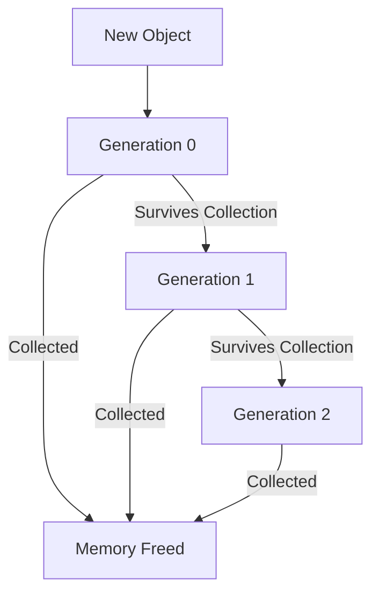

# C# Interview Questions

## Introduction

Preparing for a C# programming interview can be challenging, especially for beginners. This guide covers the most common C# interview questions you're likely to encounter, along with detailed explanations and practical examples. Whether you're interviewing for your first programming job or looking to brush up on your C# knowledge, this resource will help you build confidence and showcase your skills effectively.

## Fundamental C# Concepts

### What is C#?

**Question**: What is C# and what are its key features?

**Answer**: C# (pronounced "C-sharp") is a modern, object-oriented programming language developed by Microsoft as part of the .NET framework. It was designed by Anders Hejlsberg and first released in 2000.

Key features include:

- **Object-oriented**: Supports encapsulation, inheritance, and polymorphism
- **Type-safe**: Prevents type errors through static typing
- **Component-oriented**: Designed for building component-based applications
- **Garbage collection**: Automatic memory management
- **Lambda expressions**: Support for functional programming
- **LINQ (Language Integrated Query)**: Powerful query capabilities
- **Asynchronous programming**: Simplified with async/await pattern
- **Cross-platform**: Through .NET Core and now .NET 5+

### Value Types vs Reference Types

**Question**: Explain the difference between value types and reference types in C#.

**Answer**: In C#, types are categorized as either value types or reference types, which affects how they behave when assigned, compared, and passed as parameters.

**Value Types**:
- Stored directly on the stack
- Include primitive types (int, float, bool), structs, and enums
- When assigned, a copy of the value is created
- Comparison operators compare the actual values

```csharp
int a = 10;
int b = a; // 'b' gets a copy of the value in 'a'
a = 20;    // Changing 'a' doesn't affect 'b'
Console.WriteLine($"a: {a}, b: {b}"); // Output: a: 20, b: 10
```

**Reference Types**:
- Stored on the heap with a reference (memory address) on the stack
- Include classes, interfaces, delegates, and arrays
- When assigned, only the reference is copied, not the actual object
- Comparison operators compare references by default, not the content

```csharp
class Person {
    public string Name { get; set; }
}

Person p1 = new Person { Name = "Alice" };
Person p2 = p1; // p2 references the same object as p1
p1.Name = "Bob"; // Changing p1 also affects p2
Console.WriteLine($"p1.Name: {p1.Name}, p2.Name: {p2.Name}"); 
// Output: p1.Name: Bob, p2.Name: Bob
```

### Properties vs Fields

**Question**: What's the difference between properties and fields in C#?

**Answer**: 

**Fields**:
- Variables declared directly in a class
- Typically private and used for storing internal state
- No additional logic when reading or writing values

**Properties**:
- Provide a public way of getting and setting values
- Can contain logic like validation when values change
- Enable encapsulation by controlling access to fields
- Can be read-only, write-only, or read-write

```csharp
public class Employee {
    // Private field
    private string _name;
    
    // Public property with validation
    public string Name {
        get { return _name; }
        set {
            if (!string.IsNullOrEmpty(value)) {
                _name = value;
            }
            else {
                throw new ArgumentException("Name cannot be empty");
            }
        }
    }
    
    // Auto-implemented property (compiler creates the backing field)
    public int Age { get; set; }
    
    // Read-only property
    public bool IsAdult => Age >= 18;
}
```

## Object-Oriented Programming

### Inheritance vs Composition

**Question**: What is the difference between inheritance and composition? When would you use one over the other?

**Answer**: Both inheritance and composition are mechanisms for reusing code, but they work differently and have different use cases.

**Inheritance**:
- Establishes an "is-a" relationship between classes
- Child class inherits properties and methods from parent class
- Achieved using the `:` symbol in C#
- Supports polymorphism through method overriding

```csharp
// Base class
public class Vehicle {
    public int Speed { get; set; }
    public virtual void Move() {
        Console.WriteLine("Vehicle is moving");
    }
}

// Derived class
public class Car : Vehicle {
    public override void Move() {
        Console.WriteLine("Car is driving at " + Speed + " mph");
    }
}
```

**Composition**:
- Establishes a "has-a" relationship between classes
- A class contains objects of other classes as properties
- More flexible as it can be changed at runtime
- Follows the principle "favor composition over inheritance"

```csharp
public class Engine {
    public void Start() {
        Console.WriteLine("Engine started");
    }
}

public class Car {
    // Composition - Car "has-a" Engine
    private Engine _engine = new Engine();
    
    public void Start() {
        // Delegate to the engine
        _engine.Start();
        Console.WriteLine("Car started");
    }
}
```

**When to use which**:
- Use **inheritance** when:
  - There's a clear "is-a" relationship
  - You want to leverage polymorphism
  - The subclass is truly a specialized version of the parent

- Use **composition** when:
  - There's a "has-a" relationship
  - You want to reuse code without creating tight coupling
  - You need more flexibility to change behavior at runtime

### Method Overloading vs Overriding

**Question**: Explain method overloading and method overriding with examples.

**Answer**:

**Method Overloading**:
- Creating multiple methods with the same name but different parameters
- Occurs in the same class
- Resolved at compile time (static binding)
- Provides different ways to call the same method

```csharp
public class Calculator {
    // Method overloading
    public int Add(int a, int b) {
        return a + b;
    }
    
    public double Add(double a, double b) {
        return a + b;
    }
    
    public int Add(int a, int b, int c) {
        return a + b + c;
    }
}

// Usage
var calc = new Calculator();
int sum1 = calc.Add(5, 10);            // Calls first method
double sum2 = calc.Add(5.5, 10.5);     // Calls second method
int sum3 = calc.Add(5, 10, 15);        // Calls third method
```

**Method Overriding**:
- Replacing a method in a parent class with a new implementation in a child class
- Requires the `virtual` keyword in the parent and `override` in the child
- Resolved at runtime (dynamic binding)
- Enables polymorphic behavior

```csharp
public class Animal {
    public virtual void MakeSound() {
        Console.WriteLine("Animal makes a sound");
    }
}

public class Dog : Animal {
    public override void MakeSound() {
        Console.WriteLine("Dog barks: Woof!");
    }
}

public class Cat : Animal {
    public override void MakeSound() {
        Console.WriteLine("Cat meows: Meow!");
    }
}

// Polymorphism in action
Animal myDog = new Dog();
Animal myCat = new Cat();

myDog.MakeSound();  // Output: "Dog barks: Woof!"
myCat.MakeSound();  // Output: "Cat meows: Meow!"
```

### Interface vs Abstract Class

**Question**: What's the difference between an interface and an abstract class?

**Answer**: Interfaces and abstract classes both provide a way to define contracts for derived classes, but they have significant differences in their usage and capabilities.

**Interface**:
- Defines a contract that implementing classes must follow
- Can only contain method signatures, properties, events, and indexers (C# 8.0+ also allows default implementations)
- Classes can implement multiple interfaces
- No constructor
- No fields
- All members are implicitly public

```csharp
public interface IShape {
    double CalculateArea();
    double CalculatePerimeter();
    // C# 8.0+ allows default implementations
    string GetDescription() => "This is a shape";
}

public class Circle : IShape {
    public double Radius { get; set; }
    
    public double CalculateArea() {
        return Math.PI * Radius * Radius;
    }
    
    public double CalculatePerimeter() {
        return 2 * Math.PI * Radius;
    }
}
```

**Abstract Class**:
- Can have abstract methods (without implementation) and concrete methods (with implementation)
- A class can inherit from only one abstract class
- Can have constructors and fields
- Can have access modifiers for members
- Represents an "is-a" relationship

```csharp
public abstract class Shape {
    // Fields
    protected string _name;
    
    // Constructor
    public Shape(string name) {
        _name = name;
    }
    
    // Concrete method
    public void DisplayName() {
        Console.WriteLine($"This shape is a {_name}");
    }
    
    // Abstract methods that must be implemented by derived classes
    public abstract double CalculateArea();
    public abstract double CalculatePerimeter();
}

public class Rectangle : Shape {
    public double Width { get; set; }
    public double Height { get; set; }
    
    public Rectangle(double width, double height) : base("Rectangle") {
        Width = width;
        Height = height;
    }
    
    public override double CalculateArea() {
        return Width * Height;
    }
    
    public override double CalculatePerimeter() {
        return 2 * (Width + Height);
    }
}
```

**When to use which**:
- Use **interfaces** when:
  - You need multiple inheritance
  - You want to define a contract for unrelated classes
  - You're defining capabilities that can be added to any class regardless of hierarchy

- Use **abstract classes** when:
  - You want to share code among related classes
  - You need to define a base class that shouldn't be instantiated
  - You need to provide some implementation while forcing derived classes to implement others

## Advanced C# Concepts

### Delegates and Events

**Question**: What are delegates and events in C#? How are they related?

**Answer**: 

**Delegates**:
- Type-safe function pointers that can reference methods with compatible signatures
- Enable callback functionality and method passing
- Support for multicast (can point to multiple methods)
- Foundation for events and lambda expressions

```csharp
// Define a delegate type
public delegate void MessageHandler(string message);

public class Program {
    public static void Main() {
        // Create a delegate instance
        MessageHandler handler = DisplayMessage;
        
        // Add another method (multicast)
        handler += LogMessage;
        
        // Call the delegate (both methods will be called)
        handler("Hello, World!");
        
        // Using anonymous method
        MessageHandler anonymousHandler = delegate(string msg) {
            Console.WriteLine($"Anonymous: {msg}");
        };
        
        // Using lambda expression
        MessageHandler lambdaHandler = (msg) => Console.WriteLine($"Lambda: {msg}");
    }
    
    static void DisplayMessage(string message) {
        Console.WriteLine($"Display: {message}");
    }
    
    static void LogMessage(string message) {
        Console.WriteLine($"Log: {message}");
    }
}
```

**Events**:
- A way to provide notifications to subscribers
- Built on top of delegates
- Encapsulate delegate instances with a publish-subscribe pattern
- Cannot be invoked outside the declaring class
- Can only be added to or removed from with += and -=

```csharp
public class Button {
    // Define an event using a delegate
    public event EventHandler<EventArgs> Click;
    
    // Method to "raise" the event
    protected virtual void OnClick() {
        // Check if there are any subscribers
        Click?.Invoke(this, EventArgs.Empty);
    }
    
    // Simulate a button click
    public void PerformClick() {
        Console.WriteLine("Button clicked");
        OnClick();
    }
}

public class Program {
    public static void Main() {
        Button button = new Button();
        
        // Subscribe to the event
        button.Click += Button_Click;
        
        // Trigger the event
        button.PerformClick();
    }
    
    private static void Button_Click(object sender, EventArgs e) {
        Console.WriteLine("Button click handled!");
    }
}
```

**Relationship**:
- Events are a special case of delegates that follow the publisher-subscriber pattern
- Events prevent subscribers from invoking the delegate directly
- Events restrict access to adding and removing event handlers only

### LINQ (Language Integrated Query)

**Question**: What is LINQ and what are its advantages? Provide examples of query and method syntax.

**Answer**: LINQ (Language Integrated Query) is a set of features introduced in .NET 3.5 that adds query capabilities to C#. It provides a consistent syntax for querying different data sources like collections, databases, XML, and web services.

**Advantages of LINQ**:
- Provides a consistent way to query different data sources
- Type safety checked at compile time
- IntelliSense support for writing queries
- Supports both query and method syntax
- Increases code readability and maintainability
- Reduces code complexity for data manipulation

**LINQ Query Syntax** (similar to SQL):

```csharp
// Sample data
List<int> numbers = new List<int> { 1, 2, 3, 4, 5, 6, 7, 8, 9, 10 };

// Query syntax to get even numbers
var evenNumbers = from num in numbers
                  where num % 2 == 0
                  orderby num
                  select num;

Console.WriteLine("Even numbers:");
foreach (var num in evenNumbers) {
    Console.Write($"{num} "); // Output: 2 4 6 8 10
}
```

**LINQ Method Syntax** (using extension methods):

```csharp
// Sample data
List<string> fruits = new List<string> { 
    "apple", "banana", "cherry", "date", "elderberry" 
};

// Method syntax to filter and transform
var filteredFruits = fruits
    .Where(f => f.Length > 5)
    .OrderByDescending(f => f.Length)
    .Select(f => f.ToUpper());

Console.WriteLine("
Long fruit names:");
foreach (var fruit in filteredFruits) {
    Console.WriteLine(fruit); // Output: ELDERBERRY, BANANA, CHERRY
}
```

**Complex LINQ Example** (joining collections):

```csharp
// Sample data
var students = new List<Student> {
    new Student { Id = 1, Name = "Alice", Age = 20 },
    new Student { Id = 2, Name = "Bob", Age = 22 },
    new Student { Id = 3, Name = "Charlie", Age = 21 }
};

var courses = new List<Course> {
    new Course { Id = 101, Title = "C# Programming", StudentId = 1 },
    new Course { Id = 102, Title = "Database Systems", StudentId = 1 },
    new Course { Id = 103, Title = "Web Development", StudentId = 2 },
    new Course { Id = 104, Title = "Machine Learning", StudentId = 3 }
};

// Join students with their courses
var studentCourses = from s in students
                     join c in courses on s.Id equals c.StudentId
                     select new {
                         StudentName = s.Name,
                         CourseName = c.Title
                     };

Console.WriteLine("
Student Courses:");
foreach (var item in studentCourses) {
    Console.WriteLine($"{item.StudentName} is taking {item.CourseName}");
}

// Output:
// Alice is taking C# Programming
// Alice is taking Database Systems
// Bob is taking Web Development
// Charlie is taking Machine Learning
```

### Async/Await Pattern

**Question**: Explain the async/await pattern in C#. How does it work and what problems does it solve?

**Answer**: The async/await pattern introduced in C# 5.0 simplifies asynchronous programming by allowing you to write asynchronous code that looks and behaves like synchronous code while avoiding blocking the main thread.

**How it works**:
- The `async` keyword marks a method as asynchronous
- The `await` keyword suspends execution until the awaited task completes
- When a method hits an `await`, it returns to the caller
- The method resumes from the `await` point when the awaited task completes
- Behind the scenes, the compiler transforms the method into a state machine

**Problems it solves**:
- Avoids UI freezing in UI applications
- Improves scalability by freeing threads to handle other requests
- Simplifies error handling compared to callbacks
- Makes asynchronous code more readable and maintainable
- Enables easy composition of asynchronous operations

```csharp
public class AsyncExample {
    public async Task<string> DownloadDataAsync(string url) {
        Console.WriteLine("Starting download...");
        
        // HttpClient is designed for async operations
        using (HttpClient client = new HttpClient()) {
            // This will not block the calling thread
            string result = await client.GetStringAsync(url);
            
            // This code runs after the download completes
            Console.WriteLine("Download completed");
            return result;
        }
    }
    
    public async Task ProcessDataAsync() {
        try {
            Console.WriteLine("Process started");
            
            // Multiple async operations
            Task<string> downloadTask = DownloadDataAsync("https://example.com");
            
            // Do other work while waiting
            DoOtherWork();
            
            // Await the result when needed
            string data = await downloadTask;
            Console.WriteLine($"Downloaded {data.Length} bytes");
            
            // Sequential async operations
            await SaveDataAsync(data);
            await NotifyUserAsync();
            
            Console.WriteLine("Process completed");
        }
        catch (Exception ex) {
            Console.WriteLine($"Error: {ex.Message}");
        }
    }
    
    private void DoOtherWork() {
        Console.WriteLine("Doing other work...");
    }
    
    private async Task SaveDataAsync(string data) {
        await Task.Delay(1000); // Simulate saving
        Console.WriteLine("Data saved");
    }
    
    private async Task NotifyUserAsync() {
        await Task.Delay(500); // Simulate notification
        Console.WriteLine("User notified");
    }
}
```

Running multiple tasks in parallel:

```csharp
public async Task ParallelTasksExample() {
    // Start multiple tasks
    Task<int> task1 = CalculateAsync(10);
    Task<int> task2 = CalculateAsync(20);
    Task<int> task3 = CalculateAsync(30);
    
    // Wait for all tasks to complete
    await Task.WhenAll(task1, task2, task3);
    
    // All tasks are now complete
    int sum = task1.Result + task2.Result + task3.Result;
    Console.WriteLine($"Total: {sum}");
}

private async Task<int> CalculateAsync(int input) {
    await Task.Delay(1000); // Simulate work
    return input * input;
}
```

## C# Memory Management

### Garbage Collection

**Question**: How does garbage collection work in C#? What are generations in garbage collection?

**Answer**: Garbage Collection (GC) in C# is an automatic memory management system that deallocates memory occupied by objects that are no longer in use by the application.

**How Garbage Collection Works**:
1. **Detection**: The GC identifies objects that are no longer reachable by the application
2. **Collection**: It reclaims the memory used by these unreachable objects
3. **Compaction**: It compacts memory by moving surviving objects together to eliminate fragmentation

**Garbage Collection Generations**:
- The .NET GC is generational, dividing the heap into three generations:
  - **Generation 0**: Contains short-lived objects
  - **Generation 1**: Contains objects that survived a Gen 0 collection
  - **Generation 2**: Contains long-lived objects that survived Gen 1 collections



**Optimization Strategy**:
- GC runs more frequently on Gen 0 (smaller, faster collections)
- Less frequently on Gen 1
- Rarely on Gen 2 (full collections, more expensive)
- This strategy is based on the observation that newer objects tend to have shorter lifetimes

**How to influence GC behavior**:

```csharp
public class GCExample {
    public void DemonstrateGC() {
        // Request garbage collection
        GC.Collect();
        
        // Force collection of all generations
        GC.Collect(2, GCCollectionMode.Forced);
        
        // Wait for pending finalizers
        GC.WaitForPendingFinalizers();
        
        // Get total memory
        long memory = GC.GetTotalMemory(false);
        Console.WriteLine($"Total Memory: {memory} bytes");
        
        // Get current generation of an object
        object obj = new object();
        int gen = GC.GetGeneration(obj);
        Console.WriteLine($"Generation: {gen}");
    }
}
```

**Best Practices**:
- Avoid explicit calls to `GC.Collect()` in production code
- Implement `IDisposable` for classes that manage unmanaged resources
- Use the `using` statement for disposable objects
- Set object references to null when no longer needed

### IDisposable and Using Statement

**Question**: What is the purpose of IDisposable interface and the using statement?

**Answer**: The `IDisposable` interface and `using` statement work together to provide a clean way to handle resource cleanup, especially for unmanaged resources that the garbage collector doesn't automatically handle.

**IDisposable Interface**:
- Defines a single method `Dispose()` for releasing resources
- Used for both managed and unmanaged resources
- Especially important for unmanaged resources (files, network connections, database connections)
- Part of the "dispose pattern" for deterministic cleanup

```csharp
public class ResourceManager : IDisposable {
    private bool _disposed = false;
    private IntPtr _handle; // Example of unmanaged resource
    private StreamWriter _writer; // Example of managed resource
    
    public ResourceManager() {
        // Initialize resources
        _handle = CreateSomeUnmanagedResource();
        _writer = new StreamWriter("log.txt");
    }
    
    public void Dispose() {
        Dispose(true);
        GC.SuppressFinalize(this);
    }
    
    protected virtual void Dispose(bool disposing) {
        if (!_disposed) {
            if (disposing) {
                // Dispose managed resources
                _writer?.Dispose();
            }
            
            // Free unmanaged resources
            if (_handle != IntPtr.Zero) {
                ReleaseSomeUnmanagedResource(_handle);
                _handle = IntPtr.Zero;
            }
            
            _disposed = true;
        }
    }
    
    ~ResourceManager() {
        // Finalizer
        Dispose(false);
    }
    
    // Simulated methods
    private IntPtr CreateSomeUnmanagedResource() { return new IntPtr(1); }
    private void ReleaseSomeUnmanagedResource(IntPtr handle) { }
}
```

**Using Statement**:
- Provides a clean syntax for working with disposable objects
- Ensures `Dispose()` is called even if an exception occurs
- Equivalent to try-finally block with Dispose in finally
- Makes code more readable and less error-prone

```csharp
// Basic using statement
public void ReadFile(string path) {
    using (StreamReader reader = new StreamReader(path)) {
        string content = reader.ReadToEnd();
        Console.WriteLine(content);
    } // reader.Dispose() is automatically called here
}

// Multiple resources in one using statement
public void ProcessFiles(string inputPath, string outputPath) {
    using (StreamReader reader = new StreamReader(inputPath))
    using (StreamWriter writer = new StreamWriter(outputPath)) {
        string line;
        while ((line = reader.ReadLine()) != null) {
            writer.WriteLine(line.ToUpper());
        }
    } // Both disposed in reverse order
}

// Using declaration (C# 8.0+)
public void ModernUsing(string path) {
    using var reader = new StreamReader(path);
    // reader.Dispose() is called at the end of the containing scope
    string content = reader.ReadToEnd();
    Console.WriteLine(content);
}
```

**Try-finally equivalent**:

```csharp
public void ManualDispose(string path) {
    StreamReader reader = new StreamReader(path);
    try {
        string content = reader.ReadToEnd();
        Console.WriteLine(content);
    }
    finally {
        reader.Dispose();
    }
}
```

## C# Features by Version

### Recent C# Features

**Question**: Describe some of the new features introduced in C# 9.0 and 10.0.

**Answer**: C# continues to evolve with each version, introducing new features that improve developer productivity and code quality.

**C# 9.0 Features**:

1. **Record types**: Immutable reference types with value-based equality
```csharp
// Record type
public record Person(string FirstName, string LastName, int Age);

// Usage
var person1 = new Person("John", "Doe", 30);
var person2 = new Person("John", "Doe", 30);

// True - value-based equality
Console.WriteLine(person1 == person2);

// Non-destructive mutation
var person3 = person1 with { Age = 31 };
```

2. **Init-only properties**: Properties that can only be set during object initialization
```csharp
public class Employee {
    // Init-only property
    public string Id { get; init; }
    public string Name { get; set; }
    
    // Usage
    public static void Demo() {
        var emp = new Employee { Id = "E001", Name = "Alice" };
        // emp.Id = "E002"; // Compilation error - can't change after initialization
        emp.Name = "Alicia"; // This works fine
    }
}
```

3. **Top-level statements**: Write programs without the boilerplate Program class
```csharp
// Before C# 9.0
// class Program {
//     static void Main(string[] args) {
//         Console.WriteLine("Hello, World!");
//     }
// }

// With C# 9.0
Console.WriteLine("Hello, World!");
var name = Console.ReadLine();
Console.WriteLine($"Hello, {name}!");
```

4. **Pattern matching enhancements**:
```csharp
// Enhanced pattern matching
public static string GetDiscount(Customer customer) => customer switch {
    { LoyaltyYears: > 5, PurchaseCount: > 100 } => "20%",
    { LoyaltyYears: > 5 } => "10%",
    { PurchaseCount: > 100 } => "15%",
    { IsSubscribed: true } => "5%",
    _ => "0%"
};
```

5. **Target-typed new expressions**:
```csharp
// Instead of
Dictionary<string, List<int>> map1 = new Dictionary<string, List<int>>();

// You can write
Dictionary<string, List<int>> map2 = new();
```

**C# 10.0 Features**:

1. **Global using directives**: Declare usings once for the entire project
```csharp
// In a file at the project root level
global using System;
global using System.Collections.Generic;
global using System.Linq;
global using System.Threading.Tasks;
```

2. **File-scoped namespaces**: Reduce indentation with simplified namespace declarations
```csharp
// Instead of
// namespace MyCompany.MyProject {
//     public class MyClass { }
// }

// You can write
namespace MyCompany.MyProject;

public class MyClass { }
```

3. **Record structs**: Value type version of records
```csharp
// Record struct - a value type with record features
public record struct Point(int X, int Y);

// Usage
var p1 = new Point(5, 10);
var p2 = new Point(5, 10);
Console.WriteLine(p1 == p2); // True
```

4. **Improved lambda expressions**: Type inference and attributes for lambdas
```csharp
// Type inference for lambdas
var parse = (string s) => int.Parse(s);

// Lambda with attributes
var validate = [MyValidator] (string s) => s.Length > 5;
```

5. **Constant interpolated strings**:
```csharp
// Const string interpolation (if all placeholders are constants)
const string prefix = "User";
const string suffix = "Profile";
const string fullName = $"{prefix}_{suffix}"; // Works in C# 10
```

## Common Interview Coding Tasks

### String Manipulation

**Question**: Write a function to check if a string is a palindrome, ignoring case and non-alphanumeric characters.

**Answer**: Here's a solution that checks if a string is a palindrome by ignoring case and non-alphanumeric characters:

```csharp
public static bool IsPalindrome(string input) {
    if (string.IsNullOrEmpty(input)) {
        return true; // Empty string is considered a palindrome
    }
    
    // Convert to lowercase and keep only alphanumeric characters
    string cleaned = new string(input.ToLower()
        .Where(char.IsLetterOrDigit)
        .ToArray());
    
    // Check if the string equals its reverse
    int left = 0;
    int right = cleaned.Length - 1;
    
    while (left < right) {
        if (cleaned[left] != cleaned[right]) {
            return false;
        }
        left++;
        right--;
    }
    
    return true;
}

// Examples
public static void TestPalindromes() {
    Console.WriteLine(IsPalindrome("A man, a plan, a canal: Panama")); // true
    Console.WriteLine(IsPalindrome("race a car")); // false
    Console.WriteLine(IsPalindrome("No 'x' in Nixon")); // true
    Console.WriteLine(IsPalindrome("Hello, World!")); // false
}
```

### Collections and LINQ

**Question**: Write a function to find the top 3 most frequent words in a string, ignoring case and punctuation.

**Answer**: We can use LINQ to solve this efficiently:

```csharp
public static List<string> TopThreeWords(string text) {
    if (string.IsNullOrEmpty(text)) {
        return new List<string>();
    }
    
    // Convert to lowercase and split by non-alphanumeric characters
    var words = text.ToLower()
        .Split(new[] { ' ', '\t', '
', '\r', '.', ',', ';', ':', '!', '?', '"', '\'', '(', ')' }, 
               StringSplitOptions.RemoveEmptyEntries);
    
    // Group by word, count occurrences, and get top 3
    return words
        .GroupBy(word => word)
        .Select(group => new { 
            Word = group.Key, 
            Count = group.Count() 
        })
        .OrderByDescending(item => item.Count)
        .ThenBy(item => item.Word)  // For stable sorting when counts are equal
        .Take(3)
        .Select(item => item.Word)
        .ToList();
}

// Example
public static void TestTopWords() {
    string text = "In a village of La