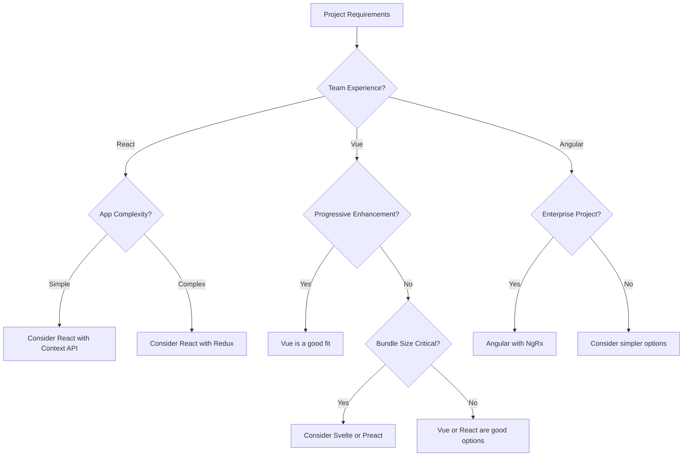

# Frontend Framework Questions

## Introduction

Frontend frameworks have become essential tools in modern web development. They provide structured approaches to building user interfaces, managing state, and handling user interactions. This guide explores common interview questions about frontend frameworks like React, Vue, and Angular that you might encounter as a beginner developer.

Understanding these frameworks and being able to discuss them intelligently is crucial for frontend development roles. We'll cover fundamental concepts, differences between popular frameworks, and practical implementation details that interviewers often ask about.

## Core Concepts

### What are Frontend Frameworks?

Frontend frameworks are JavaScript libraries or platforms that provide developers with pre-written code components, tools, and architectural patterns for building user interfaces. They help solve common challenges in web development by offering:

- A structured way to build complex UIs
- Efficient rendering and DOM manipulation
- State management solutions
- Routing capabilities
- Form handling utilities

### Why Use a Framework vs. Vanilla JavaScript?

This is a common interview question that tests your understanding of the value frameworks provide.

**Key points to mention:**

- **Productivity**: Frameworks provide ready-made solutions for common tasks
- **Structure**: They enforce consistent code organization
- **Component Reusability**: Encourages building reusable UI components
- **Performance Optimization**: Many frameworks use virtual DOM or other techniques for efficient updates
- **Community Support**: Large ecosystems with libraries, tools, and documentation

## Popular Framework Comparison

Interviewers often ask candidates to compare major frameworks. Here's a comparison table of React, Vue, and Angular that covers key points:

| Feature | React | Vue | Angular |
|---------|-------|-----|---------|
| Type | Library | Progressive Framework | Full Framework |
| Learning Curve | Moderate | Easy | Steep |
| DOM Manipulation | Virtual DOM | Virtual DOM | Real DOM with Zone.js |
| Data Binding | One-way | Two-way (optional) | Two-way |
| State Management | External (Redux, Context API) | Vuex | Services, NgRx |
| Created By | Facebook | Evan You | Google |
| Language | JavaScript/JSX | JavaScript/HTML Templates | TypeScript |
| Component Syntax | JSX | Single-file components | Component decorators |

## Common Interview Questions

### 1. What is React and what are its key features?

**Answer Example:**
React is a JavaScript library for building user interfaces, particularly single-page applications. It was developed by Facebook.

Key features include:
- **Component-Based Architecture**: UI is built from reusable, self-contained components
- **Virtual DOM**: A lightweight copy of the real DOM for performance optimization
- **JSX**: JavaScript syntax extension that allows HTML-like code in JavaScript
- **Unidirectional Data Flow**: Data flows one way from parent to child components
- **React Hooks**: Functions that let you use state and lifecycle features in functional components

**Code Example - React Component:**

```jsx
import React, { useState } from 'react';

function Counter() {
  // Using the state hook
  const [count, setCount] = useState(0);

  return (
    <div>
      <p>You clicked {count} times</p>
      <button onClick={() => setCount(count + 1)}>
        Click me
      </button>
    </div>
  );
}

export default Counter;
```

### 2. What is the Virtual DOM and why is it important?

**Answer Example:**
The Virtual DOM is a programming concept where a virtual representation of the UI is kept in memory and synced with the real DOM through a process called reconciliation.

When a component's state changes:
1. React creates a new Virtual DOM tree
2. It compares this new tree with the previous one (diffing)
3. It calculates the minimum number of operations needed to update the real DOM
4. It updates only the changed parts of the actual DOM

This process is more efficient than directly manipulating the DOM for every small change, which can be expensive and slow.

### 3. Explain the component lifecycle in React

**Answer Example:**
React components go through a series of phases during their existence:

**Class Components Lifecycle:**
- **Mounting**: `constructor()`, `render()`, `componentDidMount()`
- **Updating**: `shouldComponentUpdate()`, `render()`, `componentDidUpdate()`
- **Unmounting**: `componentWillUnmount()`

**Functional Components with Hooks:**
- `useEffect()` with empty dependency array: equivalent to `componentDidMount`
- `useEffect()` with dependencies: runs on mount and when dependencies change
- `useEffect()` with cleanup function: cleanup function works like `componentWillUnmount`

**Code Example - Lifecycle with Hooks:**

```jsx
import React, { useState, useEffect } from 'react';

function LifecycleDemo() {
  const [count, setCount] = useState(0);

  // Similar to componentDidMount and componentDidUpdate
  useEffect(() => {
    // Update the document title using the browser API
    document.title = `You clicked ${count} times`;
    
    // Return a cleanup function (similar to componentWillUnmount)
    return () => {
      document.title = 'React App';
    };
  }, [count]); // Only re-run if count changes

  return (
    <div>
      <p>You clicked {count} times</p>
      <button onClick={() => setCount(count + 1)}>
        Click me
      </button>
    </div>
  );
}
```

### 4. What is the difference between state and props in React?

**Answer Example:**
Both state and props are JavaScript objects that hold information influencing a component's output, but they serve different purposes:

**Props (Properties):**
- Passed from parent to child components
- Read-only within the receiving component
- Used to customize components or pass data down the component tree
- Changes to props come from the parent component

**State:**
- Managed within the component (for class components) or through hooks (for functional components)
- Can be changed by the component itself
- Used for data that changes over time or user interaction
- Changes to state trigger re-rendering

**Code Example - Props vs State:**

```jsx
import React, { useState } from 'react';

// Child component receives props
function Greeting(props) {
  return <h1>Hello, {props.name}!</h1>;
}

// Parent component manages state
function App() {
  const [name, setName] = useState('Guest');
  
  return (
    <div>
      <Greeting name={name} />
      <input 
        value={name}
        onChange={(e) => setName(e.target.value)}
        placeholder="Enter your name"
      />
    </div>
  );
}
```

### 5. How does Vue.js compare to React?

**Answer Example:**
Vue and React are both popular frontend frameworks with some key differences:

- **Template System**: Vue uses HTML templates with Vue-specific directives, while React uses JSX
- **Learning Curve**: Vue is often considered easier to learn for beginners
- **State Management**: Vue has Vuex built by the same team, React often uses Redux or Context API
- **Size**: Vue core library is smaller than React + ReactDOM
- **Two-way Binding**: Vue supports two-way binding with v-model, React uses one-way data flow
- **Component Structure**: Vue uses Single File Components (template, script, style), React typically separates components into different files

**Code Example - Vue Component:**

```vue
<template>
  <div>
    <p>You clicked {{ count }} times</p>
    <button @click="increment">Click me</button>
  </div>
</template>

<script>
export default {
  data() {
    return {
      count: 0
    }
  },
  methods: {
    increment() {
      this.count++
    }
  }
}
</script>
```

### 6. What is Angular and how does it differ from AngularJS?

**Answer Example:**
Angular (version 2+) is a complete rewrite of AngularJS (version 1.x). The key differences are:

- **Architecture**: Angular uses components, while AngularJS used the MVC architecture
- **Language**: Angular is built with TypeScript, AngularJS used JavaScript
- **Mobile Support**: Angular is designed to be mobile-first
- **Dependency Injection**: Angular has an improved DI system
- **Performance**: Angular is significantly faster with better change detection
- **Directives**: Angular simplified the directive system
- **Routing**: Angular has a more powerful routing system

**Code Example - Angular Component:**

```typescript
import { Component } from '@angular/core';

@Component({
  selector: 'app-counter',
  template: `
    <div>
      <p>You clicked {{ count }} times</p>
      <button (click)="increment()">Click me</button>
    </div>
  `
})
export class CounterComponent {
  count = 0;
  
  increment() {
    this.count++;
  }
}
```

### 7. Explain the concept of state management in frontend frameworks

**Answer Example:**
State management refers to how an application manages and updates its data over time. As applications grow in complexity, managing state becomes challenging.

**Key state management approaches:**

1. **Component-level state**: Managed within individual components
   - React's useState hook or this.state in class components
   - Vue's data property
   - Angular's properties in component classes

2. **Lifting state up**: Moving state to common ancestor components

3. **Context/Provider pattern**:
   - React's Context API
   - Vue's provide/inject
   - Angular's hierarchical DI system

4. **Dedicated state management libraries**:
   - Redux or MobX for React
   - Vuex for Vue
   - NgRx for Angular

**Code Example - Redux (for React):**

```jsx
// Action types
const INCREMENT = 'INCREMENT';

// Action creator
const increment = () => ({ type: INCREMENT });

// Reducer
const counterReducer = (state = { count: 0 }, action) => {
  switch (action.type) {
    case INCREMENT:
      return { count: state.count + 1 };
    default:
      return state;
  }
};

// Component with Redux
import React from 'react';
import { useSelector, useDispatch } from 'react-redux';
import { increment } from './actions';

function Counter() {
  const count = useSelector(state => state.count);
  const dispatch = useDispatch();

  return (
    <div>
      <p>You clicked {count} times</p>
      <button onClick={() => dispatch(increment())}>
        Click me
      </button>
    </div>
  );
}
```

### 8. What are Single Page Applications (SPAs) and how do frameworks facilitate them?

**Answer Example:**
Single Page Applications (SPAs) load a single HTML page and dynamically update the content as users interact with the app, without full page reloads. Frontend frameworks facilitate SPAs by:

- **Client-side routing**: Changing the view without server requests
- **Dynamic DOM manipulation**: Efficiently updating only parts of the page that need to change
- **State management**: Maintaining application state between "pages"
- **Data fetching**: Asynchronously retrieving data from APIs
- **Code splitting**: Loading only necessary code for current views

Modern frameworks provide built-in or ecosystem tools for these capabilities:
- React: React Router, lazy loading with Suspense
- Vue: Vue Router, async components
- Angular: Angular Router, lazy loading modules

**Code Example - React Router:**

```jsx
import React from 'react';
import { BrowserRouter, Routes, Route, Link } from 'react-router-dom';

// Components for different "pages"
const Home = () => <h2>Home Page</h2>;
const About = () => <h2>About Page</h2>;
const Contact = () => <h2>Contact Page</h2>;

function App() {
  return (
    <BrowserRouter>
      <nav>
        <ul>
          <li><Link to="/">Home</Link></li>
          <li><Link to="/about">About</Link></li>
          <li><Link to="/contact">Contact</Link></li>
        </ul>
      </nav>

      <Routes>
        <Route path="/" element={<Home />} />
        <Route path="/about" element={<About />} />
        <Route path="/contact" element={<Contact />} />
      </Routes>
    </BrowserRouter>
  );
}
```

## Framework Selection

### 9. How do you choose the right framework for a project?

**Answer Example:**
Choosing the right framework depends on several factors:

- **Project Requirements**: Feature complexity, scalability needs
- **Team Expertise**: Existing knowledge and learning curve
- **Performance Needs**: Real-time updates, rendering speed
- **Development Speed**: Time constraints and productivity
- **Long-term Maintenance**: Community support, stability
- **Mobile/PWA Requirements**: Native-like features needed
- **Ecosystem**: Available libraries and tools
- **Company Standards**: Existing technology stack

There's no universally "best" framework—each has strengths for different use cases:

- **React**: Great for large-scale applications with complex state management needs
- **Vue**: Excellent for progressive enhancement of existing apps or smaller projects
- **Angular**: Well-suited for enterprise applications with strict architecture needs
- **Svelte**: Good for performance-critical applications with smaller bundle sizes

### 10. What are Web Components and how do they relate to frameworks?

**Answer Example:**
Web Components are a set of native browser APIs that allow you to create reusable custom elements with encapsulated functionality. They consist of four main technologies:

1. **Custom Elements**: JavaScript APIs to define new HTML elements
2. **Shadow DOM**: Encapsulated DOM and styling
3. **HTML Templates**: HTML fragments that aren't rendered immediately
4. **ES Modules**: JavaScript module system for loading code

Web Components relate to frameworks in several ways:
- Some frameworks (like Angular and Vue) can compile components to Web Components
- Frameworks often provide similar component models but with additional features
- Web Components can be used alongside frameworks in the same application
- Some modern frameworks (like Lit) are built specifically around enhancing Web Components

**Code Example - Basic Web Component:**

```javascript
// Define a custom element
class HelloWorld extends HTMLElement {
  constructor() {
    super();
    // Create a shadow root
    const shadow = this.attachShadow({ mode: 'open' });
    
    // Create element
    const wrapper = document.createElement('div');
    wrapper.textContent = 'Hello World!';
    
    // Add styles
    const style = document.createElement('style');
    style.textContent = `
      div {
        background-color: #ffe;
        padding: 10px;
        border-radius: 5px;
      }
    `;
    
    // Attach to shadow DOM
    shadow.appendChild(style);
    shadow.appendChild(wrapper);
  }
}

// Register the custom element
customElements.define('hello-world', HelloWorld);
```

Usage:
```html
<hello-world></hello-world>
```

## Advanced Topics

### 11. Describe the concept of Server-Side Rendering (SSR) in frontend frameworks

**Answer Example:**
Server-Side Rendering (SSR) is the process of rendering components on the server rather than in the browser. This results in faster initial page loads and better SEO since search engines can crawl fully rendered content.

**Key aspects of SSR:**

- **Initial Load Performance**: Users see content faster (First Contentful Paint)
- **SEO Benefits**: Search engines see the full content
- **Social Media Sharing**: Better previews when content is shared
- **Performance on Low-Power Devices**: Less JavaScript processing needed on client

**Framework implementations:**
- React: Next.js
- Vue: Nuxt.js
- Angular: Angular Universal

**SSR Flow:**
1. Server receives request
2. Renders components to HTML
3. Sends HTML to client
4. Client "hydrates" the page (attaches event handlers)

### 12. What is the JAMstack and how do frontend frameworks fit into it?

**Answer Example:**
JAMstack stands for JavaScript, APIs, and Markup. It's an architecture approach that decouples the frontend from backend services, focusing on pre-rendering and enhancing with client-side JavaScript.

**Key principles:**
- **Pre-rendered markup**: Built at deploy time, not on-demand
- **JavaScript**: Enhances the user experience for dynamic features
- **APIs**: Backend services consumed via JavaScript

**Frontend frameworks fit into JAMstack through:**
- Static Site Generators (SSG) built on frameworks:
  - Gatsby or Next.js (React)
  - Gridsome or Nuxt.js (Vue)
  - Scully (Angular)
- Build processes that generate static HTML
- Hydration that adds interactivity on the client

JAMstack sites typically deploy to CDNs for performance and scale, with dynamic functionality provided through APIs and serverless functions.

### 13. Explain the concept of state management libraries and when to use them

**Answer Example:**
State management libraries provide structured ways to manage application data outside of components. They become valuable as applications grow and state needs to be shared across many components.

**When to use state management libraries:**
- Multiple components need access to the same state
- State changes need to be predictable and traceable
- Application logic becomes complex
- You need time-travel debugging or state persistence

**Popular state management libraries:**

1. **Redux (React)**:
   - Based on a single immutable store
   - Uses actions and reducers
   - Provides middleware for side effects

2. **Vuex (Vue)**:
   - Modular store with state, mutations, actions, getters
   - Integrated deeply with Vue's reactivity system

3. **NgRx (Angular)**:
   - Based on Redux principles
   - Uses RxJS for reactive programming
   - Includes effects for side effects

4. **Zustand/Jotai/Recoil (React)**:
   - Newer, more lightweight alternatives
   - Less boilerplate code
   - Often built with hooks in mind

**Code Example - Simple Vuex Store:**

```javascript
import Vue from 'vue'
import Vuex from 'vuex'

Vue.use(Vuex)

export default new Vuex.Store({
  state: {
    count: 0
  },
  mutations: {
    increment(state) {
      state.count++
    }
  },
  actions: {
    incrementAsync({ commit }) {
      setTimeout(() => {
        commit('increment')
      }, 1000)
    }
  },
  getters: {
    doubleCount: state => state.count * 2
  }
})
```

## Performance Optimization

### 14. What are some key performance optimization techniques in frontend frameworks?

**Answer Example:**
Performance optimization in frontend frameworks focuses on reducing bundle size, improving rendering performance, and minimizing network requests.

**Common techniques include:**

1. **Code Splitting**:
   - Loading code on demand rather than all at once
   - Using dynamic imports or lazy loading components
   
2. **Tree Shaking**:
   - Removing unused code from final bundles
   
3. **Virtual DOM Optimization**:
   - Using keys for list rendering
   - Implementing shouldComponentUpdate or memo
   
4. **Memoization**:
   - Caching calculated values (useMemo in React)
   - Preventing unnecessary re-renders
   
5. **Asset Optimization**:
   - Properly sizing and compressing images
   - Using modern formats like WebP
   
6. **Bundle Analysis**:
   - Identifying and removing large dependencies
   
7. **Server-Side Rendering or Static Generation**:
   - Improving initial load time and SEO

**Code Example - React.memo and useMemo:**

```jsx
import React, { useState, useMemo } from 'react';

// Memoized component that only re-renders when props change
const ExpensiveComponent = React.memo(({ data }) => {
  console.log('Rendering expensive component');
  
  // Expensive calculation
  const processedData = data.map(item => item * 2);
  
  return (
    <ul>
      {processedData.map((item, index) => (
        <li key={index}>{item}</li>
      ))}
    </ul>
  );
});

function App() {
  const [count, setCount] = useState(0);
  const [data, setData] = useState([1, 2, 3, 4, 5]);
  
  // Memoized value that only recalculates when data changes
  const memoizedData = useMemo(() => data, [data]);
  
  return (
    <div>
      <button onClick={() => setCount(count + 1)}>
        Count: {count}
      </button>
      <ExpensiveComponent data={memoizedData} />
    </div>
  );
}
```

### 15. How do frontend frameworks handle accessibility?

**Answer Example:**
Modern frontend frameworks provide varying levels of support for building accessible applications:

**React:**
- No built-in accessibility features, but supports ARIA attributes
- Has accessibility testing tools like react-axe
- Community packages like react-aria for accessible components

**Vue:**
- Supports ARIA attributes
- Some official guidance on accessibility
- Community resources like vue-a11y

**Angular:**
- Built-in ARIA support
- Has accessibility developer guide
- CLI can generate accessible components

**Best practices across frameworks:**
- Use semantic HTML elements (`<button>`, `<nav>`, etc.)
- Include proper ARIA roles and attributes
- Ensure keyboard navigation works
- Maintain sufficient color contrast
- Provide text alternatives for non-text content
- Test with screen readers

**Code Example - Accessible React Button Component:**

```jsx
import React from 'react';

function AccessibleButton({ onClick, disabled, children }) {
  return (
    <button
      onClick={onClick}
      disabled={disabled}
      aria-disabled={disabled}
      className={`button ${disabled ? 'button--disabled' : ''}`}
    >
      {children}
    </button>
  );
}

// Usage
function App() {
  return (
    <AccessibleButton 
      onClick={() => alert('Button clicked!')}
      disabled={false}
    >
      Click Me
    </AccessibleButton>
  );
}
```

## Testing in Frontend Frameworks

### 16. What are the different types of tests for frontend applications?

**Answer Example:**
Frontend testing can be categorized into several types:

1. **Unit Tests**: Test individual functions and components in isolation
   - Framework examples: Jest, Mocha, Vitest

2. **Component Tests**: Test UI components with their rendering and behavior
   - Framework examples: React Testing Library, Vue Test Utils, Angular Testing Utilities

3. **Integration Tests**: Test interactions between multiple components
   - Framework examples: Same as component tests but with wider scope

4. **End-to-End Tests**: Test complete user flows through the application
   - Framework examples: Cypress, Playwright, Selenium

5. **Visual Regression Tests**: Ensure UI appears correctly
   - Framework examples: Storybook with Chromatic, Percy

6. **Performance Tests**: Measure loading and rendering times
   - Framework examples: Lighthouse, WebPageTest

**Code Example - React Component Test:**

```jsx
// Button.jsx
import React from 'react';

function Button({ onClick, children }) {
  return (
    <button onClick={onClick} className="button">
      {children}
    </button>
  );
}

// Button.test.jsx
import { render, screen, fireEvent } from '@testing-library/react';
import Button from './Button';

test('calls onClick when clicked', () => {
  // Arrange
  const handleClick = jest.fn();
  render(<Button onClick={handleClick}>Click Me</Button>);
  
  // Act
  fireEvent.click(screen.getByText(/click me/i));
  
  // Assert
  expect(handleClick).toHaveBeenCalledTimes(1);
});
```

## Trending Topics

### 17. What is the Jamstack and how does it relate to frontend frameworks?

**Answer Example:**
Jamstack (JavaScript, APIs, and Markup) is a modern web development architecture that separates the frontend from the backend and emphasizes pre-rendering and decoupling.

**Key principles:**
- Pre-rendered static sites (built at deploy time)
- Enhanced with client-side JavaScript
- Served from CDNs for performance
- Dynamic functionality via APIs and serverless functions

**Relationship to frontend frameworks:**
- Frameworks power static site generators:
  - React: Gatsby, Next.js
  - Vue: Nuxt.js, Gridsome
  - Angular: Scully
- Framework components are pre-rendered to static HTML
- Hydration adds interactivity to pre-rendered pages
- Build processes optimize assets for delivery

The Jamstack approach allows developers to use familiar framework tools while delivering highly performant sites with better security (smaller attack surface) and scalability (static assets on CDNs).

### 18. What are micro-frontends and how do they work with frameworks?

**Answer Example:**
Micro-frontends extend microservice principles to frontend development, breaking monolithic UIs into smaller, independently deployable applications that can be developed by different teams.

**Key characteristics:**
- Independent development and deployment
- Team autonomy (different teams can use different technologies)
- Isolation and resilience
- Composition at runtime or build time

**Integration approaches with frameworks:**
1. **Iframe-based**: Each micro-frontend runs in its own iframe
2. **Web Components**: Encapsulating micro-frontends as custom elements
3. **JavaScript integration**: Runtime loading of JavaScript bundles
4. **Build-time integration**: Composing applications during the build process

**Frameworks and tools:**
- Single-SPA: Framework-agnostic approach to loading micro-frontends
- Module Federation (Webpack 5): Share code between independently built applications
- Nx: Monorepo tooling that supports micro-frontend architecture
- Custom approaches using framework-specific features

**Code Example - Module Federation with Webpack 5:**

```javascript
// Host application webpack.config.js
module.exports = {
  // ...
  plugins: [
    new ModuleFederationPlugin({
      name: 'host',
      filename: 'remoteEntry.js',
      remotes: {
        teamA: 'teamA@http://localhost:3001/remoteEntry.js',
        teamB: 'teamB@http://localhost:3002/remoteEntry.js',
      },
      shared: ['react', 'react-dom'],
    }),
  ],
};

// Usage in host application
import React, { lazy, Suspense } from 'react';

// Dynamically import remote components
const TeamAFeature = lazy(() => import('teamA/Feature'));
const TeamBFeature = lazy(() => import('teamB/Feature'));

function App() {
  return (
    <div>
      <h1>Host Application</h1>
      <Suspense fallback={<div>Loading TeamA Feature...</div>}>
        <TeamAFeature />
      </Suspense>
      <Suspense fallback={<div>Loading TeamB Feature...</div>}>
        <TeamBFeature />
      </Suspense>
    </div>
  );
}
```

## Interview Preparation Strategies

### How to Prepare for Frontend Framework Interview Questions

1. **Understand Core Concepts**
   - Master the fundamentals of at least one framework deeply
   - Understand JavaScript concepts that underpin frameworks (closures, prototypes, etc.)
   - Learn about common patterns like components, state, props, and lifecycle

2. **Practice Coding Challenges**
   - Build small applications or components
   - Solve common UI problems (form validation, dynamic lists, etc.)
   - Practice explaining your code and decisions

3. **Study Framework Comparisons**
   - Know the strengths and weaknesses of major frameworks
   - Understand when to use each one
   - Be prepared to explain your framework preferences

4. **Learn Advanced Topics**
   - State management approaches
   - Performance optimization
   - SSR and static generation
   - Testing strategies

5. **Prepare Your Own Questions**
   - About the company's tech stack
   - About their framework usage
   - About their development process

## Framework Decision Flowchart

Here's a simple decision flowchart to help choose a frontend framework:



## Summary

Frontend frameworks are essential tools in modern web development. This guide covered key concepts, common interview questions, and practical examples for the most popular frameworks including React, Vue, and Angular.

Key takeaways:
- Each framework has different strengths and ideal use cases
- Understanding core concepts is more important than memorizing syntax
- Performance optimization is a crucial skill across all frameworks
- Testing is an essential part of frontend development
- The ecosystem around a framework is as important as the framework itself

As you prepare for interviews, focus on building practical experience and being able to explain your reasoning for technical decisions. Remember that interviewers are typically more interested in how you think about problems than whether you know every API detail.

## Additional Resources

### Learning Resources

- **Documentation**:
  - [React Official Docs](https://react.dev/)
  - [Vue.js Guide](https://vuejs.org/guide/introduction.html)
  - [Angular Docs](https://angular.io/docs)

- **Online Courses**:
  - Frontend Masters
  - Udemy
  - egghead.io

- **Books**:
  - "Learning React" by Alex Banks and Eve Porcello
  - "Fullstack Vue" by Hassan Djirdeh
  - "Angular in Action" by Jeremy Wilken

### Practice Exercises

1. **Build a Simple Todo App** in each major framework
2. **Create a Data Dashboard** with charts and filtering
3. **Implement form validation** with error handling
4. **Build a multi-step wizard** with state management
5. **Create a responsive layout** with component composition

### Interview Practice

1. Explain how data flows in your chosen framework
2. Compare and contrast state management solutions
3. Describe how you would optimize performance in a slow application
4. Implement a simple component with specified behavior during an interview
5. Discuss how you would structure a large application using your framework of choice