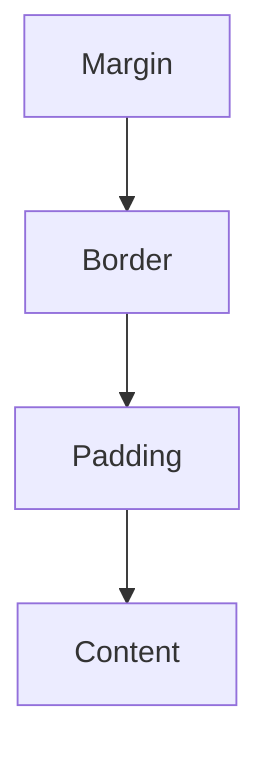

# HTML/CSS Fundamentals

## Introduction

HTML (HyperText Markup Language) and CSS (Cascading Style Sheets) form the foundation of modern web development. HTML provides the structure and content of web pages, while CSS controls their appearance and layout. Understanding these technologies is essential for anyone aspiring to become a web developer or preparing for technical interviews.

In this guide, we'll cover the core concepts of HTML and CSS, how they work together, and best practices for implementation. Whether you're building your first webpage or brushing up for an interview, this resource will help you master the fundamentals.

## HTML Basics

### What is HTML?

HTML is a markup language used to structure content on the web. It uses elements (tags) to define different types of content and their relationships.

### HTML Document Structure

Every HTML document follows a basic structure:

```html
<!DOCTYPE html>
<html lang="en">
<head>
  <meta charset="UTF-8" />
  <meta name="viewport" content="width=device-width, initial-scale=1.0" />
  <title>My Web Page</title>
</head>
<body>
  <!-- Content goes here -->
  <h1>Hello, World!</h1>
  <p>This is my first web page.</p>
</body>
</html>
```

Let's break down the key components:

- `<!DOCTYPE html>`: Declares the document type and HTML version
- `<html>`: The root element of an HTML page
- `<head>`: Contains meta-information about the document
- `<meta>`: Provides metadata such as character encoding and viewport settings
- `<title>`: Sets the title of the page (shown in browser tabs)
- `<body>`: Contains the visible content of the page

### Common HTML Elements

#### Text Elements

```html
<h1>Heading Level 1</h1>
<h2>Heading Level 2</h2>
<h3>Heading Level 3</h3>
<p>This is a paragraph of text.</p>
<strong>Bold text</strong>
<em>Italic text</em>
<br />
<hr />
```

#### Lists

```html
<!-- Ordered List -->
<ol>
  <li>First item</li>
  <li>Second item</li>
  <li>Third item</li>
</ol>

<!-- Unordered List -->
<ul>
  <li>Apple</li>
  <li>Orange</li>
  <li>Banana</li>
</ul>
```

#### Links and Images

```html
<!-- Link -->
<a href="https://example.com">Visit Example</a>

<!-- Image -->

```

#### Tables

```html
<table>
  <thead>
    <tr>
      <th>Name</th>
      <th>Email</th>
      <th>Role</th>
    </tr>
  </thead>
  <tbody>
    <tr>
      <td>Jane Doe</td>
      <td>jane@example.com</td>
      <td>Developer</td>
    </tr>
    <tr>
      <td>John Smith</td>
      <td>john@example.com</td>
      <td>Designer</td>
    </tr>
  </tbody>
</table>
```

#### Forms

```html
<form action="/submit" method="post">
  <label for="name">Name:</label>
  <input type="text" id="name" name="name" required />
  
  <label for="email">Email:</label>
  <input type="email" id="email" name="email" required />
  
  <label for="message">Message:</label>
  <textarea id="message" name="message" rows="4"></textarea>
  
  <button type="submit">Submit</button>
</form>
```

### Semantic HTML

Semantic elements clearly describe their meaning to both the browser and the developer:

```html
<header>
  <nav>
    <ul>
      <li><a href="#home">Home</a></li>
      <li><a href="#about">About</a></li>
      <li><a href="#contact">Contact</a></li>
    </ul>
  </nav>
</header>

<main>
  <section id="about">
    <h2>About Us</h2>
    <p>Information about our company.</p>
  </section>
  
  <article>
    <h2>Recent News</h2>
    <p>Our company just launched a new product!</p>
  </article>
  
  <aside>
    <h3>Related Links</h3>
    <ul>
      <li><a href="#link1">Link 1</a></li>
      <li><a href="#link2">Link 2</a></li>
    </ul>
  </aside>
</main>

<footer>
  <p>&copy; 2025 My Company</p>
</footer>
```

Using semantic elements like `<header>`, `<nav>`, `<main>`, `<section>`, `<article>`, `<aside>`, and `<footer>` improves:
- Accessibility for screen readers
- SEO performance
- Code readability and maintainability

## CSS Basics

### What is CSS?

CSS (Cascading Style Sheets) is a stylesheet language used to describe the presentation of an HTML document. It controls layout, colors, fonts, and other visual aspects of web pages.

### How to Add CSS to HTML

There are three ways to include CSS in an HTML document:

#### 1. Inline CSS

```html
<p style="color: blue; font-size: 18px;">This is a blue paragraph.</p>
```

#### 2. Internal CSS (in the `<head>` section)

```html
<head>
  <style>
    p {
      color: blue;
      font-size: 18px;
    }
  </style>
</head>
```

#### 3. External CSS (recommended)

```html
<head>
  <link rel="stylesheet" href="styles.css" />
</head>
```

With the CSS in a separate file (styles.css):

```css
p {
  color: blue;
  font-size: 18px;
}
```

### CSS Selectors

Selectors determine which HTML elements the CSS rules apply to:

```css
/* Element selector */
p {
  color: blue;
}

/* Class selector */
.highlight {
  background-color: yellow;
}

/* ID selector */
#header {
  background-color: black;
  color: white;
}

/* Attribute selector */
input[type="text"] {
  border: 1px solid gray;
}

/* Descendant selector */
article p {
  font-style: italic;
}

/* Child selector */
ul > li {
  list-style-type: square;
}

/* Pseudo-class */
a:hover {
  text-decoration: underline;
}
```

### The Box Model

All HTML elements can be considered as boxes. The CSS box model describes the rectangular boxes that are generated for elements in the document tree and laid out according to the visual formatting model.



```css
.box {
  /* Content dimensions */
  width: 300px;
  height: 200px;
  
  /* Padding (inside the border) */
  padding: 20px;
  
  /* Border */
  border: 2px solid black;
  
  /* Margin (outside the border) */
  margin: 30px;
}
```

By default, the `width` and `height` properties define the dimensions of the content area only. You can change this behavior with `box-sizing`:

```css
* {
  box-sizing: border-box; /* Width/height includes padding and border */
}
```

### CSS Units

CSS offers various units for specifying dimensions:

```css
/* Absolute units */
.element {
  width: 100px; /* Pixels */
  margin: 0.5in; /* Inches */
  padding: 1cm; /* Centimeters */
}

/* Relative units */
.container {
  font-size: 1em; /* Relative to parent's font-size */
  width: 50%; /* Percentage of parent element */
  height: 100vh; /* Viewport height */
  padding: 2rem; /* Relative to root font-size */
}
```

### Colors in CSS

```css
/* Named colors */
.named {
  color: red;
  background-color: lightblue;
}

/* Hexadecimal */
.hex {
  color: #ff0000; /* Red */
  background-color: #f0f0f0; /* Light gray */
}

/* RGB */
.rgb {
  color: rgb(255, 0, 0); /* Red */
  background-color: rgb(240, 240, 240); /* Light gray */
}

/* RGBA (with alpha/transparency) */
.rgba {
  color: rgba(255, 0, 0, 0.5); /* Semi-transparent red */
}

/* HSL (Hue, Saturation, Lightness) */
.hsl {
  color: hsl(0, 100%, 50%); /* Red */
}
```

### Typography

```css
body {
  font-family: 'Arial', sans-serif;
  font-size: 16px;
  line-height: 1.5;
  text-align: left;
}

h1 {
  font-weight: bold;
  font-size: 2em;
  text-transform: uppercase;
  letter-spacing: 2px;
}

p {
  text-indent: 2em;
  word-spacing: 2px;
}

a {
  text-decoration: none;
  color: blue;
}
```

## CSS Layout

### Display Property

The `display` property determines how an element is rendered in the layout:

```css
/* Block elements take the full width available */
div {
  display: block;
}

/* Inline elements only take up as much width as needed */
span {
  display: inline;
}

/* Inline-block elements can have width/height but flow inline */
.icon {
  display: inline-block;
  width: 20px;
  height: 20px;
}

/* Hide elements */
.hidden {
  display: none;
}
```

### Position Property

The `position` property specifies how an element is positioned in the document:

```css
/* Default positioning */
.default {
  position: static;
}

/* Relative to its normal position */
.relative {
  position: relative;
  top: 10px;
  left: 20px;
}

/* Relative to the viewport */
.fixed {
  position: fixed;
  top: 0;
  right: 0;
}

/* Relative to the nearest positioned ancestor */
.absolute {
  position: absolute;
  bottom: 10px;
  left: 10px;
}

/* Similar to fixed, but relative to nearest scrolling ancestor */
.sticky {
  position: sticky;
  top: 0;
}
```

### Flexbox

Flexbox is a one-dimensional layout method designed for arranging items in rows or columns:

```css
.container {
  display: flex;
  flex-direction: row; /* or column */
  justify-content: space-between; /* horizontal alignment */
  align-items: center; /* vertical alignment */
  flex-wrap: wrap; /* allows items to wrap to next line */
}

.item {
  flex: 1; /* grow and shrink equally */
  /* or more specifically: */
  flex-grow: 1;
  flex-shrink: 1;
  flex-basis: auto;
}
```

Example application:

```html
<div class="flex-container">
  <div class="flex-item">Item 1</div>
  <div class="flex-item">Item 2</div>
  <div class="flex-item">Item 3</div>
</div>
```

```css
.flex-container {
  display: flex;
  justify-content: space-around;
  align-items: center;
  height: 200px;
  background-color: #f5f5f5;
}

.flex-item {
  padding: 20px;
  background-color: #3498db;
  color: white;
  font-weight: bold;
  text-align: center;
}
```

### CSS Grid

Grid is a two-dimensional layout system designed for complex layouts:

```css
.grid-container {
  display: grid;
  grid-template-columns: repeat(3, 1fr); /* 3 equal columns */
  grid-template-rows: 100px 200px;
  gap: 10px;
}

.header {
  grid-column: 1 / -1; /* Spans all columns */
}

.sidebar {
  grid-row: 2 / 4; /* Spans 2 rows */
}

.content {
  grid-column: 2 / 4; /* Spans 2 columns */
  grid-row: 2 / 3;
}
```

Example application:

```html
<div class="grid-layout">
  <header class="grid-header">Header</header>
  <nav class="grid-nav">Navigation</nav>
  <main class="grid-main">Main Content</main>
  <aside class="grid-sidebar">Sidebar</aside>
  <footer class="grid-footer">Footer</footer>
</div>
```

```css
.grid-layout {
  display: grid;
  grid-template-areas:
    "header header header"
    "nav main sidebar"
    "footer footer footer";
  grid-template-columns: 1fr 3fr 1fr;
  grid-template-rows: auto 1fr auto;
  min-height: 100vh;
  gap: 10px;
}

.grid-header {
  grid-area: header;
  background-color: #3498db;
}

.grid-nav {
  grid-area: nav;
  background-color: #2ecc71;
}

.grid-main {
  grid-area: main;
  background-color: #ecf0f1;
}

.grid-sidebar {
  grid-area: sidebar;
  background-color: #e74c3c;
}

.grid-footer {
  grid-area: footer;
  background-color: #34495e;
}
```

## CSS Responsive Design

### Media Queries

Media queries allow you to apply different styles based on device characteristics:

```css
/* Base styles for all devices */
body {
  font-size: 16px;
}

/* Styles for screens narrower than 600px */
@media (max-width: 600px) {
  body {
    font-size: 14px;
  }
  
  .container {
    flex-direction: column;
  }
}

/* Styles for screens wider than 1200px */
@media (min-width: 1200px) {
  .container {
    max-width: 1200px;
    margin: 0 auto;
  }
}

/* Styles for print */
@media print {
  .no-print {
    display: none;
  }
  
  body {
    font-size: 12pt;
  }
}
```

### Viewport Meta Tag

Essential for responsive design on mobile devices:

```html
<meta name="viewport" content="width=device-width, initial-scale=1.0" />
```

### Fluid Images

Make images responsive:

```css
img {
  max-width: 100%;
  height: auto;
}
```

## Practical Example: Building a Simple Landing Page

Let's combine HTML and CSS to create a simple, responsive landing page:

```html
<!DOCTYPE html>
<html lang="en">
<head>
  <meta charset="UTF-8" />
  <meta name="viewport" content="width=device-width, initial-scale=1.0" />
  <title>Company Landing Page</title>
  <link rel="stylesheet" href="styles.css" />
</head>
<body>
  <header>
    <div class="container">
      <h1 class="logo">CompanyName</h1>
      <nav>
        <ul>
          <li><a href="#home">Home</a></li>
          <li><a href="#features">Features</a></li>
          <li><a href="#about">About</a></li>
          <li><a href="#contact">Contact</a></li>
        </ul>
      </nav>
    </div>
  </header>

  <section id="hero">
    <div class="container">
      <h2>Welcome to Our Platform</h2>
      <p>The easiest way to build modern websites with HTML and CSS</p>
      <button class="cta-button">Get Started</button>
    </div>
  </section>

  <section id="features">
    <div class="container">
      <h2>Key Features</h2>
      <div class="features-grid">
        <div class="feature">
          <h3>Responsive Design</h3>
          <p>Looks great on any device, from mobile to desktop.</p>
        </div>
        <div class="feature">
          <h3>Modern Layouts</h3>
          <p>Use CSS Grid and Flexbox for powerful layouts.</p>
        </div>
        <div class="feature">
          <h3>Fast Performance</h3>
          <p>Optimized for speed and user experience.</p>
        </div>
      </div>
    </div>
  </section>

  <footer>
    <div class="container">
      <p>&copy; 2025 CompanyName. All rights reserved.</p>
    </div>
  </footer>
</body>
</html>
```

```css
/* styles.css */
* {
  margin: 0;
  padding: 0;
  box-sizing: border-box;
}

body {
  font-family: 'Segoe UI', Tahoma, Geneva, Verdana, sans-serif;
  line-height: 1.6;
  color: #333;
}

.container {
  width: 90%;
  max-width: 1200px;
  margin: 0 auto;
  padding: 0 15px;
}

/* Header */
header {
  background-color: #2c3e50;
  color: white;
  padding: 1rem 0;
  position: sticky;
  top: 0;
  z-index: 100;
}

header .container {
  display: flex;
  justify-content: space-between;
  align-items: center;
}

.logo {
  font-size: 1.5rem;
  font-weight: bold;
}

nav ul {
  display: flex;
  list-style: none;
}

nav ul li {
  margin-left: 1.5rem;
}

nav a {
  color: white;
  text-decoration: none;
  transition: color 0.3s;
}

nav a:hover {
  color: #3498db;
}

/* Hero Section */
#hero {
  background-color: #3498db;
  color: white;
  text-align: center;
  padding: 4rem 0;
}

#hero h2 {
  font-size: 2.5rem;
  margin-bottom: 1rem;
}

#hero p {
  font-size: 1.2rem;
  margin-bottom: 2rem;
}

.cta-button {
  display: inline-block;
  background-color: white;
  color: #3498db;
  padding: 0.75rem 1.5rem;
  font-size: 1rem;
  border: none;
  border-radius: 5px;
  cursor: pointer;
  transition: background-color 0.3s, transform 0.2s;
}

.cta-button:hover {
  background-color: #f4f4f4;
  transform: translateY(-3px);
}

/* Features Section */
#features {
  padding: 4rem 0;
  background-color: #f9f9f9;
}

#features h2 {
  text-align: center;
  margin-bottom: 3rem;
}

.features-grid {
  display: grid;
  grid-template-columns: repeat(auto-fit, minmax(300px, 1fr));
  gap: 2rem;
}

.feature {
  background-color: white;
  padding: 2rem;
  border-radius: 5px;
  box-shadow: 0 2px 10px rgba(0, 0, 0, 0.1);
  text-align: center;
}

.feature h3 {
  margin-bottom: 1rem;
  color: #3498db;
}

/* Footer */
footer {
  background-color: #2c3e50;
  color: white;
  text-align: center;
  padding: 2rem 0;
}

/* Media Queries */
@media (max-width: 768px) {
  header .container {
    flex-direction: column;
    text-align: center;
  }

  nav ul {
    margin-top: 1rem;
  }
  
  #hero h2 {
    font-size: 2rem;
  }
}

@media (max-width: 480px) {
  nav ul {
    flex-direction: column;
    align-items: center;
  }
  
  nav ul li {
    margin: 0.5rem 0;
  }
  
  .features-grid {
    grid-template-columns: 1fr;
  }
}
```

## Common HTML/CSS Interview Questions

### HTML Questions:

1. **What is the difference between `<div>` and `<span>`?**
   - `<div>` is a block-level element that starts on a new line and takes up the full width available
   - `<span>` is an inline element that only takes up as much width as necessary

2. **Explain the difference between `<section>` and `<div>`.**
   - `<section>` is a semantic element that represents a standalone section of content
   - `<div>` is a non-semantic container used for styling purposes

3. **What is the purpose of the `alt` attribute in images?**
   - Provides alternative text for screen readers
   - Displays when images fail to load
   - Improves SEO

4. **What's the difference between HTML and HTML5?**
   - HTML5 introduced semantic elements (`<header>`, `<footer>`, etc.)
   - Added support for audio/video without plugins
   - Introduced canvas, local storage, and form improvements

### CSS Questions:

1. **What is the CSS Box Model?**
   - A box that wraps around HTML elements
   - Consists of: content, padding, border, and margin

2. **Explain the difference between `position: relative`, `position: absolute`, and `position: fixed`.**
   - `relative`: Positioned relative to its normal position
   - `absolute`: Positioned relative to the nearest positioned ancestor
   - `fixed`: Positioned relative to the viewport

3. **What is the difference between Flexbox and Grid?**
   - Flexbox is one-dimensional (row OR column)
   - Grid is two-dimensional (rows AND columns)

4. **What are CSS preprocessors? Name some advantages.**
   - Languages that extend CSS (Sass, Less, Stylus)
   - Advantages: variables, nesting, mixins, inheritance

5. **Explain the concept of "cascading" in CSS.**
   - The process of combining different stylesheets and resolving conflicts
   - Priority: inline styles > internal styles > external styles
   - Specificity: ID > class > element

## Best Practices

### HTML Best Practices
- Use semantic HTML whenever possible
- Keep HTML structure clean and logical
- Use appropriate tags for content
- Ensure proper nesting of elements
- Make your site accessible with ARIA attributes
- Validate your HTML code

### CSS Best Practices
- Use external stylesheets
- Organize CSS with a consistent methodology (BEM, SMACSS, etc.)
- Avoid inline styles
- Use shorthand properties
- Minimize specificity conflicts
- Consider mobile-first design
- Comment your code

## Summary

HTML and CSS are the foundational technologies of web development. HTML provides the structure and content, while CSS controls the presentation and layout. Together, they enable the creation of responsive, accessible, and visually appealing websites.

Key takeaways:
- HTML uses elements to define content structure
- Semantic HTML improves accessibility and SEO
- CSS controls styling through selectors and declarations
- The box model defines how elements are sized and spaced
- Flexbox and Grid provide powerful layout capabilities
- Responsive design ensures sites work on all devices

## Additional Resources

### Learning Resources
- MDN Web Docs: [HTML](https://developer.mozilla.org/en-US/docs/Web/HTML) and [CSS](https://developer.mozilla.org/en-US/docs/Web/CSS)
- CSS-Tricks: [A Complete Guide to Flexbox](https://css-tricks.com/snippets/css/a-guide-to-flexbox/)
- CSS-Tricks: [A Complete Guide to Grid](https://css-tricks.com/snippets/css/complete-guide-grid/)
- [W3Schools HTML Tutorial](https://www.w3schools.com/html/)
- [W3Schools CSS Tutorial](https://www.w3schools.com/css/)

### Practice Exercises

1. **Basic Layout Exercise**
   - Create a simple webpage with a header, main content area with two columns, and a footer
   - Style it using both Flexbox and Grid (as separate exercises)
   - Make it responsive for mobile and desktop

2. **Form Styling Challenge**
   - Create a signup form with name, email, password, and submit button
   - Style it to look modern and user-friendly
   - Add form validation with CSS

3. **Card Component**
   - Create a reusable card component with image, title, description, and button
   - Style it with CSS
   - Create a layout with multiple cards using Flexbox or Grid

4. **Navigation Bar**
   - Create a responsive navigation bar that collapses into a hamburger menu on mobile
   - Implement dropdown menus for desktop view
   - Ensure it's accessible and keyboard-navigable