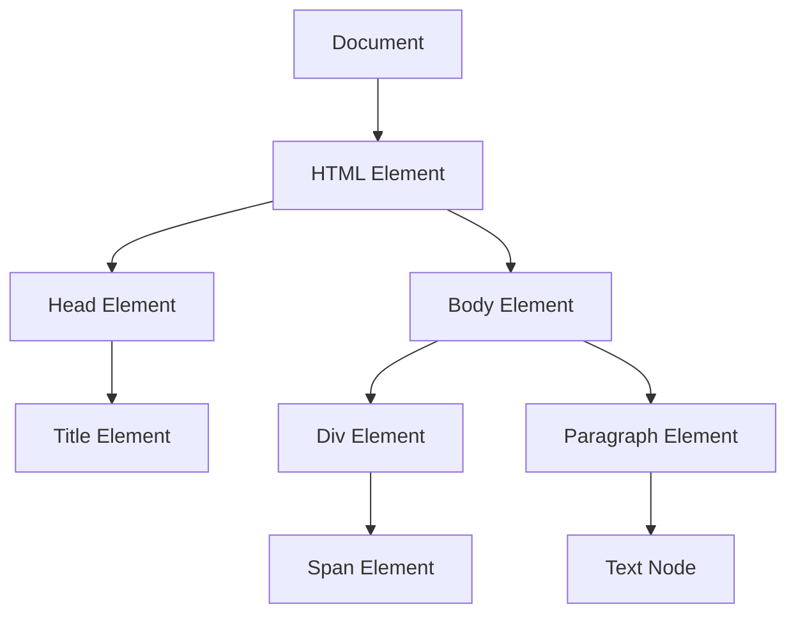

# JavaScript DOM Manipulation

## Introduction

The Document Object Model (DOM) is a programming interface for web documents. It represents the page as nodes and objects, allowing programming languages like JavaScript to interact with the structure, style, and content of web pages. DOM manipulation is the process of using JavaScript to modify web page content dynamically without requiring a page refresh.

Understanding DOM manipulation is essential for creating interactive web applications and is frequently tested in web development interviews. This guide will walk you through the fundamentals of DOM manipulation with JavaScript, providing practical examples that you can use in your projects.

## The DOM Tree Structure

The DOM represents an HTML document as a tree of nodes. Each part of the document becomes a node in this tree:



Understanding this tree structure is crucial for effective DOM manipulation.

## Selecting DOM Elements

Before manipulating the DOM, you need to select the elements you want to work with. JavaScript provides several methods for this:

### getElementById

Selects an element by its unique ID attribute:

```javascript
const element = document.getElementById('myElement');
```

### querySelector

Selects the first element that matches a CSS selector:

```javascript
const element = document.querySelector('.myClass');
const element2 = document.querySelector('#myId');
const element3 = document.querySelector('div > p');
```

### querySelectorAll

Selects all elements that match a CSS selector, returning a NodeList:

```javascript
const elements = document.querySelectorAll('.myClass');
```

### getElementsByClassName

Selects elements by class name, returning an HTMLCollection:

```javascript
const elements = document.getElementsByClassName('myClass');
```

### getElementsByTagName

Selects elements by tag name, returning an HTMLCollection:

```javascript
const paragraphs = document.getElementsByTagName('p');
```

## Manipulating DOM Elements

Once you've selected elements, you can manipulate them in various ways:

### Changing Content

#### textContent

Changes or gets the text content of an element:

```javascript
// Get text content
const text = element.textContent;

// Set text content
element.textContent = 'New text content';
```

#### innerHTML

Changes or gets the HTML content of an element:

```javascript
// Get HTML content
const html = element.innerHTML;

// Set HTML content
element.innerHTML = '<span>New HTML content</span>';
```

**Note:** Using `innerHTML` with user input can lead to security vulnerabilities like XSS attacks. Consider using `textContent` or DOM methods instead when handling user input.

### Changing Attributes

You can modify element attributes using these methods:

```javascript
// Get attribute value
const value = element.getAttribute('href');

// Set attribute value
element.setAttribute('href', 'https://example.com');

// Check if attribute exists
const hasAttr = element.hasAttribute('disabled');

// Remove attribute
element.removeAttribute('disabled');
```

### Changing Styles

You can change an element's style in several ways:

#### Using the style Property

Direct style manipulation:

```javascript
element.style.color = 'blue';
element.style.backgroundColor = 'yellow'; // Note camelCase for CSS properties
element.style.fontSize = '16px';
```

#### Adding/Removing CSS Classes

Using classList:

```javascript
// Add a class
element.classList.add('highlight');

// Remove a class
element.classList.remove('hidden');

// Toggle a class (adds if absent, removes if present)
element.classList.toggle('active');

// Check if element has a class
const hasClass = element.classList.contains('active');
```

## Creating and Removing Elements

### Creating Elements

To create new elements and add them to the DOM:

```javascript
// Create a new element
const newParagraph = document.createElement('p');

// Add content to the element
newParagraph.textContent = 'This is a new paragraph.';

// Append the element to an existing element
document.body.appendChild(newParagraph);
```

### Inserting Elements at Specific Positions

```javascript
// Insert before a specific element
parentElement.insertBefore(newElement, referenceElement);

// Modern methods
parentElement.prepend(newElement); // Insert as first child
parentElement.append(newElement);  // Insert as last child
siblingElement.before(newElement); // Insert before sibling
siblingElement.after(newElement);  // Insert after sibling
```

### Removing Elements

```javascript
// Remove an element
element.remove();

// Old method: remove child from parent
parentElement.removeChild(childElement);
```

### Cloning Elements

```javascript
// Clone an element (false = don't clone children)
const clone = element.cloneNode(false);

// Clone element with all its children
const deepClone = element.cloneNode(true);
```

## Event Handling

Event handling is a crucial part of DOM manipulation. It allows you to respond to user interactions:

### Adding Event Listeners

```javascript
element.addEventListener('click', function(event) {
  console.log('Element was clicked!');
  console.log(event); // The event object contains useful information
});
```

### Common Events

- `click`: When an element is clicked
- `submit`: When a form is submitted
- `keyup`/`keydown`: When a key is pressed/released
- `mouseover`/`mouseout`: When the mouse enters/leaves an element
- `load`: When a resource has loaded
- `change`: When an input's value changes
- `focus`/`blur`: When an element gains/loses focus

### Event Delegation

Event delegation is a technique where you add a single event listener to a parent element instead of adding listeners to multiple child elements:

```javascript
document.getElementById('parent-list').addEventListener('click', function(event) {
  // Check if the clicked element is a list item
  if (event.target.tagName === 'LI') {
    console.log('List item clicked:', event.target.textContent);
  }
});
```

This is especially useful for dynamically created elements.

## Practical Examples

### Example 1: Todo List Application

Let's create a simple todo list that demonstrates many DOM manipulation techniques:

```javascript
// HTML Structure:
// <input id="todoInput" type="text" placeholder="Enter a task">
// <button id="addButton">Add Task</button>
// <ul id="todoList"></ul>

document.getElementById('addButton').addEventListener('click', function() {
  // Get the input value
  const todoText = document.getElementById('todoInput').value.trim();
  
  if (todoText !== '') {
    // Create new list item
    const newTodo = document.createElement('li');
    
    // Create text node
    const todoContent = document.createTextNode(todoText);
    
    // Create delete button
    const deleteButton = document.createElement('button');
    deleteButton.textContent = 'Delete';
    deleteButton.classList.add('delete-btn');
    
    // Add event listener to delete button
    deleteButton.addEventListener('click', function() {
      newTodo.remove();
    });
    
    // Assemble the list item
    newTodo.appendChild(todoContent);
    newTodo.appendChild(deleteButton);
    
    // Add the new item to the list
    document.getElementById('todoList').appendChild(newTodo);
    
    // Clear the input field
    document.getElementById('todoInput').value = '';
  }
});
```

### Example 2: Form Validation

```javascript
// HTML Structure:
// <form id="registrationForm">
//   <input type="text" id="username" placeholder="Username">
//   <span id="usernameError" class="error"></span>
//   <input type="email" id="email" placeholder="Email">
//   <span id="emailError" class="error"></span>
//   <button type="submit">Register</button>
// </form>

document.getElementById('registrationForm').addEventListener('submit', function(event) {
  // Prevent form submission
  event.preventDefault();
  
  let valid = true;
  
  // Username validation
  const username = document.getElementById('username').value.trim();
  const usernameError = document.getElementById('usernameError');
  
  if (username.length < 5) {
    usernameError.textContent = 'Username must be at least 5 characters';
    valid = false;
  } else {
    usernameError.textContent = '';
  }
  
  // Email validation
  const email = document.getElementById('email').value.trim();
  const emailError = document.getElementById('emailError');
  const emailRegex = /^[^\s@]+@[^\s@]+\.[^\s@]+$/;
  
  if (!emailRegex.test(email)) {
    emailError.textContent = 'Please enter a valid email address';
    valid = false;
  } else {
    emailError.textContent = '';
  }
  
  // If valid, you would normally submit the form
  if (valid) {
    console.log('Form is valid, ready to submit!');
    // form.submit(); // Uncomment to actually submit
  }
});
```

### Example 3: Dynamic Content Loading

```javascript
// HTML Structure:
// <button id="loadData">Load Articles</button>
// <div id="articleContainer"></div>

document.getElementById('loadData').addEventListener('click', function() {
  // Show loading state
  this.textContent = 'Loading...';
  this.disabled = true;
  
  // Simulating data fetch (in real apps, use fetch API or XMLHttpRequest)
  setTimeout(function() {
    const articles = [
      { title: 'DOM Manipulation Basics', content: 'Learn the fundamentals...' },
      { title: 'Advanced JavaScript Techniques', content: 'Take your skills...' },
      { title: 'Web Performance Optimization', content: 'Make your site faster...' }
    ];
    
    const container = document.getElementById('articleContainer');
    
    // Clear any existing content
    container.innerHTML = '';
    
    // Create article elements
    articles.forEach(function(article) {
      const articleElement = document.createElement('article');
      
      const titleElement = document.createElement('h2');
      titleElement.textContent = article.title;
      
      const contentElement = document.createElement('p');
      contentElement.textContent = article.content;
      
      articleElement.appendChild(titleElement);
      articleElement.appendChild(contentElement);
      container.appendChild(articleElement);
    });
    
    // Reset button
    const button = document.getElementById('loadData');
    button.textContent = 'Refresh Articles';
    button.disabled = false;
  }, 1500);
});
```

## Performance Considerations

When manipulating the DOM, keep these performance tips in mind:

1. **Minimize DOM Updates**: Each DOM change triggers reflow (layout recalculation) and repaint.

2. **Use DocumentFragment**: When adding multiple elements:

```javascript
// Create a document fragment
const fragment = document.createDocumentFragment();

// Add elements to the fragment
for (let i = 0; i < 100; i++) {
  const newElement = document.createElement('div');
  newElement.textContent = `Item ${i}`;
  fragment.appendChild(newElement);
}

// Add the fragment to the DOM (only one reflow)
document.getElementById('container').appendChild(fragment);
```

3. **Batch DOM Updates**: Use CSS classes for multiple style changes instead of multiple style property changes.

4. **Cache DOM References**: Store references to elements you use frequently.

```javascript
// Bad (repeatedly queries the DOM)
function updateCount(count) {
  document.getElementById('counter').textContent = count;
}

// Good (caches the DOM reference)
const counterElement = document.getElementById('counter');
function updateCount(count) {
  counterElement.textContent = count;
}
```

5. **Be Careful with innerHTML**: Using `innerHTML` repeatedly discards existing elements and recreates them, losing any attached event listeners.

## Common Interview Questions on DOM Manipulation

Here are some frequently asked questions in web development interviews:

1. **Q: What is the difference between `innerHTML` and `textContent`?**
   
   A: `innerHTML` gets or sets the HTML content of an element and parses HTML tags, while `textContent` gets or sets only the text content and treats HTML tags as literal text.

2. **Q: Explain event delegation and its benefits.**
   
   A: Event delegation is attaching an event listener to a parent element that will fire for all descendants matching a selector, rather than attaching listeners to individual elements. Benefits include better memory usage, automatic handling of dynamically added elements, and less code.

3. **Q: How would you efficiently add 1000 elements to the DOM?**
   
   A: Use a DocumentFragment to build the complete structure off-DOM, then append it once, or use modern methods like `insertAdjacentHTML()` for better performance.

4. **Q: What are the differences between an HTMLCollection and a NodeList?**
   
   A: Both are array-like collections of DOM elements. HTMLCollections are live (automatically updated when the DOM changes) and only contain Element nodes. NodeLists can be either live or static and may contain any type of Node. Additionally, NodeLists have some modern array methods like `forEach()`.

5. **Q: How can you prevent event bubbling?**
   
   A: Use `event.stopPropagation()` within an event handler to prevent the event from bubbling up to parent elements.

## Summary

DOM manipulation is a fundamental skill for web developers. It allows you to create dynamic, interactive web pages by:

- Selecting elements using methods like `getElementById` and `querySelector`
- Modifying content with `textContent` and `innerHTML`
- Changing styles and attributes
- Creating and removing elements
- Handling user events

Mastering these techniques will make you a more effective web developer and help you succeed in technical interviews.

## Additional Resources and Exercises

### Resources

- [MDN Web Docs: DOM Introduction](https://developer.mozilla.org/en-US/docs/Web/API/Document_Object_Model/Introduction)
- [JavaScript.info: DOM Manipulation](https://javascript.info/document)
- [W3Schools: HTML DOM Methods](https://www.w3schools.com/js/js_htmldom_methods.asp)

### Exercises

1. **DOM Traversal Challenge**: Create a function that, given an element, finds all its siblings and changes their background color.

2. **Interactive Image Gallery**: Build a simple image gallery where clicking on thumbnails displays the full image.

3. **Form Builder**: Create a script that dynamically generates a form based on a provided configuration object.

4. **DOM Search Utility**: Write a function that finds all elements matching specific criteria (e.g., all buttons with a certain class inside a specific container).

5. **Virtual DOM Implementation**: For advanced practice, try building a simple virtual DOM implementation that minimizes actual DOM operations.

By practicing these concepts, you'll build the confidence and skills needed to handle DOM manipulation questions in interviews and real-world projects.