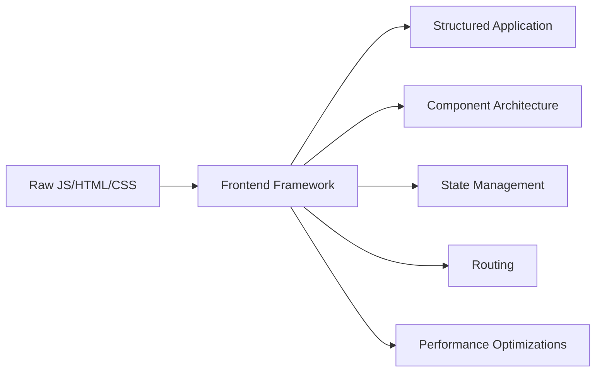
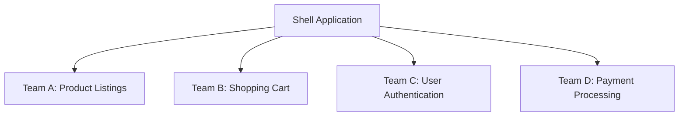

# Frontend Framework Questions

## Introduction

Frontend frameworks are essential tools in modern web development that provide structured approaches to building user interfaces. During web development interviews, questions about these frameworks are common as they assess your understanding of core concepts, architectures, and best practices. This guide covers the most frequently asked questions about popular frontend frameworks like React, Vue, and Angular to help you prepare for your interviews.

## Basic Framework Concepts

### What are Frontend Frameworks?

Frontend frameworks are JavaScript libraries or platforms that provide developers with pre-written, standardized code to simplify UI development.



### Why Use Frontend Frameworks?

Interviewers often ask why frameworks are preferred over vanilla JavaScript:

- **Component Reusability**: Build once, use everywhere
- **Declarative Programming**: Focus on what to build, not how
- **Virtual DOM**: Optimize rendering (in React and Vue)
- **State Management**: Simplified data handling
- **Developer Experience**: Better tooling and ecosystem
- **Community Support**: Large communities for help and resources

## React Framework Questions

### What is React?

React is a JavaScript library developed by Facebook (now Meta) for building user interfaces, particularly single-page applications.

### What is JSX?

JSX is a syntax extension for JavaScript that looks similar to HTML:

```jsx
function Greeting() {
  return <h1>Hello, World!</h1>;
}
```

### Explain the Virtual DOM

The Virtual DOM is a lightweight copy of the actual DOM that React uses to optimize rendering:

1. React creates a virtual DOM when your component renders
2. When state changes, a new virtual DOM is created
3. React compares the new virtual DOM with the previous snapshot (diffing)
4. Only the changed elements are updated in the real DOM

### What are React Hooks?

Hooks are functions that let you "hook into" React state and lifecycle features:

```jsx
import React, { useState, useEffect } from 'react';

function Counter() {
  // State Hook
  const [count, setCount] = useState(0);
  
  // Effect Hook
  useEffect(() => {
    document.title = `You clicked ${count} times`;
  }, [count]);
  
  return (
    <div>
      <p>You clicked {count} times</p>
      <button onClick={() => setCount(count + 1)}>
        Click me
      </button>
    </div>
  );
}
```

### What is the difference between state and props?

| Props | State |
|-------|-------|
| Passed from parent | Managed within component |
| Read-only | Can be modified with setState/useState |
| Can be passed to child components | Cannot be accessed in child components unless passed as props |

## Vue Framework Questions

### What is Vue.js?

Vue is a progressive JavaScript framework for building user interfaces, designed to be incrementally adoptable.

### Explain Vue's reactivity system

Vue uses a getter/setter based reactivity system that tracks dependencies during rendering and automatically updates when dependencies change:

```vue
<template>
  <div>
    <p>{{ message }}</p>
    <button @click="changeMessage">Change Message</button>
  </div>
</template>

<script>
export default {
  data() {
    return {
      message: 'Hello Vue!'
    }
  },
  methods: {
    changeMessage() {
      this.message = 'Message changed!';
    }
  }
}
</script>
```

### What are Vue directives?

Directives are special attributes with the `v-` prefix that apply special reactive behavior to the rendered DOM:

```vue
<template>
  <div>
    <p v-if="showMessage">Conditional message</p>
    <ul>
      <li v-for="item in items" :key="item.id">{{ item.text }}</li>
    </ul>
    <button v-on:click="handleClick">Click me</button>
    <input v-model="inputText" />
  </div>
</template>
```

Common directives include:
- `v-if` and `v-show` for conditional rendering
- `v-for` for list rendering
- `v-on` (or `@`) for event handling
- `v-model` for two-way binding
- `v-bind` (or `:`) for attribute binding

## Angular Framework Questions

### What is Angular?

Angular is a platform and framework for building single-page client applications using HTML and TypeScript, developed by Google.

### What are Angular components?

Components are the main building blocks of Angular applications:

```typescript
import { Component } from '@angular/core';

@Component({
  selector: 'app-hello',
  template: `
    <h1>Hello, {{name}}!</h1>
    <button (click)="changeName()">Change Name</button>
  `,
  styles: [`h1 { color: blue; }`]
})
export class HelloComponent {
  name = 'World';
  
  changeName() {
    this.name = 'Angular';
  }
}
```

### Explain Angular modules

Modules in Angular help organize the application into cohesive blocks of functionality:

```typescript
import { NgModule } from '@angular/core';
import { BrowserModule } from '@angular/platform-browser';
import { AppComponent } from './app.component';
import { HelloComponent } from './hello.component';

@NgModule({
  imports: [ BrowserModule ],
  declarations: [ AppComponent, HelloComponent ],
  bootstrap: [ AppComponent ]
})
export class AppModule { }
```

### What are Angular services?

Services provide functionality that isn't directly related to views:

```typescript
import { Injectable } from '@angular/core';

@Injectable({
  providedIn: 'root'
})
export class DataService {
  private data = [
    { id: 1, name: 'Item 1' },
    { id: 2, name: 'Item 2' }
  ];
  
  getData() {
    return this.data;
  }
  
  addItem(item) {
    this.data.push(item);
  }
}
```

## Framework Comparison Questions

### React vs Vue vs Angular: When to use each?

| Framework | Best Use Cases | Learning Curve |
|-----------|----------------|---------------|
| React     | Large single-page applications, applications requiring frequent updates | Moderate |
| Vue       | Progressive enhancement of existing apps, simpler SPAs | Low |
| Angular   | Enterprise-level applications, large team projects | High |

### How does state management differ across frameworks?

- **React**: Uses useState, useReducer, or external libraries like Redux or Zustand
- **Vue**: Built-in Vuex store or Pinia for state management
- **Angular**: Uses Services and RxJS for state management

## Performance Questions

### How would you optimize a React/Vue/Angular application?

Common optimization techniques:

```jsx
// React example with memo to prevent unnecessary re-renders
import React, { memo } from 'react';

const ExpensiveComponent = memo(({ data }) => {
  // Only re-renders if data changes
  return <div>{data.map(item => <span key={item.id}>{item.text}</span>)}</div>;
});

// Usage
function App() {
  return <ExpensiveComponent data={someData} />;
}
```

Other optimization techniques:
- Code splitting and lazy loading
- Server-side rendering
- Memoization of expensive calculations
- Using production builds
- Implementing virtualization for long lists

## Component Architecture Questions

### What are presentational vs container components?

- **Presentational Components**: Focus on UI, receive data via props, and emit events
- **Container Components**: Focus on data and state, provide data to presentational components

```jsx
// Presentational component
const UserCard = ({ user, onEdit }) => (
  <div className="card">
    <h3>{user.name}</h3>
    <p>{user.email}</p>
    <button onClick={() => onEdit(user.id)}>Edit</button>
  </div>
);

// Container component
const UserDashboard = () => {
  const [users, setUsers] = useState([]);
  
  useEffect(() => {
    // Fetch users from API
    fetchUsers().then(data => setUsers(data));
  }, []);
  
  const handleEdit = (userId) => {
    // Logic for editing user
  };
  
  return (
    <div>
      <h2>User Dashboard</h2>
      {users.map(user => (
        <UserCard 
          key={user.id} 
          user={user}
          onEdit={handleEdit}
        />
      ))}
    </div>
  );
};
```

## Practical Interview Questions

### Implement a counter component using React hooks

```jsx
import React, { useState } from 'react';

function Counter() {
  const [count, setCount] = useState(0);
  
  return (
    <div>
      <h2>Count: {count}</h2>
      <button onClick={() => setCount(count - 1)}>Decrement</button>
      <button onClick={() => setCount(count + 1)}>Increment</button>
    </div>
  );
}
```

### Create a simple todo list with Vue

```vue
<template>
  <div>
    <h2>Todo List</h2>
    <input 
      v-model="newTodo" 
      @keyup.enter="addTodo" 
      placeholder="Add a new todo"
    />
    <ul>
      <li v-for="(todo, index) in todos" :key="index">
        <input type="checkbox" v-model="todo.completed" />
        <span :class="{ completed: todo.completed }">{{ todo.text }}</span>
        <button @click="removeTodo(index)">Delete</button>
      </li>
    </ul>
  </div>
</template>

<script>
export default {
  data() {
    return {
      newTodo: '',
      todos: []
    }
  },
  methods: {
    addTodo() {
      if (this.newTodo.trim()) {
        this.todos.push({ 
          text: this.newTodo, 
          completed: false 
        });
        this.newTodo = '';
      }
    },
    removeTodo(index) {
      this.todos.splice(index, 1);
    }
  }
}
</script>

<style scoped>
.completed {
  text-decoration: line-through;
  color: gray;
}
</style>
```

## Modern Framework Trends

### What is server-side rendering (SSR)?

SSR renders pages on the server before sending them to the client:

```jsx
// Next.js SSR example (React)
export async function getServerSideProps() {
  const res = await fetch('https://api.example.com/data');
  const data = await res.json();
  
  return {
    props: { data }
  };
}

function Page({ data }) {
  return <div>Data: {data.title}</div>;
}

export default Page;
```

Benefits of SSR:
- Better SEO
- Faster initial page load
- Better performance on low-powered devices

### What are micro-frontends?

Micro-frontends are an architectural style where frontend applications are divided into smaller, independent pieces:



## Summary

Understanding frontend frameworks is crucial for modern web development. Key takeaways:

1. Each framework has its own philosophy and approach to building UIs
2. React emphasizes a unidirectional data flow and component composition
3. Vue offers an approachable and versatile framework with clear separation of concerns
4. Angular provides a complete solution with strong opinions about application structure
5. Interview questions typically focus on framework-specific concepts, performance optimization, and architecture decisions

## Additional Resources

Here are some exercises to reinforce your learning:

1. **Exercise**: Build the same application (e.g., a todo list) in React, Vue, and Angular to compare approaches
2. **Exercise**: Refactor an existing application to improve performance using framework-specific optimization techniques
3. **Exercise**: Implement a state management solution for a multi-component application
4. **Exercise**: Create a micro-frontend architecture with two or more frameworks working together

By understanding these concepts and practicing with real-world examples, you'll be well-prepared to answer frontend framework questions in web development interviews.