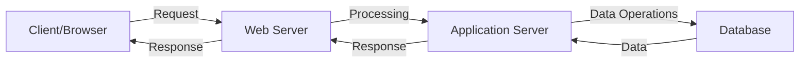
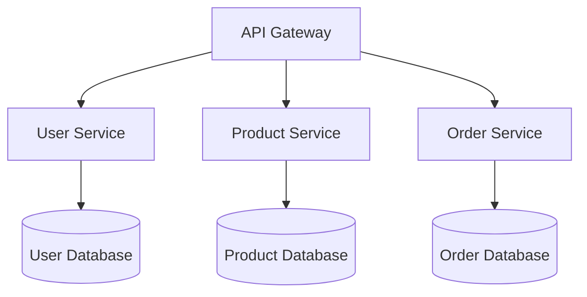
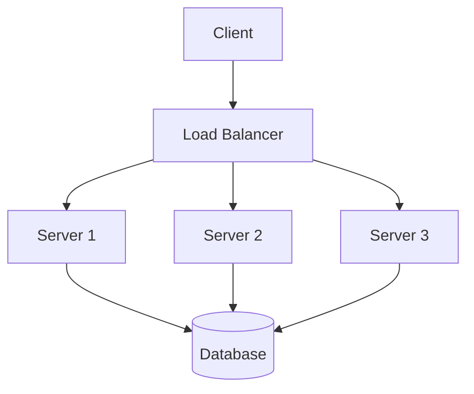

# Backend Technologies

## Introduction

Backend technologies form the foundation of web applications, powering everything that happens behind the scenes. While frontend development focuses on what users see and interact with, backend development handles data processing, business logic, and server operations that make applications functional.

This guide explores essential backend technologies you should understand for web development interviews, covering programming languages, frameworks, databases, and key concepts that power modern web applications.

## What is Backend Development?

Backend development refers to server-side development focused on how websites work. It includes:

- Creating and managing databases
- Building server-side logic
- Handling APIs and application architecture
- Ensuring security, performance, and scalability

Backend developers work with servers, applications, and databases to ensure frontend elements have the data and functionality they need.



## Core Backend Technologies

### 1. Programming Languages

Several programming languages are commonly used for backend development:

#### Node.js (JavaScript)

Node.js allows using JavaScript on the server-side, creating a unified language stack across frontend and backend.

```javascript
// Simple Node.js server
const http = require('http');

const server = http.createServer((req, res) => {
  res.statusCode = 200;
  res.setHeader('Content-Type', 'text/plain');
  res.end('Hello World');
});

server.listen(3000, '127.0.0.1', () => {
  console.log('Server running at http://127.0.0.1:3000/');
});
```

#### Python

Python is valued for its readability and extensive libraries, with frameworks like Django and Flask.

```python
# Simple Flask API
from flask import Flask, jsonify

app = Flask(__name__)

@app.route('/api/greeting', methods=['GET'])
def get_greeting():
    return jsonify({"message": "Hello, World!"})

if __name__ == '__main__':
    app.run(debug=True)
```

#### Java

Java remains popular for enterprise-level applications with frameworks like Spring Boot.

```java
// Spring Boot REST controller
@RestController
public class GreetingController {

    @GetMapping("/greeting")
    public Map<String, String> greeting() {
        Map<String, String> response = new HashMap<>();
        response.put("message", "Hello, World!");
        return response;
    }
}
```

#### PHP

Still powering a large percentage of websites, PHP is especially known for WordPress development.

```php
<?php
// Simple PHP API endpoint
header('Content-Type: application/json');

$response = [
    'message' => 'Hello, World!'
];

echo json_encode($response);
?>
```

#### Ruby

Known for its elegant syntax and the Ruby on Rails framework.

```ruby
# Ruby on Rails controller
class GreetingsController < ApplicationController
  def hello
    render json: { message: 'Hello, World!' }
  end
end
```

#### Go (Golang)

Gaining popularity for its performance and simplicity in building microservices.

```go
// Simple Go server
package main

import (
    "encoding/json"
    "log"
    "net/http"
)

func main() {
    http.HandleFunc("/greeting", func(w http.ResponseWriter, r *http.Request) {
        response := map[string]string{"message": "Hello, World!"}
        json.NewEncoder(w).Encode(response)
    })

    log.Println("Server starting on port 8080...")
    log.Fatal(http.ListenAndServe(":8080", nil))
}
```

### 2. Backend Frameworks

Frameworks provide structure and utilities to build applications more efficiently:

| Framework | Language | Key Features |
|-----------|----------|-------------|
| Express.js | Node.js | Minimal, flexible, middleware support |
| Django | Python | Full-featured, "batteries included", ORM |
| Flask | Python | Lightweight, extensible, microservices |
| Spring Boot | Java | Enterprise-ready, dependency injection |
| Laravel | PHP | Elegant syntax, MVC architecture |
| Ruby on Rails | Ruby | Convention over configuration, rapid development |
| Gin | Go | High performance, middleware support |

### 3. Databases

Databases store and organize application data:

#### Relational Databases (SQL)

Store data in structured tables with predefined relationships.

- MySQL
- PostgreSQL
- SQLite
- Microsoft SQL Server
- Oracle Database

Example SQL query:

```sql
-- Create a users table
CREATE TABLE users (
  id SERIAL PRIMARY KEY,
  username VARCHAR(50) UNIQUE NOT NULL,
  email VARCHAR(100) UNIQUE NOT NULL,
  created_at TIMESTAMP DEFAULT CURRENT_TIMESTAMP
);

-- Insert a user
INSERT INTO users (username, email) VALUES ('john_doe', 'john@example.com');

-- Query users
SELECT id, username, email FROM users WHERE username = 'john_doe';
```

#### NoSQL Databases

Store data in flexible, schema-less formats:

- Document stores: MongoDB, CouchDB
- Key-value stores: Redis, DynamoDB
- Wide-column stores: Cassandra, HBase
- Graph databases: Neo4j, ArangoDB

Example MongoDB operations:

```javascript
// Create a user
db.users.insertOne({
  username: "john_doe",
  email: "john@example.com",
  createdAt: new Date()
});

// Find a user
db.users.findOne({ username: "john_doe" });
```

### 4. RESTful APIs

REST (Representational State Transfer) is an architectural style for designing networked applications.

#### Key REST Principles:

- **Stateless**: Each request contains all information needed to complete it
- **Resource-based**: Resources identified by URIs
- **Standard HTTP methods**: GET, POST, PUT, DELETE, etc.
- **Representation**: Resources can have multiple representations (JSON, XML, etc.)

Example RESTful API endpoints for a blog:

| HTTP Method | Endpoint | Action |
|-------------|----------|--------|
| GET | /api/posts | Retrieve all posts |
| GET | /api/posts/:id | Retrieve a specific post |
| POST | /api/posts | Create a new post |
| PUT | /api/posts/:id | Update a specific post |
| DELETE | /api/posts/:id | Delete a specific post |

Example Express.js implementation:

```javascript
const express = require('express');
const app = express();

app.use(express.json());

let posts = [
  { id: 1, title: 'First Post', content: 'Hello world!' }
];

// Get all posts
app.get('/api/posts', (req, res) => {
  res.json(posts);
});

// Get post by ID
app.get('/api/posts/:id', (req, res) => {
  const post = posts.find(p => p.id === parseInt(req.params.id));
  if (!post) return res.status(404).json({ error: 'Post not found' });
  res.json(post);
});

// Create post
app.post('/api/posts', (req, res) => {
  const newPost = {
    id: posts.length + 1,
    title: req.body.title,
    content: req.body.content
  };
  posts.push(newPost);
  res.status(201).json(newPost);
});

app.listen(3000, () => console.log('Server running on port 3000'));
```

### 5. GraphQL

GraphQL is a query language for APIs that lets clients specify exactly what data they need.

```javascript
// GraphQL schema definition
const typeDefs = gql`
  type Post {
    id: ID!
    title: String!
    content: String!
    author: User!
  }
  
  type User {
    id: ID!
    name: String!
    posts: [Post!]!
  }
  
  type Query {
    post(id: ID!): Post
    posts: [Post!]!
    user(id: ID!): User
  }
`;

// Query example
const query = `
  query {
    post(id: "1") {
      title
      content
      author {
        name
      }
    }
  }
`;
```

Key advantages of GraphQL:
- Precise data fetching (no over-fetching or under-fetching)
- Single request for multiple resources
- Strong typing system
- Introspective (self-documenting)

## Server and Deployment Technologies

### 1. Web Servers

Web servers handle HTTP requests and serve responses:

- **Nginx**: High-performance HTTP server and reverse proxy
- **Apache**: Feature-rich, widely-used web server
- **Microsoft IIS**: Windows-based web server

### 2. Containerization

Containerization packages applications with their dependencies for consistent deployment:

- **Docker**: Platform for developing, shipping, and running applications in containers
- **Kubernetes**: Container orchestration system for automating deployment and scaling

Example Dockerfile:

```dockerfile
FROM node:14
WORKDIR /app
COPY package*.json ./
RUN npm install
COPY . .
EXPOSE 3000
CMD ["node", "server.js"]
```

### 3. Cloud Services

Cloud platforms provide infrastructure and services for hosting applications:

- **AWS (Amazon Web Services)**: Comprehensive cloud platform
- **Microsoft Azure**: Microsoft's cloud computing service
- **Google Cloud Platform**: Google's suite of cloud services
- **Heroku**: Platform as a service (PaaS) for easy deployment

## Authentication and Security

### 1. Authentication Methods

- **JWT (JSON Web Tokens)**: Compact, self-contained tokens for secure information transmission
- **OAuth 2.0**: Industry-standard protocol for authorization
- **Session-based authentication**: Server-side session storage

Example JWT implementation:

```javascript
const jwt = require('jsonwebtoken');
const express = require('express');
const app = express();

app.use(express.json());

const SECRET_KEY = 'your-secret-key';

// Login endpoint
app.post('/api/login', (req, res) => {
  // Authenticate user (simplified)
  const { username, password } = req.body;
  
  // In real apps, you'd verify against database
  if (username === 'admin' && password === 'password') {
    // Create JWT token
    const token = jwt.sign(
      { id: 1, username },
      SECRET_KEY,
      { expiresIn: '1h' }
    );
    
    res.json({ token });
  } else {
    res.status(401).json({ error: 'Invalid credentials' });
  }
});

// Middleware to verify token
function verifyToken(req, res, next) {
  const bearerHeader = req.headers['authorization'];
  
  if (!bearerHeader) {
    return res.status(401).json({ error: 'Unauthorized' });
  }
  
  const token = bearerHeader.split(' ')[1];
  
  jwt.verify(token, SECRET_KEY, (err, decoded) => {
    if (err) {
      return res.status(401).json({ error: 'Invalid token' });
    }
    
    req.user = decoded;
    next();
  });
}

// Protected route
app.get('/api/protected', verifyToken, (req, res) => {
  res.json({ message: 'This is protected data', user: req.user });
});

app.listen(3000);
```

### 2. Security Considerations

- **HTTPS**: Secure HTTP using TLS/SSL
- **CORS (Cross-Origin Resource Sharing)**: Controlling which domains can access your API
- **Input validation**: Preventing injection attacks
- **Rate limiting**: Protecting against brute force and DDoS attacks
- **Environment variables**: Securing sensitive information

## Backend Architecture Patterns

### 1. Monolithic Architecture

All components of an application are interconnected and run as a single service.

**Advantages:**
- Simpler development and deployment
- Easier debugging
- Less cross-cutting concerns

**Disadvantages:**
- Harder to scale specific components
- Technology stack is fixed
- Single point of failure

### 2. Microservices Architecture

Application is built as a collection of small, independent services.



**Advantages:**
- Independent scaling
- Technology diversity
- Fault isolation
- Smaller, more manageable codebases

**Disadvantages:**
- Increased complexity
- Network latency
- Data consistency challenges
- More sophisticated deployment

### 3. Serverless Architecture

Run backend code without managing server infrastructure.

**Advantages:**
- No server management
- Pay-per-execution pricing
- Automatic scaling
- Faster time to market

**Disadvantages:**
- Vendor lock-in
- Cold starts
- Limited execution duration
- Debugging challenges

Example AWS Lambda function (Node.js):

```javascript
exports.handler = async (event) => {
  try {
    const body = JSON.parse(event.body);
    const result = await processData(body);
    
    return {
      statusCode: 200,
      headers: { "Content-Type": "application/json" },
      body: JSON.stringify({ result })
    };
  } catch (error) {
    return {
      statusCode: 500,
      headers: { "Content-Type": "application/json" },
      body: JSON.stringify({ error: error.message })
    };
  }
};
```

## Common Backend Development Tasks

### 1. Data Validation

Ensuring data meets required formats and constraints:

```javascript
// Using Joi for validation in Node.js
const Joi = require('joi');

const userSchema = Joi.object({
  username: Joi.string().alphanum().min(3).max(30).required(),
  email: Joi.string().email().required(),
  age: Joi.number().integer().min(18).max(120)
});

function validateUser(req, res, next) {
  const { error } = userSchema.validate(req.body);
  if (error) {
    return res.status(400).json({ error: error.details[0].message });
  }
  next();
}

app.post('/api/users', validateUser, (req, res) => {
  // Process valid user data
});
```

### 2. Error Handling

Properly managing and responding to errors:

```javascript
// Express error handling middleware
app.use((err, req, res, next) => {
  console.error(err.stack);
  
  // Determine error type and appropriate response
  if (err.name === 'ValidationError') {
    return res.status(400).json({ error: err.message });
  }
  
  if (err.name === 'UnauthorizedError') {
    return res.status(401).json({ error: 'Invalid token' });
  }
  
  // Default server error
  res.status(500).json({ error: 'Something went wrong!' });
});
```

### 3. Logging

Recording information for debugging and monitoring:

```javascript
// Using Winston for logging in Node.js
const winston = require('winston');

const logger = winston.createLogger({
  level: 'info',
  format: winston.format.json(),
  defaultMeta: { service: 'user-service' },
  transports: [
    new winston.transports.File({ filename: 'error.log', level: 'error' }),
    new winston.transports.File({ filename: 'combined.log' })
  ]
});

// Log examples
logger.info('User logged in', { userId: 123 });
logger.error('Database connection failed', { error: err.message });
```

### 4. File Uploads

Handling file uploads from clients:

```javascript
// Using Multer for file uploads in Express
const multer = require('multer');

const storage = multer.diskStorage({
  destination: (req, file, cb) => {
    cb(null, 'uploads/');
  },
  filename: (req, file, cb) => {
    cb(null, Date.now() + '-' + file.originalname);
  }
});

const upload = multer({ storage });

app.post('/api/upload', upload.single('file'), (req, res) => {
  res.json({
    message: 'File uploaded successfully',
    filename: req.file.filename
  });
});
```

## Testing Backend Applications

### 1. Unit Testing

Testing individual components in isolation:

```javascript
// Using Jest for unit testing
const { calculateTotal } = require('../services/order');

describe('Order Service', () => {
  test('calculateTotal should add tax to subtotal', () => {
    // Arrange
    const items = [
      { price: 10, quantity: 2 },
      { price: 15, quantity: 1 }
    ];
    const taxRate = 0.1; // 10%
    
    // Act
    const result = calculateTotal(items, taxRate);
    
    // Assert
    expect(result.subtotal).toBe(35);
    expect(result.tax).toBe(3.5);
    expect(result.total).toBe(38.5);
  });
});
```

### 2. Integration Testing

Testing how components work together:

```javascript
// Using Supertest for API testing
const request = require('supertest');
const app = require('../app');
const db = require('../db');

beforeAll(async () => {
  await db.connect();
});

afterAll(async () => {
  await db.disconnect();
});

describe('User API', () => {
  test('GET /api/users should return all users', async () => {
    const response = await request(app)
      .get('/api/users')
      .expect('Content-Type', /json/)
      .expect(200);
      
    expect(Array.isArray(response.body)).toBeTruthy();
  });
  
  test('POST /api/users should create a new user', async () => {
    const newUser = {
      username: 'testuser',
      email: 'test@example.com'
    };
    
    const response = await request(app)
      .post('/api/users')
      .send(newUser)
      .expect('Content-Type', /json/)
      .expect(201);
      
    expect(response.body).toHaveProperty('id');
    expect(response.body.username).toBe(newUser.username);
  });
});
```

## Performance Optimization

### 1. Caching

Storing frequently accessed data for quick retrieval:

```javascript
// Using Redis for caching in Node.js
const redis = require('redis');
const client = redis.createClient();

async function getCachedData(key, fetchFunction) {
  // Try to get data from cache
  const cachedData = await client.get(key);
  
  if (cachedData) {
    return JSON.parse(cachedData);
  }
  
  // If not cached, fetch fresh data
  const freshData = await fetchFunction();
  
  // Store in cache for 10 minutes (600 seconds)
  await client.set(key, JSON.stringify(freshData), 'EX', 600);
  
  return freshData;
}

app.get('/api/products', async (req, res) => {
  try {
    const products = await getCachedData('all_products', fetchProductsFromDB);
    res.json(products);
  } catch (err) {
    res.status(500).json({ error: err.message });
  }
});
```

### 2. Database Optimization

Improving database performance:

- Index frequently queried fields
- Use query optimization techniques
- Implement database sharding for large datasets
- Consider read replicas for high-traffic applications

### 3. Load Balancing

Distributing traffic across multiple servers:



## Interview Questions and Answers

Here are some common backend technology interview questions:

1. **Q: What is REST and what are RESTful APIs?**  
   A: REST (Representational State Transfer) is an architectural style for designing networked applications. RESTful APIs use HTTP requests to perform CRUD operations (Create, Read, Update, Delete) on resources, identified by URLs, and utilize standard HTTP methods (GET, POST, PUT, DELETE).

2. **Q: Explain the difference between SQL and NoSQL databases.**  
   A: SQL databases are relational, use structured query language, have predefined schemas, and are vertically scalable. NoSQL databases are non-relational, have dynamic schemas for unstructured data, and are horizontally scalable.

3. **Q: What are microservices and when should you use them?**  
   A: Microservices architecture breaks an application into small, loosely coupled services that can be developed, deployed, and scaled independently. They're beneficial for large, complex applications that need independent scaling, technology diversity, and team autonomy, but add complexity that's often unnecessary for smaller applications.

4. **Q: How would you handle authentication in a RESTful API?**  
   A: Common approaches include JWT (JSON Web Tokens), which are stateless and can contain claims about the user; OAuth 2.0 for third-party authentication; and session-based authentication using cookies for traditional web applications.

5. **Q: Explain the concept of middleware in backend frameworks.**  
   A: Middleware functions have access to the request and response objects and the next middleware function in the application's request-response cycle. They can execute code, modify request/response objects, end the request-response cycle, or call the next middleware function.

## Summary

Backend technologies form the invisible foundation of web applications, handling everything from data processing to business logic. Key components include:

- **Programming languages**: Node.js, Python, Java, PHP, Ruby, Go
- **Frameworks**: Express, Django, Spring Boot, Laravel, Rails
- **Databases**: SQL (relational) and NoSQL databases
- **API architectures**: REST, GraphQL
- **Deployment technologies**: Containers, cloud services
- **Security**: Authentication, authorization, data protection
- **Architecture patterns**: Monolithic, microservices, serverless

As a backend developer, you'll need to understand how these technologies work together to create scalable, secure, and performant web applications.

## Additional Resources

To deepen your understanding of backend technologies:

- [MDN Web Docs - Server-side website programming](https://developer.mozilla.org/en-US/docs/Learn/Server-side)
- [RESTful API Design Best Practices](https://restfulapi.net/)
- [OWASP Top Ten](https://owasp.org/www-project-top-ten/) - Security vulnerabilities
- [The Twelve-Factor App](https://12factor.net/) - Best practices for building modern applications

## Practice Exercises

1. Build a simple REST API with CRUD operations using your preferred language and framework.
2. Create a microservice architecture with at least two services that communicate with each other.
3. Implement authentication using JWTs in a backend application.
4. Design a database schema for an e-commerce application with products, orders, and users.
5. Deploy a backend application using Docker containers and a cloud service.