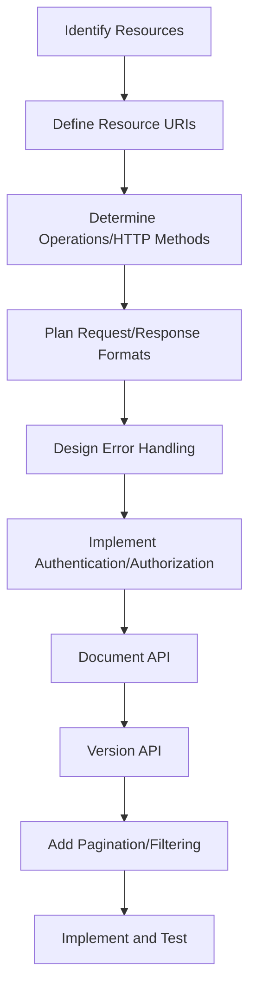

# RESTful API Design

## Introduction

RESTful API design is a cornerstone of modern web development. REST (Representational State Transfer) is an architectural style for designing networked applications, introduced by Roy Fielding in his 2000 doctoral dissertation. RESTful APIs enable different systems to communicate over HTTP in a way that's scalable, stateless, and follows a uniform interface.

In today's interconnected digital landscape, well-designed APIs are critical for:
- Creating robust microservices architectures
- Enabling third-party integrations
- Supporting mobile and web applications from a single backend
- Ensuring system longevity and maintainability

This guide will walk you through the fundamental principles of RESTful API design, illustrate them with practical examples, and provide best practices for creating APIs that other developers will love to use.

## REST Fundamentals

### What Makes an API RESTful?

REST isn't a protocol or standard, but rather a set of architectural constraints:

1. **Client-Server Architecture**: Separation of concerns between client (user interface) and server (data storage)
2. **Statelessness**: Each request contains all information needed to complete it
3. **Cacheability**: Responses must define themselves as cacheable or non-cacheable
4. **Layered System**: Client cannot tell if it's connected directly to the end server
5. **Uniform Interface**: Resources are identified in requests, manipulated through representations, and include self-descriptive messages
6. **Code on Demand** (optional): Servers can temporarily extend client functionality

### HTTP Methods and CRUD Operations

REST APIs use HTTP methods to perform CRUD (Create, Read, Update, Delete) operations:

| HTTP Method | CRUD Operation | Description |
|-------------|---------------|-------------|
| GET | Read | Retrieve resources |
| POST | Create | Create new resources |
| PUT | Update/Replace | Update existing resources (complete replacement) |
| PATCH | Update/Modify | Partially update resources |
| DELETE | Delete | Remove resources |

## Resource Design

### Nouns vs. Verbs

RESTful APIs should use nouns (not verbs) to represent resources:

```
// Good - Uses nouns for resources
GET /articles
GET /articles/123

// Avoid - Uses verbs in URLs
GET /getArticles
GET /fetchArticle/123
```

### Resource Naming Conventions

- Use plural nouns for collections: `/users`, `/products`
- Use concrete names over abstract concepts
- Maintain consistency in naming patterns
- Use hyphens for multi-word resource names: `/blog-posts`
- Keep URLs lowercase

### Resource Hierarchy and Relationships

Represent resource relationships through nested routes:

```
GET /users/123/orders            // Get all orders for user 123
GET /users/123/orders/456        // Get order 456 for user 123
POST /articles/789/comments      // Create a comment on article 789
```

## Request and Response Design

### URL Parameters vs. Query Parameters

- **URL Parameters**: Identify specific resources
   ```
   GET /users/123     // URL parameter '123' identifies a specific user
   ```

- **Query Parameters**: Filter, sort, or paginate collections
   ```
   GET /users?role=admin&sort=name    // Query parameters for filtering and sorting
   GET /products?page=2&limit=10      // Query parameters for pagination
   ```

### Response Formats

JSON is the most common format for REST API responses:

```javascript
// Example response for GET /users/123
{
  "id": 123,
  "name": "John Doe",
  "email": "john@example.com",
  "created_at": "2023-05-15T14:30:00Z",
  "role": "admin"
}

// Example response for GET /users
{
  "data": [
    {
      "id": 123,
      "name": "John Doe",
      "email": "john@example.com"
    },
    {
      "id": 124,
      "name": "Jane Smith",
      "email": "jane@example.com"
    }
  ],
  "meta": {
    "total": 45,
    "page": 1,
    "per_page": 10
  }
}
```

### HTTP Status Codes

Use appropriate HTTP status codes to indicate the result of operations:

| Status Code | Description | Example Use Cases |
|-------------|-------------|------------------|
| 200 OK | Request succeeded | Successful GET, PUT with response body |
| 201 Created | Resource created | Successful POST |
| 204 No Content | Success with no response body | Successful DELETE |
| 400 Bad Request | Invalid request | Validation errors |
| 401 Unauthorized | Authentication required | Missing authentication |
| 403 Forbidden | Authenticated but not authorized | Insufficient permissions |
| 404 Not Found | Resource not found | Invalid resource ID |
| 409 Conflict | Request conflicts with server state | Duplicate entry |
| 500 Internal Server Error | Server error | Unexpected server issue |

## Practical RESTful API Example

Let's design a simplified RESTful API for a blog system:

### Endpoints

```
# Article Management
GET    /articles                # List all articles
POST   /articles                # Create new article
GET    /articles/:id            # Get article details
PUT    /articles/:id            # Update entire article
PATCH  /articles/:id            # Update article partially
DELETE /articles/:id            # Delete article

# Comment Management (nested resource)
GET    /articles/:id/comments   # List comments for article
POST   /articles/:id/comments   # Add comment to article
GET    /comments/:id            # Get comment details
PUT    /comments/:id            # Update comment
DELETE /comments/:id            # Delete comment

# User Management
GET    /users                   # List users
POST   /users                   # Create user
GET    /users/:id               # Get user details
PUT    /users/:id               # Update user
DELETE /users/:id               # Delete user
GET    /users/:id/articles      # Get articles by user
```

### Example Request/Response Flow

**Creating a new article:**

Request:
```
POST /articles
Content-Type: application/json

{
  "title": "Understanding RESTful APIs",
  "content": "REST is an architectural style for designing web services...",
  "tags": ["api", "rest", "web-development"]
}
```

Response:
```
HTTP/1.1 201 Created
Location: /articles/456
Content-Type: application/json

{
  "id": 456,
  "title": "Understanding RESTful APIs",
  "content": "REST is an architectural style for designing web services...",
  "tags": ["api", "rest", "web-development"],
  "created_at": "2023-09-10T12:00:00Z",
  "author_id": 123
}
```

**Retrieving all articles with pagination:**

Request:
```
GET /articles?page=2&limit=10
Accept: application/json
```

Response:
```
HTTP/1.1 200 OK
Content-Type: application/json

{
  "data": [
    {
      "id": 456,
      "title": "Understanding RESTful APIs",
      "excerpt": "REST is an architectural style...",
      "created_at": "2023-09-10T12:00:00Z",
      "author": {
        "id": 123,
        "name": "John Doe"
      }
    },
    // More articles...
  ],
  "links": {
    "first": "/articles?page=1&limit=10",
    "prev": "/articles?page=1&limit=10",
    "next": "/articles?page=3&limit=10",
    "last": "/articles?page=5&limit=10"
  },
  "meta": {
    "current_page": 2,
    "total_pages": 5,
    "total_items": 42
  }
}
```

## API Versioning

Versioning helps manage changes without breaking existing client applications:

### Common Versioning Strategies

1. **URI Path Versioning**:
   ```
   /v1/articles
   /v2/articles
   ```

2. **Query Parameter Versioning**:
   ```
   /articles?version=1
   /articles?version=2
   ```

3. **Header Versioning**:
   ```
   Accept: application/vnd.myapi.v1+json
   Accept: application/vnd.myapi.v2+json
   ```

4. **Content Negotiation**:
   ```
   Accept: application/json; version=1
   Accept: application/json; version=2
   ```

URI Path Versioning is the most common and straightforward approach for beginners.

## Best Practices

### Documentation

Well-documented APIs are easier to use. Consider:
- Using tools like Swagger/OpenAPI for interactive documentation
- Including examples for each endpoint
- Documenting error responses and codes
- Providing authentication instructions

### Authentication and Security

Common authentication methods:
- API Keys
- OAuth 2.0
- JWT (JSON Web Tokens)
- Basic Authentication (less secure, use with HTTPS)

Always use HTTPS to encrypt API traffic.

### Error Handling

Return descriptive error messages:

```javascript
// Example error response
{
  "error": {
    "code": "validation_failed",
    "message": "The request data failed validation.",
    "details": [
      {
        "field": "email",
        "message": "Must be a valid email address"
      },
      {
        "field": "password",
        "message": "Must be at least 8 characters long"
      }
    ]
  }
}
```

### Rate Limiting

Protect your API from abuse by implementing rate limiting:
- Limit requests per time period (e.g., 100 requests per minute)
- Return appropriate headers:
  - `X-RateLimit-Limit`: Total allowed requests in period
  - `X-RateLimit-Remaining`: Requests remaining in period
  - `X-RateLimit-Reset`: Time when limit resets
- Use 429 Too Many Requests status code when limit is exceeded

## RESTful API Design Process

Let's visualize the process of designing a RESTful API:



## Common REST Design Patterns

### Pagination

Support large collections with pagination:
```
GET /articles?page=2&limit=25
GET /articles?offset=25&limit=25
```

Include metadata about pagination:
```javascript
{
  "data": [ /* items */ ],
  "meta": {
    "page": 2,
    "limit": 25,
    "total_pages": 10,
    "total_items": 248
  }
}
```

### Filtering, Sorting, and Searching

Allow clients to filter resources:
```
GET /products?category=electronics&price_min=100&price_max=500
GET /users?status=active&role=admin
GET /articles?tag=javascript&author=123
```

Support sorting:
```
GET /products?sort=price_asc
GET /products?sort=name_desc,created_at_desc
```

Enable searching:
```
GET /articles?search=javascript
GET /users?search=john+doe
```

### HATEOAS (Hypermedia as the Engine of Application State)

HATEOAS adds hyperlinks to responses so clients can discover available actions:

```javascript
{
  "id": 456,
  "title": "Understanding RESTful APIs",
  "content": "REST is an architectural style...",
  "created_at": "2023-09-10T12:00:00Z",
  "links": {
    "self": "/articles/456",
    "author": "/users/123",
    "comments": "/articles/456/comments",
    "edit": "/articles/456/edit"
  }
}
```

## Summary

RESTful API design is a critical skill for modern web developers. We've covered:

- Core REST principles and constraints
- Resource naming and URL design
- HTTP methods and status codes
- Request and response formats
- Versioning strategies
- Authentication and security approaches
- Common patterns like pagination and HATEOAS

Remember, a well-designed API is intuitive, consistent, and follows established conventions. It should be easy to learn, hard to misuse, and powerful enough to satisfy your requirements.

## Additional Resources

Here are some resources to deepen your understanding of RESTful API design:

- **Books**:
  - "RESTful Web APIs" by Leonard Richardson, Mike Amundsen, and Sam Ruby
  - "API Design Patterns" by JJ Geewax

- **Tools**:
  - Swagger/OpenAPI for documentation
  - Postman or Insomnia for API testing

- **Practice Exercises**:
  1. Design a RESTful API for a simple e-commerce system with products, orders, and customers
  2. Implement a small RESTful API using Express.js or your preferred framework
  3. Create OpenAPI documentation for your designed API
  4. Review and critique public APIs for their RESTfulness

By understanding and applying these principles, you'll be well-equipped to design RESTful APIs that developers find intuitive, consistent, and enjoyable to use—a valuable skill for any web development interview.