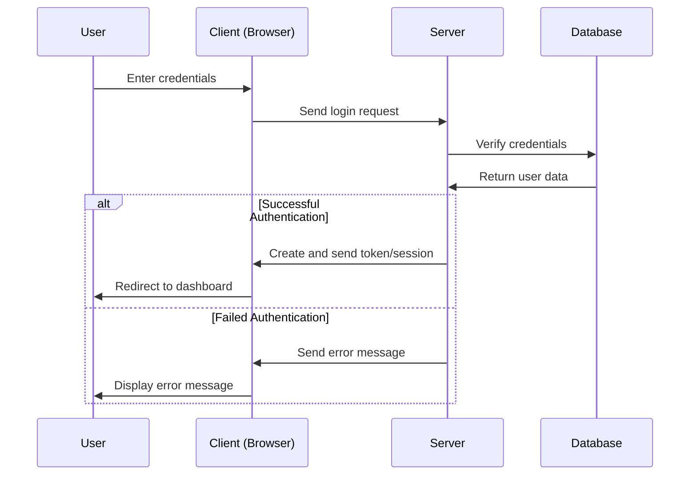
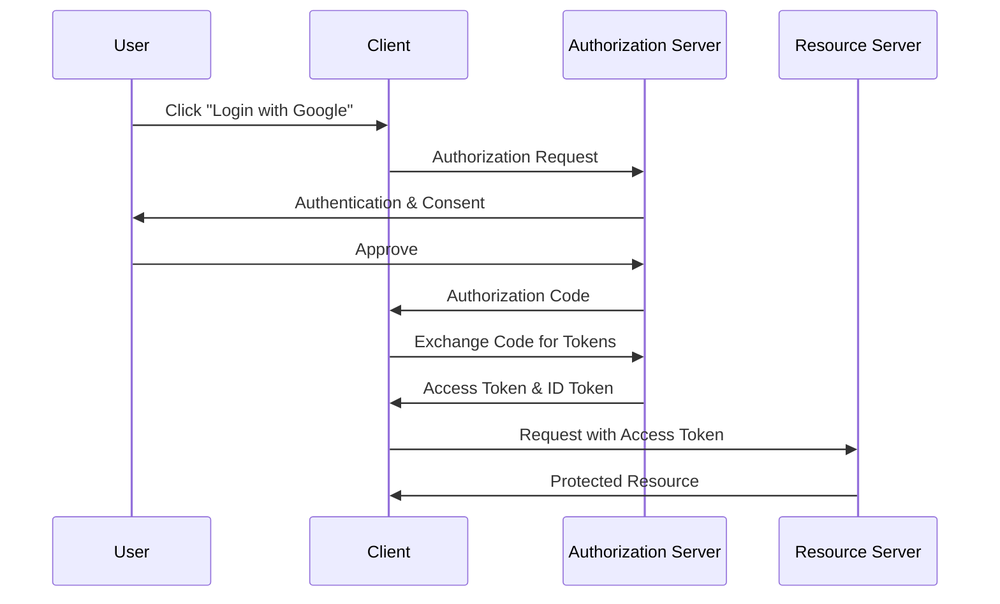

# Authentication and Authorization

## Introduction

In the world of web development, security is paramount. Two fundamental concepts that every developer must understand are **authentication** and **authorization**. While they sound similar and often work together, they serve distinct purposes in securing web applications.

- **Authentication** verifies who you are ("Are you who you say you are?")
- **Authorization** determines what you can do ("Do you have permission to do this?")

This guide will break down these concepts, explain their implementation methods, and provide practical examples to help you understand how they work in real-world applications.

## Understanding Authentication

Authentication is the process of verifying the identity of a user, system, or entity. When you log into a website with your username and password, you're going through an authentication process.

### Common Authentication Methods

#### 1. Username and Password

The most basic form of authentication involves a username (or email) and password combination.

```javascript
function authenticateUser(username, password) {
  // In a real application, you would:
  // 1. Look up the user in a database
  // 2. Hash the provided password and compare with stored hash
  // 3. Return user data or an error

  const user = findUserInDatabase(username);

  if (!user) {
    return { success: false, message: 'User not found' };
  }

  const passwordMatch = comparePasswordHash(password, user.passwordHash);

  if (!passwordMatch) {
    return { success: false, message: 'Incorrect password' };
  }

  return { success: true, user: user };
}

// Sample input/output:
// Input: authenticateUser('john_doe', 'secret123')
// Output: { success: true, user: { id: 1, username: 'john_doe', ... } }
```

#### 2. Multi-Factor Authentication (MFA)

MFA adds additional layers of security by requiring multiple forms of verification:

1. Something you know (password)
2. Something you have (phone, security key)
3. Something you are (fingerprint, facial recognition)

```javascript
function authenticateWithMFA(username, password, verificationCode) {
  // First authenticate with username/password
  const basicAuth = authenticateUser(username, password);

  if (!basicAuth.success) {
    return basicAuth;
  }

  // Then verify the second factor (verification code)
  const isCodeValid = verifyTOTPCode(username, verificationCode);

  if (!isCodeValid) {
    return { success: false, message: 'Invalid verification code' };
  }

  return { success: true, user: basicAuth.user };
}

// Sample input/output:
// Input: authenticateWithMFA('john_doe', 'secret123', '123456')
// Output: { success: true, user: { id: 1, username: 'john_doe', ... } }
```

#### 3. Token-Based Authentication

Token-based authentication uses JSON Web Tokens (JWT) or similar technologies to maintain user sessions without storing session data on the server.

```javascript
function generateAuthToken(user) {
  // Create a JWT token with user information and expiration time
  const payload = {
    userId: user.id,
    username: user.username,
    // Don't include sensitive data like passwords
    exp: Math.floor(Date.now() / 1000) + (60 * 60) // 1 hour expiration
  };

  const secretKey = 'your-secret-key'; // In production, use environment variables
  const token = jwt.sign(payload, secretKey);

  return token;
}

function verifyAuthToken(token) {
  try {
    const secretKey = 'your-secret-key';
    const decoded = jwt.verify(token, secretKey);
    return { success: true, user: decoded };
  } catch (error) {
    return { success: false, message: 'Invalid or expired token' };
  }
}

// Sample input/output:
// Token generation:
// Input: generateAuthToken({ id: 1, username: 'john_doe' })
// Output: "eyJhbGciOiJIUzI1NiIsInR5cCI6IkpXVCJ9.eyJ1c2VySWQiOjEsInVzZXJuYW1lIjoiam9obl9kb2UiLCJleHAiOjE2MTU1NjUwMDB9.abc123..."
```

### Authentication Flow

Let's visualize a typical authentication flow:



## Understanding Authorization

Once a user is authenticated, authorization determines what resources they can access and what actions they can perform.

### Common Authorization Methods

#### 1. Role-Based Access Control (RBAC)

RBAC assigns permissions based on predefined roles.

```javascript
const userRoles = {
  ADMIN: 'admin',
  EDITOR: 'editor',
  USER: 'user'
};

const permissions = {
  [userRoles.ADMIN]: ['read', 'write', 'delete', 'manage_users'],
  [userRoles.EDITOR]: ['read', 'write'],
  [userRoles.USER]: ['read']
};

function checkPermission(user, requiredPermission) {
  // Get the user's role
  const role = user.role;

  // Get permissions for that role
  const userPermissions = permissions[role] || [];

  // Check if the user has the required permission
  return userPermissions.includes(requiredPermission);
}

// Sample input/output:
// Input: checkPermission({ id: 1, username: 'john_doe', role: 'editor' }, 'write')
// Output: true

// Input: checkPermission({ id: 1, username: 'john_doe', role: 'user' }, 'delete')
// Output: false
```

#### 2. Attribute-Based Access Control (ABAC)

ABAC makes access decisions based on attributes of the user, resource, action, and environment.

```javascript
function checkAccessABAC(user, resource, action, context) {
  // Check user attributes
  if (action === 'delete' && user.role !== 'admin') {
    return false;
  }

  // Check resource attributes
  if (resource.type === 'premium' && !user.isPremiumMember) {
    return false;
  }

  // Check ownership
  if (resource.ownerId === user.id) {
    return true;
  }

  // Check context attributes
  if (context.time > '22:00' && resource.timeRestricted) {
    return false;
  }

  // More complex rules can be added here

  return true; // Default allow if no rules match
}

// Sample input/output:
// Input: checkAccessABAC(
//   { id: 1, role: 'user', isPremiumMember: false },
//   { id: 42, type: 'premium', ownerId: 2, timeRestricted: true },
//   'read',
//   { time: '20:00', ip: '192.168.1.1' }
// )
// Output: false (non-premium user trying to access premium content)
```

## Implementation Examples

Let's look at some practical implementations of authentication and authorization in common web development frameworks.

### Express.js (Node.js) Example

Here's a simple Express.js application with JWT authentication and role-based authorization:

```javascript
const express = require('express');
const jwt = require('jsonwebtoken');
const bcrypt = require('bcrypt');
const app = express();

app.use(express.json());

// Mock database
const users = [
  {
    id: 1,
    username: 'admin',
    password: '$2b$10$X7KAPlWRL8yP9nJ8U4DgYuU8Xu6yHBxJBz6HWIUl0fA8uWyvQ8s4y', // 'admin123'
    role: 'admin'
  },
  {
    id: 2,
    username: 'user',
    password: '$2b$10$cCUUUuXXHbHXVgj9lLvTpOh1oPBFrvnJd8kSG4uvpO1HRRlqC8Eje', // 'user123'
    role: 'user'
  }
];

// Authentication middleware
const authenticate = (req, res, next) => {
  const authHeader = req.headers.authorization;

  if (!authHeader || !authHeader.startsWith('Bearer ')) {
    return res.status(401).json({ message: 'Unauthorized' });
  }

  const token = authHeader.split(' ')[1];

  try {
    const decoded = jwt.verify(token, 'your-secret-key');
    req.user = decoded;
    next();
  } catch (error) {
    return res.status(401).json({ message: 'Invalid token' });
  }
};

// Authorization middleware
const authorize = (roles = []) => {
  return (req, res, next) => {
    if (!req.user) {
      return res.status(401).json({ message: 'Unauthorized' });
    }

    if (roles.length && !roles.includes(req.user.role)) {
      return res.status(403).json({ message: 'Forbidden' });
    }

    next();
  };
};

// Login route
app.post('/login', async (req, res) => {
  const { username, password } = req.body;

  const user = users.find(u => u.username === username);

  if (!user) {
    return res.status(400).json({ message: 'Invalid credentials' });
  }

  const isPasswordValid = await bcrypt.compare(password, user.password);

  if (!isPasswordValid) {
    return res.status(400).json({ message: 'Invalid credentials' });
  }

  const token = jwt.sign(
    { id: user.id, username: user.username, role: user.role },
    'your-secret-key',
    { expiresIn: '1h' }
  );

  res.json({ token });
});

// Protected routes
app.get('/api/profile', authenticate, (req, res) => {
  const user = users.find(u => u.id === req.user.id);

  if (!user) {
    return res.status(404).json({ message: 'User not found' });
  }

  // Return user data without password
  const { password, ...userWithoutPassword } = user;
  res.json(userWithoutPassword);
});

app.get('/api/admin', authenticate, authorize(['admin']), (req, res) => {
  res.json({ message: 'Admin panel', secretData: 'Only admins can see this' });
});

app.listen(3000, () => {
  console.log('Server running on port 3000');
});
```

### React Client-Side Example

Here's how you might handle authentication in a React application:

```jsx
import React, { useState, useEffect, createContext, useContext } from 'react';

// Create an authentication context
const AuthContext = createContext();

export const AuthProvider = ({ children }) => {
  const [user, setUser] = useState(null);
  const [loading, setLoading] = useState(true);

  useEffect(() => {
    // Check for token in localStorage on app load
    const token = localStorage.getItem('token');

    if (token) {
      // In a real app, you would verify the token here
      // For this example, we'll just decode it
      try {
        // Simple JWT decoding (not for production)
        const base64Url = token.split('.')[1];
        const base64 = base64Url.replace(/-/g, '+').replace(/_/g, '/');
        const jsonPayload = decodeURIComponent(
          atob(base64).split('').map(c => {
            return '%' + ('00' + c.charCodeAt(0).toString(16)).slice(-2);
          }).join('')
        );

        setUser(JSON.parse(jsonPayload));
      } catch (error) {
        localStorage.removeItem('token');
      }
    }

    setLoading(false);
  }, []);

  const login = async (username, password) => {
    try {
      const response = await fetch('http://localhost:3000/login', {
        method: 'POST',
        headers: {
          'Content-Type': 'application/json'
        },
        body: JSON.stringify({ username, password })
      });

      const data = await response.json();

      if (!response.ok) {
        throw new Error(data.message);
      }

      // Save token to localStorage
      localStorage.setItem('token', data.token);

      // Decode and set user
      const base64Url = data.token.split('.')[1];
      const base64 = base64Url.replace(/-/g, '+').replace(/_/g, '/');
      const jsonPayload = decodeURIComponent(
        atob(base64).split('').map(c => {
          return '%' + ('00' + c.charCodeAt(0).toString(16)).slice(-2);
        }).join('')
      );

      setUser(JSON.parse(jsonPayload));

      return true;
    } catch (error) {
      console.error('Login error:', error);
      return false;
    }
  };

  const logout = () => {
    localStorage.removeItem('token');
    setUser(null);
  };

  const hasPermission = (requiredRole) => {
    if (!user) return false;

    if (requiredRole === 'admin') {
      return user.role === 'admin';
    }

    return true; // Basic users have basic permissions
  };

  return (
    <AuthContext.Provider value={{ user, loading, login, logout, hasPermission }}>
      {children}
    </AuthContext.Provider>
  );
};

// Custom hook to use the auth context
export const useAuth = () => useContext(AuthContext);

// Example Login Component
const Login = () => {
  const [username, setUsername] = useState('');
  const [password, setPassword] = useState('');
  const [error, setError] = useState('');
  const { login } = useAuth();

  const handleSubmit = async (e) => {
    e.preventDefault();
    setError('');

    const success = await login(username, password);

    if (!success) {
      setError('Invalid credentials');
    }
  };

  return (
    <form onSubmit={handleSubmit}>
      <h2>Login</h2>
      {error && <p style={{ color: 'red' }}>{error}</p>}
      <div>
        <label htmlFor="username">Username:</label>
        <input
          type="text"
          id="username"
          value={username}
          onChange={(e) => setUsername(e.target.value)}
          required
        />
      </div>
      <div>
        <label htmlFor="password">Password:</label>
        <input
          type="password"
          id="password"
          value={password}
          onChange={(e) => setPassword(e.target.value)}
          required
        />
      </div>
      <button type="submit">Login</button>
    </form>
  );
};

// Protected Route Component
const ProtectedRoute = ({ element, requiredRole }) => {
  const { user, loading, hasPermission } = useAuth();

  if (loading) {
    return <div>Loading...</div>;
  }

  if (!user) {
    return <Navigate to="/login" />;
  }

  if (requiredRole && !hasPermission(requiredRole)) {
    return <div>Access denied. You don't have the required permissions.</div>;
  }

  return element;
};
```

## Authentication Strategies

### Session-Based Authentication

In session-based authentication, the server creates a session for the user after login and stores it in memory or a database. The session ID is sent to the client as a cookie.

**Pros**:
- Simple to implement
- Can revoke sessions easily
- Works well with traditional server-rendered applications

**Cons**:
- Doesn't scale well (server maintains state)
- Vulnerable to CSRF attacks if not properly protected
- Issues with mobile applications

### JWT-Based Authentication

As shown in previous examples, JWT (JSON Web Token) authentication is stateless and token-based.

**Pros**:
- Stateless (scales well)
- Works well with APIs and microservices
- Great for cross-domain scenarios and mobile apps

**Cons**:
- Tokens can't be invalidated before they expire
- Token size increases with more data
- Need to handle token storage securely on the client

### OAuth 2.0 and OpenID Connect

OAuth 2.0 is an authorization framework that allows third-party applications to access resources on behalf of a user. OpenID Connect adds an identity layer on top of OAuth 2.0.



## Security Best Practices

### Password Storage

1. **Never store plain-text passwords**
2. **Use strong hashing algorithms** like bcrypt, Argon2, or PBKDF2
3. **Use salt** to prevent rainbow table attacks

```javascript
const bcrypt = require('bcrypt');

async function hashPassword(password) {
  // The salt rounds determine the complexity (10-12 is usually good)
  const saltRounds = 10;
  const hashedPassword = await bcrypt.hash(password, saltRounds);
  return hashedPassword;
}

async function verifyPassword(password, hashedPassword) {
  const isMatch = await bcrypt.compare(password, hashedPassword);
  return isMatch;
}

// Sample input/output:
// Input: hashPassword('mySecretPassword')
// Output: '$2b$10$XYZ123...' (hashed password)

// Input: verifyPassword('mySecretPassword', '$2b$10$XYZ123...')
// Output: true
```

### Preventing Common Attacks

1. **Cross-Site Scripting (XSS)**
- Sanitize user inputs
- Use Content Security Policy (CSP)
- Set proper cookie attributes (HttpOnly, Secure, SameSite)

2. **Cross-Site Request Forgery (CSRF)**
- Use anti-CSRF tokens
- Check the Origin and Referer headers
- Use SameSite cookie attribute

3. **SQL Injection**
- Use parameterized queries or prepared statements
- Validate and sanitize user inputs
- Use an ORM (Object-Relational Mapping) library

```javascript
// BAD - Vulnerable to SQL injection
function getUserBad(username) {
  const query = `SELECT * FROM users WHERE username = '${username}'`;
  return db.execute(query); // Don't do this!
}

// GOOD - Using parameterized query
function getUserGood(username) {
  const query = 'SELECT * FROM users WHERE username = ?';
  return db.execute(query, [username]);
}
```

## Real-World Scenarios

### E-commerce Website

In an e-commerce website:
- **Authentication**: Users log in to access their accounts, view order history, and manage payment methods.
- **Authorization**:
- Regular users can place orders and view their own order history
- Store managers can update product details and manage inventory
- Admins can access sales reports and manage user accounts

### Banking Application

In a banking application:
- **Authentication**: Multi-factor authentication is crucial, combining passwords with SMS codes or authenticator apps.
- **Authorization**:
- Regular users can view their accounts and make transfers within limits
- Account managers can approve higher-value transactions
- System administrators can configure system parameters but cannot access user accounts

## Summary

Authentication and authorization are foundational concepts in web security:

- **Authentication** verifies identity using methods like passwords, tokens, biometrics, or multi-factor approaches.
- **Authorization** controls access to resources based on user roles, attributes, or other criteria.

Implementing these concepts correctly is critical for protecting user data and maintaining the security of your web applications.

## Additional Resources

To deepen your understanding of authentication and authorization, consider exploring:

1. **Learn More**:
- [OWASP Authentication Cheat Sheet](https://cheatsheetseries.owasp.org/cheatsheets/Authentication_Cheat_Sheet.html)
- [OAuth 2.0 Simplified](https://aaronparecki.com/oauth-2-simplified/)
- [JWT.io](https://jwt.io/) - Learn about JWT structure and debugging

2. **Practice Exercises**:
- Implement a simple login system with password hashing
- Add role-based authorization to an existing project
- Implement JWT authentication in a REST API
- Add OAuth 2.0 with a provider like Google or GitHub
- Create a multi-factor authentication system

3. **Security Challenges**:
- Audit an existing authentication system for vulnerabilities
- Try to implement security headers and test with tools like [securityheaders.com](https://securityheaders.com)
- Set up proper CORS configuration for your API