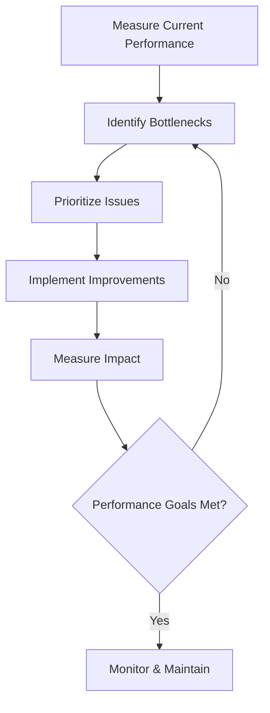

# Performance Optimization

## Introduction

Performance optimization is the process of improving the speed, efficiency, and overall user experience of web applications. In today's competitive digital landscape, a fast-loading website isn't just a nice-to-have—it's essential. Studies show that users abandon sites that take longer than 3 seconds to load, and search engines like Google use page speed as a ranking factor.

As a web developer, understanding performance optimization techniques is crucial for building successful applications and is frequently tested in technical interviews. This guide will walk you through the fundamental concepts, tools, and strategies to optimize your web applications.

## Why Performance Matters

Before diving into specific techniques, let's understand why performance optimization deserves your attention:

- **User Experience**: Faster sites provide better user experiences, leading to higher engagement and conversion rates.
- **Search Engine Ranking**: Page speed is a significant factor in search engine algorithms.
- **Accessibility**: Optimized sites work better on slower connections and older devices, making your content more accessible.
- **Cost Efficiency**: Optimized applications often consume fewer server resources, potentially reducing hosting costs.

## Performance Metrics

To optimize effectively, you need to measure performance using these key metrics:

- **Time to First Byte (TTFB)**: The time it takes for a browser to receive the first byte of response from your server.
- **First Contentful Paint (FCP)**: When the browser renders the first piece of content from the DOM.
- **Largest Contentful Paint (LCP)**: When the largest content element becomes visible.
- **First Input Delay (FID)**: The time from when a user first interacts with your site to when the browser can respond.
- **Cumulative Layout Shift (CLS)**: Measures visual stability by quantifying unexpected layout shifts.
- **Total Blocking Time (TBT)**: The total time the main thread is blocked, preventing user interactions.

## Frontend Optimization Techniques

### 1. Minimize HTTP Requests

Each resource (CSS, JavaScript, images) requires an HTTP request. Reducing these requests can significantly improve load times.

```javascript
// Instead of multiple small CSS files
// style1.css, style2.css, style3.css...

// Bundle them into a single file
// styles.bundle.css
```

### 2. Optimize Images

Images often account for the majority of a page's weight. Optimize them by:

- Using appropriate formats (JPEG for photographs, PNG for transparency, SVG for icons)
- Implementing responsive images with `srcset`
- Compressing images without significant quality loss
- Considering modern formats like WebP

```html
<picture>
  <source srcset="image.webp" type="image/webp" />
  <source srcset="image.jpg" type="image/jpeg" />
  
</picture>
```

### 3. Implement Lazy Loading

Only load resources when they're needed, particularly for images and videos that are below the fold.

```html

```

### 4. Minify and Compress Resources

Remove unnecessary characters from HTML, CSS, and JavaScript files without changing functionality.

```javascript
// Original
function calculateTotal(price, quantity) {
  const total = price * quantity;
  return total;
}

// Minified
function calculateTotal(e,t){return e*t}
```

Use Gzip or Brotli compression on your server to reduce file transfer sizes:

```javascript
// Server-side compression example (Node.js with Express)
const express = require('express');
const compression = require('compression');
const app = express();

// Enable compression
app.use(compression());
```

### 5. Implement Code Splitting

Split your JavaScript bundles to load only what's necessary for each page.

```javascript
// Modern JavaScript frameworks support dynamic imports
// Instead of importing everything upfront:
import { heavyFunction } from './utils';

// Use dynamic imports when needed:
button.addEventListener('click', async () => {
  const { heavyFunction } = await import('./utils');
  heavyFunction();
});
```

### 6. Use CSS and JavaScript Efficiently

#### CSS Optimization

- Place critical CSS inline
- Load CSS asynchronously
- Use CSS containment
- Reduce unused CSS

```html
<!-- Critical CSS inline -->
<style>
  /* Critical styles for above-the-fold content */
  .header { /* styles */ }
  .hero { /* styles */ }
</style>

<!-- Non-critical CSS loaded asynchronously -->
<link rel="preload" href="styles.css" as="style" onload="this.onload=null;this.rel='stylesheet'">
<noscript><link rel="stylesheet" href="styles.css"></noscript>
```

#### JavaScript Optimization

- Avoid render-blocking JavaScript
- Use async/defer attributes
- Remove unused code
- Optimize event listeners

```html
<!-- Regular script (blocks parsing) -->
<script src="app.js"></script>

<!-- Better options -->
<script src="app.js" defer></script>
<script src="analytics.js" async></script>
```

### 7. Implement Caching Strategies

Properly configured caching can dramatically improve performance for returning visitors.

```html
<!-- Add cache headers in your server configuration -->
<!-- Example for Apache (.htaccess) -->
<IfModule mod_expires.c>
  ExpiresActive On
  ExpiresByType image/jpg "access plus 1 year"
  ExpiresByType image/jpeg "access plus 1 year"
  ExpiresByType image/gif "access plus 1 year"
  ExpiresByType image/png "access plus 1 year"
  ExpiresByType text/css "access plus 1 month"
  ExpiresByType application/javascript "access plus 1 month"
</IfModule>
```

For client-side caching with service workers:

```javascript
// Simple service worker cache example
self.addEventListener('install', (event) => {
  event.waitUntil(
    caches.open('v1').then((cache) => {
      return cache.addAll([
        '/',
        '/styles.css',
        '/app.js',
        '/logo.png'
      ]);
    })
  );
});

self.addEventListener('fetch', (event) => {
  event.respondWith(
    caches.match(event.request).then((response) => {
      return response || fetch(event.request);
    })
  );
});
```

## Backend Optimization Techniques

### 1. Database Optimization

Efficient database queries are crucial for application performance.

```sql
-- Inefficient query
SELECT * FROM users JOIN orders ON users.id = orders.user_id;

-- Optimized query (select only needed columns)
SELECT users.name, orders.product_id, orders.amount 
FROM users JOIN orders ON users.id = orders.user_id
WHERE orders.status = 'completed';
```

Key database optimization techniques:
- Index frequently queried columns
- Use appropriate data types
- Optimize queries to fetch only necessary data
- Consider denormalization for read-heavy applications
- Implement database caching

### 2. Server-Side Caching

Implement caching to reduce database queries and expensive computations.

```javascript
// Example using Redis for caching in Node.js
const redis = require('redis');
const client = redis.createClient();

async function getUserData(userId) {
  // Try to get data from cache first
  const cachedData = await client.get(`user:${userId}`);
  
  if (cachedData) {
    return JSON.parse(cachedData);
  }
  
  // If not in cache, get from database
  const userData = await database.getUserById(userId);
  
  // Store in cache for future requests (expire after 1 hour)
  await client.set(`user:${userId}`, JSON.stringify(userData), 'EX', 3600);
  
  return userData;
}
```

### 3. API Optimization

Optimize your APIs for faster client-server communication:

- Implement pagination for large datasets
- Use GraphQL to prevent overfetching
- Consider rate limiting to prevent abuse
- Compress API responses
- Implement efficient error handling

```javascript
// Example of pagination in a REST API (Express.js)
app.get('/products', (req, res) => {
  const page = parseInt(req.query.page) || 1;
  const limit = parseInt(req.query.limit) || 10;
  const skip = (page - 1) * limit;
  
  Product.find()
    .skip(skip)
    .limit(limit)
    .then(products => {
      res.json({
        total: products.length,
        page,
        limit,
        data: products
      });
    });
});
```

### 4. Server Configuration

Optimize your server setup:

- Use HTTP/2 or HTTP/3
- Enable GZIP/Brotli compression
- Configure proper caching headers
- Implement a CDN for static assets
- Use load balancing for high-traffic applications

## Performance Testing and Analysis

To effectively optimize, you need to measure performance before and after changes.

### Tools for Performance Testing

1. **Lighthouse**: Built into Chrome DevTools, provides audits for performance, accessibility, and more.
2. **WebPageTest**: Offers detailed performance insights from multiple locations and devices.
3. **Chrome DevTools Performance Panel**: Profiles JavaScript execution and rendering performance.
4. **PageSpeed Insights**: Combines lab and field data to analyze page performance.

Here's how you can use Lighthouse from the command line:

```bash
# Install Lighthouse
npm install -g lighthouse

# Run an audit
lighthouse https://example.com --view
```

### Implementing Performance Budgets

Set performance budgets to maintain optimization over time:

```javascript
// Example webpack configuration with performance budgets
module.exports = {
  // ...
  performance: {
    hints: 'warning',
    maxAssetSize: 250000, // 250 kB
    maxEntrypointSize: 400000, // 400 kB
  }
};
```

## Real-World Optimization Example

Let's implement a complete optimization strategy for a typical web application:

```javascript
// Before optimization
document.addEventListener('DOMContentLoaded', () => {
  const images = document.querySelectorAll('img');
  const buttons = document.querySelectorAll('button');
  
  // Load all images at once
  images.forEach(img => {
    img.src = img.dataset.src;
  });
  
  // Add event listeners to all buttons
  buttons.forEach(button => {
    button.addEventListener('click', handleButtonClick);
  });
  
  // Load heavy third-party scripts
  loadAnalytics();
  loadSocialMediaWidgets();
  loadCommentSystem();
});

function handleButtonClick(e) {
  // Complex DOM operations
  const results = calculateComplexData();
  updateUI(results);
}
```

```javascript
// After optimization
// 1. Use passive listeners for scroll events
document.addEventListener('scroll', onScroll, { passive: true });

// 2. Implement intersection observer for lazy loading
const imageObserver = new IntersectionObserver((entries) => {
  entries.forEach(entry => {
    if (entry.isIntersecting) {
      const img = entry.target;
      img.src = img.dataset.src;
      imageObserver.unobserve(img);
    }
  });
});

document.querySelectorAll('img[data-src]').forEach(img => {
  imageObserver.observe(img);
});

// 3. Use event delegation instead of multiple listeners
document.querySelector('.button-container').addEventListener('click', (e) => {
  if (e.target.matches('button')) {
    handleButtonClick(e);
  }
});

// 4. Defer non-critical operations
requestIdleCallback(() => {
  loadAnalytics();
});

// 5. Load third-party resources on demand
document.querySelector('#comments-button').addEventListener('click', () => {
  import('./comment-system.js').then(module => {
    module.initialize();
  });
});

// 6. Use web workers for heavy computations
function handleButtonClick(e) {
  const worker = new Worker('calculation-worker.js');
  worker.postMessage({ action: 'calculate' });
  
  worker.onmessage = (e) => {
    updateUI(e.data.results);
  };
}
```

## Performance Optimization Workflow

A systematic approach to optimization:



## Common Interview Questions

Here are some performance optimization questions you might encounter in web development interviews:

1. **Q: What tools would you use to identify performance bottlenecks in a web application?**
   
   A: I would use Chrome DevTools Performance panel to profile JavaScript execution, Lighthouse for overall performance audits, WebPageTest for detailed waterfall analysis, and PageSpeed Insights for both lab and field data. For backend performance, I'd use tools specific to the stack, like New Relic or node-clinic for Node.js applications.

2. **Q: How would you reduce the initial load time of a web application?**
   
   A: I would implement code splitting to load only essential JavaScript initially, use server-side rendering or static site generation where appropriate, optimize and lazy-load images, use modern image formats, eliminate render-blocking resources, implement proper caching strategies, and utilize a CDN for static assets.

3. **Q: Explain the concept of critical rendering path and how to optimize it.**
   
   A: The critical rendering path is the sequence of steps the browser takes to convert HTML, CSS, and JavaScript into pixels on the screen. To optimize it, I would minimize the amount of critical resources by inlining critical CSS, deferring non-critical JavaScript, reducing the size of critical resources through minification, and reducing the length of the critical path by prioritizing visible content.

## Summary

Performance optimization is a continuous process rather than a one-time task. The techniques covered in this guide—from optimizing images and implementing lazy loading to database indexing and server-side caching—all work together to create faster, more efficient web applications.

Remember these key principles:

1. **Measure first**: Always establish baseline metrics before optimizing.
2. **Focus on user experience**: Prioritize improvements that users will notice.
3. **Progressive enhancement**: Ensure your site works for everyone, then enhance for modern browsers.
4. **Stay updated**: Performance best practices evolve with web technologies.

By systematically applying these optimization techniques, you'll create web applications that not only perform better but also provide superior user experiences—a valuable skill that will serve you well in web development interviews and throughout your career.

## Additional Resources

- [Web Vitals](https://web.dev/vitals/) - Essential metrics for a healthy site
- [JavaScript Performance](https://developer.mozilla.org/en-US/docs/Learn/Performance/JavaScript) - MDN guide
- [Database Indexing Strategies](https://use-the-index-luke.com/) - Deep dive into SQL indexing
- [Frontend Performance Checklist](https://www.smashingmagazine.com/2021/01/front-end-performance-2021-free-pdf-checklist/) - Comprehensive guide

## Exercises

1. Use Lighthouse to audit a website of your choice. Identify the top three performance issues and research how you would fix them.

2. Take a simple web page and implement at least three optimization techniques from this guide. Measure the performance before and after to quantify your improvements.

3. Create a lazy loading implementation for images without using the built-in `loading="lazy"` attribute.

4. Design a caching strategy for a web application that has both frequently and infrequently updated content. Explain your decisions.

5. Profile a JavaScript-heavy website using Chrome DevTools and identify potential performance bottlenecks in the code execution.