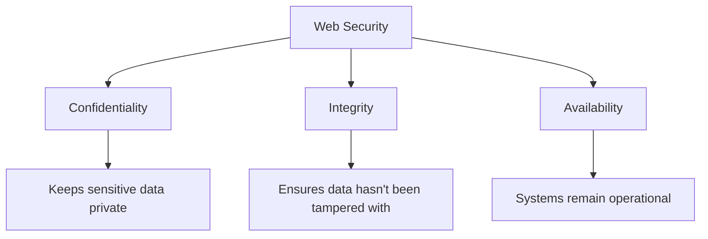

# Web Security

## Introduction

Web security is a critical aspect of web development that focuses on protecting websites and web applications from various threats and vulnerabilities. As websites handle sensitive user data and business logic, understanding security principles is essential for any web developer. This guide explores common web security challenges and how to implement effective protections.

Web security isn't just about preventing malicious attacks—it's about building trust with your users by ensuring their data remains private and secure. For developers preparing for interviews, demonstrating knowledge of security fundamentals can set you apart as a thoughtful and thorough professional.

## Core Web Security Concepts

### The Security Mindset

Effective web security requires thinking like an attacker:

- What parts of your application handle sensitive data?
- Where could user input potentially be manipulated?
- What happens if a user tries to access resources they shouldn't?
- How are you storing and transmitting sensitive information?

### The CIA Triad

Security professionals use the CIA triad as a framework for thinking about security:



- **Confidentiality**: Ensuring that information is accessible only to those authorized to access it
- **Integrity**: Maintaining the accuracy and consistency of data throughout its lifecycle
- **Availability**: Ensuring systems remain functioning and accessible to authorized users

## Common Web Vulnerabilities

### 1. Cross-Site Scripting (XSS)

XSS attacks occur when attackers inject malicious scripts into content that is then served to other users.

#### Types of XSS:

- **Reflected XSS**: Malicious script comes from the current HTTP request
- **Stored XSS**: Malicious script is stored on the target server
- **DOM-based XSS**: Vulnerability exists in client-side code

#### Example of Vulnerable Code:

```javascript
// Vulnerable code - directly inserting user input into the DOM
function displayUsername() {
  const username = new URLSearchParams(window.location.search).get('username');
  document.getElementById('greeting').innerHTML = 'Hello, ' + username + '!';
}
```

An attacker could craft a URL like: `https://yoursite.com/page?username=<script>stealCookies()</script>`

#### Secure Implementation:

```javascript
// Secure code - encoding user input before inserting into DOM
function displayUsername() {
  const username = new URLSearchParams(window.location.search).get('username');
  const encodedUsername = document.createElement('div');
  encodedUsername.textContent = username; // This safely encodes the content
  document.getElementById('greeting').appendChild(encodedUsername);
}
```

#### Protection Strategies:

1. **Input Validation**: Validate and sanitize all user inputs
2. **Output Encoding**: Encode output based on the context (HTML, JavaScript, CSS, URL)
3. **Content Security Policy (CSP)**: Add HTTP headers to control which resources can be loaded

```html
<!-- Example CSP header -->
<meta
  http-equiv="Content-Security-Policy"
  content="default-src 'self'; script-src 'self' https://trusted-cdn.com;"
/>
```

### 2. Cross-Site Request Forgery (CSRF)

CSRF tricks users into performing actions they didn't intend to do while authenticated to your site.

#### Vulnerable Scenario:

1. User logs into `bank.com` and receives a session cookie
2. Without logging out, user visits `malicious-site.com`
3. Malicious site contains code that submits a form to `bank.com/transfer`
4. Browser includes the user's `bank.com` cookies with the request
5. Transfer executes with the user's authenticated session

#### Example of Vulnerable Code:

```html
<!-- Vulnerable form without CSRF protection -->
<form action="/transfer" method="POST">
  <input type="text" name="amount" value="1000" />
  <input type="text" name="to" value="account-number" />
  <input type="submit" value="Transfer" />
</form>
```

#### Secure Implementation:

```javascript
// Server-side: Generate and validate CSRF token
app.get('/form', (req, res) => {
  const csrfToken = generateRandomToken();
  req.session.csrfToken = csrfToken;
  res.render('form', { csrfToken });
});

app.post('/transfer', (req, res) => {
  if (req.body.csrf !== req.session.csrfToken) {
    return res.status(403).send('Invalid CSRF token');
  }
  // Process the transfer
});
```

```html
<!-- Client-side: Include CSRF token in form -->
<form action="/transfer" method="POST">
  <input type="hidden" name="csrf" value="{{csrfToken}}" />
  <input type="text" name="amount" value="1000" />
  <input type="text" name="to" value="account-number" />
  <input type="submit" value="Transfer" />
</form>
```

#### Protection Strategies:

1. **CSRF Tokens**: Include unique tokens in forms that the server validates
2. **Same-Site Cookies**: Use `SameSite=Strict` or `SameSite=Lax` cookie attributes
3. **Custom Headers**: For AJAX requests, include custom headers that cross-origin requests cannot set

### 3. SQL Injection

SQL injection occurs when untrusted data is inserted into SQL queries, allowing attackers to manipulate database operations.

#### Vulnerable Code:

```javascript
// Vulnerable code
function getUserData(username) {
  const query = `SELECT * FROM users WHERE username = '${username}'`;
  return db.execute(query);
}
```

If a user inputs `admin' OR '1'='1`, the query becomes:

```sql
SELECT * FROM users WHERE username = 'admin' OR '1'='1'
```

This returns all user records, bypassing authentication.

#### Secure Implementation:

```javascript
// Secure code using parameterized queries
function getUserData(username) {
  const query = "SELECT * FROM users WHERE username = ?";
  return db.execute(query, [username]);
}
```

#### Protection Strategies:

1. **Parameterized Queries/Prepared Statements**: Always use parameterized queries for database operations
2. **ORM Libraries**: Use ORM frameworks that handle SQL safely
3. **Input Validation**: Validate input type, length, format, and range
4. **Principle of Least Privilege**: Database accounts used by applications should have minimal permissions

### 4. Authentication Vulnerabilities

#### Common Issues:

1. **Weak Passwords**: Allowing users to set easily guessable passwords
2. **Brute Force Attacks**: Not limiting login attempts
3. **Credential Stuffing**: Reused passwords across multiple sites
4. **Session Fixation**: Attackers forcing users to use a known session ID

#### Secure Implementation - Password Hashing:

```javascript
// Proper password hashing using bcrypt
const bcrypt = require('bcrypt');
const saltRounds = 12;

// Storing a password
async function storeUserPassword(username, password) {
  const hashedPassword = await bcrypt.hash(password, saltRounds);
  // Store username and hashedPassword in database
}

// Verifying a password
async function verifyPassword(username, password) {
  const user = await getUserFromDatabase(username);
  if (!user) return false;
  
  return await bcrypt.compare(password, user.hashedPassword);
}
```

#### Best Practices:

1. **Multi-Factor Authentication (MFA)**: Require additional verification beyond passwords
2. **Secure Password Storage**: Use strong, adaptive hashing algorithms (bcrypt, Argon2, PBKDF2)
3. **Account Lockout**: Implement temporary lockouts after multiple failed attempts
4. **Password Policies**: Enforce minimum length and complexity requirements

### 5. Broken Access Control

Access control ensures users can only access what they're authorized to access.

#### Vulnerable Code:

```javascript
// Vulnerable API endpoint with no authorization check
app.get('/api/user/:id/data', (req, res) => {
  const userId = req.params.id;
  const userData = getUserData(userId);
  res.json(userData);
});
```

#### Secure Implementation:

```javascript
// Secure API with proper authorization
app.get('/api/user/:id/data', (req, res) => {
  const requestedUserId = req.params.id;
  const currentUserId = req.user.id;
  
  // Check if the user is requesting their own data or is an admin
  if (requestedUserId !== currentUserId && !req.user.isAdmin) {
    return res.status(403).json({ error: 'Access denied' });
  }
  
  const userData = getUserData(requestedUserId);
  res.json(userData);
});
```

#### Best Practices:

1. **Deny by Default**: Start with everything locked down, then selectively allow access
2. **Role-Based Access Control**: Assign permissions based on roles rather than individual users
3. **Test Access Controls**: Regularly audit and test authorization rules
4. **Use Mature Frameworks**: Leverage frameworks with built-in access control features

## Security Headers

HTTP security headers provide an additional layer of protection against various attacks.

```javascript
// Example Express middleware to add security headers
app.use((req, res, next) => {
  // Prevent browsers from interpreting files as a different MIME type
  res.setHeader('X-Content-Type-Options', 'nosniff');
  
  // Prevent clickjacking attacks
  res.setHeader('X-Frame-Options', 'DENY');
  
  // Enable XSS protection in browsers
  res.setHeader('X-XSS-Protection', '1; mode=block');
  
  // Control which domains can embed your site in an iframe
  res.setHeader('Content-Security-Policy', "default-src 'self'");
  
  // HTTPS strict transport security
  res.setHeader('Strict-Transport-Security', 'max-age=31536000; includeSubDomains');
  
  next();
});
```

## HTTPS and Transport Layer Security

HTTPS encrypts data in transit, protecting it from eavesdropping and tampering.

### Key Benefits:

1. **Confidentiality**: Encrypts data between server and client
2. **Integrity**: Detects if data has been tampered with during transmission
3. **Authentication**: Verifies the identity of the website

### Implementation:

```javascript
// Setting up HTTPS server with Node.js
const https = require('https');
const fs = require('fs');
const express = require('express');
const app = express();

const options = {
  key: fs.readFileSync('private-key.pem'),
  cert: fs.readFileSync('certificate.pem')
};

https.createServer(options, app).listen(443, () => {
  console.log('Server running on https://localhost');
});

// Force HTTP to HTTPS redirect
const http = require('http');
http.createServer((req, res) => {
  res.writeHead(301, { Location: `https://${req.headers.host}${req.url}` });
  res.end();
}).listen(80);
```

## OWASP Top Ten

The [Open Web Application Security Project (OWASP)](https://owasp.org/) maintains a list of the top web application security risks. Familiarizing yourself with these is essential for any web developer:

1. Broken Access Control
2. Cryptographic Failures
3. Injection
4. Insecure Design
5. Security Misconfiguration
6. Vulnerable and Outdated Components
7. Identification and Authentication Failures
8. Software and Data Integrity Failures
9. Security Logging and Monitoring Failures
10. Server-Side Request Forgery

## Practical Security Implementation Example

Let's build a simple but secure user authentication system:

```javascript
const express = require('express');
const bcrypt = require('bcrypt');
const crypto = require('crypto');
const app = express();

// Parse JSON request bodies
app.use(express.json());

// In-memory "database" (use a real database in production)
const users = [];
const sessions = {};

// Generate CSRF token
app.get('/api/csrf-token', (req, res) => {
  const csrfToken = crypto.randomBytes(32).toString('hex');
  const sessionId = crypto.randomBytes(32).toString('hex');
  
  // Store the session and CSRF token
  sessions[sessionId] = {
    csrfToken,
    createdAt: Date.now()
  };
  
  // Set a secure session cookie
  res.cookie('sessionId', sessionId, {
    httpOnly: true,
    secure: true,
    sameSite: 'strict',
    maxAge: 3600000 // 1 hour
  });
  
  res.json({ csrfToken });
});

// Register a new user
app.post('/api/register', async (req, res) => {
  try {
    const { username, password } = req.body;
    
    // Validate input
    if (!username || !password || password.length < 8) {
      return res.status(400).json({ error: 'Invalid username or password' });
    }
    
    // Check if username already exists
    if (users.some(user => user.username === username)) {
      return res.status(409).json({ error: 'Username already exists' });
    }
    
    // Hash the password
    const hashedPassword = await bcrypt.hash(password, 12);
    
    // Store the user
    users.push({
      id: users.length + 1,
      username,
      password: hashedPassword
    });
    
    res.status(201).json({ message: 'User registered successfully' });
  } catch (error) {
    console.error('Registration error:', error);
    res.status(500).json({ error: 'Internal server error' });
  }
});

// Login
app.post('/api/login', async (req, res) => {
  try {
    const { username, password } = req.body;
    
    // Find the user
    const user = users.find(u => u.username === username);
    if (!user) {
      // Use a consistent response time to prevent timing attacks
      await bcrypt.hash('dummy', 12);
      return res.status(401).json({ error: 'Invalid username or password' });
    }
    
    // Verify password
    const passwordMatch = await bcrypt.compare(password, user.password);
    if (!passwordMatch) {
      return res.status(401).json({ error: 'Invalid username or password' });
    }
    
    // Generate session
    const sessionId = crypto.randomBytes(32).toString('hex');
    const csrfToken = crypto.randomBytes(32).toString('hex');
    
    sessions[sessionId] = {
      userId: user.id,
      csrfToken,
      createdAt: Date.now()
    };
    
    // Set a secure session cookie
    res.cookie('sessionId', sessionId, {
      httpOnly: true,
      secure: true,
      sameSite: 'strict',
      maxAge: 3600000 // 1 hour
    });
    
    res.json({
      message: 'Login successful',
      csrfToken
    });
  } catch (error) {
    console.error('Login error:', error);
    res.status(500).json({ error: 'Internal server error' });
  }
});

// Protected route - get user profile
app.get('/api/profile', (req, res) => {
  // Get session ID from cookie
  const sessionId = req.cookies.sessionId;
  if (!sessionId || !sessions[sessionId]) {
    return res.status(401).json({ error: 'Unauthorized' });
  }
  
  // Check for session expiration (1 hour)
  const session = sessions[sessionId];
  if (Date.now() - session.createdAt > 3600000) {
    delete sessions[sessionId];
    return res.status(401).json({ error: 'Session expired' });
  }
  
  // Find the user
  const user = users.find(u => u.id === session.userId);
  if (!user) {
    return res.status(404).json({ error: 'User not found' });
  }
  
  // Return user data (excluding password)
  res.json({
    id: user.id,
    username: user.username
  });
});

// Logout
app.post('/api/logout', (req, res) => {
  const sessionId = req.cookies.sessionId;
  if (sessionId && sessions[sessionId]) {
    delete sessions[sessionId];
  }
  
  res.clearCookie('sessionId');
  res.json({ message: 'Logged out successfully' });
});

// Start server
app.listen(3000, () => {
  console.log('Server running on http://localhost:3000');
});
```

This example demonstrates several security best practices:
- Secure password hashing with bcrypt
- CSRF token generation and validation
- Secure cookie settings (httpOnly, secure, sameSite)
- Session management with expiration
- Input validation
- Consistent response times to prevent timing attacks

## Summary

Web security is a multifaceted discipline that requires vigilance and continuous learning. The concepts covered in this guide—XSS, CSRF, SQL injection, authentication, and access control—form the foundation of secure web development.

Remember these key takeaways:
1. **Never trust user input** - Validate and sanitize all data
2. **Defense in depth** - Implement multiple layers of security
3. **Principle of least privilege** - Only grant the minimum permissions necessary
4. **Keep up with security trends** - Security is an evolving field
5. **Use established libraries and frameworks** - Don't reinvent security mechanisms

## Practice Exercises

1. **Security Code Review**: Examine the following code snippets and identify security vulnerabilities:

```javascript
// Snippet 1
app.get('/search', (req, res) => {
  const query = req.query.q;
  res.send(`<h1>Results for: ${query}</h1>`);
});

// Snippet 2
function authenticateUser(username, password) {
  const query = `SELECT * FROM users WHERE username = '${username}' AND password = '${password}'`;
  return db.execute(query);
}
```

2. **Security Headers Analysis**: Use a tool like [SecurityHeaders.com](https://securityheaders.com) to analyze a website you've built or frequently visit. What headers are missing or could be improved?

3. **Build a Secure Form**: Create a registration form with proper validation, CSRF protection, and secure password storage.

## Additional Resources

- [OWASP Web Security Testing Guide](https://owasp.org/www-project-web-security-testing-guide/)
- [Mozilla Web Security Guidelines](https://infosec.mozilla.org/guidelines/web_security)
- [Content Security Policy (CSP) Guide](https://developer.mozilla.org/en-US/docs/Web/HTTP/CSP)
- [JWT Authentication Best Practices](https://auth0.com/blog/a-look-at-the-latest-draft-for-jwt-bcp/)
- [HaveIBeenPwned API](https://haveibeenpwned.com/API/v3) for checking compromised passwords