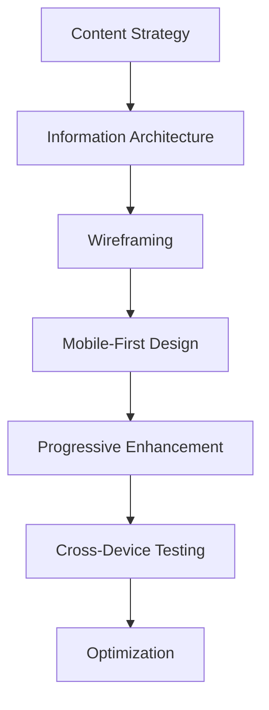

# Responsive Design

## Introduction

Responsive design is an approach to web development that ensures websites adapt and provide an optimal viewing experience across a wide range of devices and screen sizes. Rather than creating separate versions of a website for different devices, responsive design uses flexible layouts, CSS media queries, and other techniques to create a single website that responds to the user's environment.

In today's multi-device world, responsive design has become essential for providing a seamless user experience whether someone is browsing on a smartphone, tablet, laptop, or desktop computer. This concept is a fundamental skill for modern web developers and a common topic in web development interviews.

## Core Principles of Responsive Design

### Fluid Layouts

The foundation of responsive design is creating layouts that can automatically adjust based on the screen size. This is achieved by using relative units instead of fixed pixel values.

```html
<!-- Fixed width (not responsive) -->
<div style="width: 800px;">This has a fixed width</div>

<!-- Fluid width (responsive) -->
<div style="width: 80%;">This width is relative to the parent container</div>
```

### Key CSS units for responsive design:

- **Percentage (%)**: Sizes elements relative to their parent container
- **em**: Relative to the font-size of the element (2em means 2 times the size of the current font)
- **rem**: Relative to the font-size of the root element
- **vw/vh**: Relative to the viewport width/height (1vw = 1% of viewport width)

### The Viewport Meta Tag

The viewport meta tag is crucial for responsive designs. It tells the browser how to control the page's dimensions and scaling.

```html
<meta name="viewport" content="width=device-width, initial-scale=1.0" />
```

This tag ensures that the width of the page matches the screen width of the device and sets the initial zoom level to 1.

## Media Queries

Media queries are CSS techniques that allow you to apply different styles based on various device characteristics, primarily screen size.

```css
/* Base styles for all devices */
body {
  font-size: 16px;
  line-height: 1.5;
}

/* Styles for tablets */
@media (max-width: 768px) {
  body {
    font-size: 14px;
  }
}

/* Styles for smartphones */
@media (max-width: 480px) {
  body {
    font-size: 12px;
  }
}
```

### Common Breakpoints

While you should design based on your content rather than specific devices, these are commonly used breakpoints:

- **Small devices (smartphones)**: up to 576px
- **Medium devices (tablets)**: 577px to 768px
- **Large devices (desktops)**: 769px to 992px
- **Extra large devices (large desktops)**: 993px and above

## Mobile-First Approach

The mobile-first approach means designing for mobile devices first, then progressively enhancing the design for larger screens. This strategy has become increasingly important as mobile internet usage continues to grow.

```css
/* Base styles for mobile */
.container {
  padding: 10px;
}

/* Enhanced styles for larger screens */
@media (min-width: 768px) {
  .container {
    padding: 20px;
    max-width: 750px;
    margin: 0 auto;
  }
}

@media (min-width: 992px) {
  .container {
    max-width: 970px;
  }
}
```

Benefits of mobile-first design:
- Forces focus on core content and functionality
- Improves performance by starting with lighter resources
- Ensures a good experience on the most constrained devices

## Responsive Images

Images often cause challenges in responsive design because of their fixed dimensions. Here are techniques to make images responsive:

### Using max-width

```css
img {
  max-width: 100%;
  height: auto;
}
```

This simple rule ensures that images never exceed the width of their container while maintaining their aspect ratio.

### The picture element

The `<picture>` element provides more control by allowing different images for different viewport sizes:

```html
<picture>
  <source srcset="large-image.jpg" media="(min-width: 800px)" />
  <source srcset="medium-image.jpg" media="(min-width: 500px)" />
  
</picture>
```

### Using srcset for resolution switching

```html

```

This allows browsers to choose the most appropriate image based on device capabilities and viewport size.

## Flexible Typography

Typography should be responsive too. Techniques for flexible typography include:

```css
/* Using relative units */
body {
  font-size: 16px; /* Base font size */
}

h1 {
  font-size: 2rem; /* 2 times the root font size */
}

/* Fluid typography using calc() and viewport units */
h2 {
  font-size: calc(1.2rem + 1vw);
}
```

The `calc()` function with viewport units creates a smooth scaling effect where text size increases proportionally with the viewport width.

## CSS Grid and Flexbox

Modern CSS layout methods like Grid and Flexbox are powerful tools for responsive design.

### Flexbox Example

```html
<div class="flex-container">
  <div class="flex-item">Item 1</div>
  <div class="flex-item">Item 2</div>
  <div class="flex-item">Item 3</div>
</div>
```

```css
.flex-container {
  display: flex;
  flex-wrap: wrap;
}

.flex-item {
  flex: 1 1 300px; /* grow, shrink, basis */
  margin: 10px;
}
```

This creates a flexible layout where items will resize to fit their container and wrap to a new line when needed.

### CSS Grid Example

```html
<div class="grid-container">
  <div class="grid-item">Item 1</div>
  <div class="grid-item">Item 2</div>
  <div class="grid-item">Item 3</div>
  <div class="grid-item">Item 4</div>
</div>
```

```css
.grid-container {
  display: grid;
  grid-template-columns: repeat(auto-fit, minmax(250px, 1fr));
  gap: 20px;
}
```

This creates a responsive grid where columns automatically adjust based on available space, with a minimum width of 250px.

## Responsive Design Workflow

A comprehensive responsive design workflow might look like this:



1. **Content Strategy**: Determine what content is most important
2. **Information Architecture**: Organize content logically
3. **Wireframing**: Create basic layouts for different screen sizes
4. **Mobile-First Design**: Start with mobile layouts
5. **Progressive Enhancement**: Add features for larger screens
6. **Cross-Device Testing**: Test on various devices
7. **Optimization**: Refine performance and user experience

## Testing Responsive Designs

Tools for testing responsive designs:

- Browser developer tools (responsive design mode)
- Online services like BrowserStack or Responsively App
- Physical device testing

A basic testing checklist:
- Does the layout adapt appropriately at different sizes?
- Is all content accessible on every device?
- Are touch targets large enough on mobile?
- Does the site load quickly on mobile connections?
- Is the typography readable at all sizes?

## Common Interview Questions About Responsive Design

1. **What is responsive web design and why is it important?**
   
   Answer: Responsive web design is an approach that makes web pages render well on a variety of devices and window or screen sizes. It's important because it provides an optimal viewing experience across a wide range of devices, eliminating the need for separate designs for each device type.

2. **What are media queries and how do they work?**
   
   Answer: Media queries are CSS techniques that allow you to apply styles based on device characteristics like screen width, height, or orientation. They work by checking these conditions and applying the specified styles only when the conditions are met.

3. **Explain the difference between adaptive and responsive design.**
   
   Answer: Responsive design uses fluid grids and flexible images to adapt to any screen size using a single codebase with CSS media queries. Adaptive design, on the other hand, creates distinct layouts for multiple screen sizes, often using server-side detection to serve different HTML and CSS.

4. **What is the mobile-first approach and why would you use it?**
   
   Answer: Mobile-first is a design strategy where you design for the smallest screen first, then progressively enhance the design for larger screens. It's beneficial because it forces you to focus on core content, improves performance, and addresses the needs of the growing mobile user base first.

## Real-World Example: Building a Responsive Navigation Menu

A common challenge in responsive design is creating navigation that works well across all devices.

```html
<nav class="navbar">
  <div class="logo">Brand</div>
  <button class="menu-toggle">
    <span class="bar"></span>
    <span class="bar"></span>
    <span class="bar"></span>
  </button>
  <ul class="nav-menu">
    <li><a href="#">Home</a></li>
    <li><a href="#">About</a></li>
    <li><a href="#">Services</a></li>
    <li><a href="#">Contact</a></li>
  </ul>
</nav>
```

```css
.navbar {
  display: flex;
  justify-content: space-between;
  align-items: center;
  padding: 1rem;
}

.nav-menu {
  display: flex;
  list-style: none;
  margin: 0;
  padding: 0;
}

.nav-menu li {
  margin-left: 1rem;
}

.menu-toggle {
  display: none;
  flex-direction: column;
  justify-content: space-between;
  width: 30px;
  height: 21px;
  background: transparent;
  border: none;
  cursor: pointer;
}

.bar {
  height: 3px;
  width: 100%;
  background-color: black;
  border-radius: 10px;
}

/* Mobile styles */
@media (max-width: 768px) {
  .menu-toggle {
    display: flex;
  }
  
  .nav-menu {
    position: fixed;
    left: -100%;
    top: 70px;
    flex-direction: column;
    background-color: #fff;
    width: 100%;
    text-align: center;
    transition: 0.3s;
    box-shadow: 0 10px 27px rgba(0, 0, 0, 0.05);
  }
  
  .nav-menu.active {
    left: 0;
  }
  
  .nav-menu li {
    margin: 2.5rem 0;
  }
}
```

```javascript
document.querySelector('.menu-toggle').addEventListener('click', function() {
  document.querySelector('.nav-menu').classList.toggle('active');
});
```

This example shows a navigation menu that displays horizontally on larger screens and transforms into a toggle menu on mobile devices.

## Performance Considerations for Responsive Design

Responsive design shouldn't come at the cost of performance. Consider these best practices:

1. **Optimize images**:
   - Use appropriate formats (WebP where supported)
   - Compress images
   - Use responsive image techniques

2. **Minimize HTTP requests**:
   - Combine CSS files
   - Use CSS instead of images where possible

3. **Critical CSS**:
   - Inline critical styles for faster initial rendering

4. **Load non-critical resources asynchronously**:
   - Use `defer` or `async` for scripts
   - Lazy load images and content

## Summary

Responsive design is a fundamental approach to modern web development that ensures websites function well across all devices and screen sizes. Key principles include:

- Using fluid layouts with relative units
- Implementing media queries to adapt styles based on device characteristics
- Adopting a mobile-first approach
- Making images and media flexible
- Using responsive typography
- Leveraging modern CSS layout techniques like Flexbox and Grid
- Testing across multiple devices
- Optimizing for performance

By mastering these concepts, you'll be well-prepared to create websites that provide excellent user experiences regardless of how they're accessed, and you'll be equipped to answer responsive design questions in web development interviews.

## Exercises

1. Convert a fixed-width layout to a responsive one using fluid units and media queries.
2. Create a responsive navigation menu that transforms from a horizontal menu on desktop to a hamburger menu on mobile.
3. Implement a responsive image gallery using CSS Grid that changes the number of columns based on screen size.
4. Design a responsive form that maintains usability across all device sizes.
5. Audit an existing website for responsive design issues and propose solutions.

## Additional Resources

- [MDN Web Docs: Responsive Design](https://developer.mozilla.org/en-US/docs/Learn/CSS/CSS_layout/Responsive_Design)
- [CSS-Tricks: A Complete Guide to Flexbox](https://css-tricks.com/snippets/css/a-guide-to-flexbox/)
- [CSS-Tricks: A Complete Guide to Grid](https://css-tricks.com/snippets/css/complete-guide-grid/)
- [Google Web Fundamentals: Responsive Web Design Basics](https://developers.google.com/web/fundamentals/design-and-ux/responsive)
- [Smashing Magazine: Responsive Web Design Articles](https://www.smashingmagazine.com/category/responsive-web-design/)