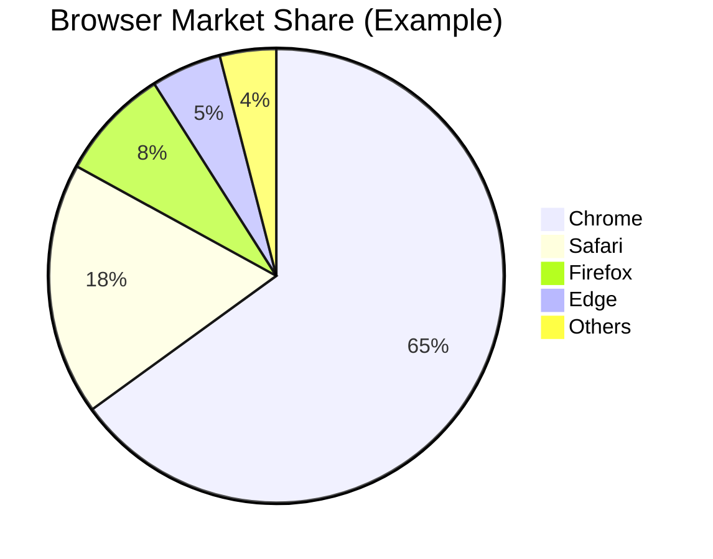

# Browser Compatibility

## Introduction

Browser compatibility refers to the ability of a website or web application to function correctly across different web browsers, browser versions, and operating systems. As a web developer, understanding browser compatibility is crucial because your users will access your applications using various browsers and devices. What works perfectly in Chrome might break in Safari or Internet Explorer, creating a frustrating experience for users.

In this guide, we'll explore what causes browser compatibility issues, how to detect them, and strategies to ensure your web applications work consistently across different browsers.

## Why Browser Compatibility Matters

Browser compatibility directly impacts:

- **User Experience**: Broken layouts or non-functioning features frustrate users
- **Accessibility**: Some users may rely on specific browsers due to accessibility tools
- **Reach**: Incompatibility can exclude entire segments of your potential audience
- **Business Impact**: Poor compatibility can lead to lost conversions and revenue

## Common Browser Compatibility Issues

### 1. Rendering Differences

Different browser engines interpret HTML and CSS in slightly different ways, which can lead to layout inconsistencies.

```html
<!-- Example of a flexbox layout that might render differently -->
<div style="display: flex; gap: 10px;">
  <div>Item 1</div>
  <div>Item 2</div>
  <div>Item 3</div>
</div>
```

The `gap` property, for instance, wasn't supported in Safari until relatively recently.

### 2. JavaScript API Support

Browsers implement JavaScript features and APIs at different paces.

```javascript
// This might work in modern browsers but fail in older ones
const items = Array.from(document.querySelectorAll('.item'));

// More compatible approach
const itemElements = document.querySelectorAll('.item');
const items = [];
for (let i = 0; i < itemElements.length; i++) {
  items.push(itemElements[i]);
}
```

### 3. CSS Property Support

New CSS properties may not be supported in all browsers.

```css
.modern-layout {
  display: grid;
  grid-template-columns: repeat(auto-fill, minmax(200px, 1fr));
  gap: 20px;
}
```

CSS Grid is now widely supported, but older browsers like IE11 have no support for it.

### 4. HTML5 Element Support

Newer HTML elements may not be recognized by older browsers.

```html
<article>
  <header>
    <h1>Article Title</h1>
  </header>
  <p>Article content...</p>
  <footer>
    <p>Author information</p>
  </footer>
</article>
```

## Browser Market Share and Support Decisions

Understanding browser usage patterns helps prioritize compatibility efforts:



When making compatibility decisions, consider:

1. Your target audience's browser preferences
2. Geographic differences in browser usage
3. Desktop vs. mobile usage patterns
4. Business requirements and acceptable compatibility thresholds

## Detecting Browser Compatibility Issues

### Manual Testing

The most straightforward approach is testing your site across multiple browsers and devices:

1. Install multiple browsers on your development machine
2. Use browser developer tools to simulate different device sizes
3. Test on actual physical devices when possible
4. Pay special attention to older browsers if your audience uses them

### Automated Testing

Several tools can help automate cross-browser testing:

- **BrowserStack and Sauce Labs**: Cloud services that let you test on real browsers
- **Selenium**: Automated testing framework for cross-browser testing
- **Cypress and Playwright**: Modern end-to-end testing frameworks

### Feature Detection

Rather than detecting specific browsers (browser sniffing), it's better to detect feature support:

```javascript
// Bad approach: Browser detection
if (navigator.userAgent.indexOf('Chrome') !== -1) {
  // Use Chrome-specific code
}

// Good approach: Feature detection
if ('IntersectionObserver' in window) {
  // Use IntersectionObserver
} else {
  // Use fallback approach
}
```

## Solutions for Browser Compatibility Issues

### 1. Progressive Enhancement

Build a baseline experience that works everywhere, then enhance for browsers that support more features:

```javascript
// Basic functionality that works everywhere
const button = document.querySelector('.toggle-button');
const content = document.querySelector('.content');

button.addEventListener('click', function() {
  if (content.style.display === 'none') {
    content.style.display = 'block';
  } else {
    content.style.display = 'none';
  }
});

// Enhanced functionality for browsers that support it
if ('animate' in HTMLElement.prototype) {
  button.addEventListener('click', function() {
    content.animate([
      { opacity: 0 },
      { opacity: 1 }
    ], { duration: 300 });
  });
}
```

### 2. CSS Fallbacks

Provide alternative CSS properties for browsers that don't support newer features:

```css
.container {
  /* Fallback for browsers without grid support */
  display: flex;
  flex-wrap: wrap;
  
  /* Modern grid layout for supporting browsers */
  display: grid;
  grid-template-columns: repeat(auto-fill, minmax(250px, 1fr));
  gap: 20px;
}
```

### 3. Polyfills and Transpilation

Polyfills add missing functionality to older browsers, while transpilation converts modern code to more compatible versions:

```javascript
// Before transpilation - Modern ES6+ code
const processItems = items => {
  return items.map(item => item.value * 2);
};

// After transpilation - ES5 code for older browsers
var processItems = function processItems(items) {
  return items.map(function(item) {
    return item.value * 2;
  });
};
```

Common tools:
- **Babel**: Transpiles modern JavaScript to older versions
- **core-js**: Provides polyfills for JavaScript features
- **Autoprefixer**: Adds vendor prefixes to CSS properties

### 4. Responsive Design

Ensure your layouts adapt to different screen sizes and device capabilities:

```css
.responsive-layout {
  display: block; /* Base layout */
}

@media (min-width: 768px) {
  .responsive-layout {
    display: flex; /* Enhanced layout for larger screens */
  }
}
```

### 5. CSS Vendor Prefixes

Use vendor prefixes for experimental or browser-specific CSS features:

```css
.box {
  -webkit-box-shadow: 0 0 10px rgba(0, 0, 0, 0.5);
  -moz-box-shadow: 0 0 10px rgba(0, 0, 0, 0.5);
  box-shadow: 0 0 10px rgba(0, 0, 0, 0.5);
}
```

Autoprefixer can handle this automatically based on your browser support requirements.

## Best Practices for Cross-Browser Development

### 1. Define Browser Support Targets

Establish which browsers and versions you need to support based on:
- Analytics data from your target audience
- Business requirements
- Practical considerations of development time vs. compatibility

### 2. Use Feature Detection Instead of Browser Detection

```javascript
// Detect if the Fetch API is available
if ('fetch' in window) {
  // Use fetch for AJAX
} else {
  // Fall back to XMLHttpRequest
}
```

Libraries like Modernizr can help with feature detection.

### 3. Test Early and Often

Don't wait until the end of development to test across browsers:
- Set up a testing pipeline that includes multiple browsers
- Test critical features across browsers as they're developed
- Use services like BrowserStack or LambdaTest for convenient access to multiple browsers

### 4. Leverage Modern Tools

```bash
# Example package.json configuration for Babel and Autoprefixer
{
  "browserslist": [
    "> 1%",
    "last 2 versions",
    "not dead"
  ],
  "scripts": {
    "build": "webpack --config webpack.config.js"
  }
}
```

The `browserslist` configuration above tells tools like Babel and Autoprefixer which browsers to support.

### 5. Use CSS Reset or Normalize

Browser default styles can vary, causing unexpected layout issues:

```css
/* Simplified example of normalize.css approach */
html {
  line-height: 1.15;
  -webkit-text-size-adjust: 100%;
}

body {
  margin: 0;
}

main {
  display: block;
}
```

Consider using libraries like:
- normalize.css - Preserves useful defaults while normalizing styles
- reset.css - Removes all browser defaults for a clean slate

### 6. Follow Web Standards

Write valid HTML, CSS, and JavaScript that follows W3C standards:
- Use HTML validation tools
- Keep CSS and JavaScript separate from HTML when possible
- Follow accessibility guidelines (WCAG)

## Real-World Example: Building a Cross-Browser Compatible Form

Let's build a simple contact form that works across browsers:

```html
<form id="contact-form" class="contact-form">
  <div class="form-group">
    <label for="name">Name:</label>
    <input type="text" id="name" name="name" required />
  </div>
  
  <div class="form-group">
    <label for="email">Email:</label>
    <input type="email" id="email" name="email" required />
  </div>
  
  <div class="form-group">
    <label for="message">Message:</label>
    <textarea id="message" name="message" rows="5" required></textarea>
  </div>
  
  <button type="submit">Send Message</button>
</form>
```

```css
/* Form styling with fallbacks */
.contact-form {
  /* Fallback for old browsers */
  width: 100%;
  max-width: 500px;
  margin: 0 auto;
  padding: 20px;
  
  /* Modern browsers */
  display: grid;
  grid-template-columns: 1fr;
  gap: 20px;
}

/* Fallback for browsers without grid support */
@supports not (display: grid) {
  .form-group {
    margin-bottom: 20px;
  }
}

input, textarea {
  width: 100%;
  padding: 8px;
  border: 1px solid #ccc;
  border-radius: 4px;
  
  /* Fallback for older browsers */
  -webkit-box-sizing: border-box;
  -moz-box-sizing: border-box;
  box-sizing: border-box;
}

button {
  background-color: #4CAF50;
  color: white;
  padding: 10px 15px;
  border: none;
  border-radius: 4px;
  cursor: pointer;
  
  /* Transition with prefixes for older browsers */
  -webkit-transition: background-color 0.3s;
  -moz-transition: background-color 0.3s;
  -o-transition: background-color 0.3s;
  transition: background-color 0.3s;
}

button:hover {
  background-color: #45a049;
}
```

```javascript
// Form validation with fallbacks
document.addEventListener('DOMContentLoaded', function() {
  const form = document.getElementById('contact-form');
  
  // Feature detection for form validation
  const hasFormValidation = 'checkValidity' in document.createElement('form');
  
  form.addEventListener('submit', function(event) {
    // If the browser doesn't support form validation
    if (!hasFormValidation) {
      event.preventDefault();
      
      const name = document.getElementById('name');
      const email = document.getElementById('email');
      const message = document.getElementById('message');
      
      let isValid = true;
      
      // Manual validation
      if (!name.value.trim()) {
        isValid = false;
        // Add error styling
        name.style.borderColor = 'red';
      }
      
      if (!email.value.trim() || !validateEmail(email.value)) {
        isValid = false;
        email.style.borderColor = 'red';
      }
      
      if (!message.value.trim()) {
        isValid = false;
        message.style.borderColor = 'red';
      }
      
      if (isValid) {
        form.submit();
      }
    }
  });
  
  // Simple email validation helper
  function validateEmail(email) {
    const re = /\S+@\S+\.\S+/;
    return re.test(email);
  }
});
```

## Common Interview Questions About Browser Compatibility

1. **What strategies do you use to ensure cross-browser compatibility?**
   - Answer with: Feature detection, progressive enhancement, testing methodology, and modern build tools

2. **How do you handle a feature that works in Chrome but not in Safari?**
   - Discuss your debugging process, feature detection, and fallback implementations

3. **What's the difference between graceful degradation and progressive enhancement?**
   - Progressive enhancement: Start with basic functionality, add enhancements for modern browsers
   - Graceful degradation: Build for modern browsers, provide fallbacks for older ones

4. **How would you debug a browser-specific issue?**
   - Browser developer tools, console.log debugging, isolating the problem, checking compatibility tables

5. **What tools do you use for cross-browser testing?**
   - BrowserStack, Sauce Labs, browser developer tools, actual devices, CI/CD pipelines

## Summary

Browser compatibility remains a fundamental challenge in web development. By understanding the common issues, implementing proper detection techniques, and following best practices, you can ensure your web applications provide a consistent experience across all major browsers.

Key takeaways:
- Define your browser support targets based on audience and business needs
- Use feature detection instead of browser detection
- Implement progressive enhancement and provide fallbacks
- Test across multiple browsers throughout development
- Leverage modern tools like Babel, Autoprefixer, and polyfills
- Follow web standards and accessibility guidelines

## Exercises

1. Create a simple webpage and test it across at least three different browsers. Document any differences you observe.

2. Take an existing JavaScript feature that might not be supported in all browsers and implement a fallback solution using feature detection.

3. Configure a build system with Babel and Autoprefixer to support specific browser targets.

4. Practice using browser developer tools to identify and fix browser-specific CSS issues.

5. Research and implement polyfills for two modern JavaScript features in a small project.

## Additional Resources

- [Can I Use](https://caniuse.com) - Browser support tables for web technologies
- [MDN Web Docs](https://developer.mozilla.org) - Comprehensive documentation with browser compatibility information
- [Modernizr](https://modernizr.com) - Feature detection library
- [Autoprefixer](https://github.com/postcss/autoprefixer) - Tool for adding vendor prefixes to CSS
- [Babel](https://babeljs.io) - JavaScript compiler for compatibility
- [BrowserStack](https://www.browserstack.com) - Cross-browser testing platform