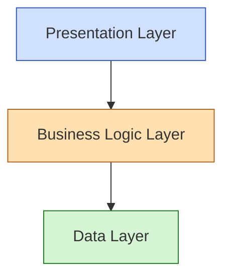
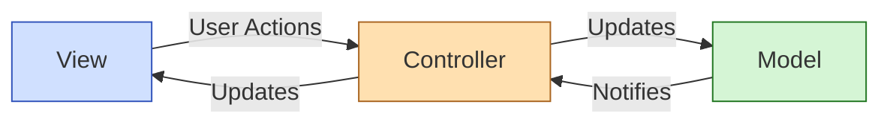
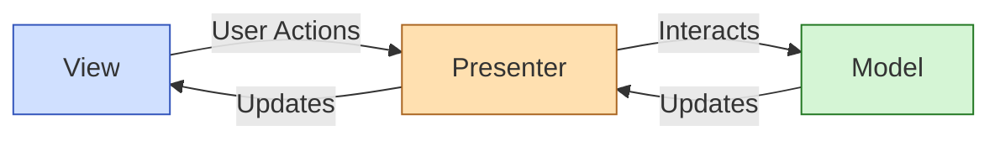
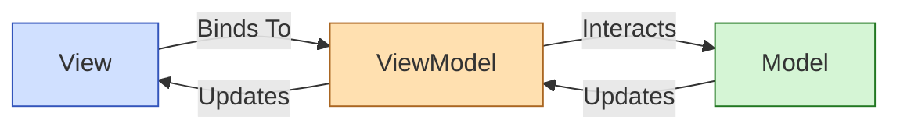
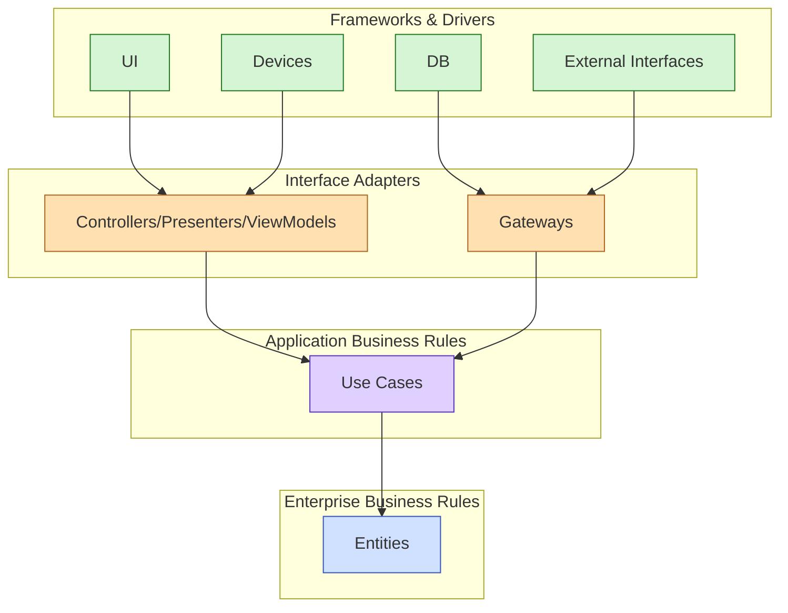
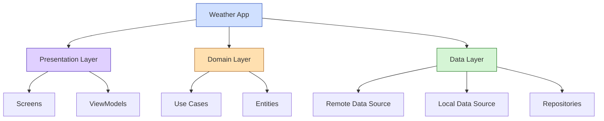

# Mobile App Architecture

## Introduction

Mobile App Architecture defines the structure and organization of code and components that make up a mobile application. A well-designed architecture ensures your app is maintainable, testable, and scalable as it grows in complexity. Whether you're developing for iOS, Android, or cross-platform solutions, understanding architectural concepts is essential for building robust mobile applications.

This guide will introduce you to the fundamental concepts of mobile app architecture, common architectural patterns, and best practices that will help you build better apps.

## Why Architecture Matters

Before diving into specific patterns, let's understand why architecture matters:

- **Maintainability**: A well-structured app is easier to update and modify
- **Testability**: Proper separation of concerns makes testing simpler
- **Scalability**: Good architecture accommodates growth and new features
- **Collaboration**: Clear structure helps teams work efficiently together
- **Performance**: Smart architectural decisions improve app performance

## Layers of Mobile App Architecture

Most mobile applications can be divided into three primary layers:



### 1. Presentation Layer

The presentation layer is what users see and interact with. It includes:

- **UI Components**: Buttons, text fields, lists, etc.
- **Screens/Views**: Individual screens in your application
- **UI Logic**: Handling user input and screen navigation

#### Example UI Component (React Native):

```jsx
const WelcomeScreen = () => {
  const [username, setUsername] = useState('');
  
  return (
    <View style={styles.container}>
      <Text style={styles.title}>Welcome to My App</Text>
      <TextInput
        style={styles.input}
        placeholder="Enter your name"
        value={username}
        onChangeText={setUsername}
      />
      <Button 
        title="Continue" 
        onPress={() => console.log(`Hello, ${username}!`)}
      />
    </View>
  );
};
```

### 2. Business Logic Layer

The business logic layer contains the core functionality of your app:

- **Use Cases**: Application-specific business rules
- **Services**: Reusable operations and workflows
- **State Management**: Handling and transforming application state

#### Example Service (Swift):

```swift
class AuthenticationService {
    func login(username: String, password: String) -> Promise<User> {
        // Validate credentials
        guard isValidEmail(username) && password.count >= 8 else {
            return Promise.reject(AuthError.invalidCredentials)
        }
        
        // Call API and return result
        return apiClient.post("/login", params: ["username": username, "password": password])
            .then { response in
                return User(from: response.data)
            }
    }
    
    private func isValidEmail(_ email: String) -> Bool {
        // Email validation logic
        let emailRegex = "[A-Z0-9a-z._%+-]+@[A-Za-z0-9.-]+\\.[A-Za-z]{2,64}"
        return NSPredicate(format: "SELF MATCHES %@", emailRegex).evaluate(with: email)
    }
}
```

### 3. Data Layer

The data layer handles data operations and external communications:

- **API Clients**: Communication with backend services
- **Local Storage**: Persistence of data on the device
- **Data Models**: Representation of your application's data

#### Example Repository (Kotlin):

```kotlin
class UserRepository(
    private val apiService: UserApiService,
    private val userDao: UserDao
) {
    suspend fun getUser(userId: String): User {
        // Try to get from local database first
        val localUser = userDao.getUserById(userId)
        
        if (localUser != null && !localUser.isStale()) {
            return localUser
        }
        
        // If not available locally or stale, fetch from API
        return try {
            val remoteUser = apiService.fetchUser(userId)
            // Save to local database
            userDao.insertOrUpdate(remoteUser)
            remoteUser
        } catch (e: Exception) {
            // If network fails but we have a local copy, return it anyway
            localUser ?: throw e
        }
    }
}
```

## Common Architectural Patterns

Let's explore the most popular architectural patterns used in mobile app development.

### MVC (Model-View-Controller)

MVC is one of the oldest architectural patterns:

- **Model**: Data and business logic
- **View**: UI elements
- **Controller**: Mediates between Model and View



#### Pros and Cons of MVC

**Pros:**
- Simple to understand and implement
- Good for small applications
- Widely used and documented

**Cons:**
- Controllers often become bloated ("Massive View Controller" problem)
- Tight coupling between View and Controller
- Limited testability

### MVP (Model-View-Presenter)

MVP evolved from MVC to improve testability:

- **Model**: Data and business logic
- **View**: Passive UI elements that delegate to Presenter
- **Presenter**: Handles UI logic and updates the View



#### Example MVP Implementation (Java):

```java
// View Interface
public interface LoginView {
    void showProgress();
    void hideProgress();
    void setUsernameError(String error);
    void setPasswordError(String error);
    void navigateToHome();
    void showError(String message);
}

// Presenter
public class LoginPresenter {
    private LoginView view;
    private AuthService authService;
    
    public LoginPresenter(LoginView view, AuthService authService) {
        this.view = view;
        this.authService = authService;
    }
    
    public void attemptLogin(String username, String password) {
        // Input validation
        boolean isValid = true;
        
        if (username.isEmpty()) {
            view.setUsernameError("Username cannot be empty");
            isValid = false;
        }
        
        if (password.isEmpty()) {
            view.setPasswordError("Password cannot be empty");
            isValid = false;
        }
        
        if (!isValid) return;
        
        // Show progress indicator
        view.showProgress();
        
        // Attempt login
        authService.login(username, password, new Callback<User>() {
            @Override
            public void onSuccess(User user) {
                view.hideProgress();
                view.navigateToHome();
            }
            
            @Override
            public void onFailure(Exception e) {
                view.hideProgress();
                view.showError(e.getMessage());
            }
        });
    }
}
```

### MVVM (Model-View-ViewModel)

MVVM is currently one of the most popular patterns:

- **Model**: Data and business logic
- **View**: Observes and binds to the ViewModel
- **ViewModel**: Exposes data and commands the View can bind to



#### Example MVVM Implementation (Swift with Combine):

```swift
// Model
struct LoginCredentials {
    let username: String
    let password: String
}

// ViewModel
class LoginViewModel {
    // Inputs
    let usernamePublisher = CurrentValueSubject<String, Never>("")
    let passwordPublisher = CurrentValueSubject<String, Never>("")
    let loginTapPublisher = PassthroughSubject<Void, Never>()
    
    // Outputs
    let isLoginEnabledPublisher: AnyPublisher<Bool, Never>
    let isLoadingPublisher = CurrentValueSubject<Bool, Never>(false)
    let errorPublisher = PassthroughSubject<String, Never>()
    let didLoginPublisher = PassthroughSubject<Void, Never>()
    
    private let authService: AuthService
    private var cancellables = Set<AnyCancellable>()
    
    init(authService: AuthService) {
        self.authService = authService
        
        // Enable login button only when both fields have text
        isLoginEnabledPublisher = Publishers.CombineLatest(
            usernamePublisher, 
            passwordPublisher
        )
        .map { username, password in
            return !username.isEmpty && !password.isEmpty
        }
        .eraseToAnyPublisher()
        
        // Handle login taps
        loginTapPublisher
            .sink { [weak self] _ in
                guard let self = self else { return }
                self.login(
                    username: self.usernamePublisher.value,
                    password: self.passwordPublisher.value
                )
            }
            .store(in: &cancellables)
    }
    
    private func login(username: String, password: String) {
        isLoadingPublisher.send(true)
        
        authService.login(username: username, password: password)
            .sink(
                receiveCompletion: { [weak self] completion in
                    self?.isLoadingPublisher.send(false)
                    if case .failure(let error) = completion {
                        self?.errorPublisher.send(error.localizedDescription)
                    }
                },
                receiveValue: { [weak self] _ in
                    self?.didLoginPublisher.send()
                }
            )
            .store(in: &cancellables)
    }
}
```

### Clean Architecture

Clean Architecture focuses on separating concerns and dependencies:



Key principles of Clean Architecture:

1. **Independence from frameworks**: The architecture doesn't depend on the existence of libraries or UI frameworks
2. **Testability**: Business rules can be tested without UI, database, or external elements
3. **Independence from UI**: The UI can change without changing the rest of the system
4. **Independence from database**: Business rules aren't bound to database implementation
5. **Independence from external agencies**: Business rules don't know anything about interfaces to the outside world

## State Management

State management is crucial in mobile apps. Here are common approaches:

### 1. Redux / Flux Pattern

Used in React Native and other frameworks, Redux centralizes application state:

```javascript
// Action
const login = (username, password) => {
  return async (dispatch) => {
    dispatch({ type: 'LOGIN_START' });
    
    try {
      const user = await AuthService.login(username, password);
      dispatch({ type: 'LOGIN_SUCCESS', payload: user });
    } catch (error) {
      dispatch({ type: 'LOGIN_FAILURE', payload: error.message });
    }
  };
};

// Reducer
const authReducer = (state = { user: null, loading: false, error: null }, action) => {
  switch (action.type) {
    case 'LOGIN_START':
      return { ...state, loading: true, error: null };
    case 'LOGIN_SUCCESS':
      return { ...state, loading: false, user: action.payload };
    case 'LOGIN_FAILURE':
      return { ...state, loading: false, error: action.payload };
    default:
      return state;
  }
};
```

### 2. Reactive Programming

Using RxJava (Android) or Combine (iOS) for reactive state management:

```kotlin
// Android with RxJava
class UserViewModel(private val userRepository: UserRepository) : ViewModel() {
    private val _userState = MutableLiveData<UserState>()
    val userState: LiveData<UserState> get() = _userState
    
    private val compositeDisposable = CompositeDisposable()
    
    fun loadUser(userId: String) {
        _userState.value = UserState.Loading
        
        userRepository.getUser(userId)
            .subscribeOn(Schedulers.io())
            .observeOn(AndroidSchedulers.mainThread())
            .subscribe({ user ->
                _userState.value = UserState.Success(user)
            }, { error ->
                _userState.value = UserState.Error(error.message ?: "Unknown error")
            })
            .addTo(compositeDisposable)
    }
    
    override fun onCleared() {
        compositeDisposable.dispose()
        super.onCleared()
    }
}

sealed class UserState {
    object Loading : UserState()
    data class Success(val user: User) : UserState()
    data class Error(val message: String) : UserState()
}
```

## Navigation Architecture

Mobile apps need a clear navigation strategy:

### 1. Single Activity, Multiple Fragments (Android)

```kotlin
// Using Navigation Component in Android
val navController = findNavController(R.id.nav_host_fragment)

val navGraph = navController.navInflater.inflate(R.navigation.main_navigation)
navController.graph = navGraph

// Navigate to a destination
navController.navigate(R.id.detailsFragment, bundleOf("itemId" to item.id))
```

### 2. Coordinator Pattern (iOS)

```swift
class MainCoordinator: Coordinator {
    var childCoordinators = [Coordinator]()
    var navigationController: UINavigationController
    
    init(navigationController: UINavigationController) {
        self.navigationController = navigationController
    }
    
    func start() {
        let viewController = HomeViewController()
        viewController.coordinator = self
        navigationController.pushViewController(viewController, animated: false)
    }
    
    func showDetails(for item: Item) {
        let viewController = DetailsViewController(item: item)
        viewController.coordinator = self
        navigationController.pushViewController(viewController, animated: true)
    }
}
```

## Cross-Platform Considerations

When building for multiple platforms, consider these architectural approaches:

### 1. Shared Business Logic

Extract common logic into a shared module:

```kotlin
// Kotlin Multiplatform example
expect class PlatformSpecific {
    fun getPlatformName(): String
}

class CommonBusinessLogic(private val platformSpecific: PlatformSpecific) {
    fun processBusinessRule(input: String): String {
        val platform = platformSpecific.getPlatformName()
        return "Processing $input on $platform"
    }
}
```

### 2. Platform-Specific UI with Shared ViewModel

```javascript
// React Native example with shared business logic
const useUserData = () => {
  const [user, setUser] = useState(null);
  const [loading, setLoading] = useState(false);
  const [error, setError] = useState(null);
  
  const fetchUser = async (userId) => {
    setLoading(true);
    setError(null);
    
    try {
      const userData = await UserService.getUser(userId);
      setUser(userData);
    } catch (err) {
      setError(err.message);
    } finally {
      setLoading(false);
    }
  };
  
  return { user, loading, error, fetchUser };
};

// Platform-specific UI components using the same hook
const UserProfileIOS = ({ userId }) => {
  const { user, loading, error, fetchUser } = useUserData();
  
  useEffect(() => {
    fetchUser(userId);
  }, [userId]);
  
  // iOS-specific UI implementation
};

const UserProfileAndroid = ({ userId }) => {
  const { user, loading, error, fetchUser } = useUserData();
  
  useEffect(() => {
    fetchUser(userId);
  }, [userId]);
  
  // Android-specific UI implementation
};
```

## Best Practices for Mobile App Architecture

### 1. Single Responsibility Principle

Each class or module should have only one reason to change:

```swift
// Bad: Mixed responsibilities
class UserManager {
    func fetchUser(id: String) { /* API Call */ }
    func saveUserToDatabase(user: User) { /* Database operation */ }
    func formatUserName(user: User) -> String { /* UI formatting */ }
}

// Good: Separated responsibilities
class UserApiClient {
    func fetchUser(id: String) { /* API Call */ }
}

class UserStorage {
    func saveUser(user: User) { /* Database operation */ }
}

class UserFormatter {
    func formatName(user: User) -> String { /* UI formatting */ }
}
```

### 2. Dependency Injection

Pass dependencies instead of creating them:

```kotlin
// Without dependency injection
class UserRepository {
    private val apiClient = ApiClient() // Hard-coded dependency
    
    fun getUser(id: String): User {
        return apiClient.fetchUser(id)
    }
}

// With dependency injection
class UserRepository(private val apiClient: ApiClient) {
    fun getUser(id: String): User {
        return apiClient.fetchUser(id)
    }
}
```

### 3. Immutable Data

Use immutable data structures to prevent unexpected side effects:

```swift
// Immutable data model
struct User {
    let id: String
    let name: String
    let email: String
    
    // To update, create a new instance with modified properties
    func withUpdatedEmail(_ newEmail: String) -> User {
        return User(id: self.id, name: self.name, email: newEmail)
    }
}
```

### 4. Progressive Disclosure of Complexity

Start simple and add complexity as needed:

1. Begin with a simple MVC/MVP if your app is small
2. Add reactive patterns as your app grows
3. Consider Clean Architecture for larger, complex applications

## Real-World Example: Building a Weather App

Let's see how these concepts apply in a real-world weather app:

### Architecture Overview



### Implementation (React Native with TypeScript)

```typescript
// Data Layer: Weather API Client
class WeatherApiClient {
  private baseUrl = 'https://api.weather.com';
  
  async fetchWeather(location: string): Promise<WeatherData> {
    try {
      const response = await fetch(`${this.baseUrl}/current?location=${location}`);
      
      if (!response.ok) {
        throw new Error(`API error: ${response.status}`);
      }
      
      return await response.json();
    } catch (error) {
      console.error('Failed to fetch weather:', error);
      throw error;
    }
  }
}

// Domain Layer: Weather Entity
interface WeatherData {
  temperature: number;
  condition: string;
  humidity: number;
  windSpeed: number;
  location: string;
  timestamp: number;
}

// Domain Layer: Weather Use Case
class GetWeatherUseCase {
  constructor(private weatherRepository: WeatherRepository) {}
  
  async execute(location: string): Promise<WeatherData> {
    return this.weatherRepository.getWeatherForLocation(location);
  }
}

// Presentation Layer: Weather ViewModel
class WeatherViewModel {
  private weatherData = new BehaviorSubject<WeatherData | null>(null);
  private loading = new BehaviorSubject<boolean>(false);
  private error = new BehaviorSubject<string | null>(null);
  
  constructor(private getWeatherUseCase: GetWeatherUseCase) {}
  
  get weatherData$() {
    return this.weatherData.asObservable();
  }
  
  get loading$() {
    return this.loading.asObservable();
  }
  
  get error$() {
    return this.error.asObservable();
  }
  
  async loadWeather(location: string): Promise<void> {
    this.loading.next(true);
    this.error.next(null);
    
    try {
      const data = await this.getWeatherUseCase.execute(location);
      this.weatherData.next(data);
    } catch (e) {
      this.error.next(e.message);
    } finally {
      this.loading.next(false);
    }
  }
}

// Presentation Layer: React Component
function WeatherScreen() {
  const [location, setLocation] = useState('New York');
  const viewModel = useViewModel(() => new WeatherViewModel(
    new GetWeatherUseCase(new WeatherRepository(new WeatherApiClient()))
  ));
  
  const weather = useObservable(viewModel.weatherData$, null);
  const loading = useObservable(viewModel.loading$, false);
  const error = useObservable(viewModel.error$, null);
  
  useEffect(() => {
    viewModel.loadWeather(location);
  }, [location]);
  
  if (loading) {
    return <ActivityIndicator size="large" />;
  }
  
  if (error) {
    return <Text style={styles.error}>Error: {error}</Text>;
  }
  
  if (!weather) {
    return <Text>No weather data available</Text>;
  }
  
  return (
    <View style={styles.container}>
      <Text style={styles.location}>{weather.location}</Text>
      <Text style={styles.temperature}>{weather.temperature}°C</Text>
      <Text style={styles.condition}>{weather.condition}</Text>
      <View style={styles.details}>
        <Text>Humidity: {weather.humidity}%</Text>
        <Text>Wind: {weather.windSpeed} km/h</Text>
      </View>
    </View>
  );
}
```

## Performance Considerations

Architecture choices impact app performance:

1. **Lazy Loading**: Load resources only when needed
2. **Memory Management**: Properly handle lifecycles and resources
3. **Background Processing**: Offload heavy tasks to background threads
4. **Caching Strategies**: Implement appropriate caching for data

## Testing Architecture Components

A good architecture enables comprehensive testing:

```kotlin
// Testing a ViewModel
class WeatherViewModelTest {
    private lateinit var viewModel: WeatherViewModel
    private lateinit var useCase: GetWeatherUseCase
    private val testDispatcher = TestCoroutineDispatcher()
    
    @Before
    fun setup() {
        useCase = mock()
        viewModel = WeatherViewModel(useCase, testDispatcher)
    }
    
    @Test
    fun `loading weather shows loading state and then success state`() = runTest {
        // Arrange
        val weatherData = WeatherData(
            temperature = 25.0,
            condition = "Sunny",
            humidity = 65,
            windSpeed = 10.0,
            location = "New York",
            timestamp = System.currentTimeMillis()
        )
        whenever(useCase.execute("New York")).thenReturn(weatherData)
        
        // Act
        viewModel.loadWeather("New York")
        
        // Assert loading state
        val loadingState = viewModel.state.value
        assertTrue(loadingState is WeatherState.Loading)
        
        // Complete the coroutine
        testDispatcher.advanceUntilIdle()
        
        // Assert success state
        val successState = viewModel.state.value
        assertTrue(successState is WeatherState.Success)
        assertEquals(weatherData, (successState as WeatherState.Success).data)
    }
    
    @Test
    fun `error during loading sets error state`() = runTest {
        // Arrange
        val errorMessage = "Network error"
        whenever(useCase.execute("New York")).thenThrow(RuntimeException(errorMessage))
        
        // Act
        viewModel.loadWeather("New York")
        testDispatcher.advanceUntilIdle()
        
        // Assert
        val errorState = viewModel.state.value
        assertTrue(errorState is WeatherState.Error)
        assertEquals(errorMessage, (errorState as WeatherState.Error).message)
    }
}
```

## Summary

Mobile App Architecture is a critical foundation for building successful apps. In this guide, we've covered:

- The three main layers of mobile app architecture
- Popular architectural patterns like MVC, MVP, MVVM, and Clean Architecture
- State management approaches
- Cross-platform architectural considerations
- Best practices for maintainable code
- A real-world example of implementing architecture in a weather app
- Performance considerations
- Testing strategies for architectural components

Remember that architecture is not a one-size-fits-all solution. Start with simpler patterns for smaller apps and gradually increase complexity as your application grows. The goal is to create a structure that supports your specific requirements while remaining maintainable and testable.

## Additional Resources

To further your understanding of mobile app architecture:

- **Books**:
  - "Clean Architecture" by Robert C. Martin
  - "Android Architecture Patterns" by Florina Muntenescu
  - "iOS App Architecture" by Uraimo Egor, Böhm Benjamin, and Toda Soroush

- **Online Tutorials**:
  - [Official Android Architecture Guide](https://developer.android.com/topic/architecture)
  - [Apple's Model-View-Controller Guide](https://developer.apple.com/library/archive/documentation/General/Conceptual/DevPedia-CocoaCore/MVC.html)
  - [Flutter Architecture Samples](https://fluttersamples.com/)

- **Practice Exercises**:
  1. Refactor a small app from MVC to MVVM
  2. Build the same simple app using different architectural patterns
  3. Create a cross-platform app with shared business logic
  4. Write unit tests for your architecture components
  5. Implement a state management solution for a multi-screen app

By mastering these concepts, you'll be well-equipped to design and build mobile applications that are robust, maintainable, and scalable.