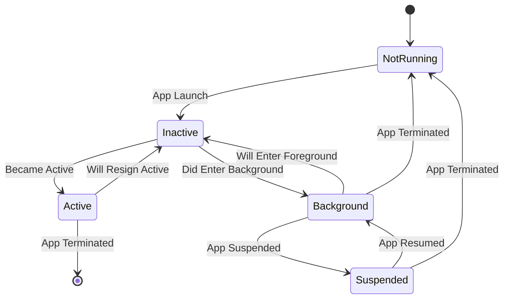
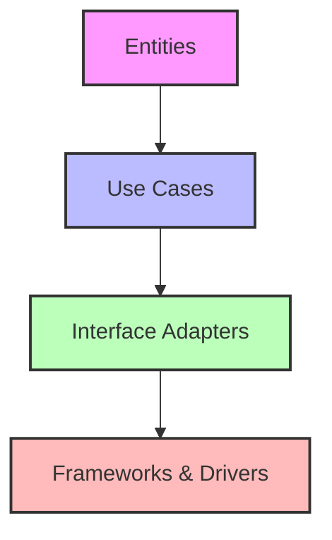

# iOS Development Questions

## Introduction

When preparing for iOS development interviews, having a solid understanding of the core concepts and being able to answer common questions is essential. This guide covers the fundamental knowledge, practical coding examples, and best practices that interviewers often look for in iOS developer candidates. Whether you're a beginner preparing for your first iOS role or an experienced developer refreshing your knowledge, this resource will help you navigate the interview process with confidence.

## Core iOS Concepts

### 1. What is the difference between a struct and a class in Swift?

This is one of the most common Swift questions in iOS interviews.

**Struct:**
- Value type (copied when passed around)
- Immutable by default
- No inheritance
- No reference counting
- Thread-safe due to value semantics
- Default memberwise initializer

**Class:**
- Reference type (shared when passed around)
- Mutable
- Supports inheritance
- Reference counting (ARC)
- Not thread-safe by default
- No default memberwise initializer

```swift
// Struct example
struct Point {
    var x: Double
    var y: Double
    
    // Methods can mutate properties
    mutating func moveBy(x deltaX: Double, y deltaY: Double) {
        x += deltaX
        y += deltaY
    }
}

// Class example
class Person {
    var name: String
    var age: Int
    
    init(name: String, age: Int) {
        self.name = name
        self.age = age
    }
    
    func celebrateBirthday() {
        age += 1
        print("\(name) is now \(age) years old!")
    }
}
```

**When to use which?**
- Use structs for simple data types, value semantics, and when inheritance is not needed
- Use classes when you need inheritance, reference semantics, or control over the identity of the object

### 2. What is the delegation pattern and why is it important in iOS development?

The delegation pattern is a design pattern widely used in iOS development that enables an object to communicate back to its owner in a decoupled way.

**Key points:**
- Allows one object to send messages to another object when specific events occur
- Uses protocols to define the methods that the delegate should implement
- Helps maintain loose coupling between components
- Commonly used in UIKit (e.g., `UITableViewDelegate`, `UITextFieldDelegate`)

```swift
// Defining a delegate protocol
protocol TaskDelegate: AnyObject {
    func taskCompleted(result: String)
    func taskFailed(error: Error)
}

// Class that uses a delegate
class TaskManager {
    weak var delegate: TaskDelegate?
    
    func performTask() {
        // Do some work...
        if success {
            delegate?.taskCompleted(result: "Task succeeded!")
        } else {
            delegate?.taskFailed(error: TaskError.failed)
        }
    }
}

// Implementing the delegate
class ViewController: UIViewController, TaskDelegate {
    let taskManager = TaskManager()
    
    override func viewDidLoad() {
        super.viewDidLoad()
        taskManager.delegate = self
        taskManager.performTask()
    }
    
    // Delegate methods
    func taskCompleted(result: String) {
        print("Task completed with result: \(result)")
    }
    
    func taskFailed(error: Error) {
        print("Task failed with error: \(error)")
    }
}
```

### 3. Explain the iOS application lifecycle

Understanding the application lifecycle is crucial for managing resources and state in your app.

**Application States:**
- Not Running: App is not launched or was terminated
- Inactive: App is running in the foreground but not receiving events
- Active: App is running in the foreground and receiving events
- Background: App is executing code in the background
- Suspended: App is in memory but not executing code



**Key App Delegate Methods:**
```swift
func application(_ application: UIApplication, didFinishLaunchingWithOptions launchOptions: [UIApplication.LaunchOptionsKey: Any]?) -> Bool {
    // App launched, initialize essential components
    return true
}

func applicationWillResignActive(_ application: UIApplication) {
    // App is about to become inactive, pause ongoing tasks
}

func applicationDidEnterBackground(_ application: UIApplication) {
    // App is now in background, save data and free resources
}

func applicationWillEnterForeground(_ application: UIApplication) {
    // App is about to enter foreground, prepare UI
}

func applicationDidBecomeActive(_ application: UIApplication) {
    // App is active and ready to receive events
}

func applicationWillTerminate(_ application: UIApplication) {
    // App is about to terminate, save data and cleanup
}
```

**Note:** For SwiftUI apps using the App protocol, the lifecycle is handled differently using the `@Environment(\.scenePhase) private var scenePhase` property.

## Memory Management in iOS

### 4. Explain Automatic Reference Counting (ARC) and how it works

ARC is Swift's memory management system that automatically deallocates objects when they're no longer needed.

**Key concepts:**
- Swift uses ARC to track and manage your app's memory usage
- ARC automatically frees up memory used by class instances when they are no longer needed
- ARC tracks how many references exist to each class instance
- When reference count drops to zero, instance is deallocated

**Common issues with ARC:**
- Strong reference cycles (memory leaks)
- Premature deallocation
- Dangling pointers

```swift
class Person {
    let name: String
    
    init(name: String) {
        self.name = name
        print("\(name) is being initialized")
    }
    
    deinit {
        print("\(name) is being deinitialized")
    }
}

// Example of ARC in action
func createAndPrintPerson() {
    let person = Person(name: "John")
    print("Person created")
    // When this function ends, person goes out of scope
    // ARC decrements reference count to 0 and deallocates
}

createAndPrintPerson()
// Output:
// John is being initialized
// Person created
// John is being deinitialized
```

### 5. What are strong, weak, and unowned references?

These reference types help prevent memory leaks in Swift applications:

**Strong references:**
- Default behavior
- Increment reference count by 1
- Prevent deallocation as long as reference exists

**Weak references:**
- Don't increment reference count
- Automatically set to nil when the referenced object is deallocated
- Must be declared as optional variables

**Unowned references:**
- Don't increment reference count
- Assume referenced object will always exist
- Will crash if accessed after referenced object is deallocated
- Used when reference is always expected to have a value

```swift
class Person {
    let name: String
    var apartment: Apartment?
    
    init(name: String) {
        self.name = name
    }
    
    deinit {
        print("\(name) is being deinitialized")
    }
}

class Apartment {
    let unit: String
    weak var tenant: Person?  // Weak reference to avoid reference cycle
    
    init(unit: String) {
        self.unit = unit
    }
    
    deinit {
        print("Apartment \(unit) is being deinitialized")
    }
}

// Usage
var john: Person? = Person(name: "John")
var unit4A: Apartment? = Apartment(unit: "4A")

john!.apartment = unit4A
unit4A!.tenant = john

john = nil  // John is deinitialized
// Weak reference tenant automatically set to nil

unit4A = nil  // Apartment is deinitialized
```

### 6. How do you identify and fix memory leaks in iOS applications?

**Identifying memory leaks:**
1. Use Xcode's Memory Graph Debugger
2. Use Instruments (especially Leaks and Allocations instruments)
3. Watch for objects not being deallocated (check deinit not being called)

**Common causes of memory leaks:**
- Strong reference cycles (retain cycles)
- Closures capturing self strongly
- Delegates not declared as weak
- NSTimer references
- NotificationCenter observers not removed

**Solutions:**
1. Use weak or unowned references to break cycles
2. Use capture lists in closures: `[weak self]` or `[unowned self]`
3. Always declare delegates as weak
4. Use invalidate() for Timer objects when done
5. Remove notification observers in deinit

```swift
// Example of fixing a closure-based memory leak
class NetworkManager {
    func fetchData(completion: @escaping () -> Void) {
        // Network request...
    }
}

class ViewController: UIViewController {
    let networkManager = NetworkManager()
    
    func loadData() {
        // BAD: Strong reference cycle
        networkManager.fetchData {
            self.updateUI()
        }
        
        // GOOD: Using weak self to break the cycle
        networkManager.fetchData { [weak self] in
            guard let self = self else { return }
            self.updateUI()
        }
    }
    
    func updateUI() {
        // Update UI...
    }
}
```

## UI Development

### 7. Compare UIKit and SwiftUI approaches

**UIKit:**
- Imperative UI framework (you describe how UI should be created)
- Mature, stable, and well-documented
- Uses Interface Builder or programmatic UI
- Uses delegation, target-action patterns
- Better compatibility with older iOS versions

**SwiftUI:**
- Declarative UI framework (you describe what UI should be)
- Newer framework (introduced in 2019)
- Uses a state-driven approach
- More concise code
- Built-in support for animations, dark mode, accessibility
- Only supports iOS 13 and newer

```swift
// UIKit example - Creating a simple label
let label = UILabel()
label.text = "Hello, UIKit!"
label.textAlignment = .center
label.textColor = .blue
label.font = UIFont.systemFont(ofSize: 24)
view.addSubview(label)

label.translatesAutoresizingMaskIntoConstraints = false
NSLayoutConstraint.activate([
    label.centerXAnchor.constraint(equalTo: view.centerXAnchor),
    label.centerYAnchor.constraint(equalTo: view.centerYAnchor)
])

// SwiftUI equivalent
struct ContentView: View {
    var body: some View {
        Text("Hello, SwiftUI!")
            .font(.system(size: 24))
            .foregroundColor(.blue)
    }
}
```

### 8. Explain Auto Layout and its importance

Auto Layout is a constraint-based layout system that lets you create adaptive interfaces that respond to different screen sizes, orientations, and dynamic content.

**Key concepts:**
- Constraints define relationships between UI elements
- Uses a mathematical constraint solver to determine view frames
- Supports intrinsic content size
- Enables responsive UIs across different devices
- Works with Size Classes for adaptive layouts

```swift
// Setting up Auto Layout constraints programmatically
func setupConstraints() {
    let button = UIButton(type: .system)
    button.setTitle("Press Me", for: .normal)
    view.addSubview(button)
    
    button.translatesAutoresizingMaskIntoConstraints = false
    NSLayoutConstraint.activate([
        // Center horizontally
        button.centerXAnchor.constraint(equalTo: view.centerXAnchor),
        
        // Position from bottom with safe area
        button.bottomAnchor.constraint(equalTo: view.safeAreaLayoutGuide.bottomAnchor, constant: -20),
        
        // Set width and height
        button.widthAnchor.constraint(equalToConstant: 200),
        button.heightAnchor.constraint(equalToConstant: 50)
    ])
}
```

**Common Auto Layout issues:**
- Conflicting constraints
- Missing constraints (ambiguous layout)
- Constraint priorities not set correctly
- Intrinsic content size issues
- Layout loops (circular dependencies)

### 9. What are the different ways to layout UI elements in iOS?

**Frames (CGRect):**
- Manual frame calculation
- Simple but not adaptive
- Used less frequently in modern iOS development

```swift
label.frame = CGRect(x: 20, y: 100, width: 200, height: 40)
```

**Auto Layout:**
- Constraint-based layout system
- Adaptive to different screen sizes
- Can be set in Interface Builder or programmatically

```swift
// Using Visual Format Language
let views = ["label": label]
let horizontalConstraints = NSLayoutConstraint.constraints(
    withVisualFormat: "H:|-20-[label]-20-|",
    options: [],
    metrics: nil,
    views: views
)
NSLayoutConstraint.activate(horizontalConstraints)
```

**Stack Views:**
- Built on top of Auto Layout
- Simplifies common layouts
- Handles distribution and alignment automatically

```swift
let stackView = UIStackView()
stackView.axis = .vertical
stackView.spacing = 10
stackView.alignment = .center
stackView.distribution = .fillEqually

stackView.addArrangedSubview(titleLabel)
stackView.addArrangedSubview(subtitleLabel)
```

**SwiftUI Layout System:**
- Modern declarative approach
- Built-in support for adaptivity
- Uses HStack, VStack, ZStack, and more

```swift
VStack(spacing: 16) {
    Text("Title")
        .font(.headline)
    Text("Subtitle")
        .font(.subheadline)
}
.padding()
```

## Networking in iOS

### 10. How do you make network requests in iOS?

**URLSession:**
- Native Apple framework for networking
- Supports background transfers
- Configurable session types
- Handles authentication and caching

```swift
func fetchData() {
    guard let url = URL(string: "https://api.example.com/data") else { return }
    
    let task = URLSession.shared.dataTask(with: url) { data, response, error in
        if let error = error {
            print("Error: \(error)")
            return
        }
        
        guard let httpResponse = response as? HTTPURLResponse,
              (200...299).contains(httpResponse.statusCode) else {
            print("Invalid response")
            return
        }
        
        if let data = data {
            do {
                let json = try JSONSerialization.jsonObject(with: data)
                print("Received: \(json)")
            } catch {
                print("JSON parsing error: \(error)")
            }
        }
    }
    
    task.resume()
}
```

**Combine Framework:**
- Reactive approach to handling asynchronous events
- Introduced in iOS 13
- Integrates well with SwiftUI

```swift
var cancellables = Set<AnyCancellable>()

func fetchUserWithCombine() {
    guard let url = URL(string: "https://api.example.com/user") else { return }
    
    URLSession.shared.dataTaskPublisher(for: url)
        .map(\.data)
        .decode(type: User.self, decoder: JSONDecoder())
        .receive(on: DispatchQueue.main)
        .sink(
            receiveCompletion: { completion in
                if case .failure(let error) = completion {
                    print("Error: \(error)")
                }
            },
            receiveValue: { user in
                print("Received user: \(user.name)")
            }
        )
        .store(in: &cancellables)
}
```

**Swift Concurrency (async/await):**
- Introduced in Swift 5.5
- More readable asynchronous code
- Built-in error handling

```swift
func fetchUserData() async throws -> User {
    guard let url = URL(string: "https://api.example.com/user") else {
        throw URLError(.badURL)
    }
    
    let (data, response) = try await URLSession.shared.data(from: url)
    
    guard let httpResponse = response as? HTTPURLResponse,
          (200...299).contains(httpResponse.statusCode) else {
        throw URLError(.badServerResponse)
    }
    
    return try JSONDecoder().decode(User.self, from: data)
}

// Usage
Task {
    do {
        let user = try await fetchUserData()
        print("User name: \(user.name)")
    } catch {
        print("Error: \(error)")
    }
}
```

### 11. How do you handle JSON data in Swift?

Swift provides several ways to work with JSON:

**JSONSerialization:**
- Works with Foundation types (Dictionary, Array, String, etc.)
- More manual control
- Works on all iOS versions

```swift
// Converting JSON data to Swift objects
func parseJSON(data: Data) {
    do {
        if let json = try JSONSerialization.jsonObject(with: data) as? [String: Any],
           let name = json["name"] as? String,
           let age = json["age"] as? Int {
            print("Name: \(name), Age: \(age)")
        }
    } catch {
        print("JSON parsing error: \(error)")
    }
}

// Converting Swift objects to JSON data
func createJSON() -> Data? {
    let person = ["name": "John", "age": 30] as [String: Any]
    
    do {
        let jsonData = try JSONSerialization.data(withJSONObject: person)
        return jsonData
    } catch {
        print("Error creating JSON: \(error)")
        return nil
    }
}
```

**Codable Protocol (Encodable & Decodable):**
- Type-safe JSON parsing
- Automatic encoding/decoding
- Introduced in Swift 4
- Less code, fewer errors

```swift
// Define Codable model
struct Person: Codable {
    let name: String
    let age: Int
    let email: String?
    
    enum CodingKeys: String, CodingKey {
        case name
        case age
        case email = "emailAddress"  // Custom key mapping
    }
}

// Decoding JSON
func decodePerson(from jsonData: Data) -> Person? {
    let decoder = JSONDecoder()
    do {
        let person = try decoder.decode(Person.self, from: jsonData)
        return person
    } catch {
        print("Decoding error: \(error)")
        return nil
    }
}

// Encoding to JSON
func encodePerson(_ person: Person) -> Data? {
    let encoder = JSONEncoder()
    encoder.outputFormatting = .prettyPrinted
    
    do {
        let jsonData = try encoder.encode(person)
        return jsonData
    } catch {
        print("Encoding error: \(error)")
        return nil
    }
}
```

## Data Persistence

### 12. What are the different ways to persist data in iOS?

**UserDefaults:**
- Simple key-value storage
- Best for small amounts of data
- Not secure for sensitive information
- Automatically synchronizes between app extensions

```swift
// Saving data
UserDefaults.standard.set("John", forKey: "username")
UserDefaults.standard.set(true, forKey: "isLoggedIn")
UserDefaults.standard.set(42, forKey: "score")

// Reading data
let username = UserDefaults.standard.string(forKey: "username")
let isLoggedIn = UserDefaults.standard.bool(forKey: "isLoggedIn")
let score = UserDefaults.standard.integer(forKey: "score")
```

**FileManager:**
- Direct access to the file system
- Good for larger data, documents, and binary files
- More control over storage location and format

```swift
func saveImageToDocuments(image: UIImage, withName name: String) {
    guard let data = image.jpegData(compressionQuality: 0.8) else { return }
    
    let documentsDirectory = FileManager.default.urls(for: .documentDirectory, in: .userDomainMask)[0]
    let fileURL = documentsDirectory.appendingPathComponent("\(name).jpg")
    
    do {
        try data.write(to: fileURL)
        print("Image saved: \(fileURL.path)")
    } catch {
        print("Error saving image: \(error)")
    }
}

func loadImageFromDocuments(name: String) -> UIImage? {
    let documentsDirectory = FileManager.default.urls(for: .documentDirectory, in: .userDomainMask)[0]
    let fileURL = documentsDirectory.appendingPathComponent("\(name).jpg")
    
    if let imageData = try? Data(contentsOf: fileURL) {
        return UIImage(data: imageData)
    }
    
    return nil
}
```

**Core Data:**
- Object graph and persistence framework
- Support for relationships, migrations, and versioning
- Good for complex data models
- Includes data validation, fetching, and filtering

```swift
// Example Core Data save operation
func saveUser(name: String, age: Int) {
    let context = persistentContainer.viewContext
    let user = User(context: context)
    user.name = name
    user.age = Int16(age)
    user.dateCreated = Date()
    
    do {
        try context.save()
        print("User saved")
    } catch {
        print("Failed to save user: \(error)")
    }
}

// Example Core Data fetch operation
func fetchUsers() -> [User] {
    let context = persistentContainer.viewContext
    let fetchRequest: NSFetchRequest<User> = User.fetchRequest()
    fetchRequest.sortDescriptors = [NSSortDescriptor(key: "name", ascending: true)]
    
    do {
        let users = try context.fetch(fetchRequest)
        return users
    } catch {
        print("Failed to fetch users: \(error)")
        return []
    }
}
```

**Keychain:**
- Secure storage for sensitive information
- Encrypted and protected
- Persists even when app is uninstalled
- Shared between apps from the same developer

```swift
func saveToKeychain(password: String, forAccount account: String) -> Bool {
    let passwordData = password.data(using: .utf8)!
    
    let query: [String: Any] = [
        kSecClass as String: kSecClassGenericPassword,
        kSecAttrAccount as String: account,
        kSecValueData as String: passwordData
    ]
    
    // Delete any existing item
    SecItemDelete(query as CFDictionary)
    
    // Add the new item
    let status = SecItemAdd(query as CFDictionary, nil)
    return status == errSecSuccess
}

func loadFromKeychain(forAccount account: String) -> String? {
    let query: [String: Any] = [
        kSecClass as String: kSecClassGenericPassword,
        kSecAttrAccount as String: account,
        kSecReturnData as String: true,
        kSecMatchLimit as String: kSecMatchLimitOne
    ]
    
    var dataTypeRef: AnyObject?
    let status = SecItemCopyMatching(query as CFDictionary, &dataTypeRef)
    
    if status == errSecSuccess, let data = dataTypeRef as? Data {
        return String(data: data, encoding: .utf8)
    }
    
    return nil
}
```

## Architecture Patterns

### 13. Explain the MVC, MVVM and other architecture patterns used in iOS development

Choosing the right architecture pattern is crucial for building maintainable iOS applications:

**MVC (Model-View-Controller):**
- Traditional iOS architecture
- Model: Data and business logic
- View: UI elements
- Controller: Mediates between Model and View
- Often leads to "Massive View Controllers"

**MVVM (Model-View-ViewModel):**
- Model: Data and business logic
- View: UI elements and user interactions
- ViewModel: Transforms Model data for the View
- Better testability and separation of concerns

```swift
// MVVM Example
// Model
struct User {
    let id: Int
    let name: String
    let email: String
}

// ViewModel
class UserViewModel {
    private let user: User
    
    init(user: User) {
        self.user = user
    }
    
    var displayName: String {
        return user.name.uppercased()
    }
    
    var emailText: String {
        return "Email: \(user.email)"
    }
}

// View/Controller
class UserViewController: UIViewController {
    @IBOutlet private weak var nameLabel: UILabel!
    @IBOutlet private weak var emailLabel: UILabel!
    
    var viewModel: UserViewModel!
    
    override func viewDidLoad() {
        super.viewDidLoad()
        updateUI()
    }
    
    private func updateUI() {
        nameLabel.text = viewModel.displayName
        emailLabel.text = viewModel.emailText
    }
}
```

**Other Common Architectures:**

**VIPER (View-Interactor-Presenter-Entity-Router):**
- More granular separation of responsibilities
- View: UI elements
- Interactor: Business logic
- Presenter: Prepares data for display
- Entity: Data models
- Router: Navigation logic
- Good for large teams and complex apps

**Clean Architecture:**
- Focuses on separating concerns
- Domain logic independent of frameworks
- Highly testable
- Uses use cases/interactors
- Data flows from outer layers to inner layers



**Coordinator Pattern:**
- Separates navigation logic from view controllers
- Makes view controllers more reusable
- Centralizes flow control
- Often combined with other patterns like MVVM

```swift
protocol Coordinator {
    func start()
}

class AppCoordinator: Coordinator {
    private let window: UIWindow
    private let navigationController: UINavigationController
    
    init(window: UIWindow) {
        self.window = window
        self.navigationController = UINavigationController()
    }
    
    func start() {
        let viewController = LoginViewController()
        viewController.delegate = self
        navigationController.pushViewController(viewController, animated: false)
        
        window.rootViewController = navigationController
        window.makeKeyAndVisible()
    }
}

extension AppCoordinator: LoginViewControllerDelegate {
    func loginDidSucceed() {
        let homeVC = HomeViewController()
        navigationController.pushViewController(homeVC, animated: true)
    }
}
```

## Concurrency & Performance

### 14. How do you handle concurrency in iOS applications?

iOS offers several mechanisms for handling concurrent operations:

**Grand Central Dispatch (GCD):**
- C-based API for managing concurrent code execution
- Uses dispatch queues to manage tasks
- Main queue for UI operations, background queues for other tasks
- Simple to use, automatic thread pooling

```swift
// Running code on a background queue
DispatchQueue.global(qos: .userInitiated).async {
    // Perform long-running task
    let result = self.performComplexCalculation()
    
    // Update UI on the main queue
    DispatchQueue.main.async {
        self.resultLabel.text = "Result: \(result)"
    }
}

// Using a dispatch group to wait for multiple operations
let group = DispatchGroup()

group.enter()
loadUserProfile { user in
    // Process user data
    group.leave()
}

group.enter()
loadUserSettings { settings in
    // Process settings
    group.leave()
}

group.notify(queue: .main) {
    // All operations completed
    self.updateUI()
}
```

**Operation and OperationQueue:**
- Object-oriented approach to concurrent tasks
- More overhead but more features than GCD
- Support for dependencies, cancellation, and prioritization
- Better for complex, interdependent tasks

```swift
class DataProcessingOperation: Operation {
    var inputData: Data
    var outputData: Data?
    
    init(data: Data) {
        self.inputData = data
        super.init()
    }
    
    override func main() {
        // Check for cancellation
        if isCancelled {
            return
        }
        
        // Process data
        outputData = processData(inputData)
    }
    
    private func processData(_ data: Data) -> Data {
        // Perform processing
        return data // Transformed data
    }
}

// Using Operations
let queue = OperationQueue()
queue.maxConcurrentOperationCount = 2

let operation1 = DataProcessingOperation(data: data1)
let operation2 = DataProcessingOperation(data: data2)

let completionOperation = BlockOperation {
    // Handle results from operation1 and operation2
}

completionOperation.addDependency(operation1)
completionOperation.addDependency(operation2)

queue.addOperations([operation1, operation2, completionOperation], waitUntilFinished: false)
```

**Swift Concurrency (async/await):**
- Modern approach introduced in Swift 5.5
- More readable and maintainable code
- Built-in error handling
- Structured concurrency with task groups

```swift
// Basic async/await
func loadData() async throws -> Data {
    let url = URL(string: "https://example.com/data")!
    let (data, _) = try await URLSession.shared.data(from: url)
    return data
}

// Task for bridging between sync and async code
func fetchData() {
    Task {
        do {
            let data = try await loadData()
            let processedData = processData(data)
            
            // Update UI on main actor
            await MainActor.run {
                updateUI(with: processedData)
            }
        } catch {
            print("Error: \(error)")
        }
    }
}

// Task groups for concurrent operations
func loadImages(ids: [String]) async throws -> [String: UIImage] {
    try await withThrowingTaskGroup(of: (String, UIImage).self) { group in
        var images = [String: UIImage]()
        
        for id in ids {
            group.addTask {
                let image = try await self.loadImage(id: id)
                return (id, image)
            }
        }
        
        // Collect results
        for try await (id, image) in group {
            images[id] = image
        }
        
        return images
    }
}
```

### 15. What techniques do you use to optimize iOS app performance?

**UI Optimization:**
- Reuse cells in UITableView/UICollectionView
- Reduce transparency and blur effects
- Optimize autolayout (minimize constraints)
- Use layer drawing for complex views
- Avoid forced layout

```swift
// Reusing table view cells
func tableView(_ tableView: UITableView, cellForRowAt indexPath: IndexPath) -> UITableViewCell {
    let cell = tableView.dequeueReusableCell(withIdentifier: "Cell", for: indexPath)
    // Configure cell
    return cell
}

// Avoiding forced layout
// BAD
label.text = "New text"
let height = label.frame.height // Forces layout

// GOOD
label.text = "New text"
label.setNeedsLayout()
view.layoutIfNeeded() // Only if you really need the height now
let height = label.frame.height
```

**Memory Management:**
- Use Instruments to identify memory issues
- Properly implement deinit to clean up resources
- Use weak and unowned references to avoid retain cycles
- Implement UIApplicationDidReceiveMemoryWarning
- Load large