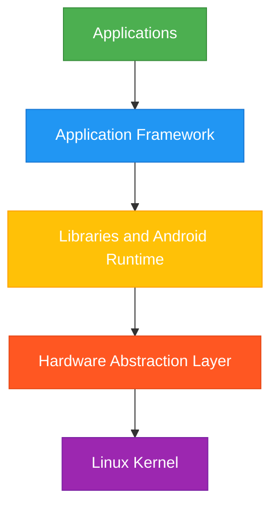
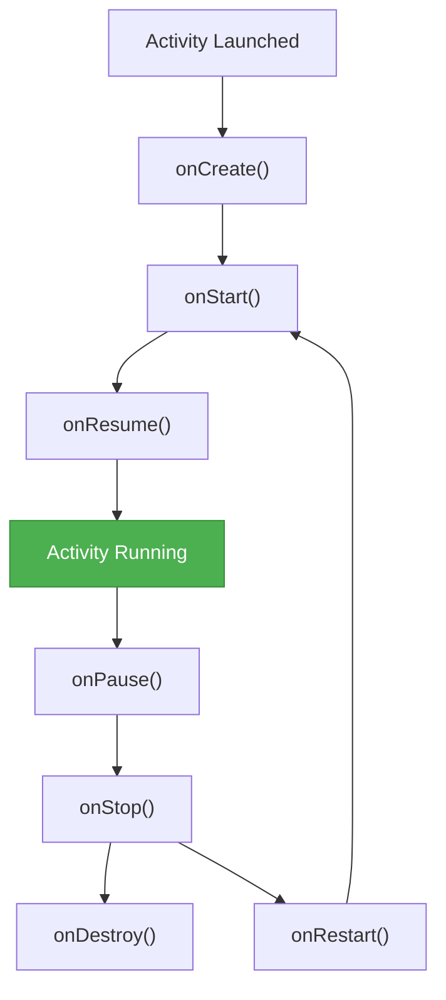

# Android Development Questions

## Introduction

Android development is one of the most in-demand skills in the tech industry today. If you're preparing for a mobile development interview, you'll likely face questions specific to Android's architecture, lifecycle components, and development practices. This guide covers the most common Android development questions you might encounter in interviews, along with clear explanations and code examples to help you understand the underlying concepts.

## Core Android Concepts

### What is Android?

Android is an open-source, Linux-based operating system designed primarily for touchscreen mobile devices such as smartphones and tablets. Developed by Google, it provides a robust platform for developers to create applications using Java, Kotlin, or C++.

Android's architecture consists of the following layers:



### What are the main components of an Android application?

Android applications consist of four main components:

1. **Activities**: Single, focused screens that users interact with
2. **Services**: Background components that perform long-running operations
3. **Broadcast Receivers**: Components that respond to system-wide announcements
4. **Content Providers**: Components that manage shared application data

Each component has a specific role in the overall functionality of an Android application.

## Activity Lifecycle Questions

### Explain the Android Activity Lifecycle

The Activity Lifecycle defines how an Activity transitions through different states during its existence.



Here's a simple implementation demonstrating lifecycle method overrides:

```java
public class MainActivity extends AppCompatActivity {
    private static final String TAG = "MainActivity";
    
    @Override
    protected void onCreate(Bundle savedInstanceState) {
        super.onCreate(savedInstanceState);
        setContentView(R.layout.activity_main);
        Log.d(TAG, "onCreate: Activity is being created");
    }
    
    @Override
    protected void onStart() {
        super.onStart();
        Log.d(TAG, "onStart: Activity is becoming visible");
    }
    
    @Override
    protected void onResume() {
        super.onResume();
        Log.d(TAG, "onResume: Activity is interacting with the user");
    }
    
    @Override
    protected void onPause() {
        super.onPause();
        Log.d(TAG, "onPause: Activity is no longer in foreground");
    }
    
    @Override
    protected void onStop() {
        super.onStop();
        Log.d(TAG, "onStop: Activity is no longer visible");
    }
    
    @Override
    protected void onRestart() {
        super.onRestart();
        Log.d(TAG, "onRestart: Activity is restarting after being stopped");
    }
    
    @Override
    protected void onDestroy() {
        super.onDestroy();
        Log.d(TAG, "onDestroy: Activity is being destroyed");
    }
}
```

When an activity transitions through different states, LogCat would show:

```
D/MainActivity: onCreate: Activity is being created
D/MainActivity: onStart: Activity is becoming visible
D/MainActivity: onResume: Activity is interacting with the user
...
D/MainActivity: onPause: Activity is no longer in foreground
D/MainActivity: onStop: Activity is no longer visible
```

### What happens when the device orientation changes?

By default, when a device orientation changes (e.g., from portrait to landscape), the current activity is destroyed and recreated. This can lead to data loss if not handled properly.

To handle orientation changes, you can:

1. Save state in `onSaveInstanceState()`:

```java
@Override
protected void onSaveInstanceState(Bundle outState) {
    super.onSaveInstanceState(outState);
    outState.putString("userInput", userInputEditText.getText().toString());
}

@Override
protected void onCreate(Bundle savedInstanceState) {
    super.onCreate(savedInstanceState);
    setContentView(R.layout.activity_main);
    
    if (savedInstanceState != null) {
        String userInput = savedInstanceState.getString("userInput");
        userInputEditText.setText(userInput);
    }
}
```

2. Or configure your activity to handle configuration changes in the manifest:

```xml
<activity
    android:name=".MainActivity"
    android:configChanges="orientation|screenSize" />
```

## Fragments and Navigation

### What is a Fragment and how does it differ from an Activity?

A Fragment represents a portion of the user interface in an Activity. Fragments encapsulate components and functionality so that they are easier to reuse within different activities.

Key differences:
- Fragments cannot exist independently; they must be hosted by an activity or another fragment
- Multiple fragments can be combined within a single activity to build multi-pane UIs
- Fragments have their own lifecycle, which is influenced by the host activity's lifecycle

Basic fragment implementation:

```java
public class ExampleFragment extends Fragment {
    
    @Override
    public View onCreateView(LayoutInflater inflater, ViewGroup container,
                             Bundle savedInstanceState) {
        // Inflate the layout for this fragment
        return inflater.inflate(R.layout.fragment_example, container, false);
    }
    
    @Override
    public void onViewCreated(View view, Bundle savedInstanceState) {
        super.onViewCreated(view, savedInstanceState);
        // Setup UI components here
        Button button = view.findViewById(R.id.button);
        button.setOnClickListener(v -> {
            Toast.makeText(getContext(), "Button clicked!", Toast.LENGTH_SHORT).show();
        });
    }
}
```

Adding the fragment to an activity using the FragmentManager:

```java
// Inside an Activity
FragmentManager fragmentManager = getSupportFragmentManager();
FragmentTransaction fragmentTransaction = fragmentManager.beginTransaction();

ExampleFragment fragment = new ExampleFragment();
fragmentTransaction.add(R.id.fragment_container, fragment);
fragmentTransaction.commit();
```

### How do you implement navigation between fragments using the Navigation Component?

The Navigation Component is part of Android Jetpack and simplifies implementing navigation, passing data between destinations, and handling deep links.

Setup steps:

1. Add dependencies to your module's build.gradle:

```gradle
dependencies {
    implementation "androidx.navigation:navigation-fragment:2.5.3"
    implementation "androidx.navigation:navigation-ui:2.5.3"
}
```

2. Create a navigation graph (res/navigation/nav_graph.xml):

```xml
<?xml version="1.0" encoding="utf-8"?>
<navigation xmlns:android="http://schemas.android.com/apk/res/android"
    xmlns:app="http://schemas.android.com/apk/res-auto"
    xmlns:tools="http://schemas.android.com/tools"
    android:id="@+id/nav_graph"
    app:startDestination="@id/homeFragment">

    <fragment
        android:id="@+id/homeFragment"
        android:name="com.example.app.HomeFragment"
        android:label="Home"
        tools:layout="@layout/fragment_home">
        <action
            android:id="@+id/action_homeFragment_to_detailFragment"
            app:destination="@id/detailFragment" />
    </fragment>

    <fragment
        android:id="@+id/detailFragment"
        android:name="com.example.app.DetailFragment"
        android:label="Detail"
        tools:layout="@layout/fragment_detail">
        <argument
            android:name="itemId"
            app:argType="integer" />
    </fragment>
</navigation>
```

3. Add NavHostFragment to your activity layout:

```xml
<?xml version="1.0" encoding="utf-8"?>
<androidx.constraintlayout.widget.ConstraintLayout
    xmlns:android="http://schemas.android.com/apk/res/android"
    xmlns:app="http://schemas.android.com/apk/res-auto"
    android:layout_width="match_parent"
    android:layout_height="match_parent">

    <androidx.fragment.app.FragmentContainerView
        android:id="@+id/nav_host_fragment"
        android:name="androidx.navigation.fragment.NavHostFragment"
        android:layout_width="0dp"
        android:layout_height="0dp"
        app:defaultNavHost="true"
        app:layout_constraintBottom_toBottomOf="parent"
        app:layout_constraintLeft_toLeftOf="parent"
        app:layout_constraintRight_toRightOf="parent"
        app:layout_constraintTop_toTopOf="parent"
        app:navGraph="@navigation/nav_graph" />

</androidx.constraintlayout.widget.ConstraintLayout>
```

4. Navigate from one fragment to another:

```kotlin
// In Kotlin
val action = HomeFragmentDirections.actionHomeFragmentToDetailFragment(itemId = 1)
findNavController().navigate(action)

// In Java
HomeFragmentDirections.ActionHomeFragmentToDetailFragment action = 
    HomeFragmentDirections.actionHomeFragmentToDetailFragment(1);
NavHostFragment.findNavController(this).navigate(action);
```

## Android Architecture Components

### What is the ViewModel and how does it help with configuration changes?

ViewModel is an Architecture Component that stores and manages UI-related data in a lifecycle-conscious way. ViewModels survive configuration changes like screen rotations, making them ideal for preserving data across lifecycle events.

Implementation example:

```java
// ViewModel class
public class UserViewModel extends ViewModel {
    private MutableLiveData<String> userName = new MutableLiveData<>();
    
    public LiveData<String> getUserName() {
        return userName;
    }
    
    public void setUserName(String name) {
        userName.setValue(name);
    }
    
    @Override
    protected void onCleared() {
        super.onCleared();
        // Clean up resources here
    }
}

// In Activity or Fragment
public class ProfileActivity extends AppCompatActivity {
    private UserViewModel viewModel;
    private TextView userNameTextView;
    private EditText userNameEditText;
    
    @Override
    protected void onCreate(Bundle savedInstanceState) {
        super.onCreate(savedInstanceState);
        setContentView(R.layout.activity_profile);
        
        userNameTextView = findViewById(R.id.user_name_text);
        userNameEditText = findViewById(R.id.user_name_edit);
        
        // Initialize ViewModel
        viewModel = new ViewModelProvider(this).get(UserViewModel.class);
        
        // Observe changes to the data
        viewModel.getUserName().observe(this, userName -> {
            userNameTextView.setText(userName);
        });
        
        // Setup save button
        findViewById(R.id.save_button).setOnClickListener(v -> {
            String name = userNameEditText.getText().toString();
            viewModel.setUserName(name);
        });
    }
}
```

Benefits:
- Data survives configuration changes
- Helps separate UI from business logic
- Makes testing easier by decoupling components

### Explain LiveData and how it's used in Android development

LiveData is an observable data holder class that is lifecycle-aware. It automatically manages subscriptions to data changes based on the lifecycle state of components like activities and fragments.

```java
public class CounterViewModel extends ViewModel {
    // MutableLiveData can be modified
    private MutableLiveData<Integer> counter = new MutableLiveData<>(0);
    
    // Public accessor exposes only the immutable LiveData
    public LiveData<Integer> getCounter() {
        return counter;
    }
    
    public void increment() {
        Integer currentValue = counter.getValue();
        counter.setValue(currentValue != null ? currentValue + 1 : 1);
    }
}

// In Activity
CounterViewModel viewModel = new ViewModelProvider(this).get(CounterViewModel.class);

// Observe changes to the counter
viewModel.getCounter().observe(this, newCount -> {
    counterTextView.setText(String.valueOf(newCount));
});

// Increment button
incrementButton.setOnClickListener(v -> {
    viewModel.increment();
});
```

Key benefits of LiveData:
- No memory leaks: Observers are bound to lifecycle objects and cleaned up when their lifecycle is destroyed
- No crashes due to stopped activities: If the observer's lifecycle is inactive, it doesn't receive LiveData events
- Always up to date data: If a lifecycle becomes inactive and then active again, it receives the latest data
- Proper configuration changes: If an activity is recreated due to a configuration change, it immediately receives the latest available data

## Android UI and Design

### What is ConstraintLayout and what advantages does it offer?

ConstraintLayout is a layout manager that allows you to create complex layouts without deeply nested view hierarchies. It positions views based on constraints relative to other views, the parent layout, or invisible guidelines.

Example implementation:

```xml
<androidx.constraintlayout.widget.ConstraintLayout 
    xmlns:android="http://schemas.android.com/apk/res/android"
    xmlns:app="http://schemas.android.com/apk/res-auto"
    android:layout_width="match_parent"
    android:layout_height="match_parent">

    <Button
        android:id="@+id/button"
        android:layout_width="wrap_content"
        android:layout_height="wrap_content"
        android:text="Center Button"
        app:layout_constraintBottom_toBottomOf="parent"
        app:layout_constraintEnd_toEndOf="parent"
        app:layout_constraintStart_toStartOf="parent"
        app:layout_constraintTop_toTopOf="parent" />

    <TextView
        android:id="@+id/textView"
        android:layout_width="0dp"
        android:layout_height="wrap_content"
        android:layout_marginTop="16dp"
        android:text="This text is below the button"
        android:textAlignment="center"
        app:layout_constraintEnd_toEndOf="parent"
        app:layout_constraintStart_toStartOf="parent"
        app:layout_constraintTop_toBottomOf="@+id/button" />

</androidx.constraintlayout.widget.ConstraintLayout>
```

Benefits:
- Flat view hierarchy improves performance
- Responsive design with relative positioning
- Advanced features like chains, guidelines, and barriers
- Compatible with Android Studio's visual layout editor
- Better performance than nested LinearLayouts or RelativeLayout

### How do you implement RecyclerView to display a list of items?

RecyclerView is a flexible view for providing a limited window into a large data set. It efficiently displays large data sets by recycling the view holders that go off-screen.

Implementation steps:

1. Add the dependency:

```gradle
implementation "androidx.recyclerview:recyclerview:1.2.1"
```

2. Add RecyclerView to your layout:

```xml
<androidx.recyclerview.widget.RecyclerView
    android:id="@+id/recycler_view"
    android:layout_width="match_parent"
    android:layout_height="match_parent" />
```

3. Create a layout for list items:

```xml
<!-- item_contact.xml -->
<androidx.constraintlayout.widget.ConstraintLayout
    xmlns:android="http://schemas.android.com/apk/res/android"
    xmlns:app="http://schemas.android.com/apk/res-auto"
    android:layout_width="match_parent"
    android:layout_height="wrap_content"
    android:padding="16dp">

    <TextView
        android:id="@+id/nameTextView"
        android:layout_width="0dp"
        android:layout_height="wrap_content"
        android:textSize="18sp"
        android:textStyle="bold"
        app:layout_constraintEnd_toEndOf="parent"
        app:layout_constraintStart_toStartOf="parent"
        app:layout_constraintTop_toTopOf="parent" />

    <TextView
        android:id="@+id/phoneTextView"
        android:layout_width="0dp"
        android:layout_height="wrap_content"
        android:layout_marginTop="4dp"
        app:layout_constraintEnd_toEndOf="parent"
        app:layout_constraintStart_toStartOf="parent"
        app:layout_constraintTop_toBottomOf="@+id/nameTextView" />

</androidx.constraintlayout.widget.ConstraintLayout>
```

4. Create a data model class:

```java
public class Contact {
    private String name;
    private String phoneNumber;
    
    public Contact(String name, String phoneNumber) {
        this.name = name;
        this.phoneNumber = phoneNumber;
    }
    
    public String getName() {
        return name;
    }
    
    public String getPhoneNumber() {
        return phoneNumber;
    }
}
```

5. Create a RecyclerView adapter:

```java
public class ContactAdapter extends RecyclerView.Adapter<ContactAdapter.ContactViewHolder> {
    private List<Contact> contacts;
    private OnContactClickListener listener;
    
    public interface OnContactClickListener {
        void onContactClick(Contact contact);
    }
    
    public ContactAdapter(List<Contact> contacts, OnContactClickListener listener) {
        this.contacts = contacts;
        this.listener = listener;
    }
    
    @NonNull
    @Override
    public ContactViewHolder onCreateViewHolder(@NonNull ViewGroup parent, int viewType) {
        View itemView = LayoutInflater.from(parent.getContext())
                .inflate(R.layout.item_contact, parent, false);
        return new ContactViewHolder(itemView);
    }
    
    @Override
    public void onBindViewHolder(@NonNull ContactViewHolder holder, int position) {
        Contact contact = contacts.get(position);
        holder.nameTextView.setText(contact.getName());
        holder.phoneTextView.setText(contact.getPhoneNumber());
        
        holder.itemView.setOnClickListener(v -> {
            if (listener != null) {
                listener.onContactClick(contact);
            }
        });
    }
    
    @Override
    public int getItemCount() {
        return contacts.size();
    }
    
    static class ContactViewHolder extends RecyclerView.ViewHolder {
        TextView nameTextView;
        TextView phoneTextView;
        
        ContactViewHolder(View itemView) {
            super(itemView);
            nameTextView = itemView.findViewById(R.id.nameTextView);
            phoneTextView = itemView.findViewById(R.id.phoneTextView);
        }
    }
}
```

6. Set up the RecyclerView in your Activity or Fragment:

```java
public class ContactsActivity extends AppCompatActivity implements ContactAdapter.OnContactClickListener {
    private RecyclerView recyclerView;
    private ContactAdapter adapter;
    private List<Contact> contactList;
    
    @Override
    protected void onCreate(Bundle savedInstanceState) {
        super.onCreate(savedInstanceState);
        setContentView(R.layout.activity_contacts);
        
        recyclerView = findViewById(R.id.recycler_view);
        recyclerView.setLayoutManager(new LinearLayoutManager(this));
        
        // Initialize data
        contactList = new ArrayList<>();
        contactList.add(new Contact("John Doe", "555-1234"));
        contactList.add(new Contact("Jane Smith", "555-5678"));
        contactList.add(new Contact("Bob Johnson", "555-9012"));
        
        // Set up adapter
        adapter = new ContactAdapter(contactList, this);
        recyclerView.setAdapter(adapter);
    }
    
    @Override
    public void onContactClick(Contact contact) {
        Toast.makeText(this, "Clicked on " + contact.getName(), Toast.LENGTH_SHORT).show();
        // Handle item click, e.g., open details screen
    }
}
```

## Data Storage and Persistence

### What are the different ways to store data in Android?

Android offers several options for data storage, each with its own use cases:

1. **Shared Preferences**: Store simple key-value pairs
   ```java
   // Writing data
   SharedPreferences sharedPreferences = getSharedPreferences("app_prefs", MODE_PRIVATE);
   SharedPreferences.Editor editor = sharedPreferences.edit();
   editor.putString("username", "john_doe");
   editor.putBoolean("isLoggedIn", true);
   editor.apply();
   
   // Reading data
   String username = sharedPreferences.getString("username", "");
   boolean isLoggedIn = sharedPreferences.getBoolean("isLoggedIn", false);
   ```

2. **Internal Storage**: Store private files in device's file system
   ```java
   // Writing to a file
   try {
       FileOutputStream fos = openFileOutput("data.txt", Context.MODE_PRIVATE);
       fos.write("Hello, world!".getBytes());
       fos.close();
   } catch (IOException e) {
       e.printStackTrace();
   }
   
   // Reading from a file
   try {
       FileInputStream fis = openFileInput("data.txt");
       byte[] buffer = new byte[1024];
       int length = fis.read(buffer);
       String content = new String(buffer, 0, length);
       fis.close();
   } catch (IOException e) {
       e.printStackTrace();
   }
   ```

3. **External Storage**: Store public files accessible by other apps
   ```java
   // Check if external storage is available
   if (Environment.getExternalStorageState().equals(Environment.MEDIA_MOUNTED)) {
       // Get directory
       File externalDir = getExternalFilesDir(Environment.DIRECTORY_DOCUMENTS);
       File file = new File(externalDir, "external_data.txt");
       
       // Writing data
       try {
           FileOutputStream fos = new FileOutputStream(file);
           fos.write("External storage data".getBytes());
           fos.close();
       } catch (IOException e) {
           e.printStackTrace();
       }
   }
   ```

4. **SQLite Database**: Store structured data in a lightweight database
   ```java
   // Database contract class
   public final class TaskContract {
       private TaskContract() {}
       
       public static class TaskEntry implements BaseColumns {
           public static final String TABLE_NAME = "tasks";
           public static final String COLUMN_TITLE = "title";
           public static final String COLUMN_DESCRIPTION = "description";
           public static final String COLUMN_COMPLETED = "completed";
       }
   }
   
   // Database helper class
   public class TaskDbHelper extends SQLiteOpenHelper {
       private static final String DATABASE_NAME = "tasks.db";
       private static final int DATABASE_VERSION = 1;
       
       public TaskDbHelper(Context context) {
           super(context, DATABASE_NAME, null, DATABASE_VERSION);
       }
       
       @Override
       public void onCreate(SQLiteDatabase db) {
           String SQL_CREATE_TASKS_TABLE = "CREATE TABLE " + TaskEntry.TABLE_NAME + " ("
                   + TaskEntry._ID + " INTEGER PRIMARY KEY AUTOINCREMENT, "
                   + TaskEntry.COLUMN_TITLE + " TEXT NOT NULL, "
                   + TaskEntry.COLUMN_DESCRIPTION + " TEXT, "
                   + TaskEntry.COLUMN_COMPLETED + " INTEGER DEFAULT 0)";
           
           db.execSQL(SQL_CREATE_TASKS_TABLE);
       }
       
       @Override
       public void onUpgrade(SQLiteDatabase db, int oldVersion, int newVersion) {
           db.execSQL("DROP TABLE IF EXISTS " + TaskEntry.TABLE_NAME);
           onCreate(db);
       }
   }
   ```

5. **Room Persistence Library**: A higher-level abstraction over SQLite
   ```java
   // Entity
   @Entity(tableName = "tasks")
   public class Task {
       @PrimaryKey(autoGenerate = true)
       public int id;
       
       @ColumnInfo(name = "title")
       public String title;
       
       @ColumnInfo(name = "description")
       public String description;
       
       @ColumnInfo(name = "completed")
       public boolean completed;
   }
   
   // DAO (Data Access Object)
   @Dao
   public interface TaskDao {
       @Query("SELECT * FROM tasks")
       List<Task> getAll();
       
       @Query("SELECT * FROM tasks WHERE id = :taskId")
       Task getById(int taskId);
       
       @Insert
       void insert(Task task);
       
       @Update
       void update(Task task);
       
       @Delete
       void delete(Task task);
   }
   
   // Database
   @Database(entities = {Task.class}, version = 1)
   public abstract class AppDatabase extends RoomDatabase {
       public abstract TaskDao taskDao();
       
       private static volatile AppDatabase INSTANCE;
       
       public static AppDatabase getDatabase(final Context context) {
           if (INSTANCE == null) {
               synchronized (AppDatabase.class) {
                   if (INSTANCE == null) {
                       INSTANCE = Room.databaseBuilder(
                           context.getApplicationContext(),
                           AppDatabase.class, 
                           "app_database"
                       ).build();
                   }
               }
           }
           return INSTANCE;
       }
   }
   ```

### How do you implement Room database in Android?

Room provides an abstraction layer over SQLite to allow fluent database access while harnessing the full power of SQLite.

Implementation steps:

1. Add dependencies to your module's build.gradle:

```gradle
dependencies {
    def room_version = "2.4.3"
    
    implementation "androidx.room:room-runtime:$room_version"
    annotationProcessor "androidx.room:room-compiler:$room_version"
    
    // Optional - Kotlin Extensions and Coroutines support for Room
    implementation "androidx.room:room-ktx:$room_version"
}
```

2. Define an Entity:

```java
@Entity(tableName = "users")
public class User {
    @PrimaryKey(autoGenerate = true)
    private int id;
    
    @ColumnInfo(name = "first_name")
    private String firstName;
    
    @ColumnInfo(name = "last_name")
    private String lastName;
    
    @ColumnInfo(name = "email")
    private String email;
    
    // Getters and setters
    public int getId() { return id; }
    public void setId(int id) { this.id = id; }
    
    public String getFirstName() { return firstName; }
    public void setFirstName(String firstName) { this.firstName = firstName; }
    
    public String getLastName() { return lastName; }
    public void setLastName(String lastName) { this.lastName = lastName; }
    
    public String getEmail() { return email; }
    public void setEmail(String email) { this.email = email; }
}
```

3. Create a DAO (Data Access Object):

```java
@Dao
public interface UserDao {
    @Query("SELECT * FROM users")
    List<User> getAllUsers();
    
    @Query("SELECT * FROM users WHERE id = :userId")
    User getUserById(int userId);
    
    @Insert
    void insert(User user);
    
    @Update
    void update(User user);
    
    @Delete
    void delete(User user);
}
```

4. Create the Database class:

```java
@Database(entities = {User.class}, version = 1)
public abstract class AppDatabase extends RoomDatabase {
    public abstract UserDao userDao();
    
    private static volatile AppDatabase INSTANCE;
    
    public static AppDatabase getInstance(Context context) {
        if (INSTANCE == null) {
            synchronized (AppDatabase.class) {
                if (INSTANCE == null) {
                    INSTANCE = Room.databaseBuilder(
                            context.getApplicationContext(),
                            AppDatabase.class, 
                            "app_database")
                            .build();
                }
            }
        }
        return INSTANCE;
    }
}
```

5. Use the Room database in your application:

```java
// Create a new user
User user = new User();
user.setFirstName("John");
user.setLastName("Doe");
user.setEmail("john.doe@example.com");

// Execute database operations on a background thread
new Thread(() -> {
    // Get database instance and insert the user
    AppDatabase db = AppDatabase.getInstance(getApplicationContext());
    db.userDao().insert(user);
    
    // Retrieve all users
    List<User> users = db.userDao().getAllUsers();
    
    // Update UI on the main thread
    runOnUiThread(() -> {
        // Update UI with the retrieved data
        updateUserList(users);
    });
}).start();
```

For a more modern approach, you can use a Repository pattern with ViewModel and LiveData:

```java
// Repository class
public class UserRepository {
    private UserDao userDao;
    private LiveData<List<User>> allUsers;
    
    public UserRepository(Application application) {
        AppDatabase db = AppDatabase.getInstance(application);
        userDao = db.userDao();
        allUsers = userDao.getAllUsers();  // Assume DAO method returns LiveData
    }
    
    public LiveData<List<User>> getAllUsers() {
        return allUsers;
    }
    
    public void insert(User user) {
        AppDatabase.databaseWriteExecutor.execute(() -> {
            userDao.insert(user);
        });
    }
}

// ViewModel
public class UserViewModel extends AndroidViewModel {
    private UserRepository repository;
    private final LiveData<List<User>> allUsers;
    
    public UserViewModel(Application application) {
        super(application);
        repository = new UserRepository(application);
        allUsers = repository.getAllUsers();
    }
    
    public LiveData<List<User>> getAllUsers() {
        return allUsers;
    }
    
    public void insert(User user) {
        repository.insert(user);
    }
}
```

## Networking in Android

### How do you perform network operations in Android?

Network operations in Android should always be performed off the main thread to avoid blocking the UI. Here are different approaches:

1. Using Retrofit (recommended):

```gradle
// Add dependencies
implementation 'com.squareup.retrofit2:retrofit:2.9.0'
implementation 'com.squareup.retrofit2:converter-gson:2.9.0'
```

```java
// Define API endpoints
public interface ApiService {
    @GET("users")
    Call<List<User>> getUsers();
    
    @GET("users/{id}")
    Call<User> getUserById(@Path("id") int userId);
    
    @POST("users")
    Call<User> createUser(@Body User user);
}

// Create Retrofit instance
Retrofit retrofit = new Retrofit.Builder()
    .baseUrl("https://api.example.com/")
    .addConverterFactory(GsonConverterFactory.create())
    .build();

// Create API service
ApiService apiService = retrofit.create(ApiService.class);

// Make a network request
Call<List<User>> call = apiService.getUsers();
call.enqueue(new Callback<List<User>>() {
    @Override
    public void onResponse(Call<List<User>> call, Response<List<User>> response) {
        if (response.isSuccessful()) {
            List<User> users = response.body();
            // Update UI with retrieved data
        } else {
            // Handle error
        }
    }
    
    @Override
    public void onFailure(Call<List<User