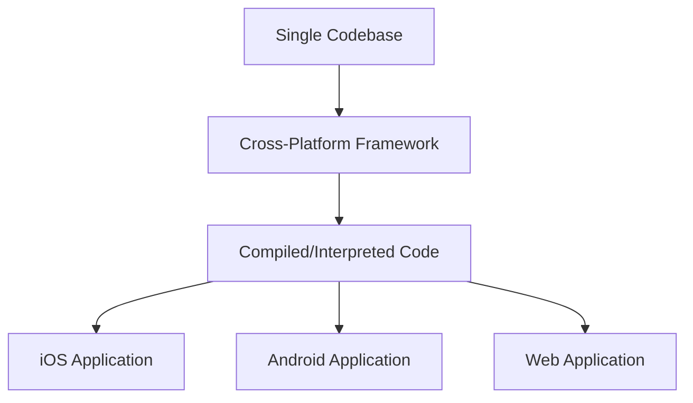

# Cross-Platform Frameworks

## Introduction

Cross-platform frameworks allow developers to build mobile applications that run on multiple operating systems (primarily iOS and Android) using a single codebase. Instead of writing separate native applications for each platform, developers can write code once and deploy it across different platforms, saving time and resources.

In mobile development interviews, understanding cross-platform frameworks is essential as many companies seek developers who can build efficient applications that work seamlessly across multiple platforms.

## What are Cross-Platform Frameworks?

Cross-platform frameworks provide tools, libraries, and APIs that abstract away platform-specific details, allowing developers to build applications that run on multiple operating systems using a shared codebase.

<br />



## Advantages of Cross-Platform Frameworks

### 1. Code Reusability

Write once, run anywhere. Developers can reuse a significant portion of their codebase across platforms.

```javascript
// Example of reusable code in React Native
function ProfileScreen() {
  return (
    <View style={styles.container}>
      <Text style={styles.title}>User Profile</Text>
      <TextInput 
        style={styles.input} 
        placeholder="Enter username"
      />
      <Button title="Update Profile" />
    </View>
  );
}

// This same component works on both iOS and Android
```

### 2. Faster Development

With a single codebase, development time can be significantly reduced compared to building separate native applications.

### 3. Cost-Effective

Requires fewer resources in terms of development and maintenance, making it a cost-effective solution for businesses.

### 4. Consistent UI/UX

Provides a more consistent user experience across different platforms.

### 5. Easier Maintenance

Bug fixes and updates need to be implemented only once, simplifying the maintenance process.

## Disadvantages of Cross-Platform Frameworks

### 1. Performance Limitations

Cross-platform applications may not perform as well as native applications, especially for graphics-intensive applications.

### 2. Limited Access to Native Features

May have limitations when accessing platform-specific features, although this gap is continuously narrowing.

### 3. Larger App Size

Cross-platform apps often have larger file sizes compared to native apps due to the included frameworks.

### 4. Platform-Specific Issues

Some features may behave differently across platforms, requiring platform-specific code.

```javascript
// Example of platform-specific code in React Native
import { Platform } from 'react-native';

const styles = {
  container: {
    padding: Platform.OS === 'ios' ? 20 : 16,
    marginTop: Platform.OS === 'ios' ? 30 : 20,
  }
};
```

## Popular Cross-Platform Frameworks

### 1. React Native

Developed by Facebook, React Native uses JavaScript and React to build mobile applications. It translates your markup to native UI components.

#### Key Features:
- Uses JSX syntax
- Hot reloading for quick development
- Large community support
- Used by Instagram, Facebook, Airbnb

#### Example:

```jsx
import React from 'react';
import { View, Text, StyleSheet, Button } from 'react-native';

const CounterApp = () => {
  const [count, setCount] = React.useState(0);

  return (
    <View style={styles.container}>
      <Text style={styles.count}>Count: {count}</Text>
      <Button 
        title="Increment" 
        onPress={() => setCount(count + 1)} 
      />
      <Button 
        title="Decrement" 
        onPress={() => setCount(count - 1)} 
      />
    </View>
  );
};

const styles = StyleSheet.create({
  container: {
    flex: 1,
    justifyContent: 'center',
    alignItems: 'center',
  },
  count: {
    fontSize: 24,
    marginBottom: 20,
  }
});

export default CounterApp;
```

### 2. Flutter

Developed by Google, Flutter uses Dart programming language and provides its own widgets for building UI.

#### Key Features:
- Rich set of pre-designed widgets
- Fast performance with the Skia rendering engine
- Hot reload for quick development
- Used by Google Ads, Alibaba, BMW

#### Example:

```dart
import 'package:flutter/material.dart';

void main() {
  runApp(MyApp());
}

class MyApp extends StatelessWidget {
  @override
  Widget build(BuildContext context) {
    return MaterialApp(
      home: CounterApp(),
    );
  }
}

class CounterApp extends StatefulWidget {
  @override
  _CounterAppState createState() => _CounterAppState();
}

class _CounterAppState extends State<CounterApp> {
  int _count = 0;

  @override
  Widget build(BuildContext context) {
    return Scaffold(
      appBar: AppBar(title: Text('Flutter Counter')),
      body: Center(
        child: Column(
          mainAxisAlignment: MainAxisAlignment.center,
          children: <Widget>[
            Text('Count: $_count', style: TextStyle(fontSize: 24)),
            SizedBox(height: 20),
            Row(
              mainAxisAlignment: MainAxisAlignment.center,
              children: [
                ElevatedButton(
                  onPressed: () {
                    setState(() {
                      _count++;
                    });
                  },
                  child: Text('Increment'),
                ),
                SizedBox(width: 10),
                ElevatedButton(
                  onPressed: () {
                    setState(() {
                      _count--;
                    });
                  },
                  child: Text('Decrement'),
                ),
              ],
            ),
          ],
        ),
      ),
    );
  }
}
```

### 3. Xamarin

Developed by Microsoft, Xamarin uses C# and .NET to build cross-platform applications.

#### Key Features:
- Shares C# codebase
- Native performance
- Direct access to native APIs
- Strong integration with Visual Studio

#### Example:

```csharp
using Xamarin.Forms;

namespace CounterApp
{
    public class App : Application
    {
        public App()
        {
            MainPage = new CounterPage();
        }
    }

    public class CounterPage : ContentPage
    {
        int count = 0;
        Label countLabel;

        public CounterPage()
        {
            countLabel = new Label
            {
                Text = "Count: 0",
                FontSize = 24,
                HorizontalOptions = LayoutOptions.Center
            };

            var incrementButton = new Button
            {
                Text = "Increment",
                Command = new Command(() => {
                    count++;
                    countLabel.Text = $"Count: {count}";
                })
            };

            var decrementButton = new Button
            {
                Text = "Decrement",
                Command = new Command(() => {
                    count--;
                    countLabel.Text = $"Count: {count}";
                })
            };

            Content = new StackLayout
            {
                VerticalOptions = LayoutOptions.Center,
                Children = {
                    countLabel,
                    incrementButton,
                    decrementButton
                }
            };
        }
    }
}
```

### 4. Ionic

Ionic uses web technologies (HTML, CSS, JavaScript) with frameworks like Angular, React, or Vue to build cross-platform applications.

#### Key Features:
- Built with web technologies
- Large library of UI components
- Integrates with Angular, React, or Vue
- Capacitor/Cordova plugins for native functionality

#### Example:

```jsx
// Ionic with React example
import React, { useState } from 'react';
import { 
  IonContent, 
  IonHeader, 
  IonPage, 
  IonTitle, 
  IonToolbar,
  IonButton,
  IonText
} from '@ionic/react';

const CounterApp: React.FC = () => {
  const [count, setCount] = useState(0);

  return (
    <IonPage>
      <IonHeader>
        <IonToolbar>
          <IonTitle>Ionic Counter</IonTitle>
        </IonToolbar>
      </IonHeader>
      <IonContent className="ion-padding">
        <div className="ion-text-center">
          <IonText>
            <h2>Count: {count}</h2>
          </IonText>
          <IonButton onClick={() => setCount(count + 1)}>
            Increment
          </IonButton>
          <IonButton onClick={() => setCount(count - 1)}>
            Decrement
          </IonButton>
        </div>
      </IonContent>
    </IonPage>
  );
};

export default CounterApp;
```

## Comparison of Popular Frameworks

| Framework    | Language    | Performance | Learning Curve    | Community Support | UI Components     |
|--------------|-------------|-------------|-------------------|-------------------|-------------------|
| React Native | JavaScript  | Good        | Moderate          | Excellent         | Native components |
| Flutter      | Dart        | Excellent   | Moderate to Steep | Growing rapidly   | Custom widgets    |
| Xamarin      | C#          | Very good   | Moderate          | Good              | Native components |
| Ionic        | HTML/CSS/JS | Moderate    | Easy              | Good              | Web components    |

## Interview Questions on Cross-Platform Frameworks

### 1. What are the main advantages of using cross-platform frameworks?

**Answer:** The main advantages include code reusability, faster development time, cost-effectiveness, consistent UI/UX across platforms, and easier maintenance.

### 2. When would you choose native development over cross-platform?

**Answer:** Native development would be preferred for:
- Performance-critical applications (games, AR/VR apps)
- Applications requiring deep integration with platform-specific features
- Applications where UI/UX needs to strictly follow platform guidelines
- Cases where the app size needs to be minimal

### 3. Compare React Native and Flutter.

**Answer:** 
- **Language:** React Native uses JavaScript, while Flutter uses Dart
- **UI Components:** React Native uses native components, while Flutter has its own widget system
- **Performance:** Flutter often performs better due to its compilation to native code
- **Development Experience:** Both offer hot reload; React Native has a larger community, while Flutter has more comprehensive documentation
- **Learning Curve:** React Native might be easier for web developers familiar with JavaScript, while Flutter requires learning Dart

### 4. How do cross-platform frameworks achieve code sharing across platforms?

**Answer:** Cross-platform frameworks employ various strategies:
- Abstraction layers that map to native components
- Custom rendering engines (like Flutter's Skia)
- JavaScript bridges that communicate with native modules
- Compilation to native code
- Webviews for rendering (in hybrid approaches like Ionic)

## Real-World Applications

### 1. Instagram

Instagram's mobile app is built with React Native, allowing the team to deliver features faster across both iOS and Android.

### 2. Google Ads

Google rebuilt their Google Ads app using Flutter, achieving better performance and a consistent UI across platforms.

### 3. UPS

UPS uses Xamarin for their mobile application, allowing them to maintain a single codebase while providing a native experience.

### 4. Market.com

The Market.com trading app is built with Ionic, providing a consistent trading platform across mobile and web.

## Making the Right Choice

When selecting a cross-platform framework for your project, consider:

1. **Team Expertise:** Choose a framework aligned with your team's existing skills
2. **App Requirements:** Consider performance needs, UI complexity, and required native features
3. **Long-term Maintenance:** Evaluate community support and framework maturity
4. **Time to Market:** Some frameworks offer faster development cycles
5. **Budget Constraints:** Consider development and maintenance costs

## Summary

Cross-platform frameworks provide an efficient way to build mobile applications that run on multiple platforms using a single codebase. They offer advantages like code reusability, faster development, and cost-effectiveness, but may have limitations in terms of performance and access to native features.

Popular frameworks include React Native, Flutter, Xamarin, and Ionic, each with its own strengths and weaknesses. The choice of framework depends on project requirements, team expertise, and business constraints.

In mobile development interviews, understanding the capabilities, limitations, and appropriate use cases for cross-platform frameworks is crucial, as many companies seek to optimize their development resources while maintaining high-quality applications.

## Practice Exercises

1. Create a simple counter application in React Native and Flutter. Compare the development experience and performance.

2. Build a to-do list application that stores data locally using a cross-platform framework of your choice.

3. Research and document how a popular app (like Instagram or Uber) uses cross-platform technology to deliver its mobile experience.

4. Create a prototype that demonstrates accessing a platform-specific feature (like camera or geolocation) using a cross-platform framework.

## Additional Resources

- Official documentation for [React Native](https://reactnative.dev/), [Flutter](https://flutter.dev/), [Xamarin](https://dotnet.microsoft.com/apps/xamarin), and [Ionic](https://ionicframework.com/)
- Online courses on platforms like Udemy, Coursera, and Pluralsight
- GitHub repositories with example projects for each framework
- Community forums and Stack Overflow tags for specific cross-platform frameworks