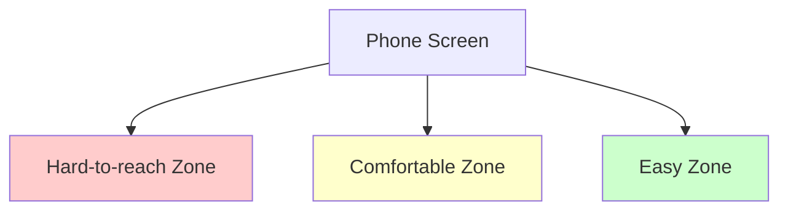
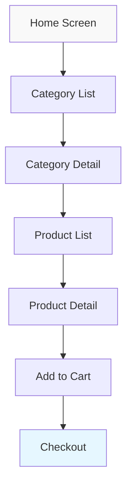

# Mobile UI/UX Principles

## Introduction

Mobile UI/UX (User Interface and User Experience) design is a critical aspect of successful mobile application development. While UI focuses on the visual elements users interact with, UX encompasses the entire journey and feeling users experience when using your app. Together, they determine whether users will enjoy, continue using, and recommend your application.

In this guide, we'll explore fundamental principles that can help you create intuitive, engaging, and user-friendly mobile experiences. Understanding these principles is essential not only for designers but also for developers who want to create apps that users love.

## Core Mobile UI/UX Principles

### 1. Touch-First Design

Mobile interfaces are primarily navigated through touch gestures rather than mouse clicks. This fundamental difference requires specific design considerations.

#### Key Guidelines:

- **Target Size**: Make touch targets (buttons, links, form elements) large enough to be easily tapped. Apple recommends at least 44×44 points, while Google suggests 48×48 dp.

```jsx
// Example in React Native - Creating a properly sized button
const TouchableButton = () => (
  <TouchableOpacity
    style={{
      height: 48, // Proper touch target height
      width: '100%',
      backgroundColor: '#007AFF',
      borderRadius: 8,
      justifyContent: 'center',
      alignItems: 'center',
    }}
    onPress={() => handlePress()}
  >
    <Text style={{ color: 'white', fontSize: 16 }}>Submit</Text>
  </TouchableOpacity>
);
```

- **Touch Zones**: Consider thumb reach on mobile devices. Important actions should be within easy reach, typically at the bottom of the screen.



- **Gestures**: Leverage intuitive gestures like swipe, pinch, and tap, but ensure they are discoverable or provide visual cues.

### 2. Simplicity and Minimalism

Mobile screens have limited real estate, making simplicity and focus essential for good UX.

#### Key Guidelines:

- **Content Prioritization**: Display only essential information and actions, hiding less important items in menus or subsequent screens.

- **Progressive Disclosure**: Reveal information gradually as users need it rather than overwhelming them upfront.

- **Visual Hierarchy**: Use size, color, contrast, and spacing to guide users' attention to the most important elements first.

```jsx
// Example of visual hierarchy with React Native
const CardWithHierarchy = () => (
  <View style={styles.card}>
    <Text style={styles.heading}>Primary Information</Text>
    <Text style={styles.subheading}>Supporting details</Text>
    <Text style={styles.body}>Additional context and information that's less important but still relevant to the user.</Text>
    <TouchableOpacity style={styles.button}>
      <Text style={styles.buttonText}>Primary Action</Text>
    </TouchableOpacity>
  </View>
);

const styles = StyleSheet.create({
  card: {
    padding: 16,
    backgroundColor: 'white',
    borderRadius: 8,
    shadowColor: '#000',
    shadowOpacity: 0.1,
    shadowRadius: 4,
    shadowOffset: { width: 0, height: 2 },
    elevation: 2,
  },
  heading: {
    fontSize: 20,
    fontWeight: 'bold',
    marginBottom: 8,
  },
  subheading: {
    fontSize: 16,
    color: '#666',
    marginBottom: 12,
  },
  body: {
    fontSize: 14,
    color: '#444',
    marginBottom: 16,
  },
  button: {
    backgroundColor: '#007AFF',
    paddingVertical: 12,
    borderRadius: 6,
    alignItems: 'center',
  },
  buttonText: {
    color: 'white',
    fontWeight: '600',
  },
});
```

### 3. Consistency

Consistency in design creates familiarity and reduces the cognitive load on users.

#### Key Guidelines:

- **Visual Consistency**: Maintain consistent typography, color schemes, and UI elements throughout your app.

- **Behavioral Consistency**: Similar actions should produce similar results across the app.

- **Platform Consistency**: Follow platform-specific guidelines (iOS Human Interface Guidelines or Android Material Design) to meet user expectations.

```jsx
// Example of a consistent button component
const PrimaryButton = ({ label, onPress }) => (
  <TouchableOpacity
    style={{
      backgroundColor: '#007AFF', // Brand primary color
      paddingVertical: 12,
      paddingHorizontal: 24,
      borderRadius: 8,
      alignItems: 'center',
    }}
    onPress={onPress}
  >
    <Text style={{ color: 'white', fontWeight: '600' }}>{label}</Text>
  </TouchableOpacity>
);

// Usage throughout the app
<PrimaryButton label="Sign In" onPress={handleSignIn} />
<PrimaryButton label="Submit" onPress={handleSubmit} />
<PrimaryButton label="Continue" onPress={handleContinue} />
```

### 4. Feedback and Response Time

Providing immediate feedback for user actions is crucial for a good mobile experience.

#### Key Guidelines:

- **Visual Feedback**: Show that the system has recognized the user's input through visual changes (color shift, animation, etc.).

- **Loading States**: Display progress indicators for operations that take more than a fraction of a second.

- **Confirmation**: Acknowledge successful actions with appropriate feedback.

```jsx
// Example of a button with loading state
const ActionButton = () => {
  const [isLoading, setIsLoading] = useState(false);
  
  const handlePress = async () => {
    setIsLoading(true);
    try {
      await performAction();
      // Show success feedback
    } catch (error) {
      // Show error feedback
    } finally {
      setIsLoading(false);
    }
  };
  
  return (
    <TouchableOpacity 
      style={styles.button} 
      onPress={handlePress}
      disabled={isLoading}
    >
      {isLoading ? (
        <ActivityIndicator color="white" size="small" />
      ) : (
        <Text style={styles.buttonText}>Submit</Text>
      )}
    </TouchableOpacity>
  );
};
```

### 5. Readability and Legibility

Text on mobile devices must be easily readable in various lighting conditions and without strain.

#### Key Guidelines:

- **Font Size**: Use a minimum font size of 16px for body text.

- **Contrast**: Ensure sufficient contrast between text and background (WCAG recommends a ratio of at least 4.5:1 for normal text).

- **Line Length**: Keep text lines short enough to read comfortably on small screens (30-40 characters per line).

```jsx
// Example of readable text styles
const TextStyles = StyleSheet.create({
  heading: {
    fontSize: 24,
    fontWeight: 'bold',
    color: '#222222',
    marginBottom: 16,
  },
  body: {
    fontSize: 16, // Minimum readable size
    lineHeight: 24, // 1.5x line height for better readability
    color: '#333333', // Dark enough for good contrast on white
    marginBottom: 12,
  },
  caption: {
    fontSize: 14,
    color: '#666666',
  },
});
```

### 6. Accessibility

Designing for accessibility ensures your app can be used by people with various disabilities and improves usability for everyone.

#### Key Guidelines:

- **Screen Readers**: Support screen readers with proper labels and semantic HTML/components.

- **Color Independence**: Don't rely solely on color to convey information.

- **Adjustable Text Size**: Support dynamic type to accommodate users who need larger text.

```jsx
// Example of accessible button in React Native
const AccessibleButton = ({ onPress, label }) => (
  <TouchableOpacity
    accessible={true}
    accessibilityLabel={label}
    accessibilityRole="button"
    accessibilityHint={`Performs ${label} action`}
    onPress={onPress}
    style={styles.button}
  >
    <Text style={styles.buttonText}>{label}</Text>
  </TouchableOpacity>
);
```

### 7. Navigation and Information Architecture

Clear and intuitive navigation is essential for users to find what they're looking for without frustration.

#### Key Guidelines:

- **Clear Hierarchy**: Design a logical information hierarchy that guides users naturally through your app.

- **Discoverable Navigation**: Make navigation elements visible and consistent.

- **Back Button**: Always provide a clear way to go back or cancel an action.



```jsx
// Example of a navigation header with back button
const HeaderWithBack = ({ title, onBack }) => (
  <View style={styles.header}>
    <TouchableOpacity 
      onPress={onBack}
      hitSlop={{ top: 20, bottom: 20, left: 20, right: 20 }}
      accessible={true}
      accessibilityLabel="Go back"
      accessibilityRole="button"
    >
      <Icon name="arrow-back" size={24} color="#000" />
    </TouchableOpacity>
    <Text style={styles.headerTitle}>{title}</Text>
    <View style={{ width: 24 }} />
  </View>
);
```

## Practical Example: Designing a Sign-Up Form

Let's apply these principles to a common mobile UI element: a sign-up form.

```jsx
const SignUpForm = () => {
  const [email, setEmail] = useState('');
  const [password, setPassword] = useState('');
  const [isLoading, setIsLoading] = useState(false);
  const [error, setError] = useState('');
  
  const handleSignUp = async () => {
    setError('');
    setIsLoading(true);
    
    try {
      // Validate input
      if (!email.includes('@')) {
        throw new Error('Please enter a valid email address');
      }
      
      if (password.length < 8) {
        throw new Error('Password must be at least 8 characters');
      }
      
      // Submit form (simulated)
      await new Promise(resolve => setTimeout(resolve, 1000));
      
      // Success handling here
      alert('Account created successfully!');
    } catch (err) {
      setError(err.message);
    } finally {
      setIsLoading(false);
    }
  };
  
  return (
    <View style={styles.container}>
      <Text style={styles.title}>Create Account</Text>
      
      {error ? (
        <Text style={styles.errorText}>{error}</Text>
      ) : null}
      
      <View style={styles.inputContainer}>
        <Text style={styles.label}>Email</Text>
        <TextInput
          style={styles.input}
          value={email}
          onChangeText={setEmail}
          placeholder="your@email.com"
          keyboardType="email-address"
          autoCapitalize="none"
          accessible={true}
          accessibilityLabel="Email input field"
        />
      </View>
      
      <View style={styles.inputContainer}>
        <Text style={styles.label}>Password</Text>
        <TextInput
          style={styles.input}
          value={password}
          onChangeText={setPassword}
          placeholder="Create a password"
          secureTextEntry
          accessible={true}
          accessibilityLabel="Password input field"
        />
        <Text style={styles.hint}>Must be at least 8 characters</Text>
      </View>
      
      <TouchableOpacity
        style={[
          styles.button,
          isLoading ? styles.buttonDisabled : null
        ]}
        onPress={handleSignUp}
        disabled={isLoading}
        accessible={true}
        accessibilityLabel="Sign up button"
        accessibilityHint="Creates a new account with the provided email and password"
      >
        {isLoading ? (
          <ActivityIndicator color="white" size="small" />
        ) : (
          <Text style={styles.buttonText}>Sign Up</Text>
        )}
      </TouchableOpacity>
    </View>
  );
};

const styles = StyleSheet.create({
  container: {
    padding: 24,
    backgroundColor: 'white',
  },
  title: {
    fontSize: 24,
    fontWeight: 'bold',
    marginBottom: 24,
    textAlign: 'center',
  },
  inputContainer: {
    marginBottom: 16,
  },
  label: {
    fontSize: 16,
    marginBottom: 8,
    fontWeight: '500',
  },
  input: {
    borderWidth: 1,
    borderColor: '#ccc',
    borderRadius: 8,
    padding: 12,
    fontSize: 16,
  },
  hint: {
    fontSize: 14,
    color: '#666',
    marginTop: 4,
  },
  button: {
    backgroundColor: '#007AFF',
    padding: 16,
    borderRadius: 8,
    alignItems: 'center',
    marginTop: 24,
  },
  buttonDisabled: {
    backgroundColor: '#7fb5eb',
  },
  buttonText: {
    color: 'white',
    fontWeight: 'bold',
    fontSize: 16,
  },
  errorText: {
    color: '#FF3B30',
    marginBottom: 16,
    fontSize: 16,
  },
});
```

This sign-up form incorporates:
- **Touch-first design**: Properly sized input fields and buttons
- **Simplicity**: Only essential information is requested
- **Feedback**: Loading state, error messages, and input validation
- **Readability**: Appropriate text sizes and contrast
- **Accessibility**: Screen reader support and clear labels
- **Visual hierarchy**: Clear organization of form elements

## Testing Mobile UI/UX

Designing is only half the battle. To ensure your mobile app provides a good user experience, you need to:

### 1. Usability Testing

Observe real users interacting with your app to identify pain points and areas for improvement.

### 2. A/B Testing

Compare different versions of UI elements to determine which performs better with users.

### 3. Analytics

Implement analytics to track user behavior and identify where users encounter problems or abandon tasks.

### 4. Accessibility Testing

Use tools like VoiceOver (iOS) or TalkBack (Android) to test how your app works for users with disabilities.

## Common Mobile UI/UX Pitfalls to Avoid

1. **Cluttered interfaces**: Trying to fit too much on a small screen
2. **Hidden functionality**: Making important features difficult to discover
3. **Inconsistent design**: Using different patterns for similar actions
4. **Poor feedback**: Not confirming user actions or showing system status
5. **Non-standard patterns**: Ignoring platform conventions that users already understand
6. **Ignoring one-handed use**: Placing important controls out of thumb reach
7. **Neglecting performance**: Slow loading times and unresponsive interfaces

## Summary

Mobile UI/UX design requires a special focus on touch interactions, screen constraints, and user context. By following these core principles, you can create mobile experiences that are intuitive, efficient, and enjoyable:

1. Design for touch first with appropriate target sizes
2. Embrace simplicity and minimalism
3. Maintain consistency throughout your app
4. Provide clear feedback for all user actions
5. Ensure text is readable in all conditions
6. Make your app accessible to all users
7. Create intuitive navigation and information architecture

Remember that good mobile UI/UX is an iterative process. Design, test with real users, gather feedback, and refine your approach continuously to create truly exceptional mobile experiences.

## Additional Resources and Exercises

### Learning Resources

- [Material Design Guidelines](https://material.io/design)
- [iOS Human Interface Guidelines](https://developer.apple.com/design/human-interface-guidelines/ios/overview/themes/)
- [Nielsen Norman Group Articles on Mobile UX](https://www.nngroup.com/topic/mobile-web/)

### Practice Exercises

1. **UI Audit**: Download a mobile app and identify 5 UI/UX principles it follows well and 3 areas it could improve.

2. **Redesign Challenge**: Take a complex desktop interface (like a dashboard) and redesign it for mobile, focusing on prioritizing content and simplifying interactions.

3. **Prototype Creation**: Use a tool like Figma or Adobe XD to create a prototype of a mobile app feature, implementing the principles discussed in this guide.

4. **Accessibility Check**: Take an existing mobile UI design and enhance it to be more accessible, considering screen readers, color contrast, and touch targets.