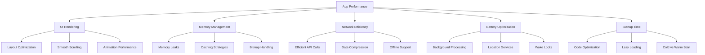

# App Performance Optimization

## Introduction

Performance optimization is a critical aspect of mobile app development that directly impacts user satisfaction, retention rates, and app store ratings. Unlike desktop applications, mobile apps operate in environments with limited resources - restricted memory, variable network connectivity, and battery constraints. Poor performance can lead to sluggish UI, excessive battery drain, or even crashes.

This guide explores key performance optimization techniques for mobile applications, providing practical examples and best practices to help you build responsive, efficient, and battery-friendly apps that users will love.

## Why Performance Matters

Before diving into optimization techniques, let's understand why mobile app performance is crucial:

- **User Retention**: Studies show that 53% of users abandon apps that take longer than 3 seconds to load
- **Battery Consumption**: Inefficient apps drain battery quickly, leading to negative reviews
- **Memory Constraints**: Mobile devices have limited RAM compared to desktops
- **Variable Network Conditions**: Users expect apps to work well even with poor connectivity
- **App Store Algorithms**: Performance metrics influence app store ranking algorithms

## Key Performance Areas



## 1. UI Rendering Optimization

### Flattening View Hierarchy

Complex nested layouts reduce rendering performance. Flatter hierarchies render faster.

**Before Optimization (Android):**

```xml
<LinearLayout>
    <LinearLayout>
        <LinearLayout>
            <TextView />
            <ImageView />
        </LinearLayout>
        <LinearLayout>
            <Button />
            <Button />
        </LinearLayout>
    </LinearLayout>
</LinearLayout>
```

**After Optimization:**

```xml
<ConstraintLayout>
    <TextView />
    <ImageView />
    <Button />
    <Button />
</ConstraintLayout>
```

### Reusing Views with RecyclerView/UITableView

Recycling views rather than creating new ones for each item dramatically improves scrolling performance and reduces memory usage.

**Android Example:**

```java
public class MyAdapter extends RecyclerView.Adapter<MyAdapter.ViewHolder> {
    private List<String> data;
    
    // Constructor, onCreateViewHolder methods...
    
    @Override
    public void onBindViewHolder(ViewHolder holder, int position) {
        // Reuse the viewholder instead of creating new views
        holder.textView.setText(data.get(position));
    }
    
    static class ViewHolder extends RecyclerView.ViewHolder {
        TextView textView;
        
        ViewHolder(View itemView) {
            super(itemView);
            textView = itemView.findViewById(R.id.text_view);
        }
    }
}
```

**iOS Example:**

```swift
func tableView(_ tableView: UITableView, cellForRowAt indexPath: IndexPath) -> UITableViewCell {
    // Dequeue a reusable cell instead of creating new ones
    let cell = tableView.dequeueReusableCell(withIdentifier: "Cell", for: indexPath)
    cell.textLabel?.text = data[indexPath.row]
    return cell
}
```

### Avoiding Overdraw

Overdraw occurs when the same pixel is drawn multiple times, wasting processing power.

**Tips to Reduce Overdraw:**
- Remove unnecessary backgrounds
- Avoid layering transparent views
- Use `clipToBounds` (iOS) or `clipChildren` (Android) when appropriate

## 2. Memory Management

### Preventing Memory Leaks

Memory leaks occur when objects are no longer needed but remain in memory.

**Common Causes:**
- Unregistered listeners
- Static references to activities/contexts
- Inner classes holding references to outer classes

**Android Example of a Memory Leak:**

```java
// BAD: This anonymous inner class holds an implicit reference to the activity
Button button = findViewById(R.id.button);
button.setOnClickListener(new View.OnClickListener() {
    @Override
    public void onClick(View v) {
        // This code retains a reference to the Activity
    }
});
```

**Fixed Version:**

```java
// GOOD: Using a weak reference or proper cleanup
Button button = findViewById(R.id.button);
View.OnClickListener listener = new View.OnClickListener() {
    @Override
    public void onClick(View v) {
        // Implementation
    }
};
button.setOnClickListener(listener);

@Override
protected void onDestroy() {
    button.setOnClickListener(null); // Remove listener
    super.onDestroy();
}
```

### Efficient Image Handling

Images often consume the most memory in mobile apps.

**Best Practices:**

1. **Load appropriately sized images:**

```java
// Android example
public static Bitmap decodeSampledBitmapFromResource(Resources res, int resId, int reqWidth, int reqHeight) {
    // First decode with inJustDecodeBounds=true to check dimensions
    final BitmapFactory.Options options = new BitmapFactory.Options();
    options.inJustDecodeBounds = true;
    BitmapFactory.decodeResource(res, resId, options);

    // Calculate inSampleSize
    options.inSampleSize = calculateInSampleSize(options, reqWidth, reqHeight);

    // Decode bitmap with inSampleSize set
    options.inJustDecodeBounds = false;
    return BitmapFactory.decodeResource(res, resId, options);
}
```

2. **Use memory-efficient bitmap formats:**
   - Android: `RGB_565` instead of `ARGB_8888` when transparency isn't needed
   - iOS: Use JPEG for photos, PNG for UI elements

3. **Implement image caching:**
   - Android: Glide or Picasso libraries
   - iOS: SDWebImage or Kingfisher libraries

## 3. Network Optimization

### Efficient Data Transfer

Network operations are often the slowest part of an app and consume battery.

**Optimization Techniques:**

1. **Batch API Requests:**

```javascript
// Instead of multiple separate requests
// BAD
fetchUserProfile(userId);
fetchUserPosts(userId);
fetchUserFollowers(userId);

// GOOD: Single batch request
fetchUserData(userId); // Server returns combined data
```

2. **Implement Data Compression:**

```java
// Android example with OkHttp
OkHttpClient client = new OkHttpClient.Builder()
    .addInterceptor(new GzipRequestInterceptor())
    .build();
```

3. **Use Protocol Buffers or JSON alternatives:**

```kotlin
// Kotlin with Protocol Buffers
val person = Person.newBuilder()
    .setId(1234)
    .setName("John Doe")
    .setEmail("jdoe@example.com")
    .build()
    
val bytes = person.toByteArray() // Much smaller than JSON
```

### Caching and Offline Support

Implementing proper caching reduces network requests and improves perceived performance.

**Example Implementation:**

```kotlin
// Android caching with Retrofit
val httpCacheDirectory = File(context.cacheDir, "http-cache")
val cacheSize = 10 * 1024 * 1024 // 10 MB
val cache = Cache(httpCacheDirectory, cacheSize)

val client = OkHttpClient.Builder()
    .cache(cache)
    .addInterceptor { chain ->
        var request = chain.request()
        
        // Add cache control based on network availability
        request = if (hasNetwork(context))
            request.newBuilder().header("Cache-Control", 
                "public, max-age=5").build()
        else
            request.newBuilder().header("Cache-Control",
                "public, only-if-cached, max-stale=604800").build()
                
        chain.proceed(request)
    }
    .build()
```

## 4. Battery Optimization

### Efficient Background Processing

Background tasks can silently drain battery if not properly managed.

**WorkManager Example (Android):**

```kotlin
val constraints = Constraints.Builder()
    .setRequiredNetworkType(NetworkType.UNMETERED) // Only on Wi-Fi
    .setRequiresBatteryNotLow(true) // Not when battery is low
    .build()

val dataSync = PeriodicWorkRequestBuilder<SyncWorker>(1, TimeUnit.HOURS)
    .setConstraints(constraints)
    .build()

WorkManager.getInstance(context).enqueueUniquePeriodicWork(
    "dataSyncJob",
    ExistingPeriodicWorkPolicy.KEEP,
    dataSync
)
```

### Location Services Optimization

Location services are particularly battery-intensive.

**Best Practices:**

```swift
// iOS example - adjusting location accuracy based on needs
let locationManager = CLLocationManager()

// For coarse location (less battery)
locationManager.desiredAccuracy = kCLLocationAccuracyHundredMeters 

// Only when needed (e.g., mapping app in foreground)
locationManager.desiredAccuracy = kCLLocationAccuracyBest 

// Balance between accuracy and battery
locationManager.desiredAccuracy = kCLLocationAccuracyNearestTenMeters
```

## 5. Launch Time Optimization

### Cold vs. Warm Start

- **Cold start**: App launches from scratch (most resource-intensive)
- **Warm start**: App was in background and is brought to foreground

**Measuring Launch Time (Android):**

```bash
adb shell am start -W -n com.example.app/.MainActivity
```

### Optimization Techniques

1. **Lazy initialization**:

```kotlin
// Lazy initialization in Kotlin
val expensiveObject by lazy {
    // Complex initialization only happens when first accessed
    ComplexObject()
}
```

2. **Deferring non-critical operations**:

```java
// Android example
@Override
protected void onCreate(Bundle savedInstanceState) {
    super.onCreate(savedInstanceState);
    setContentView(R.layout.activity_main);
    
    // Initialize only what's needed for UI display
    initializeEssentialComponents();
    
    // Defer non-critical operations
    new Handler().postDelayed(() -> {
        initializeAnalytics();
        checkForUpdates();
        preloadContent();
    }, 3000); // 3 seconds after launch
}
```

## 6. Tools for Performance Analysis

### Android Tools

- **Android Profiler**: Analyzes CPU, memory, network, and energy usage
- **Systrace**: Captures and displays execution time of app processes
- **StrictMode**: Detects operations on main thread that could cause jank

### iOS Tools

- **Instruments**: Comprehensive performance, memory, and energy profiling
- **Time Profiler**: Identifies CPU-intensive methods
- **Allocation Instrument**: Tracks memory allocations

### Example of Using Android Profiler Data

After identifying excessive GC calls in Profiler:

```java
// Before optimization: Creating new objects in a loop
for (int i = 0; i < items.size(); i++) {
    String formattedText = String.format("Item %s", items.get(i));
    processText(formattedText);
}

// After optimization: Reusing objects
StringBuilder builder = new StringBuilder();
for (int i = 0; i < items.size(); i++) {
    builder.setLength(0);
    builder.append("Item ").append(items.get(i));
    processText(builder.toString());
}
```

## Practical Optimization Checklist

Here's a checklist to help you systematically optimize your mobile app:

1. **Identify Performance Issues**
   - Run profiling tools on real devices (not just emulators)
   - Collect user feedback about slow areas
   - Test on low-end devices

2. **UI Optimizations**
   - Flatten view hierarchies
   - Implement view recycling for lists
   - Reduce overdraw
   - Optimize custom views

3. **Memory Management**
   - Fix memory leaks
   - Optimize image loading and caching
   - Use appropriate data structures
   - Implement object pooling for frequently created objects

4. **Network Efficiency**
   - Batch API requests
   - Implement proper caching
   - Compress data
   - Add offline support

5. **Battery Efficiency**
   - Optimize background processing
   - Use location services efficiently
   - Implement proper wake locks
   - Batch sensor operations

6. **Launch Time**
   - Minimize initialization in Application/AppDelegate
   - Defer non-critical operations
   - Use lazy loading
   - Optimize dependency injection

## Summary

App performance optimization is a continuous process rather than a one-time effort. Mobile environments constantly change with new OS versions, device capabilities, and user expectations.

Key takeaways:
- Performance directly impacts user satisfaction and retention
- Focus on UI smoothness, memory efficiency, network optimization, and battery usage
- Use appropriate tools to measure before and after optimization
- Test on real devices, especially lower-end models
- Balance feature richness with performance

By implementing the techniques covered in this guide, you'll be well-equipped to create mobile applications that are responsive, efficient, and provide excellent user experiences across a wide range of devices.

## Additional Resources

- **Books**:
  - "High Performance Android Apps" by Doug Sillars
  - "iOS Programming: The Big Nerd Ranch Guide"

- **Online Courses**:
  - Udacity's "Android Performance" course
  - Ray Wenderlich's "iOS Performance Optimization"

## Exercises

1. **Profiling Exercise**: Use Android Profiler or Instruments to identify the top 3 performance bottlenecks in your current app.

2. **View Hierarchy Optimization**: Take a complex layout from your app and refactor it to reduce nesting without changing its appearance.

3. **Memory Leak Detection**: Use LeakCanary (Android) or Instruments (iOS) to identify and fix at least one memory leak in your app.

4. **Network Optimization**: Implement a caching strategy for your app's API requests and measure the performance improvement.

5. **Battery Analysis**: Create a background processing task and optimize it to reduce battery consumption while maintaining functionality.