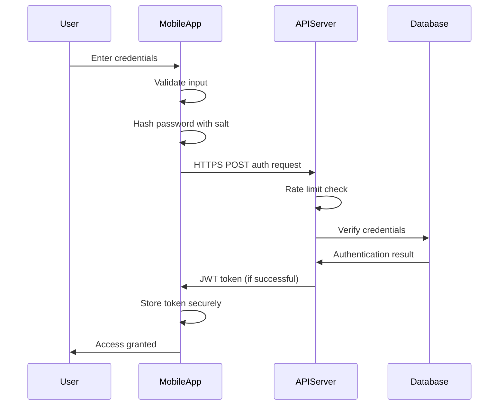

# Mobile App Security

## Introduction

Mobile app security refers to the protective measures implemented within applications to safeguard user data, prevent unauthorized access, and ensure the overall integrity of the app. As mobile devices become increasingly central to our daily lives—storing personal information, financial details, and even health records—the importance of robust security measures cannot be overstated.

For developers, understanding mobile app security is not just a technical requirement but a professional responsibility. Security vulnerabilities can lead to data breaches, financial loss, damaged reputation, and in some cases, legal consequences.

This guide will walk you through the fundamental concepts of mobile app security, common vulnerabilities, and best practices to protect your applications and users.

## Why Mobile App Security Matters

Mobile applications face unique security challenges compared to traditional web applications:

1. **Physical access risk** - Mobile devices can be lost or stolen, giving potential attackers direct physical access
2. **Diverse ecosystem** - Multiple operating systems, device types, and API levels create a complex security landscape
3. **Limited resources** - Constraints on processing power, memory, and battery life can impact security implementations
4. **App store distribution** - Once published, vulnerabilities may affect thousands of users before patches can be deployed

A security breach can result in:

- Unauthorized access to sensitive user data
- Identity theft
- Financial fraud
- Privacy violations
- Damaged brand reputation
- Regulatory fines and legal issues

## Common Mobile App Security Vulnerabilities

### 1. Insecure Data Storage

Many mobile apps store sensitive information locally on the device. If this data isn't properly protected, it can be accessed if the device is compromised.

**Vulnerable Example:**

```java
// Android - Insecure way to store data
SharedPreferences preferences = getSharedPreferences("user_prefs", MODE_PRIVATE);
SharedPreferences.Editor editor = preferences.edit();
editor.putString("username", username);
editor.putString("password", password); // Storing password in plain text
editor.apply();
```

**Secure Approach:**

```java
// Android - Using the EncryptedSharedPreferences
MasterKey masterKey = new MasterKey.Builder(context)
    .setKeyScheme(MasterKey.KeyScheme.AES256_GCM)
    .build();

EncryptedSharedPreferences encryptedPrefs = EncryptedSharedPreferences.create(
    context,
    "encrypted_user_prefs",
    masterKey,
    EncryptedSharedPreferences.PrefKeyEncryptionScheme.AES256_SIV,
    EncryptedSharedPreferences.PrefValueEncryptionScheme.AES256_GCM
);

encryptedPrefs.edit()
    .putString("username", username)
    .putString("auth_token", authToken) // Store token instead of password
    .apply();
```

### 2. Insufficient Transport Layer Protection

Data transmitted between the app and backend servers must be protected to prevent interception and tampering.

**Vulnerable Example:**

```swift
// iOS - Insecure HTTP connection
let url = URL(string: "http://api.example.com/user/login")!
var request = URLRequest(url: url)
request.httpMethod = "POST"
request.httpBody = "username=user&password=pass".data(using: .utf8)

URLSession.shared.dataTask(with: request) { data, response, error in
    // Handle response
}.resume()
```

**Secure Approach:**

```swift
// iOS - Secure HTTPS connection with certificate pinning
let url = URL(string: "https://api.example.com/user/login")!
var request = URLRequest(url: url)
request.httpMethod = "POST"
request.httpBody = "username=user&password=pass".data(using: .utf8)

let session = URLSession(configuration: .default, delegate: SSLPinningDelegate(), delegateQueue: nil)
session.dataTask(with: request) { data, response, error in
    // Handle response
}.resume()

// Certificate pinning delegate class
class SSLPinningDelegate: NSObject, URLSessionDelegate {
    func urlSession(_ session: URLSession, didReceive challenge: URLAuthenticationChallenge, 
                   completionHandler: @escaping (URLSession.AuthChallengeDisposition, URLCredential?) -> Void) {
        if challenge.protectionSpace.authenticationMethod == NSURLAuthenticationMethodServerTrust {
            if let serverTrust = challenge.protectionSpace.serverTrust {
                // Get certificate and compare with local copy
                // This is simplified - actual implementation would validate certificate
                let credential = URLCredential(trust: serverTrust)
                completionHandler(.useCredential, credential)
                return
            }
        }
        completionHandler(.cancelAuthenticationChallenge, nil)
    }
}
```

### 3. Insufficient Authentication and Authorization

Weak authentication systems can allow unauthorized users to access protected functionality or data.

**Vulnerable Example:**

```kotlin
// Kotlin - Weak authentication
fun login(username: String, password: String) {
    if (username == "admin" && password == "password123") {
        startMainActivity()
    } else {
        showErrorMessage()
    }
}
```

**Secure Approach:**

```kotlin
// Kotlin - Stronger authentication with rate limiting
private val attemptTracker = LoginAttemptTracker()

fun login(username: String, password: String) {
    if (attemptTracker.tooManyAttempts()) {
        enforceTimeout()
        return
    }
    
    val passwordHash = hashService.hashWithSalt(password)
    authRepository.verifyCredentials(username, passwordHash)
        .subscribeOn(Schedulers.io())
        .observeOn(AndroidSchedulers.mainThread())
        .subscribe({ success ->
            if (success) {
                attemptTracker.reset()
                biometricPrompt.authenticate() // Additional biometric check
            } else {
                attemptTracker.recordFailedAttempt()
                showErrorMessage()
            }
        }, { error ->
            handleError(error)
        })
}
```

### 4. Code Injection and Reverse Engineering

Mobile apps can be decompiled and analyzed, potentially exposing sensitive logic or hardcoded secrets.

**Protection Strategies:**

1. **Code Obfuscation** - Makes decompiled code harder to understand

```gradle
// Android - ProGuard configuration in build.gradle
android {
    buildTypes {
        release {
            minifyEnabled true
            proguardFiles getDefaultProguardFile('proguard-android-optimize.txt'), 'proguard-rules.pro'
        }
    }
}
```

2. **Anti-Tampering Checks** - Detect if the app has been modified

```java
// Android - Basic integrity check example
private boolean isAppTampered() {
    try {
        PackageInfo packageInfo = getPackageManager().getPackageInfo(
                getPackageName(), PackageManager.GET_SIGNATURES);
        for (Signature signature : packageInfo.signatures) {
            MessageDigest md = MessageDigest.getInstance("SHA");
            md.update(signature.toByteArray());
            String currentSignature = Base64.encodeToString(md.digest(), Base64.DEFAULT);
            // Compare with known good signature
            return !ORIGINAL_SIGNATURE.equals(currentSignature);
        }
    } catch (Exception e) {
        // If we can't check, assume tampered
        return true;
    }
    return false;
}
```

## Mobile App Security Best Practices

### 1. Secure Data Storage

- **Minimize local storage** of sensitive data
- Use the platform's **secure storage options**:
  - Android: EncryptedSharedPreferences, Keystore
  - iOS: Keychain Services
- **Never store** sensitive data in plain text
- Implement **proper key management**

### 2. Secure Communication

- **Always use HTTPS/TLS** for network communication
- Implement **certificate pinning** to prevent man-in-the-middle attacks
- **Validate all data** received from servers
- **Encrypt sensitive data** before transmission

### 3. Authentication and Authorization

- Implement **strong password policies**
- Use **multi-factor authentication** when possible
- Support **biometric authentication** (fingerprint, face recognition)
- Implement **proper session management**
- Use **OAuth 2.0 or OpenID Connect** for auth flows

### 4. Code Protection

- **Obfuscate code** to make reverse engineering more difficult
- Implement **anti-tampering** mechanisms
- Avoid **hardcoded secrets** in app code
- Use **API keys with restricted permissions**

### 5. Input Validation

- **Validate all input** from users and external sources
- Use **parameterized queries** for database operations
- **Sanitize data** before processing or storage

### 6. Secure the Development Process

- Conduct regular **security testing**:
  - Static Application Security Testing (SAST)
  - Dynamic Application Security Testing (DAST)
  - Penetration testing
- Maintain a **secure development environment**
- Keep **dependencies updated** to address known vulnerabilities

## Implementing Secure Authentication

Authentication is a critical component of mobile app security. Let's build a more secure authentication system.



### Implementation Example

**Client-Side (Android/Kotlin):**

```kotlin
class SecureAuthManager(private val context: Context) {
    private val apiService = RetrofitClient.createService(AuthApiService::class.java)
    private val tokenManager = TokenManager(context)
    
    suspend fun login(username: String, password: String): Result<AuthToken> {
        return try {
            // Validate input
            if (!isValidInput(username, password)) {
                return Result.failure(InvalidInputException())
            }
            
            // Create auth request
            val authRequest = AuthRequest(
                username = username,
                password = hashPassword(password) // Client-side hashing adds a layer of protection
            )
            
            // Make API call with error handling
            val response = apiService.login(authRequest)
            if (response.isSuccessful && response.body() != null) {
                // Store token securely
                tokenManager.saveToken(response.body()!!)
                Result.success(response.body()!!)
            } else {
                Result.failure(AuthenticationException(response.errorBody()?.string()))
            }
        } catch (e: Exception) {
            Result.failure(e)
        }
    }
    
    private fun isValidInput(username: String, password: String): Boolean {
        return username.length >= 5 && password.length >= 8
    }
    
    private fun hashPassword(password: String): String {
        // This is a simplified example - use a proper cryptographic library
        val salt = getSaltForUser() // Get user-specific salt
        return BCrypt.hashpw(password, salt)
    }
}

class TokenManager(context: Context) {
    private val masterKey = MasterKey.Builder(context)
        .setKeyScheme(MasterKey.KeyScheme.AES256_GCM)
        .build()
        
    private val encryptedPrefs = EncryptedSharedPreferences.create(
        context,
        "secure_auth_prefs",
        masterKey,
        EncryptedSharedPreferences.PrefKeyEncryptionScheme.AES256_SIV,
        EncryptedSharedPreferences.PrefValueEncryptionScheme.AES256_GCM
    )
    
    fun saveToken(token: AuthToken) {
        encryptedPrefs.edit()
            .putString("access_token", token.accessToken)
            .putString("refresh_token", token.refreshToken)
            .putLong("expiration", token.expiresAt)
            .apply()
    }
    
    fun getToken(): AuthToken? {
        val accessToken = encryptedPrefs.getString("access_token", null) ?: return null
        val refreshToken = encryptedPrefs.getString("refresh_token", null) ?: return null
        val expiresAt = encryptedPrefs.getLong("expiration", 0)
        
        return AuthToken(accessToken, refreshToken, expiresAt)
    }
    
    fun clearToken() {
        encryptedPrefs.edit().clear().apply()
    }
}
```

**Server-Side (Node.js/Express):**

```javascript
const express = require('express');
const bcrypt = require('bcrypt');
const jwt = require('jsonwebtoken');
const rateLimit = require('express-rate-limit');
const { body, validationResult } = require('express-validator');

const app = express();
app.use(express.json());

// Setup rate limiting
const loginLimiter = rateLimit({
  windowMs: 15 * 60 * 1000, // 15 minutes
  max: 5, // 5 requests per window per IP
  message: { error: 'Too many login attempts, please try again later' }
});

// Login endpoint with validation and rate limiting
app.post('/api/auth/login', 
  loginLimiter,
  [
    body('username').isLength({ min: 5 }).trim().escape(),
    body('password').isLength({ min: 8 })
  ],
  async (req, res) => {
    // Validate request
    const errors = validationResult(req);
    if (!errors.isEmpty()) {
      return res.status(400).json({ errors: errors.array() });
    }
    
    try {
      const { username, password } = req.body;
      
      // Get user from database
      const user = await User.findOne({ username });
      if (!user) {
        // Use constant time comparison to prevent timing attacks
        await bcrypt.compare('dummy', '$2b$10$dummyhashfordummypassword');
        return res.status(401).json({ error: 'Invalid credentials' });
      }
      
      // Verify password (using proper secure comparison)
      const isMatch = await bcrypt.compare(password, user.passwordHash);
      if (!isMatch) {
        return res.status(401).json({ error: 'Invalid credentials' });
      }
      
      // Generate JWT token
      const accessToken = jwt.sign(
        { id: user.id, role: user.role },
        process.env.JWT_SECRET,
        { expiresIn: '1h' }
      );
      
      const refreshToken = jwt.sign(
        { id: user.id },
        process.env.REFRESH_TOKEN_SECRET,
        { expiresIn: '7d' }
      );
      
      // Store refresh token in database
      await User.updateOne(
        { _id: user.id },
        { $set: { refreshToken: refreshToken }}
      );
      
      // Return tokens to client
      res.json({
        accessToken,
        refreshToken,
        expiresAt: Date.now() + 3600000 // 1 hour in milliseconds
      });
    } catch (err) {
      console.error(err);
      res.status(500).json({ error: 'Server error' });
    }
  }
);
```

## Security Testing

Regular security testing is essential for identifying and addressing vulnerabilities in your mobile applications.

### 1. Static Application Security Testing (SAST)

SAST tools analyze source code to identify potential security vulnerabilities.

**Popular SAST Tools:**
- Android: FindBugs, SonarQube
- iOS: Xcode's static analyzer, SwiftLint

**Example Integration with Android CI Pipeline:**

```yaml
# Example GitHub Actions workflow for Android SAST
name: Android SAST

on:
  push:
    branches: [ main ]
  pull_request:
    branches: [ main ]

jobs:
  static-analysis:
    runs-on: ubuntu-latest
    
    steps:
    - uses: actions/checkout@v2
    
    - name: Set up JDK
      uses: actions/setup-java@v1
      with:
        java-version: 11
    
    - name: Run Spotbugs
      run: ./gradlew spotbugsDebug
    
    - name: Run SonarQube Analysis
      run: ./gradlew sonarqube
      env:
        GITHUB_TOKEN: ${{ secrets.GITHUB_TOKEN }}
        SONAR_TOKEN: ${{ secrets.SONAR_TOKEN }}
```

### 2. Dynamic Application Security Testing (DAST)

DAST tools test running applications to identify security issues during execution.

**Popular DAST Tools:**
- OWASP ZAP
- MobSF (Mobile Security Framework)

### 3. Penetration Testing

Penetration testing involves simulating attacks to identify vulnerabilities:

1. **Network Communications** - Intercepting and analyzing traffic
2. **Local Storage** - Examining how data is stored on the device
3. **Client-Side Injections** - Testing input fields for injection attacks
4. **Authentication Bypass** - Attempting to circumvent authentication mechanisms

## Real-World Case Studies

### Case Study 1: Data Leakage in Clipboard

A fitness app was found to be storing sensitive health information in the clipboard, making it accessible to other applications.

**Issue:**
```kotlin
// Copying sensitive data to clipboard
val clipboard = getSystemService(Context.CLIPBOARD_SERVICE) as ClipboardManager
val clip = ClipData.newPlainText("Health Data", userHealthProfile.toString())
clipboard.setPrimaryClip(clip)
```

**Solution:**
```kotlin
// Secure alternative
// 1. Don't use clipboard for sensitive data
// 2. If needed temporarily, clear it after use
fun secureCopyAndClear(text: String) {
    val clipboard = getSystemService(Context.CLIPBOARD_SERVICE) as ClipboardManager
    val clip = ClipData.newPlainText("Secure Data", text)
    clipboard.setPrimaryClip(clip)
    
    // Schedule clearing the clipboard
    Handler(Looper.getMainLooper()).postDelayed({
        clipboard.setPrimaryClip(ClipData.newPlainText("", ""))
    }, 60000) // Clear after 1 minute
}
```

### Case Study 2: Insecure Biometric Implementation

A banking app implemented fingerprint authentication but failed to properly secure the authentication state.

**Issue:**
```java
// Insecure biometric implementation
boolean isAuthenticated = false;

void authenticateWithFingerprint() {
    biometricPrompt.authenticate(new BiometricPrompt.AuthenticationCallback() {
        @Override
        public void onAuthenticationSucceeded(BiometricPrompt.AuthenticationResult result) {
            isAuthenticated = true; // Simple boolean flag
            showBankingDashboard();
        }
    });
}
```

**Solution:**
```java
// Secure implementation using cryptographic keys
void authenticateWithFingerprint() {
    // Use Keystore-backed keys that require biometric auth
    KeyGenParameterSpec keyGenParameterSpec = new KeyGenParameterSpec.Builder(
            KEY_NAME,
            KeyProperties.PURPOSE_ENCRYPT | KeyProperties.PURPOSE_DECRYPT)
            .setBlockModes(KeyProperties.BLOCK_MODE_CBC)
            .setEncryptionPaddings(KeyProperties.ENCRYPTION_PADDING_PKCS7)
            .setUserAuthenticationRequired(true)
            .setUserAuthenticationValidityDurationSeconds(30)
            .build();
            
    KeyGenerator keyGenerator = KeyGenerator.getInstance(
            KeyProperties.KEY_ALGORITHM_AES, "AndroidKeyStore");
    keyGenerator.init(keyGenParameterSpec);
    keyGenerator.generateKey();
    
    // The key can only be used after successful biometric authentication
    biometricPrompt.authenticate(promptInfo, new BiometricPrompt.AuthenticationCallback() {
        @Override
        public void onAuthenticationSucceeded(BiometricPrompt.AuthenticationResult result) {
            // Use the cryptographic key for secure operations
            Cipher cipher = result.getCryptor();
            // This operation will only succeed if biometric auth was successful
            SecretKey key = getSecretKey();
            byte[] encryptedData = cipher.doFinal(dataToEncrypt);
            
            // Now we can safely show the banking dashboard
            showBankingDashboard();
        }
    });
}
```

## Summary

Building secure mobile applications requires a comprehensive approach that addresses vulnerabilities at multiple levels:

1. **Secure Storage** - Protect sensitive data on the device
2. **Secure Communication** - Ensure data is transmitted safely
3. **Strong Authentication** - Verify user identity reliably
4. **Code Protection** - Safeguard your application code
5. **Regular Testing** - Identify and address vulnerabilities

Security is not a one-time task but an ongoing process. As new threats emerge and platforms evolve, mobile app security practices must adapt accordingly.

## Additional Resources

### Security Guidelines

- [OWASP Mobile Security Project](https://owasp.org/www-project-mobile-security/)
- [NIST Mobile Device Security Guidelines](https://csrc.nist.gov/publications/detail/sp/1800-4/final)

### Development Tools

- Android: Android Keystore System, EncryptedSharedPreferences
- iOS: Keychain Services, CryptoKit

### Learning Exercises

1. **Security Audit** - Perform a security audit on an existing application
2. **Secure Authentication** - Implement a secure authentication system with biometric verification
3. **Certificate Pinning** - Add certificate pinning to network requests
4. **Secure Storage** - Create a secure data storage module
5. **Penetration Testing** - Set up a basic penetration testing environment with OWASP ZAP

By following these best practices and continuing to learn about emerging threats, you can significantly improve the security posture of your mobile applications and protect your users from potential harm.