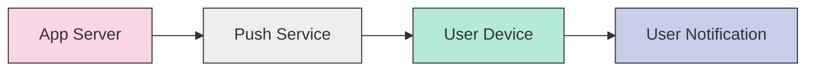

# Push Notifications

## Introduction

Push notifications are messages that can be sent to a user's device even when they aren't actively using your application. They serve as a powerful engagement tool, allowing developers to communicate important information, updates, or calls to action directly to users. In this guide, we'll explore what push notifications are, how they work, and how to implement them in mobile applications.

## What Are Push Notifications?

Push notifications are brief messages or alerts delivered to a user's device from a server. Unlike in-app notifications that only appear when an app is running, push notifications can reach users anytime, making them a valuable communication channel for mobile applications.

### Key Characteristics

- **Delivery without active app usage**: Messages reach users even when they're not using your app
- **Interactive elements**: Can include buttons, images, or other interactive components
- **Customizable**: Can be personalized based on user preferences or behavior
- **Opt-in feature**: Users must grant permission to receive push notifications

## How Push Notifications Work

Push notifications rely on a system architecture involving several components:



1. **App Server**: Your backend server that decides when to send notifications and to whom
2. **Push Service**: Platform-specific services like Firebase Cloud Messaging (FCM) for Android or Apple Push Notification Service (APNS) for iOS
3. **Device**: The user's mobile device that receives and displays the notification
4. **User Interface**: How the notification appears to the user

The process flows like this:

1. Your app registers with the platform's push service when installed
2. The service provides a unique token for that device installation
3. Your app sends this token to your server
4. When you want to send a notification, your server sends a message to the push service with the token(s)
5. The push service delivers the notification to the appropriate device(s)

## Push Notification Platforms

### Firebase Cloud Messaging (FCM) for Android

Firebase Cloud Messaging is Google's solution for sending push notifications to Android devices. It's a cross-platform messaging solution that lets you reliably deliver messages at no cost.

#### Setting Up FCM in an Android App

1. First, add the required dependencies to your `build.gradle` file:

```kotlin
dependencies {
    implementation platform('com.google.firebase:firebase-bom:32.2.0')
    implementation 'com.google.firebase:firebase-messaging'
}
```

2. Initialize Firebase in your application class:

```kotlin
class MyApplication : Application() {
    override fun onCreate() {
        super.onCreate()
        FirebaseApp.initializeApp(this)
    }
}
```

3. Create a service that extends FirebaseMessagingService:

```kotlin
class MyFirebaseMessagingService : FirebaseMessagingService() {
    override fun onNewToken(token: String) {
        // Send token to your app server
        sendRegistrationToServer(token)
    }

    override fun onMessageReceived(remoteMessage: RemoteMessage) {
        // Handle the received message
        if (remoteMessage.notification != null) {
            showNotification(remoteMessage.notification?.title, remoteMessage.notification?.body)
        }
    }

    private fun showNotification(title: String?, body: String?) {
        // Create and display notification
        val notificationManager = getSystemService(Context.NOTIFICATION_SERVICE) as NotificationManager
        
        if (Build.VERSION.SDK_INT >= Build.VERSION_CODES.O) {
            val channel = NotificationChannel(
                "channel_id",
                "Channel Name",
                NotificationManager.IMPORTANCE_DEFAULT
            )
            notificationManager.createNotificationChannel(channel)
        }
        
        val notificationBuilder = NotificationCompat.Builder(this, "channel_id")
            .setContentTitle(title)
            .setContentText(body)
            .setSmallIcon(R.drawable.notification_icon)
            .setAutoCancel(true)
        
        notificationManager.notify(0, notificationBuilder.build())
    }

    private fun sendRegistrationToServer(token: String) {
        // Implement code to send token to your backend
    }
}
```

4. Register the service in your AndroidManifest.xml:

```xml
<service
    android:name=".MyFirebaseMessagingService"
    android:exported="false">
    <intent-filter>
        <action android:name="com.google.firebase.MESSAGING_EVENT" />
    </intent-filter>
</service>
```

### Apple Push Notification Service (APNS) for iOS

Apple Push Notification Service is Apple's push notification service for iOS devices.

#### Setting Up APNS in a Swift App

1. Request permission from the user to receive notifications:

```swift
import UserNotifications

class AppDelegate: UIResponder, UIApplicationDelegate {
    func application(_ application: UIApplication, didFinishLaunchingWithOptions launchOptions: [UIApplication.LaunchOptionsKey: Any]?) -> Bool {
        
        UNUserNotificationCenter.current().requestAuthorization(options: [.alert, .sound, .badge]) { granted, error in
            if granted {
                DispatchQueue.main.async {
                    UIApplication.shared.registerForRemoteNotifications()
                }
            }
        }
        
        return true
    }
    
    func application(_ application: UIApplication, didRegisterForRemoteNotificationsWithDeviceToken deviceToken: Data) {
        // Convert token to string
        let tokenString = deviceToken.map { String(format: "%02.2hhx", $0) }.joined()
        
        // Send token to your server
        sendTokenToServer(token: tokenString)
    }
    
    func application(_ application: UIApplication, didFailToRegisterForRemoteNotificationsWithError error: Error) {
        print("Failed to register for remote notifications: \(error.localizedDescription)")
    }
    
    func application(_ application: UIApplication, didReceiveRemoteNotification userInfo: [AnyHashable : Any], fetchCompletionHandler completionHandler: @escaping (UIBackgroundFetchResult) -> Void) {
        // Handle the received notification
        if let aps = userInfo["aps"] as? [String: Any] {
            // Process notification data
        }
        
        completionHandler(.newData)
    }
    
    private func sendTokenToServer(token: String) {
        // Implement code to send token to your backend
    }
}
```

## Sending Push Notifications from Your Server

Once you have users registered with tokens, you'll need to send notifications from your server. Here's a simple Node.js example using the `firebase-admin` package to send notifications through FCM:

```javascript
const admin = require('firebase-admin');
const serviceAccount = require('./path-to-service-account.json');

// Initialize Firebase Admin SDK
admin.initializeApp({
  credential: admin.credential.cert(serviceAccount)
});

// Function to send notification to a specific device
async function sendPushNotification(token, title, body, data = {}) {
  try {
    const message = {
      notification: {
        title: title,
        body: body
      },
      data: data,
      token: token
    };

    const response = await admin.messaging().send(message);
    console.log('Successfully sent message:', response);
    return response;
  } catch (error) {
    console.error('Error sending message:', error);
    throw error;
  }
}

// Example usage
sendPushNotification(
  'USER_DEVICE_TOKEN',
  'New Message',
  'You have received a new message!',
  { messageId: '123456' }
);
```

## Best Practices for Push Notifications

### 1. Request Permission at the Right Time

Don't ask for notification permissions immediately at app launch. Wait until there's context that demonstrates value:

```kotlin
// Android (Kotlin) - Better timing for requesting permissions
class OnboardingActivity : AppCompatActivity() {
    fun onFinishOnboarding() {
        // User has completed onboarding and understands app value
        requestNotificationPermission()
    }
    
    private fun requestNotificationPermission() {
        // Request notification permission
    }
}
```

### 2. Send Relevant and Timely Notifications

Always ensure your notifications provide value. Irrelevant notifications are the primary reason users disable them.

### 3. Personalize When Possible

Use user data to make notifications more relevant:

```javascript
// Server-side personalization example
function createPersonalizedNotification(user) {
  return {
    title: `${user.name}, we miss you!`,
    body: `Check out ${user.interests[0]} updates since your last visit`,
    data: {
      category: user.interests[0],
      lastVisit: user.lastLoginDate
    }
  };
}
```

### 4. Implement Deep Linking

Make notifications actionable by taking users to the relevant screen:

```kotlin
// Android deep linking from notification
private fun createDeepLinkNotification(title: String, message: String, deepLink: String) {
    val intent = Intent(Intent.ACTION_VIEW, Uri.parse(deepLink))
    val pendingIntent = PendingIntent.getActivity(this, 0, intent, PendingIntent.FLAG_IMMUTABLE)
    
    val builder = NotificationCompat.Builder(this, CHANNEL_ID)
        .setSmallIcon(R.drawable.notification_icon)
        .setContentTitle(title)
        .setContentText(message)
        .setPriority(NotificationCompat.PRIORITY_DEFAULT)
        .setContentIntent(pendingIntent)
        .setAutoCancel(true)
        
    with(NotificationManagerCompat.from(this)) {
        notify(notificationId, builder.build())
    }
}
```

### 5. Respect User Preferences

Allow users to customize notification categories and frequency:

```kotlin
// Example of preference settings for notifications
class NotificationPreferencesFragment : PreferenceFragmentCompat() {
    override fun onCreatePreferences(savedInstanceState: Bundle?, rootKey: String?) {
        setPreferencesFromResource(R.xml.notification_preferences, rootKey)
    }
}

// XML preferences file (notification_preferences.xml)
// <?xml version="1.0" encoding="utf-8"?>
// <PreferenceScreen xmlns:app="http://schemas.android.com/apk/res-auto">
//     <SwitchPreferenceCompat
//         app:key="enable_notifications"
//         app:title="Enable Notifications"
//         app:defaultValue="true" />
//     <MultiSelectListPreference
//         app:key="notification_categories"
//         app:title="Notification Categories"
//         app:entries="@array/notification_categories"
//         app:entryValues="@array/notification_category_values"
//         app:defaultValue="@array/default_notification_categories" />
// </PreferenceScreen>
```

## Testing Push Notifications

### Using Firebase Console for FCM Testing

The Firebase Console provides a simple interface to test notifications:

1. Navigate to your Firebase project
2. Select "Cloud Messaging" from the left menu
3. Click "Send your first message"
4. Configure your notification and select test devices

### Debugging Common Issues

#### Notification Not Showing Up

Common causes:
- Permission not granted by user
- Incorrect implementation of the notification service
- App in foreground (requires special handling)
- Token expired or invalid

#### Checklist for Troubleshooting:

1. Verify that you have the correct permissions in your manifest
2. Check if the user has granted notification permissions
3. Ensure your tokens are up-to-date in your backend
4. Check for any errors in your server logs when sending notifications
5. Look for errors in the device logs related to your notification service

## Rich Push Notifications

Modern push notifications support rich content like images, buttons, and expandable views.

### Adding an Image to Android Notifications

```kotlin
val bitmap = BitmapFactory.decodeResource(resources, R.drawable.notification_image)

val notificationBuilder = NotificationCompat.Builder(this, CHANNEL_ID)
    .setSmallIcon(R.drawable.notification_icon)
    .setContentTitle("New Product Available")
    .setContentText("Check out our latest product!")
    .setLargeIcon(bitmap)
    .setStyle(NotificationCompat.BigPictureStyle()
        .bigPicture(bitmap)
        .bigLargeIcon(null))
    .setPriority(NotificationCompat.PRIORITY_DEFAULT)
```

### Adding Action Buttons to iOS Notifications

```swift
let acceptAction = UNNotificationAction(
    identifier: "ACCEPT_ACTION",
    title: "Accept",
    options: [.foreground]
)

let declineAction = UNNotificationAction(
    identifier: "DECLINE_ACTION",
    title: "Decline",
    options: [.destructive]
)

let category = UNNotificationCategory(
    identifier: "INVITATION_CATEGORY",
    actions: [acceptAction, declineAction],
    intentIdentifiers: [],
    options: []
)

UNUserNotificationCenter.current().setNotificationCategories([category])
```

## Summary

Push notifications are a powerful tool for engaging with your mobile app users. When implemented correctly and used responsibly, they can significantly improve user retention and satisfaction. Remember these key points:

- Push notifications require user permission, so demonstrate value before requesting it
- Different platforms (iOS and Android) have different implementation requirements
- Best practices include personalization, timing, and respecting user preferences
- Rich notifications with images and actions can increase engagement
- Always test thoroughly before deploying to production

## Additional Resources

### Exercises

1. Implement a basic push notification system in an Android or iOS app
2. Create a notification with custom actions and handle user responses
3. Build a user preference system that allows users to select which types of notifications they want to receive

### Further Learning

- Official documentation:
  - [Firebase Cloud Messaging](https://firebase.google.com/docs/cloud-messaging)
  - [Apple Push Notification Service](https://developer.apple.com/documentation/usernotifications)
- Notification design guidelines:
  - [Material Design (Android)](https://material.io/design/platform-guidance/android-notifications.html)
  - [Human Interface Guidelines (iOS)](https://developer.apple.com/design/human-interface-guidelines/notifications)

Now that you understand the fundamentals of push notifications, you're ready to implement this powerful engagement feature in your mobile applications!