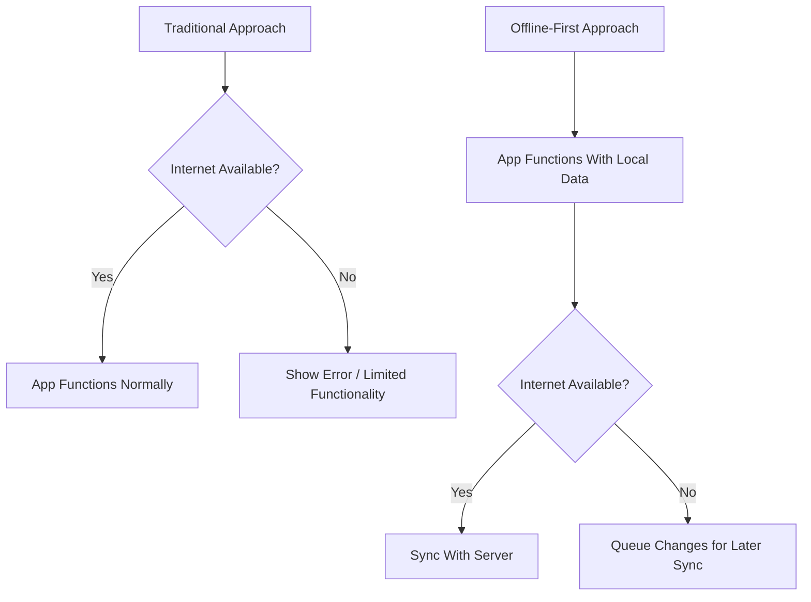

# Offline Capabilities

## Introduction

In the mobile-first world, users expect applications to work regardless of their connection status. Offline capabilities refer to a mobile app's ability to function properly even when the device has limited or no internet connectivity. This is a crucial aspect of mobile development that directly impacts user experience and retention.

Implementing offline capabilities is no longer just a nice-to-have feature—it's essential, especially in regions with inconsistent network coverage or for applications that users need to access in low-connectivity environments like subways, airplanes, or rural areas.

## Understanding Offline-First Design

Offline-first is a design approach that prioritizes the offline experience of an application. Instead of treating offline mode as an error state, offline-first applications are built assuming that network connectivity is optional.



## Key Components of Offline Capabilities

### 1. Local Data Storage

The foundation of any offline-capable application is local data storage. Several options are available depending on your platform:

#### For Native Apps:

- **iOS**: Core Data, Realm, SQLite
- **Android**: Room Persistence Library, SQLite, SharedPreferences

#### For Cross-Platform Solutions:

- **React Native**: AsyncStorage, Realm, SQLite
- **Flutter**: Hive, SQFlite, SharedPreferences

#### Example: Using Room in Android

```kotlin
// Define the entity
@Entity(tableName = "tasks")
data class Task(
    @PrimaryKey(autoGenerate = true) val id: Int = 0,
    val title: String,
    val description: String,
    val isDone: Boolean = false,
    val syncedWithServer: Boolean = false
)

// Create the DAO (Data Access Object)
@Dao
interface TaskDao {
    @Query("SELECT * FROM tasks")
    fun getAllTasks(): List<Task>
    
    @Insert
    fun insert(task: Task)
    
    @Update
    fun update(task: Task)
    
    @Query("SELECT * FROM tasks WHERE syncedWithServer = 0")
    fun getUnsynced(): List<Task>
}

// Implementation in a repository
class TaskRepository(private val taskDao: TaskDao) {
    fun saveTask(task: Task) {
        taskDao.insert(task)
    }
    
    fun getUnsyncedTasks(): List<Task> {
        return taskDao.getUnsynced()
    }
}
```

### 2. Caching Strategies

Caching involves storing copies of resources locally to avoid unnecessary network requests. Various caching strategies include:

- **Cache-First**: Check cache first, use network only if necessary
- **Network-First**: Try network first, fall back to cache
- **Stale-While-Revalidate**: Use cache immediately while updating it in the background

#### Example: Implementing Cache-First Strategy in React Native

```javascript
async function fetchData(url) {
  try {
    // Check if we have cached data
    const cachedData = await AsyncStorage.getItem(url);
    
    if (cachedData) {
      // Return cached data immediately
      return JSON.parse(cachedData);
    }
    
    // If no cached data, fetch from network
    const response = await fetch(url);
    const data = await response.json();
    
    // Cache the results
    await AsyncStorage.setItem(url, JSON.stringify(data));
    
    return data;
  } catch (error) {
    console.error('Error fetching data:', error);
    
    // If we have cached data, return it even if network request fails
    const cachedData = await AsyncStorage.getItem(url);
    if (cachedData) {
      return JSON.parse(cachedData);
    }
    
    throw error;
  }
}
```

### 3. Data Synchronization

Data synchronization is the process of keeping local data and server data consistent. This involves:

- **Conflict Resolution**: Handling cases where the same data was modified both locally and on the server
- **Queue Management**: Managing pending operations that need to be synchronized
- **Optimistic UI Updates**: Updating the UI immediately while synchronization happens in the background

#### Example: Basic Synchronization with Conflict Resolution in Flutter

```dart
class SyncService {
  final ApiService api;
  final Database db;
  
  SyncService(this.api, this.db);
  
  Future<void> syncTasks() async {
    // Get all local changes
    final List<Task> localChanges = await db.getUnsyncedTasks();
    
    for (var task in localChanges) {
      try {
        // Get the latest version from server
        final serverTask = await api.getTask(task.id);
        
        if (serverTask == null) {
          // New task - create on server
          final createdTask = await api.createTask(task);
          await db.updateTaskSync(createdTask.id, true);
        } else if (serverTask.updatedAt > task.updatedAt) {
          // Server has newer version - handle conflict
          // Strategy: Keep server version but flag for user review
          await db.updateTask(serverTask.copyWith(needsReview: true));
        } else {
          // Local version is newer - update server
          await api.updateTask(task);
          await db.updateTaskSync(task.id, true);
        }
      } catch (e) {
        // Network error or other issue - try again later
        print('Failed to sync task ${task.id}: $e');
      }
    }
    
    // Fetch and store any new server changes
    try {
      final serverTasks = await api.getAllTasks();
      await db.mergeServerTasks(serverTasks);
    } catch (e) {
      print('Failed to fetch server tasks: $e');
    }
  }
}
```

### 4. Network Detection

Applications need to detect network status changes to adapt their behavior accordingly:

#### Example: Network Detection in React Native

```javascript
import NetInfo from "@react-native-community/netinfo";

// Subscribe to network status changes
const unsubscribe = NetInfo.addEventListener(state => {
  console.log("Connection type:", state.type);
  console.log("Is connected?:", state.isConnected);
  
  if (state.isConnected) {
    // We're online - start synchronization
    synchronizeData();
  } else {
    // We're offline - update UI and stop unnecessary requests
    setOfflineMode(true);
  }
});

// Don't forget to unsubscribe when the component unmounts
useEffect(() => {
  return () => {
    unsubscribe();
  };
}, []);
```

## Implementing Offline Capabilities in Progressive Web Apps (PWAs)

Progressive Web Apps bring native-like offline capabilities to web applications using Service Workers and other modern web technologies.

### Service Workers

Service Workers act as a programmable network proxy, allowing you to intercept network requests and respond with cached resources.

```javascript
// Register service worker
if ('serviceWorker' in navigator) {
  window.addEventListener('load', () => {
    navigator.serviceWorker.register('/service-worker.js')
      .then(registration => {
        console.log('Service Worker registered successfully:', registration.scope);
      })
      .catch(error => {
        console.log('Service Worker registration failed:', error);
      });
  });
}

// In service-worker.js
const CACHE_NAME = 'my-app-cache-v1';
const urlsToCache = [
  '/',
  '/index.html',
  '/styles/main.css',
  '/scripts/main.js',
  '/images/logo.png'
];

// Install the service worker and cache initial resources
self.addEventListener('install', event => {
  event.waitUntil(
    caches.open(CACHE_NAME)
      .then(cache => {
        return cache.addAll(urlsToCache);
      })
  );
});

// Intercept fetch requests
self.addEventListener('fetch', event => {
  event.respondWith(
    caches.match(event.request)
      .then(response => {
        // Cache hit - return the response from the cache
        if (response) {
          return response;
        }
        
        // Clone the request because it's a one-time use stream
        const fetchRequest = event.request.clone();
        
        return fetch(fetchRequest).then(response => {
          // Check if we received a valid response
          if (!response || response.status !== 200 || response.type !== 'basic') {
            return response;
          }
          
          // Clone the response because it's a one-time use stream
          const responseToCache = response.clone();
          
          caches.open(CACHE_NAME)
            .then(cache => {
              cache.put(event.request, responseToCache);
            });
            
          return response;
        });
      })
  );
});
```

### Using IndexedDB for Structured Data Storage in PWAs

For more complex data storage needs in web applications, IndexedDB provides a powerful solution:

```javascript
// Open database
const openDB = () => {
  return new Promise((resolve, reject) => {
    const request = indexedDB.open('MyTasksDB', 1);
    
    request.onupgradeneeded = (event) => {
      const db = event.target.result;
      if (!db.objectStoreNames.contains('tasks')) {
        const store = db.createObjectStore('tasks', { keyPath: 'id' });
        store.createIndex('syncStatus', 'syncedWithServer', { unique: false });
      }
    };
    
    request.onsuccess = () => resolve(request.result);
    request.onerror = () => reject(request.error);
  });
};

// Add task to IndexedDB
const saveTask = async (task) => {
  const db = await openDB();
  return new Promise((resolve, reject) => {
    const transaction = db.transaction(['tasks'], 'readwrite');
    const store = transaction.objectStore('tasks');
    
    // Add timestamp and sync status
    const taskToSave = {
      ...task,
      updatedAt: new Date().getTime(),
      syncedWithServer: false
    };
    
    const request = store.put(taskToSave);
    
    request.onsuccess = () => resolve(request.result);
    request.onerror = () => reject(request.error);
    
    transaction.oncomplete = () => db.close();
  });
};

// Get all unsynced tasks
const getUnsyncedTasks = async () => {
  const db = await openDB();
  return new Promise((resolve, reject) => {
    const transaction = db.transaction(['tasks'], 'readonly');
    const store = transaction.objectStore('tasks');
    const index = store.index('syncStatus');
    
    const request = index.getAll(IDBKeyRange.only(false));
    
    request.onsuccess = () => resolve(request.result);
    request.onerror = () => reject(request.error);
    
    transaction.oncomplete = () => db.close();
  });
};
```

## Best Practices for Offline Capabilities

### 1. Adopt an Offline-First Mindset

- Design your application assuming users will be offline
- Make the default experience work without a network connection
- Enhance the experience when a network is available

### 2. Communicate Connection Status Clearly

Let users know when they're working offline and when data will be synchronized:

```javascript
function ConnectionStatus({ isOnline }) {
  return (
    <div className={`connection-status ${isOnline ? 'online' : 'offline'}`}>
      {isOnline 
        ? <span>✓ Connected: All changes are saved</span>
        : <span>⚠ Offline: Changes will sync when you're back online</span>
      }
    </div>
  );
}
```

### 3. Implement Smart Retries

Don't bombard the server with retries. Use an exponential backoff strategy:

```javascript
async function fetchWithRetry(url, options = {}, retries = 3, initialDelay = 1000) {
  try {
    return await fetch(url, options);
  } catch (error) {
    if (retries === 0) throw error;
    
    console.log(`Retrying in ${initialDelay}ms...`);
    
    // Wait for the specified delay
    await new Promise(resolve => setTimeout(resolve, initialDelay));
    
    // Retry with exponential backoff
    return fetchWithRetry(
      url, 
      options, 
      retries - 1, 
      initialDelay * 2
    );
  }
}
```

### 4. Optimize Bandwidth When Reconnecting

When a connection is restored, be mindful of bandwidth constraints:

- Prioritize critical synchronizations
- Batch update requests to reduce overhead
- Consider compressing data
- Implement delta syncs (only sending what changed)

### 5. Regular Testing in Airplane Mode

Regularly test your application in true offline conditions:

- Enable airplane mode on your device
- Use the application normally
- Re-enable connectivity and verify synchronization
- Check for data conflicts and resolution

## Real-World Applications

### Example 1: Offline Note-Taking App

A note-taking application needs to:
- Store notes locally using SQLite or Room
- Allow creating, editing, and deleting notes while offline
- Sync changes when the device reconnects
- Handle conflicts if the same note was edited on multiple devices

### Example 2: Field Service Application

For field technicians working in areas with poor connectivity:
- Download work orders and customer data before leaving for assignments
- Capture photos, signatures, and completion details offline
- Queue all data for submission when connectivity is restored
- Provide clear indicators of sync status for each work order

### Example 3: Media Streaming App with Offline Playback

A music or video streaming app that supports offline playback:
- Allow users to download content for offline viewing
- Manage storage space efficiently
- Track playback progress locally
- Sync usage statistics and history when reconnected

## Common Interview Questions About Offline Capabilities

1. **Q: What are the key challenges in implementing offline functionality in mobile apps?**
   
   A: The main challenges include data synchronization, conflict resolution, managing storage constraints, providing a consistent user experience, and ensuring data integrity across offline and online states.

2. **Q: How would you handle conflict resolution when the same data is modified both offline and on the server?**
   
   A: Common strategies include:
   - Last-write-wins (based on timestamps)
   - Server-wins (server data takes precedence)
   - Client-wins (local changes take precedence)
   - Three-way merging (comparing base, client, and server versions)
   - Presenting conflicts to users for manual resolution

3. **Q: How would you optimize battery usage in an app with offline capabilities?**
   
   A: Optimize by batching network operations when reconnected, using efficient sync algorithms, implementing intelligent retry mechanisms, and adapting sync frequency based on battery levels and connectivity quality.

## Summary

Offline capabilities are essential for creating resilient mobile applications that provide consistent user experiences regardless of network conditions. Key components include:

- Local data storage solutions appropriate for your platform
- Effective caching strategies for different types of content
- Robust data synchronization mechanisms with conflict resolution
- Network detection to adapt application behavior

By adopting an offline-first mindset from the beginning of development, you can build applications that are more reliable, user-friendly, and suited to real-world usage conditions where network connectivity is never guaranteed.

## Additional Resources

- [Mozilla Developer Network: Offline Web Applications](https://developer.mozilla.org/en-US/docs/Web/Progressive_web_apps/Offline_Service_workers)
- [Google Developers: Offline Storage for Progressive Web Apps](https://developer.chrome.com/docs/apps/offline_storage)
- [Room Persistence Library Documentation (Android)](https://developer.android.com/training/data-storage/room)
- [Service Worker API (MDN)](https://developer.mozilla.org/en-US/docs/Web/API/Service_Worker_API)

## Exercises

1. Create a simple to-do list app that works offline and synchronizes when a connection is available.
2. Implement different caching strategies (cache-first, network-first, stale-while-revalidate) and compare their performance in different network conditions.
3. Design a conflict resolution algorithm for a collaborative note-taking application where multiple users can edit the same document offline.
4. Implement a storage management system that prioritizes which content to keep offline based on user behavior and available storage.
5. Create a PWA with a service worker that caches essential resources and provides a full offline experience.