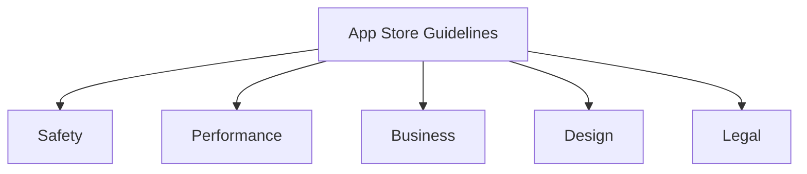

# App Store Guidelines

## Introduction

App store guidelines are the rules and policies that govern what kinds of applications can be published on major mobile app marketplaces like Apple's App Store and Google's Play Store. These guidelines ensure quality, security, and consistency across the platform ecosystem. Understanding these requirements is crucial for mobile developers, as failing to comply can lead to rejections during the review process or even removal of existing apps.

In this guide, we'll explore the key aspects of app store guidelines that every beginner mobile developer should know before submitting their applications.

## Core Guidelines Categories

Both major app stores organize their guidelines into several categories:



### 1. Safety Guidelines

Safety guidelines focus on protecting users from harmful, offensive, or inappropriate content.

#### Key Safety Requirements:

- **User-Generated Content**: Apps that allow users to create or share content must include:
  - Content filtering mechanisms
  - A way to report offensive content
  - The ability to block abusive users

- **Children's Apps**: Applications targeted at children must:
  - Comply with children's privacy laws (COPPA in the US)
  - Not collect personal information without parental consent
  - Not contain direct links to purchase pages

**Example**: Review Mechanism Implementation

```jsx
function ReportContentButton({ contentId, contentType }) {
  const reportContent = async () => {
    try {
      const reason = await showReportDialog();
      
      if (reason) {
        await apiClient.reportContent({
          contentId,
          contentType,
          reason
        });
        
        showSuccessMessage("Thank you for reporting this content");
      }
    } catch (error) {
      showErrorMessage("Failed to report content");
    }
  };
  
  return (
    <Button 
      onPress={reportContent}
      accessibilityLabel="Report inappropriate content"
    >
      Report
    </Button>
  );
}
```

### 2. Performance Guidelines

Performance guidelines ensure apps run smoothly, don't crash, and use device resources appropriately.

#### Key Performance Requirements:

- **Stability**: Apps should not crash, freeze, or display obvious technical problems
- **Responsiveness**: Apps should respond to user input within a reasonable time
- **Battery Usage**: Apps should not drain battery unnecessarily
- **Memory Management**: Apps should manage memory efficiently

**Example**: Efficient Image Loading

```jsx
import { Image } from 'react-native';
import { memo } from 'react';

const OptimizedImage = memo(({ uri, style }) => {
  return (
    <Image
      source={{ uri }}
      style={style}
      // Enable caching
      cachePolicy="memory-disk"
      // Load images at appropriate resolutions
      resizeMode="cover"
      // Lazy load images that might be off-screen
      loading="lazy"
      // Show placeholder while loading
      defaultSource={require('./placeholder.png')}
    />
  );
});

export default OptimizedImage;
```

### 3. Business Model Guidelines

These guidelines cover how apps can monetize and what business practices are allowed.

#### Key Business Requirements:

- **In-App Purchases**: Digital goods must use the platform's in-app purchase system
- **Subscription Models**: Must clearly disclose renewal terms and pricing
- **Free Trials**: Must clearly communicate when free trials end and what users will be charged
- **Commission Fees**: Platform fees typically range from 15-30% of revenue

**Example**: Implementing In-App Purchases (iOS)

```swift
import StoreKit

class PurchaseManager {
    func purchaseProduct(withID productID: String) {
        // Request the products from App Store
        let request = SKProductsRequest(productIdentifiers: [productID])
        request.delegate = self
        request.start()
    }
}

extension PurchaseManager: SKProductsRequestDelegate {
    func productsRequest(_ request: SKProductsRequest, 
                        didReceive response: SKProductsResponse) {
        if let product = response.products.first {
            // Present the product for purchase
            let payment = SKPayment(product: product)
            SKPaymentQueue.default().add(payment)
        }
    }
}
```

### 4. Design Guidelines

Design guidelines ensure apps provide a consistent user experience aligned with platform standards.

#### Key Design Requirements:

- **Platform Consistency**: Follow platform UI/UX patterns
- **Accessibility**: Support features like VoiceOver, Dynamic Type, etc.
- **Layout**: Adapt to different screen sizes and orientations
- **App Icons**: Follow specific size and design requirements

**Example**: Implementing Accessibility Features

```jsx
import { View, Text, TouchableOpacity } from 'react-native';

function AccessibleButton({ onPress, label, hint }) {
  return (
    <TouchableOpacity
      onPress={onPress}
      accessible={true}
      accessibilityLabel={label}
      accessibilityHint={hint}
      accessibilityRole="button"
    >
      <View style={styles.button}>
        <Text style={styles.buttonText}>{label}</Text>
      </View>
    </TouchableOpacity>
  );
}
```

### 5. Legal Guidelines

Legal guidelines ensure apps comply with international and regional laws.

#### Key Legal Requirements:

- **Privacy Policy**: All apps must have a clear privacy policy
- **Data Collection**: Transparency about what data is collected and how it's used
- **Intellectual Property**: Must not infringe on others' IP
- **Regional Compliance**: Must comply with local laws in regions where the app is available

**Example**: Implementing a Privacy Consent Flow

```jsx
import React, { useState, useEffect } from 'react';
import AsyncStorage from '@react-native-async-storage/async-storage';

function PrivacyConsentScreen({ onAccept }) {
  const [consented, setConsented] = useState(false);
  
  useEffect(() => {
    // Check if user has previously consented
    AsyncStorage.getItem('privacyConsented')
      .then(value => {
        if (value === 'true') {
          setConsented(true);
          onAccept();
        }
      });
  }, []);
  
  const handleConsent = async () => {
    await AsyncStorage.setItem('privacyConsented', 'true');
    setConsented(true);
    onAccept();
  };
  
  if (consented) return null;
  
  return (
    <View style={styles.container}>
      <Text style={styles.title}>Privacy Policy</Text>
      <Text style={styles.description}>
        Our app collects the following data to provide you with a better experience:
        {''}- Device information
        {''}- Usage statistics
        {''}- User preferences
      </Text>
      <Button 
        title="Accept" 
        onPress={handleConsent} 
      />
      <LinkButton 
        title="View Full Privacy Policy" 
        onPress={showFullPrivacyPolicy} 
      />
    </View>
  );
}
```

## App Store vs. Play Store: Key Differences

While both app stores have similar core principles, there are notable differences:

| Aspect               | Apple App Store                   | Google Play Store                         |
|----------------------|-----------------------------------|-------------------------------------------|
| Review Process       | Manual review, typically 1-3 days | Initial automated review, hours to 1 day  |
| Content Restrictions | Stricter content policies         | More permissive in some categories        |
| Testing Mechanisms   | TestFlight                        | Internal, Closed, and Open Testing tracks |
| Update Frequency     | Same review for all updates       | Faster for minor updates                  |
| Developer Fee        | $99/year                          | $25 one-time fee                          |

## Best Practices for App Store Approval

### 1. Test Thoroughly Before Submission

Ensure your app is fully functional and meets all requirements before submission:

```jsx
// Example of implementing proper error handling
try {
  // Attempt to perform an operation
  const result = await performRiskyOperation();
  handleSuccess(result);
} catch (error) {
  // Gracefully handle and log the error
  logErrorToMonitoringService(error);
  
  // Show user-friendly error message
  if (error.code === 'NETWORK_ERROR') {
    showMessage('Please check your internet connection and try again');
  } else {
    showMessage('Something went wrong. Please try again later');
  }
}
```

### 2. Provide Complete Metadata

Always include:
- Accurate app descriptions
- High-quality screenshots
- Preview videos (if applicable)
- Relevant keywords

### 3. Be Transparent About Functionality

Don't hide or misrepresent features, especially:
- Data collection practices
- Subscription terms
- In-app purchases

### 4. Follow Platform-Specific Guidelines

```jsx
// iOS-specific code
import { Platform } from 'react-native';

function PlatformSpecificButton({ onPress, title }) {
  return (
    <TouchableOpacity
      onPress={onPress}
      style={[
        styles.button,
        Platform.OS === 'ios' 
          ? styles.iosButton  // iOS-specific styling
          : styles.androidButton  // Android-specific styling
      ]}
    >
      <Text style={styles.buttonText}>{title}</Text>
    </TouchableOpacity>
  );
}
```

### 5. Address Rejection Reasons Promptly

If your app is rejected:
- Read the rejection reason carefully
- Make the requested changes
- Include a detailed explanation with your resubmission

## Common Rejection Reasons

1. **Incomplete Information**
   - Missing privacy policy
   - Incomplete app metadata

2. **Performance Issues**
   - Crashes and bugs
   - Slow performance

3. **Legal Violations**
   - Copyright infringement
   - Misleading descriptions

4. **Design Problems**
   - Poor UI/UX
   - Not following platform guidelines

5. **Prohibited Content**
   - Inappropriate content
   - Content that mimics system functionality

## Implementation Checklist

Use this checklist before submitting your app:

- [ ] App is thoroughly tested on multiple devices
- [ ] All required permissions have clear explanations
- [ ] Privacy policy is up-to-date and accessible
- [ ] App metadata is complete and accurate
- [ ] In-app purchases are properly implemented
- [ ] Age ratings are appropriate
- [ ] Accessibility features are implemented
- [ ] App icon and screenshots meet requirements
- [ ] Contact information is current

## Summary

Understanding app store guidelines is critical for successful mobile app development. Both Apple's App Store and Google's Play Store have comprehensive rules covering safety, performance, business models, design, and legal compliance. Following these guidelines from the start of your development process will save time and frustration during the submission process.

Remember that these guidelines evolve over time, so staying updated with the latest changes is essential for continued success in mobile app development.

## Additional Resources

- Official Apple App Store Review Guidelines
- Google Play Console Help Center
- Mobile App Testing Best Practices
- Accessibility Development Guidelines

## Practice Exercises

1. Review a popular app and identify how it implements the various guideline categories discussed.

2. Create a simple app feature that demonstrates proper implementation of:
   - Accessibility requirements
   - Privacy consent flow
   - In-app purchase implementation

3. Develop a checklist for your specific app type that covers all relevant guideline categories.