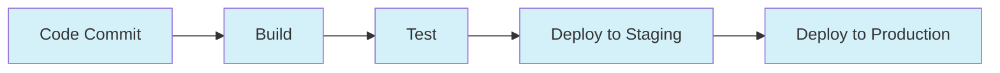
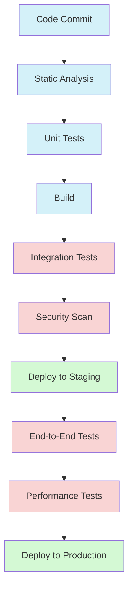

# CI/CD Pipelines

## Introduction

Continuous Integration and Continuous Deployment (CI/CD) pipelines form the backbone of modern DevOps practices. These automated workflows help development teams deliver code changes more frequently, reliably, and with fewer errors. If you're preparing for DevOps interviews or simply want to understand how modern software teams work, understanding CI/CD pipelines is essential.

In this guide, we'll explore what CI/CD pipelines are, how they work, and how to implement them in real-world projects.

## What is a CI/CD Pipeline?

A CI/CD pipeline is an automated sequence of steps that code changes go through from development to production deployment. It consists of two main components:

1. **Continuous Integration (CI)**: The practice of automatically integrating code changes from multiple contributors into a shared repository, followed by automated building and testing.

2. **Continuous Deployment/Delivery (CD)**: The practice of automatically deploying all code changes to a testing and/or production environment after the build stage.



## Benefits of CI/CD Pipelines

- **Faster Feedback**: Developers receive immediate feedback on code changes
- **Reduced Risk**: Smaller, incremental changes reduce deployment risk
- **Improved Code Quality**: Automated testing helps catch bugs early
- **Consistent Deployments**: Standardized deployment process
- **Increased Productivity**: Less manual work and faster delivery cycles

## Key Components of a CI/CD Pipeline

### 1. Source Control

All CI/CD pipelines start with source control, typically using Git repositories like GitHub, GitLab, or Bitbucket.

```bash
# Example of a typical Git workflow
git checkout -b feature/new-feature
# Make code changes
git add .
git commit -m "Add new feature"
git push origin feature/new-feature
# Create pull request
```

### 2. Build Stage

The build stage compiles the code, installs dependencies, and creates deployable artifacts.

```yaml
# Example build stage in GitHub Actions
build:
  runs-on: ubuntu-latest
  steps:
    - uses: actions/checkout@v3
    - name: Set up Node.js
      uses: actions/setup-node@v3
      with:
        node-version: '18'
    - name: Install dependencies
      run: npm ci
    - name: Build
      run: npm run build
```

### 3. Test Stage

The test stage runs automated tests to verify the code functions correctly.

```yaml
# Example test stage in GitHub Actions
test:
  needs: build
  runs-on: ubuntu-latest
  steps:
    - uses: actions/checkout@v3
    - name: Set up Node.js
      uses: actions/setup-node@v3
      with:
        node-version: '18'
    - name: Install dependencies
      run: npm ci
    - name: Run tests
      run: npm test
```

### 4. Deployment Stages

Deployment stages push the code to various environments, usually starting with staging and ending with production.

```yaml
# Example deployment stage in GitHub Actions
deploy-staging:
  needs: test
  runs-on: ubuntu-latest
  steps:
    - uses: actions/checkout@v3
    - name: Deploy to staging
      run: |
        echo "Deploying to staging environment"
        # Deploy commands here
        
deploy-production:
  needs: deploy-staging
  runs-on: ubuntu-latest
  if: github.ref == 'refs/heads/main'
  steps:
    - uses: actions/checkout@v3
    - name: Deploy to production
      run: |
        echo "Deploying to production environment"
        # Deploy commands here
```

## Popular CI/CD Tools

Here are some widely used CI/CD tools that you might encounter in interviews or real-world projects:

1. **Jenkins**: An open-source automation server with hundreds of plugins
2. **GitHub Actions**: Integrated CI/CD solution within GitHub
3. **GitLab CI/CD**: Built into the GitLab platform
4. **CircleCI**: Cloud-based CI/CD platform
5. **Travis CI**: CI service used to build and test projects
6. **AWS CodePipeline**: Continuous delivery service from AWS
7. **Azure DevOps Pipelines**: Microsoft's CI/CD solution

## Real-World CI/CD Pipeline Example

Let's create a complete CI/CD pipeline for a simple Node.js application using GitHub Actions.

### Step 1: Create a Workflow File

Create a file at `.github/workflows/main.yml`:

```yaml
name: CI/CD Pipeline

on:
  push:
    branches: [ main ]
  pull_request:
    branches: [ main ]

jobs:
  build:
    runs-on: ubuntu-latest
    steps:
      - uses: actions/checkout@v3
      - name: Setup Node.js
        uses: actions/setup-node@v3
        with:
          node-version: '18'
      - name: Install dependencies
        run: npm ci
      - name: Build
        run: npm run build
      - name: Save build artifacts
        uses: actions/upload-artifact@v3
        with:
          name: build-artifacts
          path: dist/

  test:
    needs: build
    runs-on: ubuntu-latest
    steps:
      - uses: actions/checkout@v3
      - name: Setup Node.js
        uses: actions/setup-node@v3
        with:
          node-version: '18'
      - name: Install dependencies
        run: npm ci
      - name: Run tests
        run: npm test
      - name: Run linter
        run: npm run lint

  deploy-staging:
    needs: test
    runs-on: ubuntu-latest
    if: github.event_name == 'push'
    steps:
      - uses: actions/checkout@v3
      - name: Download build artifacts
        uses: actions/download-artifact@v3
        with:
          name: build-artifacts
          path: dist/
      - name: Deploy to staging
        run: |
          echo "Deploying to staging environment"
          # Here you would include your actual staging deployment commands
          # For example, deploying to a cloud provider like Netlify, Vercel, or AWS

  deploy-production:
    needs: deploy-staging
    runs-on: ubuntu-latest
    if: github.event_name == 'push' && github.ref == 'refs/heads/main'
    steps:
      - uses: actions/checkout@v3
      - name: Download build artifacts
        uses: actions/download-artifact@v3
        with:
          name: build-artifacts
          path: dist/
      - name: Deploy to production
        run: |
          echo "Deploying to production environment"
          # Here you would include your actual production deployment commands
```

### Step 2: Understanding the Pipeline Flow

Let's break down what happens in this pipeline:

1. When code is pushed or a PR is created targeting the main branch, the pipeline starts
2. **Build job**: Compiles the application and saves the build artifacts
3. **Test job**: Runs unit tests and linting to ensure code quality
4. **Deploy to staging**: Deploys the application to the staging environment (only on push events)
5. **Deploy to production**: Deploys to production (only on push to main branch)

## Best Practices for CI/CD Pipelines

1. **Keep It Fast**: Optimize your pipeline to run as quickly as possible
2. **Fail Fast**: Run critical tests early in the pipeline
3. **Maintain Idempotency**: Pipeline should produce the same result regardless of how many times it runs
4. **Use Environment Variables**: Store secrets and configuration as environment variables
5. **Implement Quality Gates**: Set up quality thresholds that must be met to proceed
6. **Monitor Your Pipeline**: Track metrics like build time, success rate, and deployment frequency



## Common CI/CD Interview Questions

Here are some questions you might encounter in DevOps interviews:

1. **What is the difference between Continuous Integration, Continuous Delivery, and Continuous Deployment?**
   
   - **Continuous Integration**: Automatically integrating code changes from multiple contributors
   - **Continuous Delivery**: Automatically delivering code changes to a staging environment
   - **Continuous Deployment**: Automatically deploying code changes to production

2. **How would you handle database migrations in a CI/CD pipeline?**

   Database migrations should be part of your deployment process, using tools like Flyway, Liquibase, or built-in ORM migration tools. Always back up the database before running migrations.

3. **How do you handle secrets in a CI/CD pipeline?**

   Use the secret management features provided by your CI/CD tool. Never store secrets in your codebase. Consider using vault services like HashiCorp Vault or AWS Secrets Manager.

4. **What strategies would you use for zero-downtime deployments?**

   - Blue/Green deployments
   - Canary deployments
   - Rolling updates
   - Feature toggles

## Implementing a Basic CI/CD Pipeline for Your Project

Here's how to get started with CI/CD for your personal project:

### For GitHub-based Projects:

1. Create `.github/workflows/ci.yml` file
2. Define a basic pipeline:

```yaml
name: Basic CI/CD

on:
  push:
    branches: [ main ]
  pull_request:
    branches: [ main ]

jobs:
  build-and-test:
    runs-on: ubuntu-latest
    steps:
      - uses: actions/checkout@v3
      - name: Setup environment
        uses: actions/setup-node@v3
        with:
          node-version: '18'
      - name: Install dependencies
        run: npm ci
      - name: Run tests
        run: npm test
      - name: Build
        run: npm run build
```

This simple pipeline will:
- Trigger on push to main or when a PR targets main
- Set up a Node.js environment
- Install dependencies
- Run tests
- Build the application

As your project grows, you can expand this pipeline to include more stages and sophisticated deployment processes.

## Summary

CI/CD pipelines form the foundation of modern software development practices. They automate the process of integrating, testing, and deploying code, resulting in faster delivery cycles and higher-quality software.

Key takeaways:
- CI/CD pipelines automate building, testing, and deployment
- They provide faster feedback and reduce deployment risks
- Major components include source control, build, test, and deployment stages
- Many tools exist to implement CI/CD (Jenkins, GitHub Actions, GitLab CI, etc.)
- Best practices include keeping pipelines fast, secure, and reliable

## Additional Resources

To deepen your understanding of CI/CD pipelines:

1. Explore official documentation:
   - [GitHub Actions Documentation](https://docs.github.com/en/actions)
   - [Jenkins User Documentation](https://www.jenkins.io/doc/)
   - [GitLab CI/CD Documentation](https://docs.gitlab.com/ee/ci/)

2. Try implementing CI/CD for your personal projects

3. Practice CI/CD concepts with exercises:
   - Set up a basic CI pipeline for a sample application
   - Implement automated testing in your pipeline
   - Configure multi-environment deployments
   - Explore advanced features like matrix builds or parallel testing

By mastering CI/CD pipelines, you'll be well-prepared for DevOps interviews and equipped to implement efficient software delivery processes in your projects.