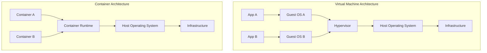
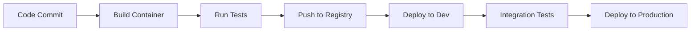

# Containerization

## Introduction

Containerization is a lightweight virtualization technology that allows you to package an application along with its dependencies, libraries, and configuration files into a single, portable unit called a container. Unlike traditional virtual machines, containers share the host system's kernel but run in isolated user spaces, making them more efficient and faster to deploy.

In the DevOps world, containerization has revolutionized how applications are developed, tested, and deployed across different environments, ensuring consistency and reducing the "it works on my machine" problem.

## Why Containerization Matters

Containerization solves several critical challenges in modern software development:

1. **Consistency**: Containers run the same way regardless of where they're deployed
2. **Isolation**: Applications run in their own environment without interfering with each other
3. **Portability**: Containers can run anywhere that supports the container runtime
4. **Efficiency**: Containers share OS resources, making them lightweight
5. **Scalability**: Containers can be easily replicated to handle increased load

## Container vs. Virtual Machine

Before diving deeper, let's understand how containers differ from traditional virtual machines:



The key differences include:

| Feature | Containers | Virtual Machines |
|---------|-----------|------------------|
| Size | Typically MBs | Often GBs |
| Startup time | Seconds | Minutes |
| Resource usage | Low overhead | Higher overhead |
| OS | Shares host kernel | Requires full OS per VM |
| Isolation | Process-level | Hardware-level |

## Container Technologies

### Docker: The Industry Standard

[Docker](https://www.docker.com/) is the most widely used containerization platform. It provides a complete ecosystem for building, shipping, and running containers.

#### Key Docker Components

1. **Docker Engine**: The runtime that builds and runs containers
2. **Docker Images**: Read-only templates used to create containers
3. **Docker Containers**: Running instances of Docker images
4. **Dockerfile**: Text document with instructions to build a Docker image
5. **Docker Hub**: A repository for sharing Docker images
6. **Docker Compose**: A tool for defining and running multi-container applications

### Creating Your First Docker Container

Let's build a simple Docker container for a Node.js application:

1. First, create a `Dockerfile`:

```dockerfile
# Use an official Node.js runtime as the base image
FROM node:14-alpine

# Set the working directory in the container
WORKDIR /app

# Copy package.json and package-lock.json
COPY package*.json ./

# Install dependencies
RUN npm install

# Copy application code to the container
COPY . .

# Expose port 3000
EXPOSE 3000

# Command to run the application
CMD ["node", "app.js"]
```

2. Build the Docker image:

```bash
docker build -t my-node-app .
```

Output:
```
Sending build context to Docker daemon  2.76MB
Step 1/7 : FROM node:14-alpine
 ---> fe39f43f1d22
Step 2/7 : WORKDIR /app
 ---> Using cache
 ---> 9c7a259bf845
Step 3/7 : COPY package*.json ./
 ---> 6d631e46f3dd
Step 4/7 : RUN npm install
 ---> Running in a2b1d5c7f9ed
added 127 packages in 4.5s
Removing intermediate container a2b1d5c7f9ed
 ---> 8e5c7bc9ce3e
Step 5/7 : COPY . .
 ---> e7d7eb90a4fe
Step 6/7 : EXPOSE 3000
 ---> Running in 4a6536e8d4b2
Removing intermediate container 4a6536e8d4b2
 ---> 2c1b2e2fe9a5
Step 7/7 : CMD ["node", "app.js"]
 ---> Running in 7b02c72f28f1
Removing intermediate container 7b02c72f28f1
 ---> b3f492a8432d
Successfully built b3f492a8432d
Successfully tagged my-node-app:latest
```

3. Run the container:

```bash
docker run -p 3000:3000 my-node-app
```

This command maps port 3000 from your host to port 3000 in the container.

## Container Orchestration

As applications grow more complex, managing individual containers becomes challenging. Container orchestration tools automate the deployment, scaling, and management of containerized applications.

### Kubernetes: The Container Orchestrator

[Kubernetes](https://kubernetes.io/) (often abbreviated as K8s) is an open-source platform for automating deployment, scaling, and operations of containerized applications.

#### Key Kubernetes Concepts

1. **Pods**: The smallest deployable units that can contain one or more containers
2. **Services**: Defines how to access pods
3. **Deployments**: Manages the desired state for pods and ReplicaSets
4. **Nodes**: Worker machines in the Kubernetes cluster
5. **Cluster**: A set of nodes running containerized applications

#### Basic Kubernetes Example

Here's a simple Kubernetes deployment for our Node.js application:

```yaml
apiVersion: apps/v1
kind: Deployment
metadata:
  name: nodejs-deployment
spec:
  replicas: 3
  selector:
    matchLabels:
      app: nodejs
  template:
    metadata:
      labels:
        app: nodejs
    spec:
      containers:
      - name: nodejs
        image: my-node-app:latest
        ports:
        - containerPort: 3000
---
apiVersion: v1
kind: Service
metadata:
  name: nodejs-service
spec:
  selector:
    app: nodejs
  ports:
  - port: 80
    targetPort: 3000
  type: LoadBalancer
```

This configuration:
- Creates a deployment with 3 replicas of our Node.js application
- Sets up a service to expose the application externally

## Docker Compose: Multi-Container Applications

For simpler multi-container applications, Docker Compose provides an easier alternative to Kubernetes.

Here's an example `docker-compose.yml` file for a web application with Node.js and MongoDB:

```yaml
version: '3'
services:
  web:
    build: .
    ports:
      - "3000:3000"
    depends_on:
      - mongodb
    environment:
      - MONGO_URL=mongodb://mongodb:27017/myapp
  
  mongodb:
    image: mongo:4.4
    volumes:
      - mongo-data:/data/db
    ports:
      - "27017:27017"

volumes:
  mongo-data:
```

To run this multi-container application:

```bash
docker-compose up
```

## Container Best Practices

### 1. Keep Containers Small

Smaller containers start faster and have fewer security vulnerabilities:

- Use Alpine-based images when possible
- Implement multi-stage builds
- Only install necessary packages

Example of a multi-stage build:

```dockerfile
# Build stage
FROM node:14 AS build
WORKDIR /app
COPY package*.json ./
RUN npm install
COPY . .
RUN npm run build

# Production stage
FROM node:14-alpine
WORKDIR /app
COPY --from=build /app/dist ./dist
COPY --from=build /app/node_modules ./node_modules
COPY package*.json ./
EXPOSE 3000
CMD ["npm", "start"]
```

### 2. Use Non-Root Users

Running containers as root is a security risk:

```dockerfile
FROM node:14-alpine

# Create app directory
WORKDIR /app

# Create a non-root user
RUN addgroup -S appgroup && adduser -S appuser -G appgroup

# Change ownership of the application files
COPY --chown=appuser:appgroup . .

# Switch to non-root user
USER appuser

EXPOSE 3000
CMD ["node", "app.js"]
```

### 3. Implement Health Checks

Health checks ensure containers are functioning correctly:

```dockerfile
FROM nginx:alpine
HEALTHCHECK --interval=30s --timeout=3s \
  CMD curl -f http://localhost/ || exit 1
```

### 4. Use Volume Mounts for Persistent Data

Containers are ephemeral, so store persistent data in volumes:

```bash
docker run -d \
  --name mongodb \
  -v mongodb-data:/data/db \
  mongo:4.4
```

## Container Security

Security is crucial for containerized applications:

1. **Scan images for vulnerabilities**:
   ```bash
   docker scan my-node-app
   ```

2. **Limit container resources**:
   ```bash
   docker run --memory="512m" --cpus="0.5" my-node-app
   ```

3. **Use secrets management**:
   ```bash
   docker run --name my-app \
     --secret source=app_secret,target=/app/secrets/app_secret \
     my-node-app
   ```

4. **Implement network segmentation with Docker networks**:
   ```bash
   docker network create backend
   docker network create frontend
   docker run --network=backend --name api my-api-app
   docker run --network=frontend --name web my-web-app
   ```

## Containerization in CI/CD Pipelines

Containers integrate well with CI/CD pipelines:



Example GitHub Actions workflow:

```yaml
name: Build and Deploy

on:
  push:
    branches: [ main ]

jobs:
  build:
    runs-on: ubuntu-latest
    steps:
    - uses: actions/checkout@v2
    
    - name: Build and push Docker image
      uses: docker/build-push-action@v2
      with:
        context: .
        push: true
        tags: myapp:latest
    
    - name: Deploy to Kubernetes
      uses: steebchen/kubectl@v2
      with:
        config: ${{ secrets.KUBE_CONFIG_DATA }}
        command: apply -f k8s/deployment.yaml
```

## Common Interview Questions about Containerization

1. **What is the difference between a container and a virtual machine?**
   - Containers share the host OS kernel and are more lightweight, while VMs include a full OS.

2. **Explain the concept of container orchestration and why it's important.**
   - Container orchestration automates deployment, scaling, and management of containerized applications, ensuring high availability and efficient resource utilization.

3. **What are the key components of a Dockerfile?**
   - FROM (base image), WORKDIR, COPY/ADD, RUN, EXPOSE, CMD/ENTRYPOINT, etc.

4. **What is the difference between CMD and ENTRYPOINT in a Dockerfile?**
   - CMD provides default commands that can be overridden, while ENTRYPOINT specifies the executable that will always run when the container starts.

5. **How do you handle sensitive data in containers?**
   - Use secrets management, environment variables, or mount sensitive files from secure external sources.

## Summary

Containerization has transformed modern software development by providing consistent, portable, and efficient environments for applications. Docker dominates as the standard containerization tool, while Kubernetes offers robust orchestration for complex deployments.

Key takeaways:

1. Containers provide lightweight, portable, and consistent environments
2. Docker simplifies container creation and management
3. Kubernetes excels at orchestrating containers at scale
4. Container best practices focus on security, size, and portability
5. Containerization integrates seamlessly with CI/CD pipelines

## Exercises

1. Build a Docker container for a simple web application
2. Create a multi-container application using Docker Compose
3. Deploy a containerized application to a cloud provider (AWS, GCP, or Azure)
4. Implement a CI/CD pipeline that builds and deploys containers
5. Secure a containerized application following best practices

## Additional Resources

- [Docker Documentation](https://docs.docker.com/)
- [Kubernetes Documentation](https://kubernetes.io/docs/home/)
- [Container Security Best Practices](https://docs.docker.com/develop/security-best-practices/)
- ["Docker Deep Dive" by Nigel Poulton](https://www.amazon.com/Docker-Deep-Dive-Nigel-Poulton/dp/1521822808)
- ["Kubernetes: Up and Running" by Brendan Burns, Joe Beda, and Kelsey Hightower](https://www.amazon.com/Kubernetes-Running-Dive-Future-Infrastructure/dp/1492046531)