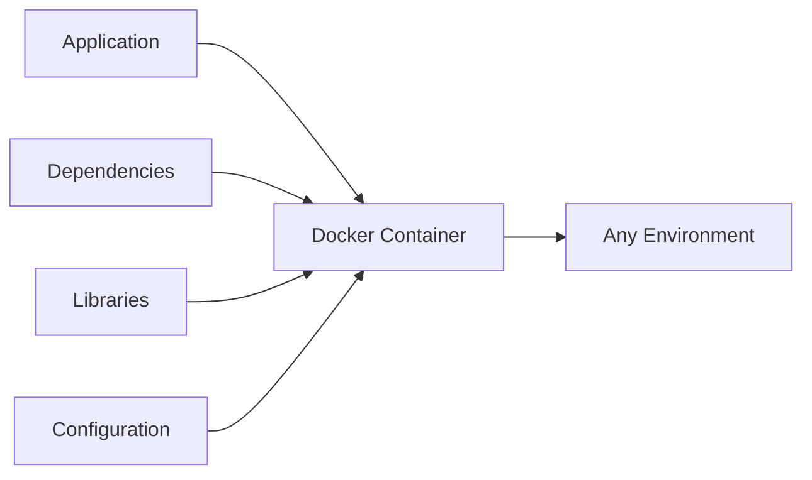
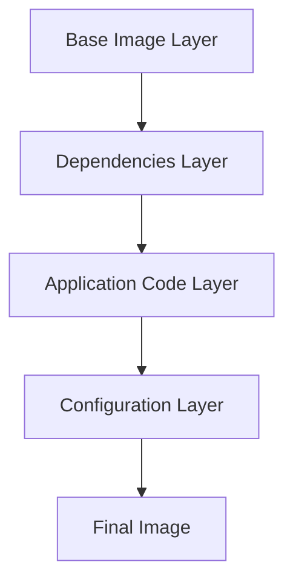

# Docker Questions

## Introduction

Docker is a platform that enables developers to build, package, and distribute applications as containers. Containers are lightweight, standalone, executable software packages that include everything needed to run an application: code, runtime, system tools, system libraries, and settings. Docker simplifies the process of creating, deploying, and running applications by using containerization technology.

In this guide, we'll explore common Docker concepts, commands, and best practices that often appear in DevOps and cloud computing interviews. Whether you're preparing for a technical interview or just want to strengthen your Docker knowledge, this comprehensive resource will help you understand the fundamentals and advanced topics.

## Docker Fundamentals

### What is Docker?

Docker is an open-source platform that automates the deployment of applications inside lightweight, portable containers. Containers allow a developer to package up an application with all parts it needs, such as libraries and other dependencies, and ship it all out as one package.



### Docker vs. Virtual Machines

One common interview question asks about the difference between Docker containers and virtual machines.

| Docker Containers | Virtual Machines |
|-------------------|------------------|
| Share the host OS kernel | Run on a hypervisor with full OS |
| Lightweight (MBs) | Heavy (GBs) |
| Start in seconds | Start in minutes |
| Less resource intensive | More resource intensive |
| Less isolated | More isolated |

### Key Docker Components

Docker architecture consists of several key components:

1. **Docker Engine**: The core of Docker that creates and runs containers
2. **Docker Image**: A read-only template with instructions for creating a Docker container
3. **Docker Container**: A runnable instance of an image
4. **Docker Registry**: A repository for Docker images (like Docker Hub)
5. **Dockerfile**: A text file with instructions to build a Docker image
6. **Docker Compose**: A tool for defining and running multi-container applications

## Essential Docker Commands

### Basic Docker Commands

Here are some fundamental Docker commands you should know for interviews:

```bash
# List all running containers
docker ps

# List all containers (including stopped)
docker ps -a

# Pull an image from Docker Hub
docker pull ubuntu:20.04

# Run a container
docker run -d -p 8080:80 nginx

# Stop a container
docker stop container_id

# Remove a container
docker rm container_id

# List all images
docker images

# Remove an image
docker rmi image_id

# View container logs
docker logs container_id
```

### Docker Image Management

```bash
# Build an image from a Dockerfile
docker build -t myapp:1.0 .

# Tag an image
docker tag myapp:1.0 username/myapp:latest

# Push an image to Docker Hub
docker push username/myapp:latest

# Save an image to a tar file
docker save -o myapp.tar myapp:1.0

# Load an image from a tar file
docker load -i myapp.tar
```

## Dockerfile Explained

A Dockerfile is a text document containing instructions to build a Docker image. Here's a sample Dockerfile with explanations:

```dockerfile
# Base image
FROM node:14-alpine

# Set working directory
WORKDIR /app

# Copy package.json and package-lock.json
COPY package*.json ./

# Install dependencies
RUN npm install

# Copy source code
COPY . .

# Build the application
RUN npm run build

# Expose port
EXPOSE 3000

# Command to run the application
CMD ["npm", "start"]
```

Let's break down each directive:

- `FROM`: Specifies the base image
- `WORKDIR`: Sets the working directory inside the container
- `COPY`: Copies files from the host to the container
- `RUN`: Executes commands during the build process
- `EXPOSE`: Informs Docker that the container listens on specific ports
- `CMD`: Provides defaults for executing a container

## Docker Networking

### Network Types

Docker provides several network drivers:

1. **bridge**: The default network driver. Containers can communicate with each other on the same bridge network.
2. **host**: Removes network isolation between the container and the host.
3. **none**: Disables all networking for the container.
4. **overlay**: Connects multiple Docker daemons together for Docker Swarm services.
5. **macvlan**: Assigns a MAC address to a container, making it appear as a physical device on the network.

```bash
# Create a custom bridge network
docker network create my_network

# Run a container on a specific network
docker run --network=my_network nginx

# Connect a running container to a network
docker network connect my_network container_id

# Inspect network
docker network inspect my_network
```

## Docker Volumes and Data Persistence

Containers are ephemeral by nature. When a container is deleted, all data inside is lost. Docker provides volumes for data persistence.

```bash
# Create a volume
docker volume create my_volume

# Run a container with a volume
docker run -v my_volume:/data nginx

# Use bind mounts to map host directory to container
docker run -v $(pwd):/app node:14

# List volumes
docker volume ls

# Remove a volume
docker volume rm my_volume
```

## Docker Compose

Docker Compose is a tool for defining and running multi-container Docker applications. Here's a simple `docker-compose.yml` example for a web application with a database:

```yaml
version: '3'
services:
  web:
    build: .
    ports:
      - "8000:8000"
    depends_on:
      - db
    environment:
      - DATABASE_URL=postgres://postgres:postgres@db:5432/mydb
  
  db:
    image: postgres:13
    volumes:
      - postgres_data:/var/lib/postgresql/data
    environment:
      - POSTGRES_USER=postgres
      - POSTGRES_PASSWORD=postgres
      - POSTGRES_DB=mydb

volumes:
  postgres_data:
```

Common Docker Compose commands:

```bash
# Start services
docker-compose up

# Start services in detached mode
docker-compose up -d

# Stop services
docker-compose down

# View logs
docker-compose logs

# Scale a service
docker-compose up -d --scale web=3
```

## Docker Security Best Practices

Security is a crucial aspect of Docker that often comes up in interviews:

1. **Use official images** from trusted sources
2. **Keep images minimal** to reduce attack surface
3. **Don't run containers as root**
   ```dockerfile
   # Create a user
   RUN addgroup -S appgroup && adduser -S appuser -G appgroup
   # Switch to that user
   USER appuser
   ```
4. **Scan images for vulnerabilities**
   ```bash
   docker scan myimage:latest
   ```
5. **Use secrets management** for sensitive data
6. **Implement resource limits**
   ```bash
   docker run --memory="512m" --cpus="1.0" nginx
   ```
7. **Use read-only file systems when possible**
   ```bash
   docker run --read-only nginx
   ```

## Docker Orchestration

For production environments, container orchestration platforms help manage containers at scale:

1. **Docker Swarm**: Docker's native orchestration solution
2. **Kubernetes**: The most popular container orchestration platform
3. **Amazon ECS/EKS**: AWS's container services
4. **Azure AKS**: Microsoft's Kubernetes service
5. **Google GKE**: Google's Kubernetes service

## Advanced Docker Interview Questions

### 1. How does Docker implement isolation?

Docker uses several Linux kernel features:
- **Namespaces**: For isolation of resources (PID, network, mount, etc.)
- **Control Groups (cgroups)**: For resource limitations
- **Union File Systems**: For layered images

### 2. Explain Docker image layers

Docker images consist of read-only layers, each representing a Dockerfile instruction:



When you change a layer, all downstream layers must be recreated. This is why Dockerfiles typically place frequently changing content (like application code) after dependencies.

### 3. How would you reduce Docker image size?

- Use lightweight base images (Alpine Linux)
- Combine RUN commands with `&&` to reduce layers
- Remove unnecessary files in the same RUN command
- Use multi-stage builds
- Implement `.dockerignore` file

Example of a multi-stage build:

```dockerfile
# Build stage
FROM node:14 AS build
WORKDIR /app
COPY . .
RUN npm ci && npm run build

# Production stage
FROM nginx:alpine
COPY --from=build /app/build /usr/share/nginx/html
EXPOSE 80
CMD ["nginx", "-g", "daemon off;"]
```

### 4. Explain Docker healthchecks

Healthchecks verify if a container is running properly:

```dockerfile
HEALTHCHECK --interval=5m --timeout=3s \
  CMD curl -f http://localhost/ || exit 1
```

## Common Troubleshooting Questions

### How to debug a crashing container?

```bash
# View logs
docker logs container_id

# Enter a running container
docker exec -it container_id /bin/bash

# Run with interactive shell
docker run -it --entrypoint /bin/bash image_id

# Check resource usage
docker stats
```

### How to handle Docker networking issues?

```bash
# Inspect network
docker network inspect bridge

# View container network settings
docker inspect container_id | grep -A 20 "NetworkSettings"

# Restart Docker networking
docker network prune
```

## Real-World Docker Examples

### Example 1: Containerizing a Node.js Application

Here's how you might containerize a simple Node.js application:

1. Create a `Dockerfile`:

```dockerfile
FROM node:14-alpine

WORKDIR /app

COPY package*.json ./

RUN npm install

COPY . .

EXPOSE 3000

CMD ["node", "index.js"]
```

2. Build and run the container:

```bash
docker build -t my-nodejs-app .
docker run -p 3000:3000 my-nodejs-app
```

### Example 2: Setting up a Microservices Architecture

For a simple microservices setup with Docker Compose:

```yaml
version: '3'
services:
  api-gateway:
    build: ./api-gateway
    ports:
      - "8000:8000"
    depends_on:
      - auth-service
      - user-service
  
  auth-service:
    build: ./auth-service
    environment:
      - DB_HOST=db
    depends_on:
      - db
  
  user-service:
    build: ./user-service
    environment:
      - DB_HOST=db
    depends_on:
      - db
  
  db:
    image: postgres:13
    volumes:
      - db_data:/var/lib/postgresql/data
    environment:
      - POSTGRES_PASSWORD=secret

volumes:
  db_data:
```

## Summary

Docker has revolutionized application development and deployment by introducing containerization as a lightweight alternative to virtual machines. Understanding Docker concepts, commands, and best practices is essential for any DevOps or cloud computing role.

Key takeaways:
- Docker containers are lightweight, portable, and consistent across environments
- Dockerfile defines how to build an image
- Docker Compose helps manage multi-container applications
- Security and optimization are critical aspects of Docker usage
- Container orchestration solutions like Kubernetes help manage containers at scale

## Additional Resources

To further enhance your Docker knowledge:

1. **Practice Exercises**:
   - Containerize a simple web application
   - Create a multi-container application with Docker Compose
   - Implement a CI/CD pipeline for Docker images

2. **Recommended Reading**:
   - Docker official documentation
   - Docker Deep Dive by Nigel Poulton
   - The Docker Workshop

3. **Certification Paths**:
   - Docker Certified Associate (DCA)
   - Certified Kubernetes Administrator (CKA)

Keep practicing with Docker to build confidence for your DevOps interviews. The best way to learn Docker is by applying it to real projects and solving practical problems.