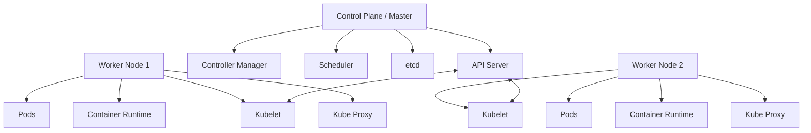

# Kubernetes Basics

## Introduction

Kubernetes (often abbreviated as K8s) is an open-source container orchestration platform designed to automate the deployment, scaling, and management of containerized applications. Developed originally by Google and now maintained by the Cloud Native Computing Foundation (CNCF), Kubernetes has become the industry standard for container orchestration in production environments.

In this guide, we'll explore the fundamental concepts of Kubernetes, understand its architecture, and learn basic commands to help you get started with deploying applications on Kubernetes.

## Why Kubernetes?

As applications move from monolithic architectures to microservices, managing multiple containers becomes increasingly complex. Kubernetes solves this complexity by providing:

- **Automated deployment and rollbacks**
- **Service discovery and load balancing**
- **Self-healing capabilities**
- **Horizontal scaling**
- **Secret and configuration management**

## Core Concepts

Before diving into Kubernetes commands, let's understand some core concepts:

### Pods

A pod is the smallest deployable unit in Kubernetes. It represents a single instance of a running process in your cluster and can contain one or more containers. Containers within a pod share network and storage resources and can communicate with each other using `localhost`.

### Nodes

Nodes are the physical or virtual machines that make up a Kubernetes cluster. Each node runs the necessary services to manage containers and communicate with the master node.

### Cluster

A Kubernetes cluster consists of at least one master node (control plane) and multiple worker nodes. The master node manages the cluster, while the worker nodes run the applications.

### Namespaces

Namespaces provide a way to divide cluster resources between multiple users or projects. They are virtual clusters within a physical cluster.

## Kubernetes Architecture

Kubernetes follows a master-worker architecture:



### Control Plane Components

1. **API Server**: The front-end of the Kubernetes control plane that exposes the Kubernetes API.
2. **etcd**: A consistent and highly-available key-value store used for all cluster data.
3. **Scheduler**: Watches for newly created pods with no assigned node and selects a node for them to run on.
4. **Controller Manager**: Runs controller processes that regulate the state of the cluster.

### Node Components

1. **Kubelet**: An agent that runs on each node and ensures containers are running in a pod.
2. **Kube-proxy**: Maintains network rules on nodes to allow network communication to your pods.
3. **Container Runtime**: The software responsible for running containers (e.g., Docker, containerd).

## Getting Started with Kubernetes

### Prerequisites

Before you start working with Kubernetes, ensure you have:

1. A basic understanding of containers (particularly Docker)
2. `kubectl` installed - the Kubernetes command-line tool
3. Access to a Kubernetes cluster (Minikube for local development or a cloud-provided cluster)

### Setting Up Minikube (for Local Development)

Minikube is a tool that lets you run Kubernetes locally.

```bash
# Install Minikube
# For macOS (using Homebrew)
brew install minikube

# Start a cluster
minikube start

# Check status
minikube status
```

Output:
```
minikube
type: Control Plane
host: Running
kubelet: Running
apiserver: Running
kubeconfig: Configured
```

### Basic kubectl Commands

`kubectl` is the command-line tool for interacting with Kubernetes clusters.

#### Checking Cluster Info

```bash
# Get cluster info
kubectl cluster-info

# List all nodes
kubectl get nodes
```

Output:
```
Kubernetes control plane is running at https://192.168.49.2:8443
CoreDNS is running at https://192.168.49.2:8443/api/v1/namespaces/kube-system/services/kube-dns:dns/proxy

NAME       STATUS   ROLES           AGE   VERSION
minikube   Ready    control-plane   24h   v1.25.3
```

#### Deploying Your First Application

Let's deploy a simple Nginx web server:

```bash
# Create a deployment
kubectl create deployment nginx-demo --image=nginx:latest

# View deployments
kubectl get deployments
```

Output:
```
NAME        READY   UP-TO-DATE   AVAILABLE   AGE
nginx-demo  1/1     1            1           45s
```

```bash
# View pods
kubectl get pods
```

Output:
```
NAME                         READY   STATUS    RESTARTS   AGE
nginx-demo-8d545c96d-2nxrd   1/1     Running   0          1m
```

### Exposing Your Application

To access your application, you need to expose it as a service:

```bash
# Create a service
kubectl expose deployment nginx-demo --port=80 --type=LoadBalancer

# View services
kubectl get services
```

Output:
```
NAME         TYPE           CLUSTER-IP      EXTERNAL-IP   PORT(S)        AGE
kubernetes   ClusterIP      10.96.0.1       <none>        443/TCP        24h
nginx-demo   LoadBalancer   10.100.226.15   <pending>     80:30583/TCP   25s
```

For Minikube, you need to run:

```bash
minikube service nginx-demo
```

This will open your default web browser with the Nginx welcome page.

## Kubernetes YAML Manifests

While deploying applications using commands is convenient, in real-world scenarios, you'll use YAML files to declare your desired state.

### Example Deployment YAML

```yaml
apiVersion: apps/v1
kind: Deployment
metadata:
  name: nginx-deployment
  labels:
    app: nginx
spec:
  replicas: 3
  selector:
    matchLabels:
      app: nginx
  template:
    metadata:
      labels:
        app: nginx
    spec:
      containers:
      - name: nginx
        image: nginx:1.14.2
        ports:
        - containerPort: 80
```

Save this to a file named `nginx-deployment.yaml` and apply it:

```bash
kubectl apply -f nginx-deployment.yaml
```

Output:
```
deployment.apps/nginx-deployment created
```

### Example Service YAML

```yaml
apiVersion: v1
kind: Service
metadata:
  name: nginx-service
spec:
  selector:
    app: nginx
  ports:
    - port: 80
      targetPort: 80
  type: LoadBalancer
```

Save this to a file named `nginx-service.yaml` and apply it:

```bash
kubectl apply -f nginx-service.yaml
```

Output:
```
service/nginx-service created
```

## Scaling Your Application

One of the key benefits of Kubernetes is easy scaling:

```bash
# Scale the deployment to 5 replicas
kubectl scale deployment nginx-deployment --replicas=5

# Check pods to verify scaling
kubectl get pods
```

Output:
```
NAME                               READY   STATUS    RESTARTS   AGE
nginx-deployment-9456bbbf9-4bfwg   1/1     Running   0          45s
nginx-deployment-9456bbbf9-9vkzj   1/1     Running   0          45s
nginx-deployment-9456bbbf9-kpzxg   1/1     Running   0          5m
nginx-deployment-9456bbbf9-s78qk   1/1     Running   0          45s
nginx-deployment-9456bbbf9-z4pl5   1/1     Running   0          5m
```

## Updating Your Application

Kubernetes makes it easy to update your applications:

```bash
# Update the image
kubectl set image deployment/nginx-deployment nginx=nginx:1.16.1

# Check the rollout status
kubectl rollout status deployment/nginx-deployment
```

Output:
```
deployment "nginx-deployment" successfully rolled out
```

## Common Kubernetes Resources

Beyond pods, deployments, and services, Kubernetes has many other resource types:

1. **ConfigMaps** - For configuration data
2. **Secrets** - For sensitive data
3. **StatefulSets** - For stateful applications
4. **DaemonSets** - Ensures all nodes run a copy of a pod
5. **Jobs** - For batch processes
6. **Ingress** - For HTTP/HTTPS routing
7. **PersistentVolumes** - For storage

## Real-world Example: Deploying a Multi-tier Application

Let's deploy a simple two-tier application with a frontend and a backend database.

### Redis Backend Deployment

```yaml
apiVersion: apps/v1
kind: Deployment
metadata:
  name: redis-backend
spec:
  selector:
    matchLabels:
      app: redis
  replicas: 1
  template:
    metadata:
      labels:
        app: redis
    spec:
      containers:
      - name: redis
        image: redis:alpine
        ports:
        - containerPort: 6379
```

### Redis Service

```yaml
apiVersion: v1
kind: Service
metadata:
  name: redis
spec:
  selector:
    app: redis
  ports:
  - port: 6379
    targetPort: 6379
```

### Web Frontend Deployment

```yaml
apiVersion: apps/v1
kind: Deployment
metadata:
  name: web-frontend
spec:
  selector:
    matchLabels:
      app: web
  replicas: 2
  template:
    metadata:
      labels:
        app: web
    spec:
      containers:
      - name: web
        image: nginx:alpine
        ports:
        - containerPort: 80
        env:
        - name: REDIS_HOST
          value: "redis"
```

### Web Service

```yaml
apiVersion: v1
kind: Service
metadata:
  name: web
spec:
  selector:
    app: web
  ports:
  - port: 80
    targetPort: 80
  type: LoadBalancer
```

Apply these configurations:

```bash
kubectl apply -f redis-deployment.yaml
kubectl apply -f redis-service.yaml
kubectl apply -f web-deployment.yaml
kubectl apply -f web-service.yaml
```

This example demonstrates how to:
- Deploy multiple components
- Connect services
- Pass environment variables
- Use service discovery (web can reach redis using the service name)

## Troubleshooting in Kubernetes

Here are some common commands for troubleshooting:

```bash
# Get detailed information about a pod
kubectl describe pod <pod-name>

# View pod logs
kubectl logs <pod-name>

# Execute a command in a pod
kubectl exec -it <pod-name> -- /bin/bash

# Check events
kubectl get events
```

## Summary

In this guide, we've covered the fundamentals of Kubernetes:

- Core concepts and architecture
- Basic Kubernetes commands
- Deploying applications using commands and YAML files
- Exposing applications with services
- Scaling and updating applications
- Real-world deployment example
- Basic troubleshooting

Kubernetes has a steep learning curve, but understanding these basics provides a solid foundation for deploying and managing containerized applications in production environments.

## Additional Resources

To continue your Kubernetes learning journey:

1. **Official Kubernetes Documentation**: [kubernetes.io](https://kubernetes.io/docs/home/)
2. **Kubernetes: Up and Running** by Brendan Burns, Joe Beda, and Kelsey Hightower
3. **Kubernetes Patterns** by Bilgin Ibryam and Roland Huß

## Practice Exercises

1. Deploy a simple stateless application with at least two replicas.
2. Create a ConfigMap and use it in your deployment.
3. Implement a rolling update strategy for your application.
4. Set up resource limits (CPU and memory) for your pods.
5. Create a simple CI/CD pipeline for deploying to Kubernetes.