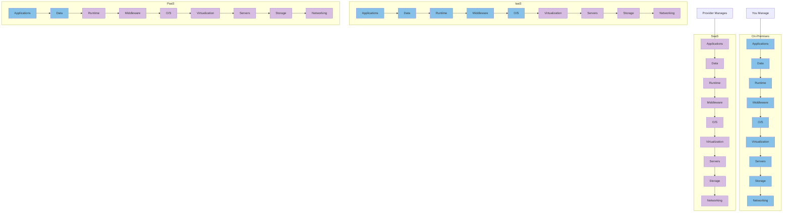
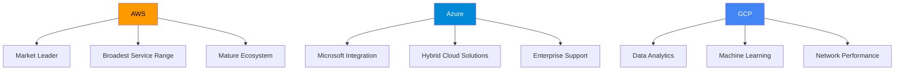

# Cloud Services (AWS, Azure, GCP)

## Introduction

Cloud computing has revolutionized how businesses deploy and manage their IT infrastructure. Instead of maintaining physical servers and data centers, organizations can now leverage computing resources provided by cloud service providers. The three major players in the cloud computing space are Amazon Web Services (AWS), Microsoft Azure, and Google Cloud Platform (GCP).

This guide will introduce you to these cloud service providers, explain their core offerings, and help you understand when to use each one. Whether you're preparing for DevOps interviews or looking to migrate applications to the cloud, this knowledge is essential for modern software development.

## Understanding Cloud Service Models

Before diving into specific providers, let's understand the three primary cloud service models:

- **Infrastructure as a Service (IaaS)**: Provides virtualized computing resources over the internet.
- **Platform as a Service (PaaS)**: Offers hardware and software tools over the internet, typically for application development.
- **Software as a Service (SaaS)**: Delivers software applications over the internet, on a subscription basis.

Here's a visualization of the cloud service models and what each party manages:



Blue represents components that you manage, and purple represents components managed by the cloud provider.

## Amazon Web Services (AWS)

AWS is the market leader in cloud services, offering a vast array of services across compute, storage, database, networking, and more.

### Key AWS Services

1. **Compute**
   - **EC2 (Elastic Compute Cloud)**: Virtual servers in the cloud
   - **Lambda**: Serverless compute service
   - **ECS/EKS**: Container orchestration services

2. **Storage**
   - **S3 (Simple Storage Service)**: Object storage
   - **EBS (Elastic Block Store)**: Block storage for EC2 instances
   - **Glacier**: Low-cost storage for archiving and long-term backup

3. **Database**
   - **RDS (Relational Database Service)**: Managed relational databases
   - **DynamoDB**: Managed NoSQL database
   - **ElastiCache**: In-memory caching service

4. **Networking**
   - **VPC (Virtual Private Cloud)**: Isolated cloud resources
   - **Route 53**: DNS web service
   - **CloudFront**: Content delivery network

### Practical Example: Deploying a Web Application on AWS

Let's look at how to deploy a simple web application using AWS services:

```bash
# Install the AWS CLI
pip install awscli

# Configure AWS CLI with your credentials
aws configure
# Enter your AWS Access Key ID, Secret Access Key, region, and output format

# Create an S3 bucket for static website hosting
aws s3 mb s3://my-static-website-bucket

# Enable static website hosting
aws s3 website s3://my-static-website-bucket \
  --index-document index.html \
  --error-document error.html

# Upload website files
aws s3 sync ./website-files s3://my-static-website-bucket

# Make the bucket publicly accessible
aws s3api put-bucket-policy \
  --bucket my-static-website-bucket \
  --policy '{
    "Version": "2012-10-17",
    "Statement": [
        {
            "Sid": "PublicReadGetObject",
            "Effect": "Allow",
            "Principal": "*",
            "Action": "s3:GetObject",
            "Resource": "arn:aws:s3:::my-static-website-bucket/*"
        }
    ]
}'
```

Your website is now accessible at `http://my-static-website-bucket.s3-website-<region>.amazonaws.com`.

## Microsoft Azure

Azure is Microsoft's cloud computing platform, tightly integrated with Microsoft's software ecosystem.

### Key Azure Services

1. **Compute**
   - **Virtual Machines**: IaaS offering similar to AWS EC2
   - **Azure Functions**: Serverless compute service
   - **Azure Kubernetes Service (AKS)**: Managed Kubernetes

2. **Storage**
   - **Azure Blob Storage**: Object storage
   - **Azure Files**: File shares
   - **Azure Disk Storage**: Block storage for VMs

3. **Database**
   - **Azure SQL Database**: Managed SQL database
   - **Cosmos DB**: Globally distributed, multi-model database
   - **Azure Cache for Redis**: In-memory data store

4. **Networking**
   - **Virtual Network**: Isolated network in the cloud
   - **Azure DNS**: Domain name system hosting
   - **Azure CDN**: Content delivery network

### Practical Example: Deploying a .NET Application on Azure

Here's how to deploy a .NET application to Azure App Service using the Azure CLI:

```bash
# Install the Azure CLI
curl -sL https://aka.ms/InstallAzureCLIDeb | sudo bash

# Log in to Azure
az login

# Create a resource group
az group create --name myResourceGroup --location eastus

# Create an App Service plan
az appservice plan create \
  --name myAppServicePlan \
  --resource-group myResourceGroup \
  --sku F1

# Create a web app
az webapp create \
  --name myWebApp \
  --resource-group myResourceGroup \
  --plan myAppServicePlan

# Deploy the application from a Git repository
az webapp deployment source config \
  --name myWebApp \
  --resource-group myResourceGroup \
  --repo-url https://github.com/username/webapp \
  --branch master \
  --manual-integration
```

Your application is now deployed and accessible at `https://myWebApp.azurewebsites.net`.

## Google Cloud Platform (GCP)

GCP is Google's suite of cloud computing services, known for its strength in data analytics, machine learning, and container technologies.

### Key GCP Services

1. **Compute**
   - **Compute Engine**: Virtual machines in Google's data centers
   - **Cloud Functions**: Serverless execution environment
   - **Google Kubernetes Engine (GKE)**: Managed Kubernetes service

2. **Storage**
   - **Cloud Storage**: Object storage
   - **Persistent Disk**: Block storage for VMs
   - **Filestore**: Managed file storage

3. **Database**
   - **Cloud SQL**: Managed relational database
   - **Firestore**: NoSQL document database
   - **Bigtable**: NoSQL wide-column database

4. **Networking**
   - **Virtual Private Cloud (VPC)**: Isolated network
   - **Cloud DNS**: Domain name system
   - **Cloud CDN**: Content delivery network

### Practical Example: Deploying a Containerized Application on GKE

Let's deploy a containerized application on Google Kubernetes Engine:

```bash
# Install the Google Cloud SDK
# (Follow instructions from cloud.google.com)

# Initialize gcloud
gcloud init

# Set the project
gcloud config set project my-project-id

# Create a GKE cluster
gcloud container clusters create my-cluster \
  --zone us-central1-a \
  --num-nodes 3

# Get credentials for kubectl
gcloud container clusters get-credentials my-cluster \
  --zone us-central1-a

# Create a deployment using kubectl
kubectl create deployment my-app \
  --image=gcr.io/my-project-id/my-app:v1

# Expose the deployment with a load balancer
kubectl expose deployment my-app \
  --name=my-app-service \
  --type=LoadBalancer \
  --port 80 \
  --target-port 8080
```

You can now access your application through the external IP assigned to the load balancer, which you can find with `kubectl get service my-app-service`.

## Comparing Cloud Providers

Each cloud provider has its strengths and specialties. Here's a quick comparison:



## Cloud Cost Management

Understanding and managing cloud costs is crucial for DevOps engineers. Here are some strategies:

1. **Right-sizing**: Choose the appropriate instance sizes for your workloads.
2. **Reserved Instances/Committed Use Discounts**: Commit to using specific resources for 1-3 years for discounts.
3. **Spot Instances/Preemptible VMs**: Use spare capacity at a discount for non-critical workloads.
4. **Autoscaling**: Automatically adjust resources based on demand.
5. **Tagging Resources**: Tag resources for better cost allocation and tracking.

### Example: Setting Up AWS Cost Budgets

```bash
# Create a budget using AWS CLI
aws budgets create-budget \
  --account-id 123456789012 \
  --budget file://budget.json \
  --notifications-with-subscribers file://notifications.json
```

Where `budget.json` contains:

```json
{
  "BudgetName": "Monthly EC2 Budget",
  "BudgetLimit": {
    "Amount": "100",
    "Unit": "USD"
  },
  "CostFilters": {
    "Service": ["Amazon Elastic Compute Cloud - Compute"]
  },
  "CostTypes": {
    "IncludeTax": true,
    "IncludeSubscription": true,
    "UseBlended": false,
    "IncludeRefund": false,
    "IncludeCredit": false,
    "IncludeUpfront": true,
    "IncludeRecurring": true,
    "IncludeOtherSubscription": true,
    "IncludeSupport": true,
    "IncludeDiscount": true,
    "UseAmortized": false
  },
  "TimeUnit": "MONTHLY",
  "BudgetType": "COST"
}
```

## DevOps and Cloud Integration

Cloud services are integral to modern DevOps practices. Here's how they fit together:

1. **Infrastructure as Code (IaC)**: Define and provision cloud resources using code:
   - AWS CloudFormation
   - Azure Resource Manager (ARM) templates
   - Google Cloud Deployment Manager

2. **CI/CD Pipelines**: Integrate cloud services into your CI/CD pipelines:
   - AWS CodePipeline/CodeBuild
   - Azure DevOps
   - Google Cloud Build

3. **Monitoring and Logging**: Cloud-native monitoring solutions:
   - AWS CloudWatch
   - Azure Monitor
   - Google Cloud Monitoring (formerly Stackdriver)

### Example: Infrastructure as Code with AWS CloudFormation

```yaml
AWSTemplateFormatVersion: '2010-09-09'
Resources:
  MyEC2Instance:
    Type: AWS::EC2::Instance
    Properties:
      InstanceType: t2.micro
      ImageId: ami-0c55b159cbfafe1f0
      SecurityGroups:
        - !Ref WebServerSecurityGroup
      UserData:
        Fn::Base64: !Sub |
          #!/bin/bash
          yum update -y
          yum install -y httpd
          systemctl start httpd
          systemctl enable httpd
          echo "<h1>Hello from CloudFormation</h1>" > /var/www/html/index.html
  
  WebServerSecurityGroup:
    Type: AWS::EC2::SecurityGroup
    Properties:
      GroupDescription: Enable HTTP
      SecurityGroupIngress:
        - IpProtocol: tcp
          FromPort: 80
          ToPort: 80
          CidrIp: 0.0.0.0/0
```

## Common Interview Questions

Here are some common cloud services interview questions you might encounter:

1. **What's the difference between IaaS, PaaS, and SaaS?**
   - Answer: IaaS provides virtualized computing resources, PaaS offers both hardware and software tools for application development, and SaaS delivers complete software applications over the internet.

2. **Explain the concept of "shared responsibility model" in cloud computing.**
   - Answer: The shared responsibility model delineates what security aspects the cloud provider is responsible for versus what the customer is responsible for. Typically, the provider secures the infrastructure, while customers secure their data, applications, and access.

3. **What are the benefits of using a multi-cloud strategy?**
   - Answer: Benefits include avoiding vendor lock-in, leveraging best-of-breed services from different providers, improving resilience, and potentially optimizing costs.

4. **How would you approach migrating an on-premises application to the cloud?**
   - Answer: Start with assessment and planning, choose the right migration strategy (rehost, refactor, rearchitect, rebuild, or replace), implement a proof of concept, migrate in phases, test thoroughly, and finally cut over with minimal downtime.

5. **What is auto-scaling and why is it important?**
   - Answer: Auto-scaling automatically adjusts the number of compute resources based on the current demand. It's important for maintaining application availability and performance while optimizing costs.

## Summary

Cloud services have become the backbone of modern IT infrastructure, offering scalability, flexibility, and cost-efficiency. The three major providers—AWS, Azure, and GCP—each offer comprehensive solutions with their own strengths and specialties.

As a DevOps engineer, understanding these cloud platforms is essential for designing, implementing, and maintaining robust, scalable systems. The knowledge of cloud services is not just about knowing which services exist, but also about understanding how to integrate them effectively, manage costs, and leverage them for continuous integration and deployment.

## Additional Resources and Exercises

### Resources

- AWS Documentation: [aws.amazon.com/documentation](https://aws.amazon.com/documentation/)
- Azure Documentation: [docs.microsoft.com/azure](https://docs.microsoft.com/azure)
- GCP Documentation: [cloud.google.com/docs](https://cloud.google.com/docs)
- Cloud Architecture Patterns: [Cloud Design Patterns](https://docs.microsoft.com/azure/architecture/patterns/)

### Exercises

1. **Cloud Provider Comparison**
   - Sign up for free tiers of AWS, Azure, and GCP
   - Deploy the same simple web application on each platform
   - Compare the experience, documentation, and performance

2. **Infrastructure as Code**
   - Create a CloudFormation template for AWS or an ARM template for Azure that provisions a web server with a database
   - Deploy the template and verify it works as expected
   - Make modifications to the infrastructure through the template

3. **Cost Optimization**
   - Use the pricing calculators for each cloud provider to estimate costs for a specific workload
   - Identify strategies to reduce costs without sacrificing performance
   - Implement resource tagging and monitoring to track actual costs

4. **Multi-Cloud Strategy**
   - Design an architecture that spans multiple cloud providers
   - Identify the challenges and benefits of this approach
   - Consider how you would handle identity management, networking, and monitoring across clouds