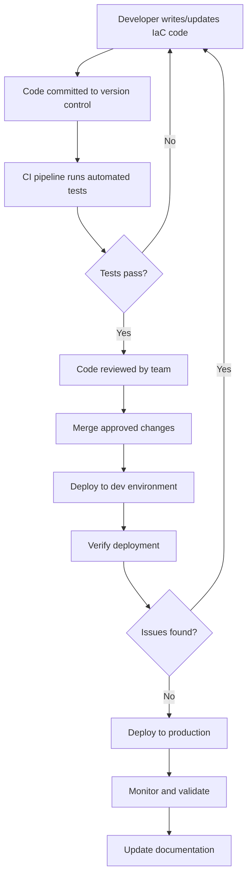

# Infrastructure as Code

## Introduction

Infrastructure as Code (IaC) is a key practice in modern DevOps and cloud computing that involves managing and provisioning computing infrastructure through machine-readable definition files rather than physical hardware configuration or interactive configuration tools. In simpler terms, it means writing code to define, deploy, and manage your infrastructure.

Before IaC, system administrators would manually configure servers, networking devices, and other infrastructure components. This manual process was time-consuming, error-prone, and difficult to scale. Infrastructure as Code addresses these challenges by bringing software development practices to infrastructure management.

## Core Concepts of Infrastructure as Code

### What Problem Does IaC Solve?

Consider this scenario: Your team needs to set up a new testing environment that matches production. Without IaC:

- A system administrator would manually configure each server
- The process might take days or weeks
- There could be inconsistencies between environments
- Documentation might become outdated

With IaC, you define your infrastructure in code files that can be:
- Version controlled
- Easily replicated
- Automatically deployed
- Tested before implementation

### Key Benefits of Infrastructure as Code

1. **Consistency and Reproducibility**: Infrastructure deployments become consistent and repeatable across different environments.

2. **Speed and Efficiency**: Automation reduces the time needed to set up new environments from days to minutes.

3. **Scalability**: Scale your infrastructure up or down by modifying code rather than manual processes.

4. **Disaster Recovery**: Quickly recover from failures by redeploying infrastructure from code.

5. **Documentation**: The code itself serves as documentation for your infrastructure.

6. **Cost Reduction**: More efficient resource usage and reduction in human errors.

7. **Security and Compliance**: Security policies can be coded and version controlled.

## IaC Approaches and Tools

Infrastructure as Code implementations generally fall into two categories:

### Declarative Approach

The declarative approach focuses on **what** the end state should be, not how to get there.

- You define the desired state of the infrastructure
- The IaC tool figures out how to achieve that state
- Examples: Terraform, AWS CloudFormation, Azure Resource Manager templates

For example, with Terraform you might declare:

```hcl
resource "aws_instance" "web_server" {
  ami           = "ami-0c55b159cbfafe1f0"
  instance_type = "t2.micro"
  tags = {
    Name = "WebServer"
  }
}
```

This code doesn't specify the steps to create an EC2 instance—it simply declares that this instance should exist with these properties.

### Imperative (Procedural) Approach

The imperative approach focuses on **how** to achieve the desired state.

- You define the specific commands needed to create the infrastructure
- The tool executes these commands in order
- Examples: Chef, Puppet, Ansible (though Ansible can be used in a more declarative style as well)

For example, an Ansible task might look like:

```yaml
- name: Ensure nginx is installed
  apt:
    name: nginx
    state: present

- name: Ensure nginx is running
  service:
    name: nginx
    state: started
    enabled: yes
```

This explicitly states the commands to run to install and start Nginx.

## Popular Infrastructure as Code Tools

Let's explore some of the most popular IaC tools:

### Terraform

HashiCorp's Terraform is a cloud-agnostic IaC tool that uses a declarative approach.

**Key Features:**
- Works with multiple cloud providers
- Uses HashiCorp Configuration Language (HCL)
- State management to track resource changes
- Plan and apply workflow

**Simple Example:**

```hcl
# Define AWS as the provider
provider "aws" {
  region = "us-west-2"
}

# Create a VPC
resource "aws_vpc" "main" {
  cidr_block = "10.0.0.0/16"
  
  tags = {
    Name = "Main VPC"
  }
}

# Create a subnet within the VPC
resource "aws_subnet" "public" {
  vpc_id     = aws_vpc.main.id
  cidr_block = "10.0.1.0/24"
  
  tags = {
    Name = "Public Subnet"
  }
}
```

### AWS CloudFormation

AWS CloudFormation is Amazon's native IaC service for AWS resources.

**Key Features:**
- Uses JSON or YAML templates
- Deeply integrated with AWS services
- Manages resource dependencies automatically
- Rollback capability if deployment fails

**Simple Example:**

```yaml
Resources:
  MyS3Bucket:
    Type: 'AWS::S3::Bucket'
    Properties:
      BucketName: my-unique-bucket-name
      AccessControl: Private
      VersioningConfiguration:
        Status: Enabled
```

### Ansible

Red Hat's Ansible is a configuration management and orchestration tool that can be used for IaC.

**Key Features:**
- Agentless architecture (uses SSH)
- YAML-based playbooks
- Extensive module library
- Simpler learning curve than some other tools

**Simple Example:**

```yaml
---
- name: Setup web server
  hosts: webservers
  become: yes
  
  tasks:
    - name: Install Apache
      apt:
        name: apache2
        state: present
        
    - name: Start Apache service
      service:
        name: apache2
        state: started
        enabled: yes
        
    - name: Deploy website content
      copy:
        src: /local/path/to/website/
        dest: /var/www/html/
```

## How IaC Works in Practice

Let's walk through a practical example of using Infrastructure as Code with Terraform to create a simple web application environment on AWS.

### Step 1: Define Infrastructure Requirements

Our example web application needs:
- A VPC with public and private subnets
- An EC2 instance running a web server
- A security group to allow HTTP traffic
- An S3 bucket to store static assets

### Step 2: Write the Infrastructure Code

```hcl
# main.tf

provider "aws" {
  region = "us-east-1"
}

# Create a VPC
resource "aws_vpc" "app_vpc" {
  cidr_block = "10.0.0.0/16"
  
  tags = {
    Name = "AppVPC"
  }
}

# Create a public subnet
resource "aws_subnet" "public" {
  vpc_id            = aws_vpc.app_vpc.id
  cidr_block        = "10.0.1.0/24"
  availability_zone = "us-east-1a"
  
  tags = {
    Name = "Public Subnet"
  }
}

# Create an internet gateway
resource "aws_internet_gateway" "gw" {
  vpc_id = aws_vpc.app_vpc.id
  
  tags = {
    Name = "App Internet Gateway"
  }
}

# Create a route table allowing internet access
resource "aws_route_table" "public_rt" {
  vpc_id = aws_vpc.app_vpc.id
  
  route {
    cidr_block = "0.0.0.0/0"
    gateway_id = aws_internet_gateway.gw.id
  }
  
  tags = {
    Name = "Public Route Table"
  }
}

# Associate route table with public subnet
resource "aws_route_table_association" "public_rta" {
  subnet_id      = aws_subnet.public.id
  route_table_id = aws_route_table.public_rt.id
}

# Create a security group for web traffic
resource "aws_security_group" "web_sg" {
  name        = "web_sg"
  description = "Allow HTTP traffic"
  vpc_id      = aws_vpc.app_vpc.id
  
  ingress {
    from_port   = 80
    to_port     = 80
    protocol    = "tcp"
    cidr_blocks = ["0.0.0.0/0"]
  }
  
  egress {
    from_port   = 0
    to_port     = 0
    protocol    = "-1"
    cidr_blocks = ["0.0.0.0/0"]
  }
}

# Create an EC2 instance for the web server
resource "aws_instance" "web_server" {
  ami           = "ami-0c55b159cbfafe1f0"  # Amazon Linux 2 AMI
  instance_type = "t2.micro"
  subnet_id     = aws_subnet.public.id
  security_groups = [aws_security_group.web_sg.id]
  
  user_data = <<-EOF
              #!/bin/bash
              yum update -y
              yum install -y httpd
              systemctl start httpd
              systemctl enable httpd
              echo "<h1>Hello from Terraform-provisioned server</h1>" > /var/www/html/index.html
              EOF
  
  tags = {
    Name = "WebServer"
  }
}

# Create an S3 bucket for static assets
resource "aws_s3_bucket" "assets" {
  bucket = "my-app-assets-bucket-unique-name"
  acl    = "private"
  
  tags = {
    Name = "AppAssets"
  }
}
```

### Step 3: Initialize Terraform

```bash
terraform init
```

This command initializes Terraform, downloads the AWS provider, and prepares your working directory.

### Step 4: Preview Changes

```bash
terraform plan
```

This command shows you what Terraform will create, modify, or delete:

```
Plan: 8 to add, 0 to change, 0 to destroy.
```

### Step 5: Apply Changes

```bash
terraform apply
```

After reviewing the plan and confirming, Terraform will create all the resources defined in your code.

### Step 6: Update Infrastructure as Needed

If you need to make changes to your infrastructure, simply update your code and run `terraform plan` and `terraform apply` again. Terraform will make only the necessary changes to reach the desired state.

### Step 7: Clean Up Resources When Done

```bash
terraform destroy
```

This command will remove all resources created by your Terraform configuration.

## IaC Best Practices

To get the most out of Infrastructure as Code, follow these best practices:

### 1. Version Control

Store your infrastructure code in a version control system like Git to:
- Track changes over time
- Enable collaboration
- Facilitate code reviews
- Roll back to previous versions if needed

### 2. Modularize Your Code

Break your infrastructure code into reusable modules for:
- Better organization
- Reuse across projects
- Easier maintenance
- Simplified testing

For example, in Terraform:

```hcl
module "vpc" {
  source = "./modules/vpc"
  cidr_block = "10.0.0.0/16"
}

module "web_servers" {
  source = "./modules/web_servers"
  vpc_id = module.vpc.vpc_id
  count = 3
}
```

### 3. Use Variables and Parameters

Make your code flexible by parameterizing values instead of hardcoding them:

```hcl
# variables.tf
variable "region" {
  description = "AWS region to deploy to"
  default     = "us-east-1"
}

variable "environment" {
  description = "Deployment environment (dev, staging, prod)"
}

# main.tf
provider "aws" {
  region = var.region
}

resource "aws_vpc" "main" {
  # ...
  tags = {
    Environment = var.environment
  }
}
```

### 4. Implement Testing

Test your infrastructure code before applying it:
- Syntax validation
- Policy compliance checks
- Integration tests

Tools like Terratest can help automate infrastructure testing.

### 5. Follow Security Best Practices

- Don't hardcode sensitive information like access keys
- Use secrets management services
- Implement least privilege access
- Enable audit logging

### 6. Document Your Code

Add comments and documentation to explain:
- What resources are being created
- Why certain decisions were made
- Dependencies between resources
- How to use and modify the code

## IaC Workflow Visualization

Here's a visualization of a typical IaC workflow:



## Common IaC Challenges and Solutions

### Challenge 1: Managing State

With declarative tools like Terraform, managing the state file (which tracks the current state of your infrastructure) can be challenging.

**Solution:** Use remote state storage (like AWS S3) with state locking to enable team collaboration and prevent concurrent modifications.

Example Terraform configuration:

```hcl
terraform {
  backend "s3" {
    bucket         = "terraform-state-bucket"
    key            = "project/terraform.tfstate"
    region         = "us-east-1"
    dynamodb_table = "terraform-locks"
    encrypt        = true
  }
}
```

### Challenge 2: Handling Sensitive Data

Infrastructure often requires secrets like API keys or database passwords.

**Solution:** Use a secrets manager like HashiCorp Vault, AWS Secrets Manager, or environment variables. Never store secrets in your IaC code.

### Challenge 3: Drift Detection and Management

Infrastructure can change outside of your IaC process, creating "drift" from the defined state.

**Solution:** Regularly run drift detection (e.g., `terraform plan`) and implement policies preventing manual changes to infrastructure.

## Real-World Use Cases

### Case Study 1: Microservices Infrastructure

A company migrating from a monolithic application to microservices can use IaC to:

- Define a consistent Kubernetes cluster
- Create namespaces for different services
- Set up CI/CD pipelines
- Configure monitoring and logging infrastructure
- Manage network policies

### Case Study 2: Multi-Environment Deployments

A web application requiring development, staging, and production environments can use IaC to:

- Create identical environments with different scaling
- Promote changes through environments systematically
- Ensure consistent security configurations
- Isolate environments while maintaining similarity

Example with Terraform workspaces:

```bash
# For development
terraform workspace new dev
terraform workspace select dev
terraform apply -var-file=dev.tfvars

# For production
terraform workspace new prod
terraform workspace select prod
terraform apply -var-file=prod.tfvars
```

### Case Study 3: Disaster Recovery

Organizations can use IaC to improve disaster recovery by:

- Defining backup infrastructure in another region
- Creating automated recovery procedures
- Testing recovery regularly by spinning up resources from code
- Ensuring all infrastructure changes are captured and replicable

## Summary

Infrastructure as Code represents a fundamental shift in how we manage computing infrastructure. By defining infrastructure through code, organizations can achieve:

- Faster, more reliable deployments
- Consistent environments across development, testing, and production
- Better collaboration between development and operations teams
- Improved documentation and change tracking
- Reduced costs through automation and standardization

As cloud computing continues to evolve, IaC becomes increasingly essential for managing complex, dynamic infrastructure at scale. Learning IaC tools and practices is now a core competency for DevOps engineers and cloud professionals.

## Additional Resources

To deepen your understanding of Infrastructure as Code, explore these resources:

1. **Practice Exercises:**
   - Create a basic web server infrastructure using Terraform
   - Define a multi-tier application using AWS CloudFormation
   - Write Ansible playbooks to configure application servers

2. **Advanced Topics to Explore:**
   - Infrastructure testing strategies
   - Implementing GitOps workflows with IaC
   - Compliance as Code integration
   - Immutable infrastructure patterns

3. **Key Skills to Develop:**
   - Learn at least one declarative IaC tool (like Terraform)
   - Understand configuration management with tools like Ansible
   - Practice infrastructure version control workflows
   - Study cloud provider-specific IaC solutions

By mastering Infrastructure as Code, you'll be well-positioned for success in modern DevOps and cloud engineering roles.