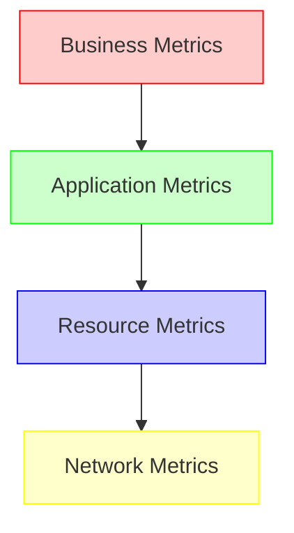
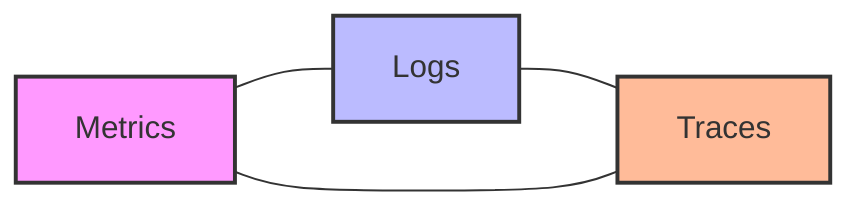

# Monitoring and Logging

## Introduction

In the world of DevOps and cloud infrastructure, monitoring and logging are foundational practices that ensure systems run smoothly, securely, and efficiently. Without robust monitoring and logging, teams operate in the dark, unable to detect issues, identify performance bottlenecks, or troubleshoot problems when they arise.

This guide explains the core concepts of monitoring and logging, their importance in modern applications, and practical approaches to implementing them effectively. Whether you're preparing for DevOps interviews or building your first cloud application, understanding these concepts is essential.

## What is Monitoring?

Monitoring is the systematic process of collecting, analyzing, and using information to track a system's performance over time and detect anomalies.

### Key Aspects of Monitoring

1. **Real-time visibility** into the health and performance of systems
2. **Proactive issue detection** before they impact users
3. **Historical data collection** for trend analysis and capacity planning
4. **Alerting mechanisms** that notify teams when metrics exceed thresholds

## What is Logging?

Logging is the process of recording events, activities, and messages that occur in operating systems, applications, and networks.

### Key Aspects of Logging

1. **Event recording** of system and application activities
2. **Error tracking** to identify and diagnose issues
3. **Audit trails** for security and compliance purposes
4. **Behavioral insights** into how systems and users interact

## The Monitoring Pyramid

Monitoring typically follows a hierarchical structure, often visualized as a pyramid:



1. **Business Metrics** - High-level indicators tied to business outcomes (e.g., conversion rates, revenue)
2. **Application Metrics** - Performance of your applications (e.g., response times, error rates)
3. **Resource Metrics** - System resource utilization (e.g., CPU, memory, disk)
4. **Network Metrics** - Network performance and connectivity (e.g., latency, packet loss)

## Types of Monitoring

### Infrastructure Monitoring

Infrastructure monitoring focuses on the hardware and platform components that support your applications.

**Key metrics include:**

- CPU utilization
- Memory usage
- Disk I/O and storage capacity
- Network throughput and latency

**Example of Infrastructure Monitoring with Prometheus:**

```javascript
// Sample Prometheus query to monitor CPU usage
rate(node_cpu_seconds_total{mode!="idle"}[1m])
```

### Application Performance Monitoring (APM)

APM tracks the performance and availability of software applications.

**Key metrics include:**

- Response time
- Throughput (requests per second)
- Error rates
- Resource consumption

**Example of instrumenting a Node.js application with APM:**

```javascript
const apm = require('elastic-apm-node').start({
  serviceName: 'my-service',
  serverUrl: 'http://apm-server:8200'
})

const express = require('express')
const app = express()

app.get('/api/data', (req, res) => {
  // This request will be automatically monitored
  // with transaction tracking
  res.json({ status: 'success' })
})

app.listen(3000, () => {
  console.log('Server running on port 3000')
})
```

### User Experience Monitoring

This focuses on how end-users experience your application.

**Key metrics include:**

- Page load time
- Time to first byte (TTFB)
- Time to interactive (TTI)
- User journey completion rates

## Logging Levels and Best Practices

Most logging frameworks provide different severity levels for log messages:

```
ERROR: Critical issues requiring immediate attention
WARN: Potential issues that don't stop the application
INFO: General information about application flow
DEBUG: Detailed information for debugging purposes
TRACE: Very detailed debugging information
```

**Example of setting up logging in a Java application:**

```java
import org.slf4j.Logger;
import org.slf4j.LoggerFactory;

public class UserService {
    private static final Logger logger = LoggerFactory.getLogger(UserService.class);
    
    public User findUserById(String id) {
        logger.info("Looking up user with ID: {}", id);
        
        try {
            // Database operations
            User user = userRepository.findById(id);
            
            if (user == null) {
                logger.warn("User with ID {} not found", id);
                return null;
            }
            
            logger.debug("Found user: {}", user);
            return user;
        } catch (Exception e) {
            logger.error("Error finding user with ID: {}", id, e);
            throw e;
        }
    }
}
```

### Structured Logging

Traditional text-based logging can be difficult to parse and analyze. Structured logging formats each log entry as a data structure (typically JSON), making it easier to search and analyze.

**Example of structured logging in Python:**

```python
import structlog

log = structlog.get_logger()

def process_order(order_id, customer_id, amount):
    log.info(
        "processing_order",
        order_id=order_id,
        customer_id=customer_id,
        amount=amount
    )
    
    # Process the order...
    
    log.info(
        "order_processed",
        order_id=order_id,
        processing_time=1.5,
        status="completed"
    )
```

**Output:**

```json
{"event": "processing_order", "order_id": "ORD-12345", "customer_id": "CUST-6789", "amount": 99.99, "timestamp": "2023-05-28T14:22:33Z"}
{"event": "order_processed", "order_id": "ORD-12345", "processing_time": 1.5, "status": "completed", "timestamp": "2023-05-28T14:22:35Z"}
```

## The Three Pillars of Observability

Modern monitoring and logging are part of a broader concept called "observability," which consists of three main pillars:



1. **Metrics**: Numerical representations of data measured over time
2. **Logs**: Timestamped records of discrete events
3. **Traces**: Records of a request as it flows through a distributed system

Together, these pillars provide comprehensive visibility into complex systems.

## Popular Monitoring and Logging Tools

### Monitoring Tools

- **Prometheus**: Open-source monitoring system with a dimensional data model and powerful query language
- **Grafana**: Visualization and dashboarding for metrics
- **Datadog**: SaaS platform for cloud-scale monitoring
- **New Relic**: APM and full-stack observability platform
- **CloudWatch**: AWS's native monitoring service

### Logging Tools

- **ELK Stack** (Elasticsearch, Logstash, Kibana): Popular open-source logging stack
- **Fluentd**: Open-source data collector for unified logging layer
- **Graylog**: Log management platform
- **Splunk**: Enterprise-grade logging and monitoring platform
- **Loki**: Horizontally-scalable, highly-available log aggregation system

## Building a Simple Monitoring Setup

Let's walk through a basic example of setting up monitoring for a web application using Prometheus and Grafana.

### Step 1: Instrument Your Application

For a Node.js application, you can use the `prom-client` library:

```javascript
const express = require('express');
const prometheus = require('prom-client');

// Create a Registry to register metrics
const register = new prometheus.Registry();
prometheus.collectDefaultMetrics({ register });

// Create a counter for HTTP requests
const httpRequestsTotal = new prometheus.Counter({
  name: 'http_requests_total',
  help: 'Total number of HTTP requests',
  labelNames: ['method', 'route', 'status'],
  registers: [register]
});

const app = express();

// Add middleware to count requests
app.use((req, res, next) => {
  const end = res.end;
  res.end = function() {
    httpRequestsTotal.inc({
      method: req.method,
      route: req.route?.path || req.path,
      status: res.statusCode
    });
    return end.apply(this, arguments);
  };
  next();
});

// Expose metrics endpoint for Prometheus to scrape
app.get('/metrics', async (req, res) => {
  res.set('Content-Type', register.contentType);
  res.end(await register.metrics());
});

// Your application routes
app.get('/', (req, res) => {
  res.send('Hello World!');
});

app.listen(3000, () => {
  console.log('Server running on port 3000');
});
```

### Step 2: Configure Prometheus to Scrape Your Application

Create a `prometheus.yml` configuration file:

```yaml
global:
  scrape_interval: 15s

scrape_configs:
  - job_name: 'my-app'
    static_configs:
      - targets: ['localhost:3000']
```

### Step 3: Set Up Grafana Dashboard

Once Prometheus is collecting data, you can create a Grafana dashboard with a query like:

```
rate(http_requests_total[5m])
```

This will show the rate of HTTP requests over the last 5 minutes.

## Implementing Centralized Logging

Let's implement a basic centralized logging system using the ELK stack.

### Step 1: Configure Logstash

Create a `logstash.conf` file:

```
input {
  beats {
    port => 5044
  }
}

filter {
  if [type] == "nginx-access" {
    grok {
      match => { "message" => "%{COMBINEDAPACHELOG}" }
    }
    date {
      match => [ "timestamp", "dd/MMM/yyyy:HH:mm:ss Z" ]
    }
  }
}

output {
  elasticsearch {
    hosts => ["elasticsearch:9200"]
    index => "app-logs-%{+YYYY.MM.dd}"
  }
}
```

### Step 2: Set Up Filebeat to Ship Logs

Create a `filebeat.yml` configuration:

```yaml
filebeat.inputs:
- type: log
  enabled: true
  paths:
    - /var/log/nginx/access.log
  tags: ["nginx-access"]

output.logstash:
  hosts: ["logstash:5044"]
```

### Step 3: Query Logs in Kibana

With logs flowing into Elasticsearch, you can use Kibana to run queries like:

```
status:500 AND user_agent:*Chrome*
```

This would find all 500 errors from Chrome users.

## Best Practices for Effective Monitoring and Logging

1. **Define clear objectives** before implementing monitoring solutions
2. **Monitor the Four Golden Signals**:
   - Latency
   - Traffic
   - Errors
   - Saturation
3. **Use structured logging** for easier analysis
4. **Implement appropriate log levels** to control verbosity
5. **Set up automated alerts** for critical issues
6. **Practice log rotation** to manage storage and performance
7. **Secure your logs** to protect sensitive information
8. **Correlate logs and metrics** for comprehensive troubleshooting
9. **Establish baselines** to identify abnormal behavior
10. **Define SLOs (Service Level Objectives)** to set performance targets

## Real-World Monitoring and Logging Scenario

Imagine you're responsible for an e-commerce platform that's experiencing intermittent slowdowns during peak shopping hours. Here's how you might approach this issue:

1. **Check infrastructure metrics first**: Look for CPU, memory, or disk bottlenecks.
2. **Review application-level metrics**: Examine response times, error rates, and throughput.
3. **Analyze database performance**: Look for slow queries, locks, or connection issues.
4. **Examine logs for errors or warnings**: Filter logs during the slowdown periods.
5. **Correlate user behavior with system metrics**: Is a specific user action triggering the issue?
6. **Review recent changes**: Did a deployment coincide with the onset of the problem?

After investigation, you might discover that a database index is missing, causing queries to slow down as the number of concurrent users increases.

## Common DevOps Interview Questions on Monitoring and Logging

1. **Q: What's the difference between monitoring and logging?**
   
   A: Monitoring provides real-time visibility into system performance using metrics, while logging records discrete events and messages. Monitoring tells you when something is wrong, while logs help you understand why it's wrong.

2. **Q: How would you implement monitoring for a microservices architecture?**
   
   A: I would use a combination of infrastructure monitoring (e.g., Prometheus), distributed tracing (e.g., Jaeger or Zipkin), centralized logging (e.g., ELK stack), and service mesh telemetry (e.g., Istio). I'd ensure each service exposes health and metrics endpoints and implements consistent logging formats.

3. **Q: How do you prevent sensitive information from appearing in logs?**
   
   A: Implement log sanitization by:
   - Using log masking for sensitive fields (e.g., passwords, credit card numbers)
   - Creating logging frameworks that automatically redact PII
   - Using dedicated security tools to scan logs for sensitive information
   - Training developers on secure logging practices

4. **Q: How would you handle log volume in a high-traffic application?**
   
   A: I would:
   - Implement log sampling for high-volume events
   - Use different log levels to control verbosity
   - Configure log rotation and retention policies
   - Consider using a streaming approach for log processing
   - Scale the logging infrastructure horizontally
   - Implement log aggregation to process logs near their source

## Summary

Monitoring and logging are critical components of any DevOps and cloud infrastructure. They provide visibility into system performance, help troubleshoot issues, and enable proactive management of applications.

Key takeaways from this guide:

- Monitoring focuses on metrics and real-time system health
- Logging records events and messages for later analysis
- Both are part of the broader observability concept
- Implementing structured logging improves searchability and analysis
- Various tools exist for different monitoring and logging needs
- Best practices include setting clear objectives, monitoring the right signals, and securing sensitive information

By mastering these concepts and tools, you'll be well-prepared for DevOps interviews and able to build more reliable, maintainable systems.

## Additional Resources

- Practice implementing a monitoring solution for a simple application
- Try setting up the ELK stack or Prometheus/Grafana locally
- Explore different logging frameworks and understand their capabilities
- Create dashboards for different use cases and audiences
- Design an alerting strategy for a fictional application