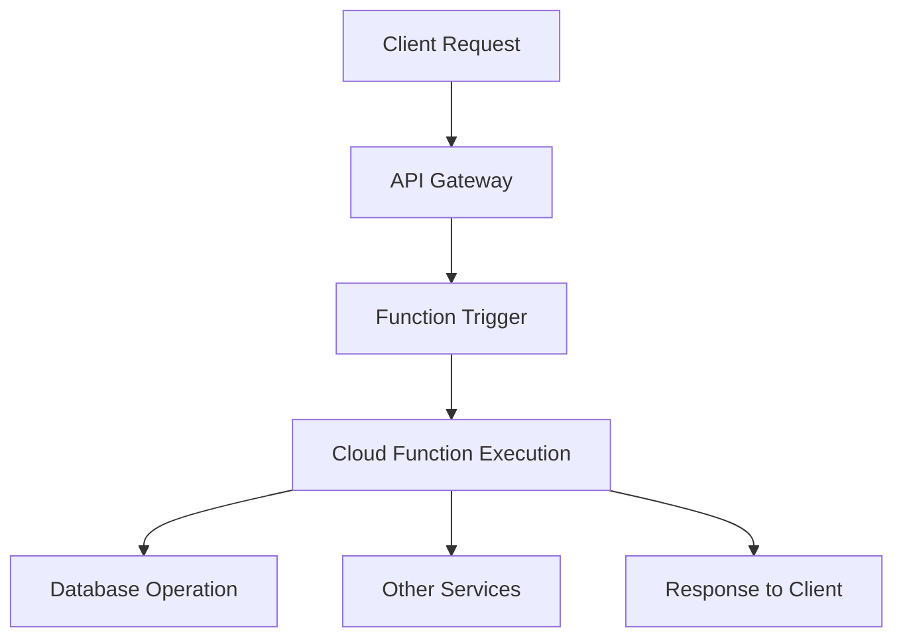
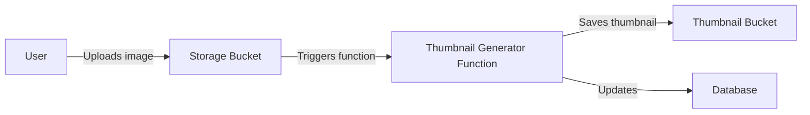

# Serverless Architecture

## Introduction

Serverless architecture represents a cloud computing execution model where cloud providers dynamically manage the allocation and provisioning of servers. A serverless application runs in stateless compute containers that are event-triggered, ephemeral (may last for one invocation), and fully managed by the cloud provider.

Despite the name "serverless," servers are still involved, but developers no longer need to worry about server management, maintenance, scaling, or capacity planning. This allows teams to focus on developing application logic rather than infrastructure concerns.

## What is Serverless Computing?

Serverless computing is based on the concept of "Function as a Service" (FaaS), where applications are broken down into individual, event-triggered functions that run in ephemeral containers managed by a cloud provider.

Key characteristics of serverless architecture include:

- **No server management**: Developers don't need to provision or maintain servers
- **Pay-per-execution**: You only pay for the exact compute time consumed
- **Auto-scaling**: Applications scale automatically based on demand
- **Built-in availability and fault tolerance**: The provider handles infrastructure reliability
- **Event-driven**: Functions are triggered by events rather than running continuously



## How Serverless Works

Let's break down the fundamental concepts of serverless architecture:

### 1. Functions

Functions are the core building blocks of serverless applications. Each function performs a specific task and is designed to be stateless, with no dependency on the underlying infrastructure.

Here's a simple example of an AWS Lambda function in Node.js:

```javascript
exports.handler = async (event) => {
    // Extract data from the event
    const name = event.name || 'World';
    
    // Business logic
    const message = `Hello, ${name}!`;
    
    // Return response
    return {
        statusCode: 200,
        body: JSON.stringify({
            message: message,
            timestamp: new Date().toISOString()
        })
    };
};
```

When triggered:
- Input: `{ "name": "Alice" }`
- Output: `{ "statusCode": 200, "body": "{ \"message\": \"Hello, Alice!\", \"timestamp\": \"2025-03-17T12:34:56.789Z\" }" }`

### 2. Event Sources

Functions are invoked in response to events from various sources, such as:

- HTTP requests via API Gateway
- Database changes
- File uploads
- Scheduled events
- Message queue notifications
- IoT triggers

### 3. Statelessness

Serverless functions are designed to be stateless, meaning they don't maintain state between invocations. Any required state should be stored in external services like databases or object storage.

## Major Serverless Platforms

Several cloud providers offer serverless computing platforms:

| Provider | Service | Features |
|----------|---------|----------|
| AWS | Lambda | First major FaaS platform, tight integration with AWS services |
| Microsoft | Azure Functions | Integrated with Azure ecosystem, multiple language support |
| Google | Cloud Functions | Lightweight, event-based serverless compute |
| IBM | Cloud Functions | Based on Apache OpenWhisk, open-source foundation |

## Real-World Serverless Application Example

Let's build a simple serverless application that processes image uploads, generating thumbnails automatically:

### 1. Architecture Overview



### 2. Thumbnail Generator Function (AWS Lambda with Node.js)

```javascript
const AWS = require('aws-sdk');
const sharp = require('sharp');
const s3 = new AWS.S3();
const dynamoDB = new AWS.DynamoDB.DocumentClient();

exports.handler = async (event) => {
    try {
        // Get the source bucket and key from the event
        const bucket = event.Records[0].s3.bucket.name;
        const key = decodeURIComponent(event.Records[0].s3.object.key.replace(/\+/g, ' '));
        
        // Download the image from S3
        const s3Object = await s3.getObject({
            Bucket: bucket,
            Key: key
        }).promise();
        
        // Generate thumbnail using sharp
        const thumbnail = await sharp(s3Object.Body)
            .resize(200, 200, { fit: 'inside' })
            .toBuffer();
        
        // Upload thumbnail to destination bucket
        const thumbnailKey = `thumbnails/${key}`;
        await s3.putObject({
            Bucket: process.env.THUMBNAIL_BUCKET,
            Key: thumbnailKey,
            Body: thumbnail,
            ContentType: 'image/jpeg'
        }).promise();
        
        // Update metadata in DynamoDB
        await dynamoDB.put({
            TableName: process.env.IMAGE_TABLE,
            Item: {
                id: key,
                originalLocation: `${bucket}/${key}`,
                thumbnailLocation: `${process.env.THUMBNAIL_BUCKET}/${thumbnailKey}`,
                processedAt: new Date().toISOString()
            }
        }).promise();
        
        return {
            statusCode: 200,
            body: JSON.stringify({ message: 'Thumbnail created successfully' })
        };
    } catch (error) {
        console.error('Error processing image:', error);
        return {
            statusCode: 500,
            body: JSON.stringify({ error: 'Failed to process image' })
        };
    }
};
```

### 3. Infrastructure as Code (AWS CloudFormation/Serverless Framework)

```yaml
service: image-processing-service

provider:
  name: aws
  runtime: nodejs16.x
  environment:
    THUMBNAIL_BUCKET: ${self:service}-thumbnails-${opt:stage, 'dev'}
    IMAGE_TABLE: ${self:service}-images-${opt:stage, 'dev'}

functions:
  generateThumbnail:
    handler: handler.handler
    events:
      - s3:
          bucket: ${self:service}-uploads-${opt:stage, 'dev'}
          event: s3:ObjectCreated:*

resources:
  Resources:
    UploadsBucket:
      Type: AWS::S3::Bucket
      Properties:
        BucketName: ${self:service}-uploads-${opt:stage, 'dev'}
    
    ThumbnailsBucket:
      Type: AWS::S3::Bucket
      Properties:
        BucketName: ${self:service}-thumbnails-${opt:stage, 'dev'}
    
    ImagesTable:
      Type: AWS::DynamoDB::Table
      Properties:
        TableName: ${self:service}-images-${opt:stage, 'dev'}
        BillingMode: PAY_PER_REQUEST
        AttributeDefinitions:
          - AttributeName: id
            AttributeType: S
        KeySchema:
          - AttributeName: id
            KeyType: HASH
```

## Benefits of Serverless Architecture

### 1. Cost Efficiency
Pay only for actual compute time used rather than paying for idle servers. This can result in significant cost savings, especially for applications with variable workloads.

### 2. Simplified Operations
The cloud provider manages infrastructure, reducing operational overhead for teams. No need to worry about server provisioning, patching, or capacity planning.

### 3. Automatic Scaling
Functions scale automatically with workload, from zero to peak demand without configuration. This ensures optimal performance during traffic spikes.

### 4. Faster Time to Market
Developers can focus on writing application code instead of managing infrastructure, leading to faster development cycles and deployment.

### 5. Built-in Availability and Fault Tolerance
Serverless platforms typically provide high availability and fault tolerance capabilities out of the box.

## Limitations and Challenges

### 1. Cold Start Latency
When a function hasn't been used recently, there might be additional latency (cold start) as the provider provisions the execution environment.

Example cold start times (approximate):
- AWS Lambda (Node.js): 100-400ms
- AWS Lambda (Java): 400-800ms
- Azure Functions: 200-500ms

### 2. Execution Duration Limits
Most providers impose limits on how long a function can run:
- AWS Lambda: 15 minutes
- Azure Functions: 10 minutes
- Google Cloud Functions: 9 minutes

### 3. Debugging and Testing Challenges
Debugging distributed serverless applications can be more complex, requiring specialized tools and approaches.

### 4. Vendor Lock-in
Building on serverless platforms often means tight coupling with provider-specific services, making it harder to switch providers.

### 5. Limited State Management
The stateless nature of functions requires external state management solutions for applications requiring state.

## When to Use Serverless Architecture

Serverless architecture works best for:

- **Event-driven workloads**: Processing that happens in response to events
- **Microservices**: Small, independent services with clear boundaries
- **API backends**: Handling HTTP requests without maintaining servers
- **Data processing pipelines**: Processing files, streams, or database updates
- **Scheduled tasks**: Running jobs at specified intervals without dedicated servers
- **Variable workloads**: Applications with unpredictable traffic patterns

## When to Consider Alternatives

Serverless might not be ideal for:

- **Long-running processes**: Applications requiring continuous processing
- **High-performance computing**: Workloads needing specialized hardware
- **Applications with predictable, steady workloads**: Where dedicated servers might be more cost-effective
- **Applications with strict cold start requirements**: Where millisecond latency is critical

## Best Practices for Serverless Development

1. **Design for statelessness**: Don't rely on local state between invocations
2. **Keep functions small and focused**: Follow single-responsibility principle
3. **Optimize for cold starts**: Minimize dependencies and initialization code
4. **Implement proper error handling**: Account for retries and idempotency
5. **Set appropriate timeouts**: Avoid long-running functions
6. **Use infrastructure as code**: Automate deployment with templates
7. **Implement monitoring and observability**: Use logging, metrics, and tracing
8. **Consider security implications**: Apply principle of least privilege

## Practical Exercise: Building a Serverless API

Let's create a simple serverless REST API that manages a to-do list:

1. **Define the API endpoints**:
   - `GET /todos` - List all to-dos
   - `POST /todos` - Create a new to-do
   - `GET /todos/{id}` - Get a specific to-do
   - `PUT /todos/{id}` - Update a to-do
   - `DELETE /todos/{id}` - Delete a to-do

2. **Create the function handlers**:

```javascript
// List todos
exports.listTodos = async (event) => {
    const todos = await dynamoDB.scan({
        TableName: process.env.TODOS_TABLE
    }).promise();
    
    return {
        statusCode: 200,
        body: JSON.stringify(todos.Items)
    };
};

// Create todo
exports.createTodo = async (event) => {
    const requestBody = JSON.parse(event.body);
    const todo = {
        id: uuid.v4(),
        text: requestBody.text,
        completed: false,
        createdAt: new Date().toISOString()
    };
    
    await dynamoDB.put({
        TableName: process.env.TODOS_TABLE,
        Item: todo
    }).promise();
    
    return {
        statusCode: 201,
        body: JSON.stringify(todo)
    };
};

// Get todo by ID
exports.getTodo = async (event) => {
    const result = await dynamoDB.get({
        TableName: process.env.TODOS_TABLE,
        Key: { id: event.pathParameters.id }
    }).promise();
    
    if (!result.Item) {
        return {
            statusCode: 404,
            body: JSON.stringify({ error: "Todo not found" })
        };
    }
    
    return {
        statusCode: 200,
        body: JSON.stringify(result.Item)
    };
};
```

3. **Configure API routes in serverless.yml**:

```yaml
functions:
  listTodos:
    handler: todos.listTodos
    events:
      - http:
          path: todos
          method: get
  
  createTodo:
    handler: todos.createTodo
    events:
      - http:
          path: todos
          method: post
  
  getTodo:
    handler: todos.getTodo
    events:
      - http:
          path: todos/{id}
          method: get
```

## Summary

Serverless architecture represents a paradigm shift in cloud computing, offering a model where developers can focus on writing code without worrying about the underlying infrastructure. Key takeaways include:

- Serverless doesn't mean "no servers," but rather "servers managed by the provider"
- Functions as a Service (FaaS) is the core computational model of serverless
- Benefits include cost efficiency, simplified operations, and automatic scaling
- Challenges include cold starts, execution limits, and potential vendor lock-in
- Serverless works best for event-driven, intermittent workloads
- Best practices include designing for statelessness and keeping functions focused

As cloud computing continues to evolve, serverless architecture stands as an important approach that enables developers to build scalable, resilient applications with reduced operational overhead.

## Additional Resources

To deepen your understanding of serverless architecture, consider exploring these resources:

1. Cloud provider documentation:
   - [AWS Lambda Documentation](https://docs.aws.amazon.com/lambda/)
   - [Azure Functions Documentation](https://docs.microsoft.com/en-us/azure/azure-functions/)
   - [Google Cloud Functions Documentation](https://cloud.google.com/functions/docs)

2. Frameworks for serverless development:
   - [Serverless Framework](https://www.serverless.com/)
   - [AWS SAM](https://aws.amazon.com/serverless/sam/)
   - [Terraform](https://www.terraform.io/)

3. Recommended practice projects:
   - Build a serverless API with authentication
   - Create an image or file processing pipeline
   - Implement a scheduled task for data aggregation
   - Develop a real-time data processing system
   - Build a chatbot or notification service