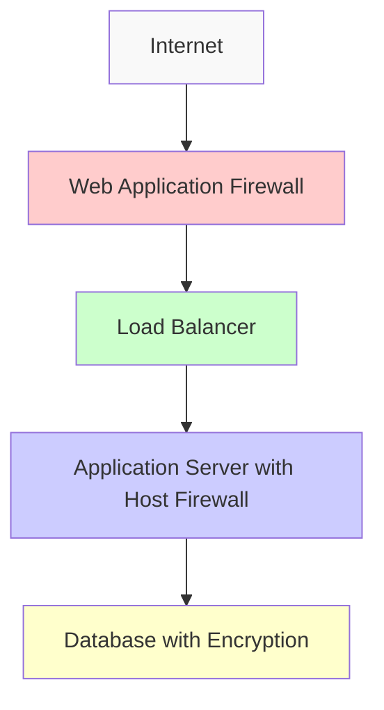
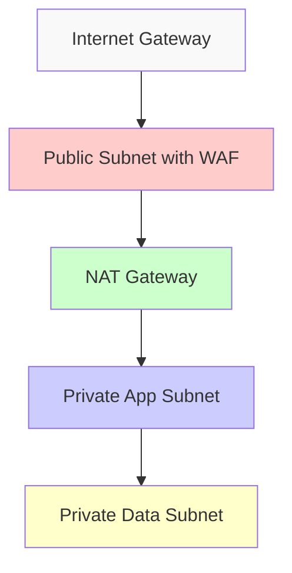
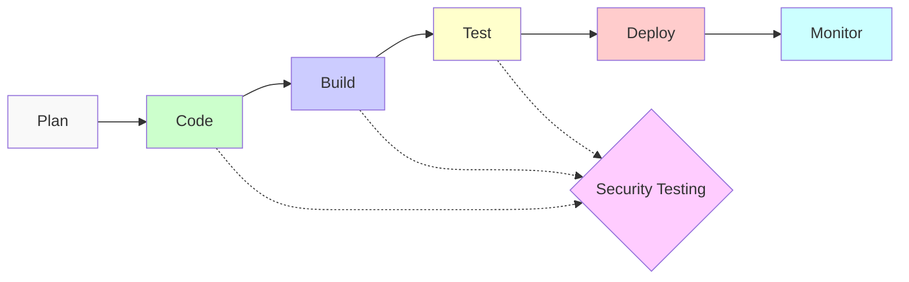

# Security Best Practices

## Introduction

Security is a critical aspect of modern DevOps and cloud infrastructure. With the increasing frequency and sophistication of cyber attacks, implementing robust security practices has become essential for protecting applications, data, and infrastructure. This guide explores key security best practices that DevOps engineers and cloud practitioners should implement to safeguard their systems from potential threats.

Security in DevOps—often called DevSecOps—integrates security practices throughout the development lifecycle rather than treating it as an afterthought. By embedding security into every stage of your development and deployment process, you can build more resilient systems that are better equipped to withstand security threats.

## Core Security Principles

### 1. Defense in Depth

The concept of "defense in depth" involves implementing multiple layers of security controls throughout your infrastructure.



**Why it matters**: If one layer is compromised, additional layers continue to protect your resources. This approach significantly reduces the risk of a complete system breach.

### 2. Principle of Least Privilege

Grant users and services the minimum permissions required to perform their functions.

**Example**: Instead of giving a service full admin access, limit permissions to only what's needed:

```yaml
# AWS IAM Policy with Least Privilege
{
  "Version": "2012-10-17",
  "Statement": [
    {
      "Effect": "Allow",
      "Action": [
        "s3:GetObject",
        "s3:ListBucket"
      ],
      "Resource": [
        "arn:aws:s3:::example-bucket",
        "arn:aws:s3:::example-bucket/*"
      ]
    }
  ]
}
```

**Why it matters**: If credentials are compromised, the attacker's ability to cause damage is limited by the restricted permissions.

### 3. Secure Configuration Management

Document, standardize, and automate secure configurations for all systems and components.

**Example using Terraform**:

```hcl
# Secure S3 bucket configuration with encryption and versioning
resource "aws_s3_bucket" "secure_bucket" {
  bucket = "secure-application-data"
  
  versioning {
    enabled = true
  }
  
  server_side_encryption_configuration {
    rule {
      apply_server_side_encryption_by_default {
        sse_algorithm = "AES256"
      }
    }
  }
  
  # Block public access
  block_public_acls       = true
  block_public_policy     = true
  ignore_public_acls      = true
  restrict_public_buckets = true
}
```

## DevOps-Specific Security Practices

### 1. Infrastructure as Code (IaC) Security

When defining infrastructure as code, incorporate security checks to prevent insecure deployments.

**Best practices**:

- Use IaC security scanning tools (like Checkov, TFSec, or CFN-Nag)
- Create reusable, secure templates
- Version control all infrastructure code

**Example: Scanning Terraform code with Checkov**:

```bash
# Command to scan Terraform code
$ checkov -d /path/to/terraform/code

# Sample output
Check: CKV_AWS_20: "S3 Bucket has an ACL defined which allows public access."
   FAILED for resource: aws_s3_bucket.data
   File: /main.tf:30-42
   Guide: https://docs.checkov.io/docs/aws/CKV_AWS_20

Check: CKV_AWS_21: "Ensure all data stored in the S3 bucket is securely encrypted at rest"
   PASSED for resource: aws_s3_bucket.data
```

### 2. Secret Management

Properly manage secrets like API keys, database credentials, and other sensitive information.

**Best practices**:

- Never hardcode secrets in application code or configuration files
- Use dedicated secret management tools
- Rotate credentials regularly

**Example using Hashicorp Vault**:

```bash
# Store a database password in Vault
$ vault kv put secret/myapp/database password="super-secure-password"

# Application retrieval
$ vault kv get secret/myapp/database
```

**Accessing secrets programmatically**:

```javascript
// Node.js example using Vault client
const vault = require("node-vault")({
  endpoint: "https://vault.example.com:8200",
  token: process.env.VAULT_TOKEN
});

async function getDatabaseCredentials() {
  try {
    const result = await vault.read("secret/myapp/database");
    return result.data;
  } catch (error) {
    console.error("Error retrieving secrets:", error);
  }
}
```

### 3. CI/CD Pipeline Security

Secure your continuous integration and delivery pipelines to prevent them from becoming attack vectors.

**Best practices**:

- Scan code for vulnerabilities at each stage
- Enforce approval workflows for sensitive deployments
- Use ephemeral, isolated build environments
- Implement signing and verification for artifacts

**Example Jenkins pipeline with security measures**:

```groovy
pipeline {
    agent {
        // Use ephemeral containers for isolation
        docker {
            image 'node:16-alpine'
            args '-u root'
        }
    }
    
    stages {
        stage('Checkout') {
            steps {
                checkout scm
            }
        }
        
        stage('Install Dependencies') {
            steps {
                sh 'npm ci'
            }
        }
        
        stage('Security Scan') {
            steps {
                // Run SAST using npm audit
                sh 'npm audit --audit-level=high'
                
                // Run dependency scan using Snyk
                sh 'npx snyk test --severity-threshold=high'
            }
        }
        
        stage('Build') {
            steps {
                sh 'npm run build'
            }
        }
        
        stage('Test') {
            steps {
                sh 'npm test'
            }
        }
        
        stage('Deploy to Staging') {
            when {
                branch 'develop'
            }
            steps {
                // Deploy code to staging environment
                sh './deploy.sh staging'
            }
        }
        
        stage('Deploy to Production') {
            when {
                branch 'main'
            }
            steps {
                // Require manual approval before deploying to production
                input message: 'Deploy to production?', ok: 'Approve'
                
                // Sign the deployment artifact
                sh 'gpg --detach-sign --armor ./dist/bundle.js'
                
                // Deploy to production
                sh './deploy.sh production'
            }
        }
    }
    
    post {
        always {
            // Clean up sensitive data
            sh 'rm -rf node_modules'
            cleanWs()
        }
    }
}
```

## Cloud Security Best Practices

### 1. Identity and Access Management (IAM)

Implement strong identity controls in your cloud environments.

**Best practices**:

- Implement role-based access control (RBAC)
- Enable multi-factor authentication (MFA)
- Regularly audit and review permissions
- Use temporary credentials where possible

**Example Azure RBAC Role**:

```json
{
  "Name": "App Service Reader",
  "Description": "Can view App Service resources but not modify them",
  "Actions": [
    "Microsoft.Web/sites/read",
    "Microsoft.Web/sites/config/read"
  ],
  "NotActions": [],
  "AssignableScopes": [
    "/subscriptions/{subscriptionId}/resourceGroups/{resourceGroupName}"
  ]
}
```

### 2. Network Security

Protect your cloud networks from unauthorized access and potential threats.

**Best practices**:

- Implement proper network segmentation
- Use private subnets for sensitive resources
- Configure security groups and firewalls
- Implement traffic filtering and inspection

**Example AWS network security architecture**:



**AWS Security Group Example**:

```hcl
resource "aws_security_group" "web_server" {
  name        = "web-server-sg"
  description = "Security group for web servers"
  vpc_id      = aws_vpc.main.id

  # Allow inbound HTTP and HTTPS from anywhere
  ingress {
    from_port   = 80
    to_port     = 80
    protocol    = "tcp"
    cidr_blocks = ["0.0.0.0/0"]
    description = "Allow HTTP traffic"
  }

  ingress {
    from_port   = 443
    to_port     = 443
    protocol    = "tcp"
    cidr_blocks = ["0.0.0.0/0"]
    description = "Allow HTTPS traffic"
  }

  # Allow SSH only from internal network
  ingress {
    from_port   = 22
    to_port     = 22
    protocol    = "tcp"
    cidr_blocks = ["10.0.0.0/16"]
    description = "Allow SSH from internal network only"
  }

  # Allow all outbound traffic
  egress {
    from_port   = 0
    to_port     = 0
    protocol    = "-1"
    cidr_blocks = ["0.0.0.0/0"]
    description = "Allow all outbound traffic"
  }

  tags = {
    Name = "web-server-sg"
  }
}
```

### 3. Data Protection

Safeguard data at rest, in transit, and in use within cloud environments.

**Best practices**:

- Encrypt sensitive data at rest and in transit
- Implement data backup and recovery solutions
- Apply data loss prevention (DLP) policies
- Control and monitor data access

**Example encryption configuration in GCP**:

```yaml
# Google Cloud Storage bucket with default encryption
resources:
- name: secure-data-bucket
  type: storage.v1.bucket
  properties:
    location: us-central1
    encryption:
      defaultKmsKeyName: projects/my-project/locations/global/keyRings/my-keyring/cryptoKeys/my-key
    versioning:
      enabled: true
    lifecycle:
      rule:
      - action:
          type: Delete
        condition:
          age: 90
          isLive: false
```

### 4. Monitoring and Threat Detection

Implement comprehensive logging and monitoring to detect and respond to security threats.

**Best practices**:

- Centralize log collection
- Set up alerts for suspicious activities
- Regularly review security logs
- Implement automated responses to common threats

**Example logging setup using Fluentd**:

```yaml
# Fluentd configuration to collect and forward logs to a SIEM
<source>
  @type tail
  path /var/log/nginx/access.log
  pos_file /var/log/fluentd/nginx-access.log.pos
  tag nginx.access
  <parse>
    @type nginx
  </parse>
</source>

<filter nginx.access>
  @type grep
  <regexp>
    key message
    pattern /(admin|login|password|token)/i
  </regexp>
</filter>

<match nginx.access>
  @type elasticsearch
  host elasticsearch.example.com
  port 9200
  index_name nginx-access
  include_tag_key true
</match>
```

## Implementing DevSecOps Culture

Integrating security into DevOps requires cultural change in addition to technical solutions.

### 1. Security Training and Awareness

Ensure your team understands security principles and best practices.

**Best practices**:

- Regular security training sessions
- Security champions within development teams
- Capture and share security lessons learned
- Create security checklists for common tasks

### 2. Shift Left Security

Move security testing and validation earlier in the development process.



**Best practices**:

- Implement pre-commit hooks for security checks
- Use IDE plugins for real-time security feedback
- Include security requirements in user stories
- Validate security early with automated tools

**Example pre-commit hook**:

```bash
#!/bin/bash
# Pre-commit hook to check for hardcoded secrets

FILES_PATTERN="\.(js|java|py|go|rb|php|json|yaml|yml|xml|properties|config)(\.|$)"
KEYWORDS="password|secret|key|token|credential|passwd"

if git diff --cached --name-only | grep -E $FILES_PATTERN | xargs grep -l -E $KEYWORDS >/dev/null; then
    echo "COMMIT REJECTED: Found potential secrets in your changes."
    echo "Please remove secrets or use a secure vault instead."
    
    git diff --cached --name-only | grep -E $FILES_PATTERN | 
    xargs grep --color -n -E $KEYWORDS
    
    exit 1
fi

exit 0
```

### 3. Regular Security Assessments

Perform systematic security checks of your infrastructure and applications.

**Types of security assessments**:

- Vulnerability scanning
- Penetration testing
- Compliance audits
- Architecture reviews

**Example vulnerability scanning with OWASP ZAP**:

```bash
# Basic automated scan using ZAP
docker run -t owasp/zap2docker-stable zap-baseline.py -t https://example.com

# Output will include findings like:
# WARN-NEW: X-Content-Type-Options Header Missing [10021]
# WARN-NEW: Cookie Without Secure Flag [10011]
```

## Compliance and Regulatory Considerations

Different industries and regions have specific security compliance requirements.

**Common frameworks and regulations**:

- GDPR (General Data Protection Regulation)
- HIPAA (Health Insurance Portability and Accountability Act)
- PCI DSS (Payment Card Industry Data Security Standard)
- SOC 2 (Service Organization Control 2)

**Best practices**:

- Document your compliance controls
- Map security practices to compliance requirements
- Automate compliance checks where possible
- Prepare for audits with proper evidence collection

**Example compliance check with InSpec**:

```ruby
# InSpec profile for checking basic PCI DSS requirements
control 'pci-dss-requirement-8.2.3' do
  impact 1.0
  title 'Passwords must require a minimum length of at least seven characters'
  desc 'Password parameters must be configured to require passwords to have a minimum length of at least seven characters.'
  
  describe security_policy do
    its('MinimumPasswordLength') { should be >= 7 }
  end
end

control 'pci-dss-requirement-2.2.4' do
  impact 1.0
  title 'Configure system security parameters to prevent misuse'
  
  describe sshd_config do
    its('Protocol') { should cmp 2 }
    its('LogLevel') { should eq 'INFO' }
    its('PermitRootLogin') { should eq 'no' }
    its('PermitEmptyPasswords') { should eq 'no' }
  end
end
```

## Security Incident Response

Prepare for security incidents before they occur to minimize damage and recovery time.

**Key elements of incident response**:

1. **Preparation**: Establish procedures, roles, and communication channels
2. **Detection**: Identify potential security incidents
3. **Containment**: Limit the damage of the incident
4. **Eradication**: Remove the threat from the environment
5. **Recovery**: Restore systems to normal operation
6. **Lessons Learned**: Review and improve security posture

**Example incident response runbook template**:

```yaml
Title: Database Unauthorized Access Incident Response
Severity: High
Responsible Team: Database Security Team

Detection:
  - Alert from database audit logs showing unusual privileged operations
  - Alert from SIEM indicating multiple failed login attempts followed by successful login

Initial Assessment:
  1. Verify the alert is valid
  2. Check if access was authorized but unusual
  3. Determine the scope of potential data access

Containment Steps:
  1. Isolate the affected database instances
  2. Revoke the compromised credentials
  3. Enable enhanced monitoring on related systems
  4. Block the source IP addresses if external

Eradication Steps:
  1. Identify the attack vector
  2. Patch vulnerabilities if applicable
  3. Review and update access controls
  4. Scan for any persistence mechanisms

Recovery Steps:
  1. Restore from last known good backup if data was modified
  2. Issue new credentials with proper restrictions
  3. Gradually return to normal operations with monitoring
  4. Verify data integrity

Communication Plan:
  - Internal: Security team, IT management, affected application owners
  - External: Customers, regulators (if data breach confirmed)

Documentation Requirements:
  - Timeline of events
  - Actions taken
  - Extent of impact
  - Evidence preservation
```

## Summary

Security best practices in DevOps and cloud environments require a holistic approach that integrates security throughout the development lifecycle and across all layers of your infrastructure. Key takeaways include:

1. **Shift security left** in your development process to identify issues early
2. **Automate security checks** to make them consistent and repeatable
3. **Implement defense in depth** with multiple security controls
4. **Follow least privilege principles** for all identities and services
5. **Secure your CI/CD pipelines** to protect your deployment process
6. **Protect data** in all states: at rest, in transit, and in use
7. **Monitor continuously** to detect and respond to threats quickly
8. **Create a security-aware culture** through training and awareness

By integrating these security best practices into your DevOps and cloud operations, you can build more resilient systems that better protect your organization's data and resources from evolving security threats.

## Additional Resources

### Learning Resources

- **Books**:
  - "DevOps Security: Securing Software Through Continuous Delivery" by Paul Duvall
  - "Cloud Security and Privacy" by Tim Mather, Subra Kumaraswamy, and Shahed Latif

- **Online Courses**:
  - AWS Security Specialty Certification
  - Certified Kubernetes Security Specialist (CKS)
  - Certified Cloud Security Professional (CCSP)

- **Websites and Documentation**:
  - OWASP Cloud Security Project
  - Cloud Security Alliance (CSA) Best Practices
  - NIST Cybersecurity Framework

### Security Tools

- **IAM**: AWS IAM, Azure AD, HashiCorp Vault, CyberArk
- **SAST**: SonarQube, Checkmarx, Fortify
- **DAST**: OWASP ZAP, Burp Suite
- **Container Security**: Aqua Security, Twistlock, Sysdig Secure
- **Infrastructure as Code Security**: Checkov, TFSec, CloudSploit
- **Compliance as Code**: InSpec, Open Policy Agent, kube-bench

## Exercises

1. **Security Assessment**:
   - Perform a security audit of an existing application using OWASP ZAP
   - Document findings and prioritize remediation steps

2. **Infrastructure as Code Security**:
   - Take an existing Terraform or CloudFormation template
   - Run a security scanning tool like Checkov or CFN-Nag
   - Fix any identified security issues

3. **Secret Management Implementation**:
   - Set up a secrets management solution (HashiCorp Vault, AWS Secrets Manager, etc.)
   - Migrate existing hardcoded secrets to the new system
   - Update application code to retrieve secrets dynamically

4. **DevSecOps Pipeline**:
   - Add security scanning steps to an existing CI/CD pipeline
   - Implement quality gates that prevent deployment if critical vulnerabilities are found
   - Create reports that track security debt over time