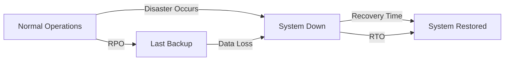
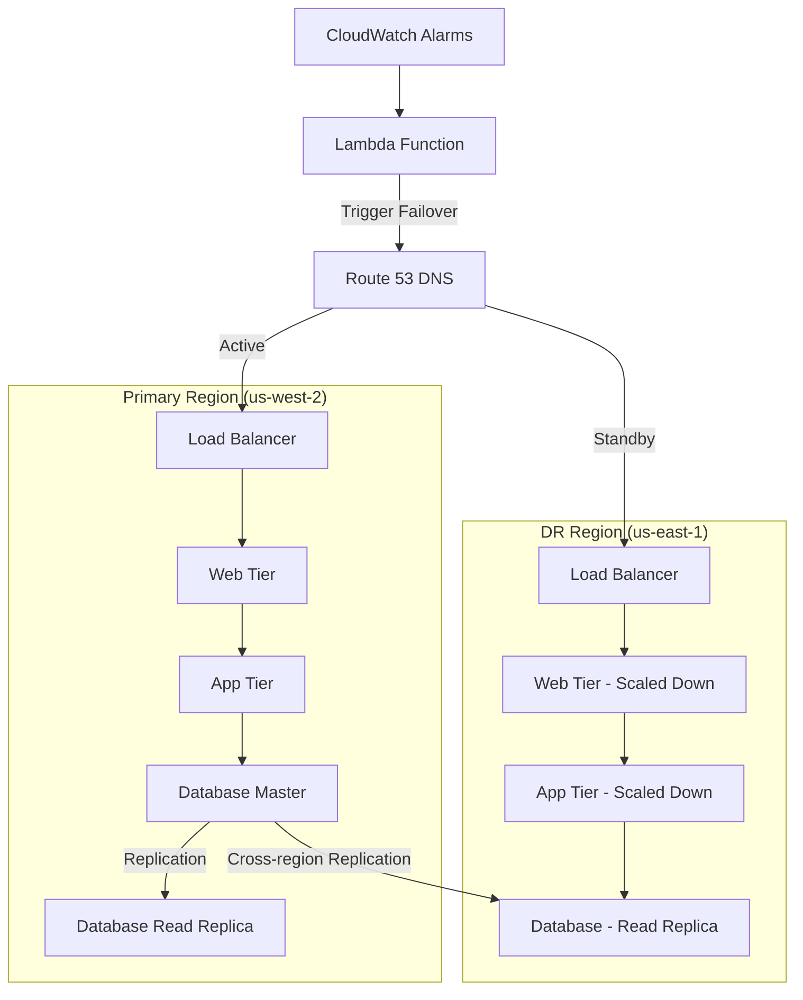

# Disaster Recovery

## Introduction

Disaster Recovery (DR) is a critical component of any robust cloud or DevOps infrastructure strategy. It encompasses the policies, procedures, and technologies designed to recover systems, data, and infrastructure following a disaster. These disasters can range from natural calamities like earthquakes and floods to human-induced issues such as cyberattacks, hardware failures, or operational errors.

In today's digital landscape where businesses rely heavily on continuous availability of IT services, effective disaster recovery planning is not just a good practice—it's a business necessity. A well-designed DR strategy can mean the difference between a minor disruption and a catastrophic business failure.

## Key Concepts in Disaster Recovery

### Recovery Time Objective (RTO)

Recovery Time Objective defines the maximum acceptable length of time a system can be down after a disaster. It answers the question: "How quickly must we recover?"

```
RTO = Time when system is restored - Time when disaster occurred
```

For example, if your e-commerce platform has an RTO of 4 hours, your DR plan should ensure that the system can be restored within 4 hours of a disaster.

### Recovery Point Objective (RPO)

Recovery Point Objective defines the maximum acceptable amount of data loss measured in time. It answers the question: "How much data can we afford to lose?"

```
RPO = Time of last backup - Time when disaster occurred
```

For instance, if your database has an RPO of 15 minutes, you need to ensure that backups occur at least every 15 minutes.

<br />

Let's visualize RTO and RPO:



### Business Impact Analysis (BIA)

BIA is the process of determining the potential impacts of disasters on business operations. This analysis helps prioritize systems and applications based on their criticality to business functions, which in turn informs RTO and RPO values.

### Disaster Recovery Plan (DRP)

A DRP is a documented process that outlines the steps necessary to recover IT systems, infrastructure, and data following a disaster. It should be:

- Comprehensive
- Regularly tested
- Easily accessible
- Well-communicated to relevant personnel

## Disaster Recovery Strategies

Different DR strategies offer varying levels of protection, cost, and complexity:

### 1. Backup and Restore

The most basic strategy involves regular data backups that can be restored when needed.

#### Implementation Example:

```bash
# Example: Setting up automated daily backup with AWS CLI
aws backup start-backup-job \
  --backup-vault-name my-backup-vault \
  --resource-arn arn:aws:ec2:us-west-2:123456789012:instance/i-0123456789abcdef \
  --iam-role-arn arn:aws:iam::123456789012:role/backup-role \
  --lifecycle DeleteAfterDays=90
```

**Pros:**
- Low cost
- Simple to implement

**Cons:**
- High RTO (slow recovery)
- Potential for significant data loss

### 2. Pilot Light

In this approach, a minimal version of the core infrastructure is always running in the cloud.

#### Implementation Example:

```terraform
# Terraform example for maintaining a scaled-down "pilot light" environment
resource "aws_instance" "pilot_light_db" {
  ami           = "ami-0c55b159cbfafe1f0"
  instance_type = "t2.micro"  # Smaller instance type for cost savings
  
  tags = {
    Name = "PilotLightDatabase"
    Environment = "DR"
  }
}

# This can be scaled up quickly in case of disaster
```

**Pros:**
- Faster recovery than backup-restore
- Lower cost than hot standby

**Cons:**
- Requires some ongoing maintenance
- Still requires time to scale up

### 3. Warm Standby

A scaled-down but fully functional environment is continuously running.

#### Implementation Example:

```yaml
# Kubernetes example: Maintaining a warm standby with reduced replicas
apiVersion: apps/v1
kind: Deployment
metadata:
  name: app-warm-standby
  namespace: dr-environment
spec:
  replicas: 2  # Reduced from production count
  selector:
    matchLabels:
      app: my-application
  template:
    metadata:
      labels:
        app: my-application
    spec:
      containers:
      - name: app-container
        image: my-application:latest
        resources:
          requests:
            memory: "256Mi"
            cpu: "0.5"
          limits:
            memory: "512Mi"
            cpu: "1"
```

**Pros:**
- Much faster recovery
- Systems are already running and tested

**Cons:**
- Higher ongoing costs
- Requires active maintenance

### 4. Hot Site / Multi-Site

Full production environment is duplicated and running continuously in multiple locations.

#### Implementation Example:

```hcl
# Terraform configuration for multi-region deployment
provider "aws" {
  alias  = "primary"
  region = "us-west-2"
}

provider "aws" {
  alias  = "dr"
  region = "us-east-1"
}

# Primary region resources
module "primary_environment" {
  source = "./environment"
  providers = {
    aws = aws.primary
  }
  environment = "production"
  instance_count = 5
}

# DR region resources (identical to primary)
module "dr_environment" {
  source = "./environment"
  providers = {
    aws = aws.dr
  }
  environment = "dr-production"
  instance_count = 5
}
```

**Pros:**
- Near-zero RTO and RPO
- High resilience

**Cons:**
- Most expensive option
- Complex to maintain synchronization

## Cloud-Based Disaster Recovery Implementation

### AWS Disaster Recovery Solutions

AWS offers several solutions to implement disaster recovery:

1. **AWS Backup**: Centralized backup service
2. **Amazon S3 Cross-Region Replication**: Automatic replication of S3 objects
3. **AWS CloudFormation**: Infrastructure as code for quick environment replication
4. **Route 53**: DNS failover capabilities

#### Example: Setting up S3 Cross-Region Replication

```json
{
  "Rules": [
    {
      "Status": "Enabled",
      "Priority": 1,
      "DeleteMarkerReplication": { "Status": "Enabled" },
      "Filter" : { "Prefix": "" },
      "Destination": {
        "Bucket": "arn:aws:s3:::destination-bucket",
        "ReplicationTime": {
          "Status": "Enabled",
          "Time": {
            "Minutes": 15
          }
        },
        "Metrics": {
          "Status": "Enabled",
          "EventThreshold": {
            "Minutes": 15
          }
        }
      }
    }
  ]
}
```

### Azure Disaster Recovery Solutions

Azure provides these key services for DR:

1. **Azure Site Recovery**: Orchestrates replication, failover, and recovery
2. **Azure Backup**: Backup and restore capabilities
3. **Azure Traffic Manager**: Routing traffic for failover scenarios

#### Example: Azure Site Recovery Configuration

```powershell
# PowerShell example to set up Azure Site Recovery
# Create a Recovery Services vault
New-AzRecoveryServicesVault -Name "MyVault" -ResourceGroupName "MyRG" -Location "East US"

# Set vault context
Set-AzRecoveryServicesVaultContext -Vault $vault

# Create a replication policy
$policy = New-AzRecoveryServicesAsrPolicy -Name "MyPolicy" -RecoveryPointRetentionInHours 24 -ApplicationConsistentSnapshotFrequencyInHours 4
```

### Google Cloud Platform (GCP)

GCP offers these DR solutions:

1. **Regional Persistent Disks**: Synchronously replicated across zones
2. **Google Cloud Storage**: Multi-regional storage
3. **Deployment Manager**: Template-based deployment for DR environments

## Testing Disaster Recovery

A DR plan is only as good as its testing. Regular testing ensures that:

1. Recovery procedures work as expected
2. RTO and RPO objectives can be met
3. Team members understand their roles during a disaster

### Types of DR Tests

1. **Walkthrough/Tabletop Exercises**: Discussion-based review of the DR plan
2. **Simulation Tests**: Simulated disaster scenarios in a test environment
3. **Parallel Tests**: Recovery systems are activated without disrupting production
4. **Full Interruption Tests**: Production systems are actually shut down (highest risk)

### Testing Example: Database Recovery Test

```bash
# 1. Create a test instance from the latest backup
aws rds restore-db-instance-from-db-snapshot \
  --db-instance-identifier restored-test-db \
  --db-snapshot-identifier latest-backup-snapshot

# 2. Verify data integrity and application connectivity
mysql -h restored-test-db.xyz.region.rds.amazonaws.com -u admin -p -e "SELECT COUNT(*) FROM critical_table;"

# 3. Measure the time taken and compare with RTO objective
# 4. Document findings and update DR plan if necessary
```

## Real-World Implementation Example

Let's walk through a comprehensive DR setup for a web application:

### Architecture



### Implementation Steps

1. **Set up cross-region database replication**:

```sql
-- PostgreSQL example
SELECT * FROM pg_create_physical_replication_slot('disaster_recovery_slot');

-- Configure standby
ALTER SYSTEM SET primary_conninfo = 'host=primary_db port=5432 user=replication password=secret';
ALTER SYSTEM SET primary_slot_name = 'disaster_recovery_slot';
```

2. **Implement infrastructure as code for both regions**:

```yaml
# CloudFormation example (simplified)
Resources:
  PrimaryVPC:
    Type: AWS::EC2::VPC
    Properties:
      CidrBlock: 10.0.0.0/16
      
  DRVpc:
    Type: AWS::EC2::VPC
    Properties:
      CidrBlock: 10.1.0.0/16
      
  PrimaryWebServer:
    Type: AWS::EC2::Instance
    Properties:
      InstanceType: t3.large
      # Additional properties...
      
  DRWebServer:
    Type: AWS::EC2::Instance
    Properties:
      InstanceType: t3.medium
      # Additional properties...
```

3. **Set up automated failover detection and switching**:

```javascript
// Lambda function for automated failover (simplified)
exports.handler = async (event) => {
  // Check if primary region is down based on CloudWatch alarm
  if (event.detail.alarmName === 'PrimaryRegionHealthCheck') {
    // Update Route 53 to point to DR region
    const params = {
      ChangeBatch: {
        Changes: [
          {
            Action: 'UPSERT',
            ResourceRecordSet: {
              Name: 'myapplication.example.com',
              Type: 'A',
              SetIdentifier: 'Failover',
              Failover: 'PRIMARY',
              ResourceRecords: [{ Value: DR_REGION_ENDPOINT }],
              TTL: 60,
            },
          },
        ],
      },
      HostedZoneId: 'Z1PA6795UKMFR9',
    };
    
    return await route53.changeResourceRecordSets(params).promise();
  }
};
```

4. **Regular backup and verification**:

```bash
# Automated backup verification script
#!/bin/bash

# Restore the latest backup to a test environment
BACKUP_ID=$(aws backup list-recovery-points-by-backup-vault --backup-vault-name my-vault --query 'RecoveryPoints[0].RecoveryPointArn' --output text)

aws backup start-restore-job \
  --recovery-point-arn $BACKUP_ID \
  --metadata '{"RestoreTestInstance": "true"}' \
  --iam-role-arn arn:aws:iam::123456789012:role/restore-role

# Run verification tests and send report
./verify_backup_integrity.sh
```

## Best Practices

1. **Document Everything**: Maintain detailed documentation of your DR plan
2. **Automation**: Automate as much of the DR process as possible
3. **Regular Testing**: Test your DR plan at least quarterly
4. **Security**: Ensure DR sites maintain the same security standards as primary sites
5. **Monitoring**: Implement robust monitoring to detect disasters quickly
6. **Communication Plan**: Establish clear communication channels during disasters
7. **Continuous Improvement**: Review and update the DR plan after incidents or tests

## Common Challenges and Solutions

| Challenge | Solution |
|-----------|----------|
| Cost constraints | Implement tiered DR strategies based on application criticality |
| Data synchronization | Use database replication technologies with monitoring |
| Complex dependencies | Document and test dependencies thoroughly |
| Changing environments | Implement DR as code and include in CI/CD pipelines |
| Human error | Automate processes and create clear playbooks |

## Summary

Disaster Recovery is a crucial aspect of DevOps and cloud infrastructure that ensures business continuity in the face of unexpected events. Key points to remember:

- Define clear RTO and RPO objectives based on business requirements
- Choose the appropriate DR strategy based on criticality and budget
- Implement cloud-native DR solutions when possible
- Test your DR plan regularly
- Document and automate processes
- Continuously improve based on testing and real-world incidents

By implementing a comprehensive disaster recovery strategy, organizations can minimize downtime, reduce data loss, and maintain business operations even when disaster strikes.

## Additional Resources

- [AWS Disaster Recovery Whitepaper](https://aws.amazon.com/disaster-recovery/)
- [Azure Business Continuity Documentation](https://docs.microsoft.com/en-us/azure/site-recovery/)
- [Google Cloud Disaster Recovery Planning Guide](https://cloud.google.com/solutions/dr-scenarios-planning-guide)
- [The Disaster Recovery Journal](https://drj.com/)

## Exercises

1. Calculate the RTO and RPO requirements for three different applications in a typical organization.
2. Design a pilot light DR strategy for a three-tier web application.
3. Create a basic disaster recovery runbook template.
4. Compare the costs of different DR strategies for a sample application.
5. Design and document a DR testing schedule and methodology for a critical system.