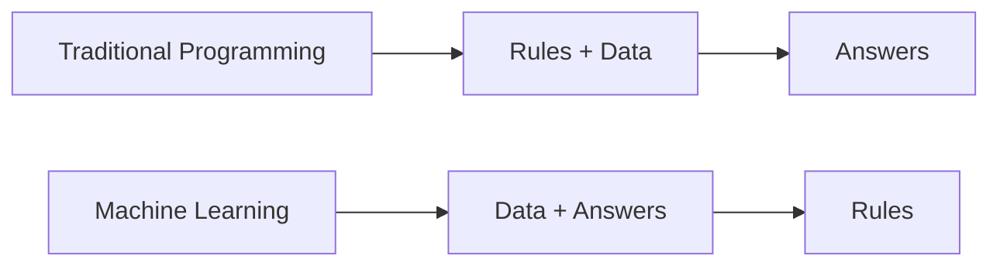
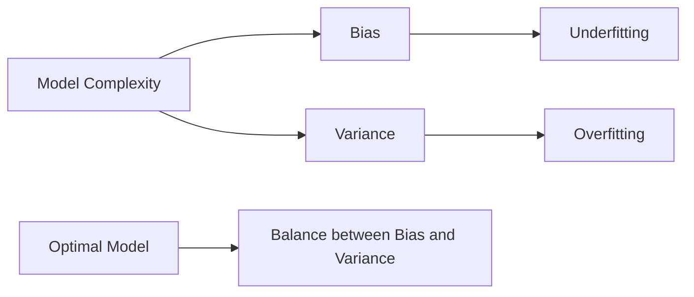

# Machine Learning Fundamentals

## Introduction

Machine Learning (ML) is a subset of artificial intelligence that enables systems to learn and improve from experience without being explicitly programmed. At its core, ML is about creating algorithms that can receive input data and use statistical analysis to predict outputs while updating themselves when new data becomes available.

In this guide, we'll explore the fundamental concepts of machine learning that form the foundation of more advanced topics. Whether you're preparing for interviews or starting your ML journey, understanding these basics is crucial for success in the field.

## What is Machine Learning?

Machine learning is the process of teaching computers to learn patterns from data. Unlike traditional programming where we provide explicit instructions, in machine learning, we provide examples from which the algorithm learns.



### Types of Machine Learning

Machine learning is typically categorized into three main types:

1. **Supervised Learning**: The algorithm learns from labeled training data, trying to predict outcomes for unseen data.
2. **Unsupervised Learning**: The algorithm works with unlabeled data, trying to find patterns or structures within it.
3. **Reinforcement Learning**: The algorithm learns by interacting with an environment, receiving rewards or penalties for its actions.

## Key Machine Learning Concepts

### 1. Data and Features

**Data** is the foundation of any machine learning model. It consists of examples (instances) that the model will learn from.

**Features** are the individual measurable properties of the phenomena being observed. Selecting relevant features is critical for model performance.

Example:

```python
# Sample dataset with features: square footage, bedrooms, and age
# Target: house price
import pandas as pd

data = {
    'sqft': [1400, 1600, 1700, 1875, 1100],
    'bedrooms': [3, 3, 4, 4, 2],
    'age': [15, 10, 12, 7, 25],
    'price': [235000, 285000, 310000, 340000, 195000]
}

df = pd.DataFrame(data)
print(df)
```

Output:
```
   sqft  bedrooms  age   price
0  1400         3   15  235000
1  1600         3   10  285000
2  1700         4   12  310000
3  1875         4    7  340000
4  1100         2   25  195000
```

### 2. Training and Testing Sets

To evaluate a model's performance, we split our data into:
- **Training set**: Used to train the model (typically 70-80% of the data)
- **Testing set**: Used to evaluate the model's performance on unseen data

```python
from sklearn.model_selection import train_test_split

# Split the data
X = df[['sqft', 'bedrooms', 'age']]  # features
y = df['price']  # target

X_train, X_test, y_train, y_test = train_test_split(X, y, test_size=0.2, random_state=42)
```

### 3. Model Training and Evaluation

#### Training
Training involves feeding data to the algorithm so it can learn patterns and relationships between features and targets.

```python
from sklearn.linear_model import LinearRegression

# Create and train the model
model = LinearRegression()
model.fit(X_train, y_train)
```

#### Evaluation
Common evaluation metrics include:

For regression problems:
- Mean Absolute Error (MAE)
- Mean Squared Error (MSE)
- Root Mean Squared Error (RMSE)
- R-squared (R²)

For classification problems:
- Accuracy
- Precision
- Recall
- F1 Score
- Confusion Matrix

```python
from sklearn.metrics import mean_squared_error, r2_score

# Make predictions
y_pred = model.predict(X_test)

# Evaluate the model
mse = mean_squared_error(y_test, y_pred)
r2 = r2_score(y_test, y_pred)

print(f"Mean Squared Error: {mse}")
print(f"R² Score: {r2}")
```

### 4. Bias-Variance Tradeoff

The bias-variance tradeoff is a fundamental concept in machine learning:

- **High bias** (underfitting): The model is too simple and cannot capture the underlying pattern in the data.
- **High variance** (overfitting): The model is too complex and captures noise in the training data, failing to generalize to new data.



### 5. Feature Engineering

Feature engineering is the process of creating new features or transforming existing ones to improve model performance.

```python
# Feature engineering example
df['bedrooms_per_sqft'] = df['bedrooms'] / df['sqft']
df['is_new'] = df['age'] < 10  # Boolean feature
```

### 6. Regularization

Regularization techniques help prevent overfitting by adding a penalty term to the loss function:

- **L1 Regularization (Lasso)**: Adds absolute value of coefficients as penalty term, can lead to sparse models
- **L2 Regularization (Ridge)**: Adds squared magnitude of coefficients as penalty term, shrinks coefficients

```python
from sklearn.linear_model import Ridge, Lasso

# Ridge regression (L2 regularization)
ridge_model = Ridge(alpha=1.0)
ridge_model.fit(X_train, y_train)

# Lasso regression (L1 regularization)
lasso_model = Lasso(alpha=0.1)
lasso_model.fit(X_train, y_train)
```

## Common Machine Learning Algorithms

### 1. Linear Regression

Linear regression models the relationship between a dependent variable and one or more independent variables using a linear equation.

```python
from sklearn.linear_model import LinearRegression
import matplotlib.pyplot as plt
import numpy as np

# Generate sample data
X = np.array([[1], [2], [3], [4], [5]])
y = np.array([2, 3.5, 4.8, 6.3, 7.5])

# Train the model
model = LinearRegression()
model.fit(X, y)

# Make predictions
X_new = np.array([[0], [6]])
y_pred = model.predict(X_new)

# Plot the results
plt.scatter(X, y, color='blue', label='Data points')
plt.plot(np.concatenate([X_new, X]), np.concatenate([y_pred, model.predict(X)]), color='red', label='Linear regression')
plt.xlabel('X')
plt.ylabel('y')
plt.legend()
plt.title('Linear Regression Example')
plt.show()

print(f"Coefficient: {model.coef_[0]}")
print(f"Intercept: {model.intercept_}")
```

Output:
```
Coefficient: 1.37
Intercept: 0.65
```

### 2. Logistic Regression

Despite its name, logistic regression is a classification algorithm that estimates the probability of an instance belonging to a particular class.

```python
from sklearn.linear_model import LogisticRegression
from sklearn.datasets import make_classification
from sklearn.model_selection import train_test_split
from sklearn.metrics import accuracy_score, classification_report

# Generate a binary classification dataset
X, y = make_classification(n_samples=100, n_features=2, n_informative=2, 
                          n_redundant=0, random_state=42)

# Split the data
X_train, X_test, y_train, y_test = train_test_split(X, y, test_size=0.2, random_state=42)

# Train the model
model = LogisticRegression()
model.fit(X_train, y_train)

# Make predictions
y_pred = model.predict(X_test)

# Evaluate the model
accuracy = accuracy_score(y_test, y_pred)
print(f"Accuracy: {accuracy:.2f}")
print("
Classification Report:")
print(classification_report(y_test, y_pred))
```

### 3. Decision Trees

Decision trees are versatile algorithms that can perform both classification and regression tasks by creating a model that predicts the value of a target variable by learning simple decision rules.

```python
from sklearn.tree import DecisionTreeClassifier
from sklearn.datasets import load_iris
from sklearn.model_selection import train_test_split
from sklearn.metrics import accuracy_score

# Load the Iris dataset
iris = load_iris()
X, y = iris.data, iris.target

# Split the data
X_train, X_test, y_train, y_test = train_test_split(X, y, test_size=0.2, random_state=42)

# Train the model
dt_model = DecisionTreeClassifier(max_depth=3)
dt_model.fit(X_train, y_train)

# Make predictions
y_pred = dt_model.predict(X_test)

# Evaluate the model
accuracy = accuracy_score(y_test, y_pred)
print(f"Decision Tree Accuracy: {accuracy:.2f}")
```

### 4. K-Nearest Neighbors (KNN)

KNN is a simple, instance-based learning algorithm that classifies new data points based on the majority class of their k nearest neighbors.

```python
from sklearn.neighbors import KNeighborsClassifier
from sklearn.datasets import load_breast_cancer
from sklearn.model_selection import train_test_split
from sklearn.metrics import accuracy_score

# Load the breast cancer dataset
cancer = load_breast_cancer()
X, y = cancer.data, cancer.target

# Split the data
X_train, X_test, y_train, y_test = train_test_split(X, y, test_size=0.2, random_state=42)

# Train the model
knn_model = KNeighborsClassifier(n_neighbors=5)
knn_model.fit(X_train, y_train)

# Make predictions
y_pred = knn_model.predict(X_test)

# Evaluate the model
accuracy = accuracy_score(y_test, y_pred)
print(f"KNN Accuracy: {accuracy:.2f}")
```

### 5. Support Vector Machines (SVM)

SVM is a powerful algorithm that finds a hyperplane that best separates data into different classes, with the maximum margin.

```python
from sklearn.svm import SVC
from sklearn.datasets import make_classification
from sklearn.model_selection import train_test_split
from sklearn.preprocessing import StandardScaler
from sklearn.metrics import accuracy_score

# Generate a dataset
X, y = make_classification(n_samples=100, n_features=20, random_state=42)

# Split the data
X_train, X_test, y_train, y_test = train_test_split(X, y, test_size=0.2, random_state=42)

# Standardize the features
scaler = StandardScaler()
X_train_scaled = scaler.fit_transform(X_train)
X_test_scaled = scaler.transform(X_test)

# Train the model
svm_model = SVC(kernel='rbf', C=1.0, gamma='scale')
svm_model.fit(X_train_scaled, y_train)

# Make predictions
y_pred = svm_model.predict(X_test_scaled)

# Evaluate the model
accuracy = accuracy_score(y_test, y_pred)
print(f"SVM Accuracy: {accuracy:.2f}")
```

## Real-World Applications

Machine learning is widely applied across various domains:

### 1. Healthcare
- **Disease Prediction**: Analyzing medical data to predict diseases like diabetes or heart disease
- **Medical Imaging**: Classifying medical images to detect tumors or other abnormalities

### 2. Finance
- **Fraud Detection**: Identifying unusual patterns in transaction data
- **Credit Scoring**: Evaluating loan applicants' creditworthiness

### 3. Retail
- **Recommendation Systems**: Suggesting products based on past purchases
- **Demand Forecasting**: Predicting future product demand

### 4. Transportation
- **Route Optimization**: Finding the most efficient routes for delivery vehicles
- **Predictive Maintenance**: Predicting when vehicles will need maintenance

## Common Machine Learning Interview Questions

Here are some fundamental ML questions frequently asked in interviews:

1. **What's the difference between supervised and unsupervised learning?**
   
   *Answer: Supervised learning uses labeled data to train models that can make predictions, while unsupervised learning works with unlabeled data to find patterns or structures within the data itself.*

2. **What is the bias-variance tradeoff?**
   
   *Answer: The bias-variance tradeoff involves balancing the model's ability to fit the training data (reducing bias) while maintaining its ability to generalize to new data (reducing variance).*

3. **How do you handle missing data?**
   
   *Answer: Common approaches include removing rows or columns with missing values, imputation (replacing missing values with mean, median, or predicted values), or using algorithms that can handle missing values directly.*

4. **Explain overfitting and how to prevent it.**
   
   *Answer: Overfitting occurs when a model learns the training data too well, including its noise and outliers. To prevent it, use techniques like cross-validation, regularization, early stopping, or ensemble methods.*

5. **What's the difference between L1 and L2 regularization?**
   
   *Answer: L1 regularization (Lasso) adds the absolute value of coefficients to the loss function and can result in sparse models by driving some coefficients to zero. L2 regularization (Ridge) adds the squared magnitude of coefficients and tends to shrink coefficients without eliminating them completely.*

## Summary

Machine learning fundamentals provide the essential knowledge needed to understand and apply more advanced concepts. Key takeaways include:

- Machine learning allows computers to learn from data rather than being explicitly programmed
- Data quality and feature selection are crucial for model performance
- The bias-variance tradeoff is central to creating models that generalize well
- Different algorithms are suited for different types of problems
- Proper evaluation metrics help assess model performance objectively
- Machine learning has diverse applications across industries

## Additional Resources

To deepen your understanding of machine learning fundamentals:

### Books
- "Hands-On Machine Learning with Scikit-Learn, Keras, and TensorFlow" by Aurélien Géron
- "Introduction to Machine Learning with Python" by Andreas Müller and Sarah Guido
- "The Elements of Statistical Learning" by Trevor Hastie, Robert Tibshirani, and Jerome Friedman

### Online Courses
- Andrew Ng's Machine Learning course on Coursera
- Fast.ai's Practical Deep Learning for Coders
- Stanford University's CS229: Machine Learning

### Practice Exercises

1. **Linear Regression Challenge**:
   - Use a dataset like the Boston Housing dataset to predict house prices
   - Experiment with different feature engineering techniques
   - Compare different regression algorithms

2. **Classification Exercise**:
   - Use the Titanic dataset to predict passenger survival
   - Practice data cleaning, feature engineering, and model selection
   - Evaluate using different metrics (accuracy, precision, recall, F1)

3. **Cross-Validation Practice**:
   - Implement k-fold cross-validation from scratch
   - Use it to tune hyperparameters for a model of your choice
   - Compare results with and without cross-validation