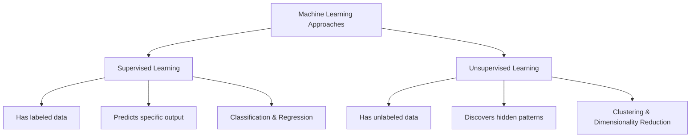

# Supervised vs Unsupervised Learning

## Introduction

Machine learning algorithms can be broadly categorized based on the nature of the learning process. Two fundamental paradigms stand out: **supervised learning** and **unsupervised learning**. Understanding the difference between these approaches is crucial for any machine learning practitioner, especially during technical interviews.

This guide breaks down both learning types, exploring their characteristics, applications, strengths, limitations, and when to use each approach.

## What is Supervised Learning?

Supervised learning is like learning with a teacher. The algorithm learns from labeled training data, using input features (X) to predict output values (y).

### Key Characteristics

- Uses labeled data with known outcomes
- Has a clear target variable to predict
- Involves a training phase with feedback
- Performance can be measured against known correct answers

### Types of Supervised Learning Problems

1. **Classification**: Predicting discrete categories or classes
2. **Regression**: Predicting continuous numerical values

### Common Supervised Learning Algorithms

- Linear Regression
- Logistic Regression
- Decision Trees
- Random Forests
- Support Vector Machines (SVM)
- Neural Networks
- K-Nearest Neighbors (KNN)

## What is Unsupervised Learning?

Unsupervised learning is like exploring and finding patterns without a guide. The algorithm works with unlabeled data and must find structure within it without explicit instructions.

### Key Characteristics

- Uses unlabeled data without predefined outputs
- No target variable to predict
- Discovers hidden patterns or structures in data
- Performance is harder to measure objectively

### Types of Unsupervised Learning Problems

1. **Clustering**: Grouping similar data points
2. **Dimensionality Reduction**: Simplifying data while preserving information
3. **Association Rule Learning**: Discovering relationships between variables

### Common Unsupervised Learning Algorithms

- K-Means Clustering
- Hierarchical Clustering
- Principal Component Analysis (PCA)
- t-SNE
- DBSCAN
- Autoencoders
- Apriori Algorithm

## Comparing Supervised and Unsupervised Learning



| Aspect | Supervised Learning | Unsupervised Learning |
|--------|---------------------|------------------------|
| Data | Labeled | Unlabeled |
| Goal | Prediction | Pattern discovery |
| Feedback | Direct, from labeled data | Indirect or none |
| Complexity | Generally simpler | Often more complex |
| Applications | Spam detection, price prediction | Customer segmentation, anomaly detection |
| Evaluation | Clear metrics (accuracy, MSE) | Less straightforward (silhouette score, etc.) |

## Code Examples

### Supervised Learning Example (Classification)

Here's a simple example using scikit-learn to train a classifier on the Iris dataset:

```python
# Import necessary libraries
from sklearn.datasets import load_iris
from sklearn.model_selection import train_test_split
from sklearn.ensemble import RandomForestClassifier
from sklearn.metrics import accuracy_score

# Load dataset
iris = load_iris()
X, y = iris.data, iris.target

# Split data into training and testing sets
X_train, X_test, y_train, y_test = train_test_split(X, y, test_size=0.3, random_state=42)

# Create and train the model
clf = RandomForestClassifier(n_estimators=100)
clf.fit(X_train, y_train)

# Make predictions
y_pred = clf.predict(X_test)

# Evaluate performance
accuracy = accuracy_score(y_test, y_pred)
print(f"Model accuracy: {accuracy:.2f}")
```

**Output:**
```
Model accuracy: 0.96
```

In this supervised learning example:
- We used labeled data (iris dataset with flower species labels)
- Split the data into training and test sets
- Trained a Random Forest classifier to predict flower species
- Evaluated performance using accuracy metric

### Unsupervised Learning Example (Clustering)

Here's an example of K-means clustering on the same dataset but ignoring the labels:

```python
# Import necessary libraries
from sklearn.datasets import load_iris
from sklearn.cluster import KMeans
import matplotlib.pyplot as plt
import numpy as np

# Load dataset (but ignore the labels - unsupervised approach)
iris = load_iris()
X = iris.data

# Create and train the model
kmeans = KMeans(n_clusters=3, random_state=42)
clusters = kmeans.fit_predict(X)

# Visualize results (first two features only for simplicity)
plt.figure(figsize=(10, 6))
plt.scatter(X[:, 0], X[:, 1], c=clusters, cmap='viridis', marker='o', edgecolor='black')
plt.scatter(kmeans.cluster_centers_[:, 0], kmeans.cluster_centers_[:, 1], 
            s=200, marker='X', c='red', label='Centroids')
plt.xlabel(iris.feature_names[0])
plt.ylabel(iris.feature_names[1])
plt.title('K-Means Clustering of Iris Dataset')
plt.legend()
plt.colorbar(label='Cluster')
plt.show()
```

In this unsupervised learning example:
- We used the same data but ignored the labels
- Applied K-means to find natural clusters in the data
- The algorithm discovered patterns without knowing the actual flower species
- We visualized the clusters it found

## Real-World Applications

### Supervised Learning Applications

1. **Email Spam Detection**
   - Input: Email characteristics (sender, content, subject)
   - Output: Binary classification (spam/not spam)
   - Training: Uses historical emails already labeled as spam or not

2. **Medical Diagnosis**
   - Input: Patient symptoms, test results, vital signs
   - Output: Disease prediction/diagnosis
   - Training: Learn from previous correctly diagnosed cases

3. **House Price Prediction**
   - Input: House features (location, size, bedrooms, etc.)
   - Output: Estimated price
   - Training: Historical house sales with known prices

### Unsupervised Learning Applications

1. **Customer Segmentation**
   - Input: Customer behavior and purchase history
   - Process: Group similar customers without predefined categories
   - Outcome: Discover natural customer segments for targeted marketing

2. **Anomaly Detection**
   - Input: Network traffic data or financial transactions
   - Process: Learn normal patterns
   - Outcome: Flag unusual activities that deviate from normal patterns

3. **Recommendation Systems**
   - Input: User behavior and preferences
   - Process: Find patterns in user-item interactions
   - Outcome: Suggest products/content similar users enjoyed

## Semi-Supervised Learning: The Middle Ground

Semi-supervised learning combines elements of both approaches:
- Uses a small amount of labeled data and a large amount of unlabeled data
- Particularly useful when labeling data is expensive or time-consuming
- Examples include photo organization and speech analysis

```python
# Pseudo-code for semi-supervised learning
from sklearn.semi_supervised import LabelSpreading

# Create model
model = LabelSpreading()

# Prepare data (some labeled, some unlabeled)
X = all_data_points
y = [-1 if unlabeled else label for each data point]  # -1 indicates unlabeled

# Train model
model.fit(X, y)
```

## How to Choose Between Supervised and Unsupervised Learning

Consider these factors when deciding which approach to use:

1. **Available Data**:
   - If you have labeled data → Consider supervised learning
   - If you only have unlabeled data → Use unsupervised learning

2. **Problem Type**:
   - If you need to predict specific outcomes → Supervised learning
   - If you want to discover patterns or structure → Unsupervised learning

3. **Resources**:
   - Labeling data is expensive/time-consuming → Consider unsupervised or semi-supervised
   - Quick results needed → Supervised may be simpler to implement and validate

4. **Domain Knowledge**:
   - Strong domain understanding → Can better guide supervised learning
   - Exploring unknown territory → Unsupervised may reveal unexpected insights

## Common Interview Questions

1. **When would you choose supervised over unsupervised learning?**
   - Answer: Choose supervised when you have labeled data and a specific target to predict. Choose unsupervised for pattern discovery, data exploration, or when labels aren't available.

2. **What's more computationally expensive: supervised or unsupervised learning?**
   - Answer: It depends on the specific algorithms, but many unsupervised algorithms (like k-means with high k values) can be more computationally intensive as they explore relationship spaces without guidance.

3. **Can you convert an unsupervised problem to supervised?**
   - Answer: Yes, through techniques like creating synthetic labels, using clustering results as labels, or manual annotation of a subset of data.

## Summary

- **Supervised learning** uses labeled data to make predictions about specific outcomes.
- **Unsupervised learning** discovers hidden patterns in unlabeled data.
- Each approach has unique strengths, limitations, and ideal use cases.
- The choice between them depends on your data, problem, resources, and goals.
- Many real-world ML systems combine both approaches for maximum effectiveness.

## Practice Exercises

1. **Basic Exercise**: Implement a simple linear regression model on the Boston Housing dataset.
2. **Intermediate Exercise**: Compare the performance of a supervised classifier with an unsupervised clustering algorithm on the same dataset.
3. **Advanced Exercise**: Design a semi-supervised learning system that can leverage a small amount of labeled data along with a larger pool of unlabeled data.

## Additional Resources

- **Books**:
  - "Pattern Recognition and Machine Learning" by Christopher Bishop
  - "The Elements of Statistical Learning" by Hastie, Tibshirani, and Friedman

- **Online Courses**:
  - Andrew Ng's Machine Learning course on Coursera
  - Fast.ai's Practical Deep Learning courses

- **Libraries**:
  - Scikit-learn documentation for practical implementations
  - TensorFlow and PyTorch tutorials for deep learning approaches