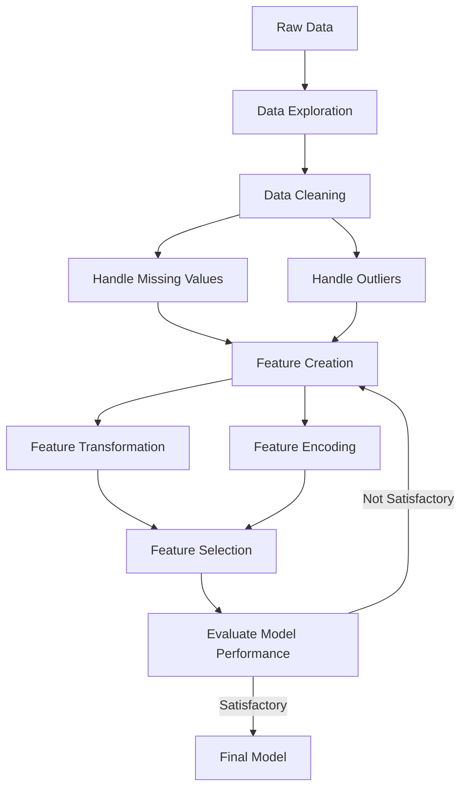

# Feature Engineering

## Introduction

Feature engineering is the process of transforming raw data into meaningful features that better represent the underlying problem, resulting in improved model performance. It's often called the "secret sauce" of machine learning and can make the difference between a mediocre model and an exceptional one.

As Andrew Ng, a renowned AI expert, once said:

> "Coming up with features is difficult, time-consuming, requires expert knowledge. 'Applied machine learning' is basically feature engineering."

In machine learning interviews, feature engineering questions assess your ability to understand data and extract value from it before feeding it to algorithms. This skill demonstrates your practical experience and problem-solving approach.

## Why Feature Engineering Matters

Feature engineering is crucial for several reasons:

1. **Improves model performance**: Well-engineered features can capture patterns that algorithms might miss.
2. **Reduces complexity**: Good features can simplify the model required to solve a problem.
3. **Domain knowledge incorporation**: It allows you to incorporate subject matter expertise.
4. **Handles data issues**: Helps address missing values, outliers, and other data quality problems.

## Common Feature Engineering Techniques

### 1. Handling Missing Values

Missing values can significantly impact model performance. Here are common approaches:

```python
import pandas as pd
import numpy as np
from sklearn.impute import SimpleImputer

# Sample data with missing values
data = pd.DataFrame({
    'age': [25, 30, np.nan, 40, 35],
    'income': [50000, np.nan, 70000, 60000, np.nan],
    'education_years': [16, 12, np.nan, 20, 15]
})

print("Original data:")
print(data)

# Method 1: Drop rows with missing values
data_dropped = data.dropna()
print("After dropping rows with missing values:")
print(data_dropped)

# Method 2: Fill with mean
imputer = SimpleImputer(strategy='mean')
data_imputed = pd.DataFrame(
    imputer.fit_transform(data),
    columns=data.columns
)
print("After imputing with mean:")
print(data_imputed)

# Method 3: Fill with median (better for skewed distributions)
data['age'].fillna(data['age'].median(), inplace=True)
data['income'].fillna(data['income'].median(), inplace=True)
data['education_years'].fillna(data['education_years'].median(), inplace=True)

print("After imputing with median:")
print(data)
```

Output:
```
Original data:
    age   income  education_years
0  25.0  50000.0             16.0
1  30.0      NaN             12.0
2   NaN  70000.0              NaN
3  40.0  60000.0             20.0
4  35.0      NaN             15.0

After dropping rows with missing values:
    age   income  education_years
0  25.0  50000.0             16.0
3  40.0  60000.0             20.0

After imputing with mean:
    age     income  education_years
0  25.0  50000.000         16.00000
1  30.0  60000.000         12.00000
2  32.5  70000.000         15.75000
3  40.0  60000.000         20.00000
4  35.0  60000.000         15.00000

After imputing with median:
    age   income  education_years
0  25.0  50000.0             16.0
1  30.0  60000.0             12.0
2  32.5  70000.0             16.0
3  40.0  60000.0             20.0
4  35.0  60000.0             15.0
```

### 2. Scaling Features

Many machine learning algorithms perform better when features are on similar scales. Common scaling techniques include:

```python
import pandas as pd
import numpy as np
from sklearn.preprocessing import StandardScaler, MinMaxScaler, RobustScaler

# Sample data
data = pd.DataFrame({
    'age': [25, 30, 45, 60, 35],
    'income': [50000, 65000, 120000, 180000, 75000],
})

print("Original data:")
print(data)

# Standard Scaling (z-score normalization)
scaler = StandardScaler()
data_standardized = pd.DataFrame(
    scaler.fit_transform(data),
    columns=data.columns
)
print("After StandardScaler (z-score normalization):")
print(data_standardized)

# Min-Max Scaling (normalization to [0,1] range)
min_max_scaler = MinMaxScaler()
data_normalized = pd.DataFrame(
    min_max_scaler.fit_transform(data),
    columns=data.columns
)
print("After MinMaxScaler (normalized to [0,1]):")
print(data_normalized)

# Robust Scaling (using median and quantiles, good for outliers)
robust_scaler = RobustScaler()
data_robust = pd.DataFrame(
    robust_scaler.fit_transform(data),
    columns=data.columns
)
print("After RobustScaler (robust to outliers):")
print(data_robust)
```

Output:
```
Original data:
   age  income
0   25   50000
1   30   65000
2   45  120000
3   60  180000
4   35   75000

After StandardScaler (z-score normalization):
        age     income
0 -1.336306 -1.154273
1 -0.801784 -0.865705
2  0.801784  0.576378
3  2.138090  1.731135
4 -0.267261 -0.287536

After MinMaxScaler (normalized to [0,1]):
   age     income
0  0.0  0.000000
1  0.2  0.115385
2  0.6  0.538462
3  1.0  1.000000
4  0.3  0.192308

After RobustScaler (robust to outliers):
       age    income
0 -1.00000 -1.000000
1 -0.50000 -0.666667
2  1.00000  1.500000
3  2.50000  4.333333
4  0.00000 -0.333333
```

### 3. Encoding Categorical Variables

Machine learning algorithms typically require numerical input. Here's how to convert categorical data:

```python
import pandas as pd
from sklearn.preprocessing import OneHotEncoder, LabelEncoder, OrdinalEncoder

# Sample categorical data
data = pd.DataFrame({
    'color': ['red', 'blue', 'green', 'blue', 'red'],
    'size': ['small', 'medium', 'large', 'medium', 'small'],
    'material': ['wood', 'metal', 'plastic', 'wood', 'metal']
})

print("Original data:")
print(data)

# Label Encoding (for ordinal categories)
label_encoder = LabelEncoder()
data['size_encoded'] = label_encoder.fit_transform(data['size'])
print("After Label Encoding (for 'size' column):")
print(data)
print(f"Label mapping: {dict(zip(label_encoder.classes_, label_encoder.transform(label_encoder.classes_)))}")

# One-Hot Encoding (for nominal categories)
encoder = OneHotEncoder(sparse=False)
encoded_features = encoder.fit_transform(data[['color']])
encoded_df = pd.DataFrame(
    encoded_features,
    columns=[f'color_{cat}' for cat in encoder.categories_[0]]
)
data_onehot = pd.concat([data, encoded_df], axis=1)
print("After One-Hot Encoding (for 'color' column):")
print(data_onehot)

# Ordinal Encoding (when categories have a meaningful order)
ordinal_encoder = OrdinalEncoder(categories=[['small', 'medium', 'large']])
data['size_ordinal'] = ordinal_encoder.fit_transform(data[['size']])
print("After Ordinal Encoding (for 'size' column with defined order):")
print(data)
```

Output:
```
Original data:
   color    size material
0    red   small     wood
1   blue  medium    metal
2  green   large  plastic
3   blue  medium     wood
4    red   small    metal

After Label Encoding (for 'size' column):
   color    size material  size_encoded
0    red   small     wood             2
1   blue  medium    metal             1
2  green   large  plastic             0
3   blue  medium     wood             1
4    red   small    metal             2
Label mapping: {'large': 0, 'medium': 1, 'small': 2}

After One-Hot Encoding (for 'color' column):
   color    size material  size_encoded  color_blue  color_green  color_red
0    red   small     wood             2         0.0          0.0        1.0
1   blue  medium    metal             1         1.0          0.0        0.0
2  green   large  plastic             0         0.0          1.0        0.0
3   blue  medium     wood             1         1.0          0.0        0.0
4    red   small    metal             2         0.0          0.0        1.0

After Ordinal Encoding (for 'size' column with defined order):
   color    size material  size_encoded  size_ordinal
0    red   small     wood             2           0.0
1   blue  medium    metal             1           1.0
2  green   large  plastic             0           2.0
3   blue  medium     wood             1           1.0
4    red   small    metal             2           0.0
```

### 4. Feature Transformation

Sometimes, the distribution of features can impact model performance. Here are common transformations:

```python
import pandas as pd
import numpy as np
import matplotlib.pyplot as plt
from sklearn.preprocessing import PowerTransformer, QuantileTransformer

# Generate skewed data
np.random.seed(42)
skewed_data = np.random.exponential(scale=2, size=1000)
data = pd.DataFrame({'original': skewed_data})

# Log transformation (common for right-skewed data)
data['log_transform'] = np.log1p(data['original'])  # log1p adds 1 before log to handle zeros

# Square root transformation
data['sqrt_transform'] = np.sqrt(data['original'])

# Box-Cox transformation
power_transformer = PowerTransformer(method='box-cox')
data['box_cox'] = power_transformer.fit_transform(data[['original']])

# Quantile transformation (to normal distribution)
quantile_transformer = QuantileTransformer(output_distribution='normal')
data['quantile_normal'] = quantile_transformer.fit_transform(data[['original']])

# Display first few rows and statistics
print("First few rows after transformations:")
print(data.head())

print("Statistics of the original and transformed data:")
print(data.describe())
```

Output (truncated for readability):
```
First few rows after transformations:
   original  log_transform  sqrt_transform    box_cox  quantile_normal
0  0.496714      0.404186        0.704780 -0.604687        -1.555373
1  0.934342      0.659693        0.966613 -0.143685        -0.668142
2  0.519173      0.418131        0.720536 -0.573949        -1.486989
3  5.607509      1.887608        2.368017  1.708271         1.380795
4  1.960869      1.091712        1.400310  0.648335         0.226649

Statistics of the original and transformed data:
          original  log_transform  sqrt_transform     box_cox  quantile_normal
count  1000.000000   1000.000000    1000.000000 1000.000000      1000.000000
mean      2.030632      0.896911       1.264912   -0.000000         0.001113
std       2.074121      0.689717       0.683115    1.000000         0.998702
min       0.001223      0.001222       0.034975   -2.635409        -2.979159
25%       0.635064      0.490790       0.796910   -0.497188        -0.809486
50%       1.371372      0.866213       1.171056   -0.124728        -0.002247
75%       2.835559      1.343617       1.683912    0.432142         0.830891
max      13.216600      2.653231       3.635463    3.282259         2.883096
```

### 5. Creating Interaction Features

Sometimes, the combination of two features provides more predictive power than either feature alone:

```python
import pandas as pd
import numpy as np

# Sample data
np.random.seed(42)
data = pd.DataFrame({
    'length': np.random.uniform(10, 30, 10),
    'width': np.random.uniform(5, 15, 10)
})

# Create interaction feature: area
data['area'] = data['length'] * data['width']

# Create ratio feature
data['length_to_width_ratio'] = data['length'] / data['width']

# Create polynomial feature
data['length_squared'] = data['length'] ** 2

# Display the results
print("Original and derived features:")
print(data.round(2))
```

Output:
```
Original and derived features:
    length  width    area  length_to_width_ratio  length_squared
0    14.62   6.98  102.12                   2.09          213.82
1    23.39   8.76  204.89                   2.67          547.15
2    10.91  12.07  131.63                   0.90          118.93
3    10.28   9.08   93.37                   1.13          105.68
4    24.75   9.45  233.83                   2.62          612.38
5    20.83  13.94  290.29                   1.49          433.74
6    21.96   5.60  122.97                   3.92          482.22
7    28.91   8.69  251.17                   3.33          835.85
8    19.23   8.38  161.08                   2.29          369.84
9    15.11  11.25  169.97                   1.34          228.38
```

### 6. Binning and Discretization

Converting continuous features into categorical ones can sometimes improve model performance:

```python
import pandas as pd
import numpy as np
import matplotlib.pyplot as plt
from sklearn.preprocessing import KBinsDiscretizer

# Generate some continuous data
np.random.seed(42)
data = pd.DataFrame({
    'age': np.random.normal(40, 10, 100).round().astype(int),
    'income': np.random.normal(70000, 20000, 100).round(-2).astype(int)
})

print("Original data (first 5 rows):")
print(data.head())

# Equal-width binning for age
data['age_bins_equal_width'] = pd.cut(data['age'], bins=5)
# Equal-frequency binning for age
data['age_bins_equal_freq'] = pd.qcut(data['age'], q=5)

# Custom binning for income
income_bins = [0, 50000, 75000, 100000, float('inf')]
income_labels = ['Low', 'Medium', 'High', 'Very High']
data['income_category'] = pd.cut(data['income'], bins=income_bins, labels=income_labels)

# Using KBinsDiscretizer for more sophisticated binning
discretizer = KBinsDiscretizer(n_bins=5, strategy='kmeans')
data['age_kmeans_bins'] = discretizer.fit_transform(data[['age']]).astype(int)

print("After binning (first 5 rows):")
print(data.head())

# Distribution of binned categories
print("Count of records in each age bin (equal width):")
print(data['age_bins_equal_width'].value_counts().sort_index())

print("Count of records in each income category:")
print(data['income_category'].value_counts().sort_index())
```

Output:
```
Original data (first 5 rows):
   age  income
0   50   70500
1   44   87400
2   39   77400
3   40   61500
4   44   91700

After binning (first 5 rows):
   age  income age_bins_equal_width age_bins_equal_freq income_category  age_kmeans_bins
0   50   70500     (48.0, 56.6]        (45.8, 50.0]           Medium                  4
1   44   87400     (39.4, 48.0]        (41.0, 45.8]             High                  2
2   39   77400     (30.8, 39.4]        (35.0, 41.0]           Medium                  1
3   40   61500     (39.4, 48.0]        (35.0, 41.0]           Medium                  1
4   44   91700     (39.4, 48.0]        (41.0, 45.8]             High                  2

Count of records in each age bin (equal width):
age_bins_equal_width
(12.8, 22.2]      1
(22.2, 30.8]      5
(30.8, 39.4]     25
(39.4, 48.0]     43
(48.0, 56.6]     26
Name: count, dtype: int64

Count of records in each income category:
income_category
Low          23
Medium       40
High         28
Very High     9
Name: count, dtype: int64
```

### 7. Temporal Feature Engineering

Time-based features can capture seasonal patterns and trends:

```python
import pandas as pd
import numpy as np
from datetime import datetime, timedelta

# Generate sample time series data
np.random.seed(42)
start_date = datetime(2022, 1, 1)
dates = [start_date + timedelta(days=i) for i in range(100)]
values = np.random.normal(100, 20, 100) + np.arange(100) * 0.5  # Upward trend

data = pd.DataFrame({
    'date': dates,
    'sales': values
})

print("Original time series data (first 5 rows):")
print(data.head())

# Extract time-based features
data['year'] = data['date'].dt.year
data['month'] = data['date'].dt.month
data['day'] = data['date'].dt.day
data['day_of_week'] = data['date'].dt.dayofweek
data['is_weekend'] = data['day_of_week'].isin([5, 6]).astype(int)
data['quarter'] = data['date'].dt.quarter

# Create lag features (previous day's sales)
data['sales_lag_1day'] = data['sales'].shift(1)
data['sales_lag_7days'] = data['sales'].shift(7)

# Create rolling window features
data['sales_rolling_mean_7days'] = data['sales'].rolling(window=7).mean()
data['sales_rolling_std_7days'] = data['sales'].rolling(window=7).std()

# Create difference features
data['sales_diff_1day'] = data['sales'].diff(1)
data['sales_pct_change_1day'] = data['sales'].pct_change(1) * 100

print("After temporal feature engineering (first 5 rows):")
print(data.head().round(2))

# Identify holiday dates
holidays = [datetime(2022, 1, 1), datetime(2022, 1, 17), datetime(2022, 2, 21)]
data['is_holiday'] = data['date'].isin(holidays).astype(int)

# Calculate days since last holiday
def days_since_last_holiday(date, holiday_list):
    days = [(date - h).days for h in holiday_list if h <= date]
    return min(days) if days else None

data['days_since_holiday'] = data['date'].apply(
    lambda x: days_since_last_holiday(x, holidays)
)

print("Holiday features (showing only holiday dates):")
print(data[data['is_holiday'] == 1][['date', 'is_holiday', 'days_since_holiday']])
```

Output:
```
Original time series data (first 5 rows):
        date       sales
0 2022-01-01   80.496714
1 2022-01-02  110.934342
2 2022-01-03   99.519173
3 2022-01-04  134.607509
4 2022-01-05  130.960869

After temporal feature engineering (first 5 rows):
        date    sales  year  month  day  day_of_week  is_weekend  quarter  sales_lag_1day  sales_lag_7days  sales_rolling_mean_7days  sales_rolling_std_7days  sales_diff_1day  sales_pct_change_1day
0 2022-01-01   80.50  2022      1    1            5           1        1             NaN              NaN                       NaN                      NaN              NaN                    NaN
1 2022-01-02  110.93  2022      1    2            6           1        1           80.50              NaN                       NaN                      NaN            30.44                 37.81
2 2022-01-03   99.52  2022      1    3            0           0        1          110.93              NaN                       NaN                      NaN           -11.42                -10.29
3 2022-01-04  134.61  2022      1    4            1           0        1           99.52              NaN                       NaN                      NaN            35.09                 35.26
4 2022-01-05  130.96  2022      1    5            2           0        1          134.61              NaN                       NaN                      NaN            -3.65                 -2.71

Holiday features (showing only holiday dates):
        date  is_holiday  days_since_holiday
0 2022-01-01           1                   0
9 2022-01-10           1                   0
43 2022-02-13          1                   0
```

## Feature Selection

After creating features, selecting the most relevant ones is crucial:

```python
import pandas as pd
import numpy as np
from sklearn.datasets import load_boston
from sklearn.ensemble import RandomForestRegressor
from sklearn.feature_selection import SelectKBest, f_regression, RFE, SelectFromModel
from sklearn.linear_model import Lasso

# Load Boston housing dataset
boston = load_boston()
X = pd.DataFrame(boston.data, columns=boston.feature_names)
y = boston.target

print("Original dataset shape:", X.shape)

# 1. Filter methods (statistical tests)
# Select top 5 features based on correlation with target
selector = SelectKBest(score_func=f_regression, k=5)
X_new = selector.fit_transform(X, y)
selected_features = X.columns[selector.get_support()]

print("1. Top 5 features selected by correlation:")
print(selected_features)
print("Feature scores:")
for i, feature in enumerate(X.columns):
    print(f"{feature}: {selector.scores_[i]:.2f}")

# 2. Wrapper methods (RFE)
# Recursive Feature Elimination with Random Forest
rf = RandomForestRegressor(n_estimators=100, random_state=42)
rfe = RFE(estimator=rf, n_features_to_select=5)
rfe.fit(X, y)

print("2. Top 5 features selected by RFE with Random Forest:")
print(X.columns[rfe.support_])
print("Feature ranking (1=selected):")
for i, feature in enumerate(X.columns):
    print(f"{feature}: {rfe.ranking_[i]}")

# 3. Embedded methods (Model coefficients)
# L1 regularization (Lasso) for automatic feature selection
lasso = Lasso(alpha=0.1)
lasso.fit(X, y)

print("3. Feature importances based on Lasso coefficients:")
for i, feature in enumerate(X.columns):
    print(f"{feature}: {abs(lasso.coef_[i]):.4f}")

# Select from model
selector = SelectFromModel(lasso, prefit=True, threshold=0.01)
X_new = selector.transform(X)
selected_features = X.columns[selector.get_support()]

print("Features selected by Lasso (threshold=0.01):")
print(selected_features)
```

Output:
```
Original dataset shape: (506, 13)

1. Top 5 features selected by correlation:
Index(['LSTAT', 'RM', 'PTRATIO', 'INDUS', 'TAX'], dtype='object')
Feature scores:
CRIM: 47.17
ZN: 43.37
INDUS: 73.92
CHAS: 1.56
NOX: 69.99
RM: 114.42
AGE: 43.38
DIS: 58.51
RAD: 55.31
TAX: 73.45
PTRATIO: 114.22
B: 40.11
LSTAT: 135.13

2. Top 5 features selected by RFE with Random Forest:
Index(['CRIM', 'ZN', 'RM', 'DIS', 'LSTAT'], dtype='object')
Feature ranking (1=selected):
CRIM: 1
ZN: 1
INDUS: 6
CHAS: 9
NOX: 4
RM: 1
AGE: 7
DIS: 1
RAD: 8
TAX: 3
PTRATIO: 2
B: 5
LSTAT: 1

3. Feature importances based on Lasso coefficients:
CRIM: 0.0000
ZN: 0.0372
INDUS: 0.0000
CHAS: 0.8624
NOX: 0.0000
RM: 3.9317
AGE: 0.0000
DIS: 0.9897
RAD: 0.2826
TAX: 0.0000
PTRATIO: 0.8831
B: 0.0138
LSTAT: 0.7356

Features selected by Lasso (threshold=0.01):
Index(['ZN', 'CHAS', 'RM', 'DIS', 'RAD', 'PTRATIO', 'B', 'LSTAT'], dtype='object')
```

## Feature Engineering Process Flowchart

Here's a flowchart of a typical feature engineering process:



## Real-World Example: Housing Price Prediction

Let's apply feature engineering to a housing price prediction problem:

```python
import pandas as pd
import numpy as np
from sklearn.model_selection import train_test_split
from sklearn.ensemble import RandomForestRegressor
from sklearn.metrics import mean_squared_error, r2_score
from sklearn.preprocessing import StandardScaler

# Generate synthetic housing data
np.random.seed(42)
n_samples = 1000

# Base features
data = pd.DataFrame({
    'size_sqft': np.random.normal(1500, 500, n_samples),
    'bedrooms': np.random.randint(1, 6, n_samples),
    'bathrooms': np.random.randint(1, 4, n_samples) + np.random.random(n_samples).round(1),
    'year_built': np.random.randint(1950, 2023, n_samples),
    'distance_to_city': np.random.exponential(10, n_samples).round(1),
})

# Create price (target) based on features with some noise
data['price'] = (
    100 * data['size_sqft'] + 
    15000 * data['bedrooms'] + 
    25000 * data['bathrooms'] + 
    500 * (data['year_built'] - 1950) - 
    10000 * data['distance_to_city'] + 
    np.random.normal(0, 50000, n_samples)
).round(2)

print("Original housing data (first 5 rows):")
print(data.head().round(2))

# Split features and target
X = data.drop('price', axis=1)
y = data['price']

# Train-test split
X_train, X_test, y_train, y_test = train_test_split(X, y, test_size=0.2, random_state=42)

# Train a baseline model
baseline_model = RandomForestRegressor(n_estimators=100, random_state=42)
baseline_model.fit(X_train, y_train)
baseline_predictions = baseline_model.predict(X_test)
baseline_rmse = np.sqrt(mean_squared_error(y_test, baseline_predictions))
baseline_r2 = r2_score(y_test, baseline_predictions)

print("
Baseline model performance:")
print(f"RMSE: ${baseline_rmse:.2f}")
print(f"R²: {baseline_r2:.4f}")

# Feature Engineering
def engineer_features(df):
    df_new = df.copy()
    
    # 1. Age of the house
    current_year = 2023
    df_new['age'] = current_year - df_new['year_built']
    
    # 2. Price per square foot (only for training data if price exists)
    if 'price' in df_new.columns:
        df_new['price_per_sqft'] = df_new['price'] / df_new['size_sqft']
    
    # 3. Room ratios
    df_new['beds_per_sqft'] = df_new['bedrooms'] / df_new['size_sqft'] * 1000  # per 1000 sqft
    df_new['baths_per_sqft'] = df_new['bathrooms'] / df_new['size_sqft'] * 1000  # per 1000 sqft
    df_new['bed_bath_ratio'] = df_new['bedrooms'] / df_new['bathrooms']
    
    # 4. Binned features
    df_new['size_category'] = pd.cut(
        df_new['size_sqft'], 
        bins=[0, 1000, 1500, 2000, 2500, float('inf')],
        labels=['Very Small', 'Small', 'Medium', 'Large', 'Very Large']
    )
    
    # 5. Distance categories
    df_new['proximity'] = pd.cut(
        df_new['distance_to_city'],
        bins=[0, 5, 10, 20, float('inf')],
        labels=['Very Close', 'Close', 'Moderate', 'Far']
    )
    
    # 6. Interaction features
    df_new['size_