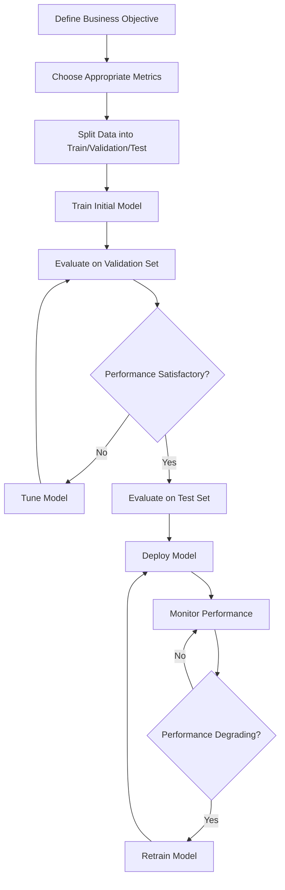

# Model Evaluation

## Introduction

Model evaluation is a critical step in the machine learning lifecycle. After building a model, you need to assess how well it performs and whether it will generalize to new, unseen data. This process helps you determine if your model is ready for production or needs further improvement.

In this tutorial, we'll explore various techniques for model evaluation that are commonly tested in machine learning interviews. You'll learn about different evaluation metrics, validation strategies, and how to interpret results to make informed decisions about your models.

## Why Model Evaluation Matters

Imagine building a model that achieves 99% accuracy on your training data. Sounds great, right? But when deployed to production, it performs poorly on real-world data. This phenomenon, known as **overfitting**, demonstrates why proper model evaluation is essential.

Key reasons for model evaluation:

1. Measure performance objectively
2. Detect overfitting or underfitting
3. Compare different models
4. Make informed decisions about model deployment
5. Identify areas for improvement

## Common Evaluation Metrics

Different problems require different evaluation metrics. Here are the most common ones you should know for interviews:

### Classification Metrics

#### Accuracy

Accuracy is the ratio of correct predictions to the total number of predictions.

```python
from sklearn.metrics import accuracy_score

y_true = [0, 1, 0, 1, 0]
y_pred = [0, 1, 0, 0, 1]

accuracy = accuracy_score(y_true, y_pred)
print(f"Accuracy: {accuracy}")
# Output: Accuracy: 0.6
```

**When to use**: When classes are balanced and misclassifications have similar costs.

**Limitations**: Can be misleading with imbalanced classes.

#### Precision and Recall

- **Precision**: The ratio of true positives to the total predicted positives.
- **Recall (Sensitivity)**: The ratio of true positives to the total actual positives.

```python
from sklearn.metrics import precision_score, recall_score

y_true = [0, 1, 1, 0, 1]
y_pred = [0, 0, 1, 0, 1]

precision = precision_score(y_true, y_pred)
recall = recall_score(y_true, y_pred)

print(f"Precision: {precision}")
print(f"Recall: {recall}")
# Output:
# Precision: 1.0
# Recall: 0.6667
```

**When to use**:
- High precision is important when false positives are costly
- High recall is important when false negatives are costly

#### F1 Score

The F1 score is the harmonic mean of precision and recall.

```python
from sklearn.metrics import f1_score

y_true = [0, 1, 1, 0, 1]
y_pred = [0, 0, 1, 0, 1]

f1 = f1_score(y_true, y_pred)
print(f"F1 Score: {f1}")
# Output: F1 Score: 0.8
```

**When to use**: When you need a balance between precision and recall.

#### Confusion Matrix

A table showing the counts of true positives, false positives, true negatives, and false negatives.

```python
from sklearn.metrics import confusion_matrix
import seaborn as sns
import matplotlib.pyplot as plt
import numpy as np

y_true = [0, 0, 1, 1, 0, 1, 0, 1, 1, 0]
y_pred = [0, 0, 1, 0, 0, 1, 1, 1, 1, 0]

cm = confusion_matrix(y_true, y_pred)
print(cm)
# Output:
# [[4 1]
#  [1 4]]

# For visualization (not required in interviews but helpful for understanding)
plt.figure(figsize=(5, 4))
sns.heatmap(cm, annot=True, fmt='d', cmap='Blues', 
            xticklabels=['Predicted 0', 'Predicted 1'],
            yticklabels=['Actual 0', 'Actual 1'])
plt.ylabel('Actual')
plt.xlabel('Predicted')
plt.title('Confusion Matrix')
plt.tight_layout()
```

#### ROC Curve and AUC

ROC (Receiver Operating Characteristic) curve plots the true positive rate against the false positive rate at various threshold settings. The Area Under the Curve (AUC) quantifies the overall performance.

```python
from sklearn.metrics import roc_curve, auc
import matplotlib.pyplot as plt

# Assume y_true contains actual labels and y_scores contains probability scores
y_true = [0, 0, 1, 1, 0, 1, 0, 1, 1, 0]
y_scores = [0.1, 0.3, 0.7, 0.4, 0.2, 0.8, 0.5, 0.9, 0.6, 0.1]

fpr, tpr, thresholds = roc_curve(y_true, y_scores)
roc_auc = auc(fpr, tpr)

print(f"AUC: {roc_auc}")
# Output: AUC: 0.8
```

**When to use**: When evaluating binary classifiers and you need a single metric that is threshold-independent.

### Regression Metrics

#### Mean Absolute Error (MAE)

The average of absolute differences between predicted and actual values.

```python
from sklearn.metrics import mean_absolute_error

y_true = [3, -0.5, 2, 7, 4.2]
y_pred = [2.5, 0.0, 2, 8, 4.5]

mae = mean_absolute_error(y_true, y_pred)
print(f"MAE: {mae}")
# Output: MAE: 0.56
```

**When to use**: When you want to treat all errors equally regardless of direction.

#### Mean Squared Error (MSE)

The average of squared differences between predicted and actual values.

```python
from sklearn.metrics import mean_squared_error

y_true = [3, -0.5, 2, 7, 4.2]
y_pred = [2.5, 0.0, 2, 8, 4.5]

mse = mean_squared_error(y_true, y_pred)
print(f"MSE: {mse}")
# Output: MSE: 0.465
```

**When to use**: When large errors should be penalized more heavily than small ones.

#### Root Mean Squared Error (RMSE)

The square root of MSE, which returns the error in the same unit as the target variable.

```python
from sklearn.metrics import mean_squared_error
import numpy as np

y_true = [3, -0.5, 2, 7, 4.2]
y_pred = [2.5, 0.0, 2, 8, 4.5]

rmse = np.sqrt(mean_squared_error(y_true, y_pred))
print(f"RMSE: {rmse}")
# Output: RMSE: 0.6819
```

#### R-squared (Coefficient of Determination)

Indicates the proportion of variance in the dependent variable that is predictable from the independent variable(s).

```python
from sklearn.metrics import r2_score

y_true = [3, -0.5, 2, 7, 4.2]
y_pred = [2.5, 0.0, 2, 8, 4.5]

r2 = r2_score(y_true, y_pred)
print(f"R-squared: {r2}")
# Output: R-squared: 0.9573
```

**When to use**: When you want to understand how well your model explains the variability of the target variable.

## Validation Techniques

Having good metrics isn't enough; you also need to ensure your evaluation is robust. Here are key validation techniques to know:

### Train-Test Split

The simplest approach is to split your data into training and testing sets.

```python
from sklearn.model_selection import train_test_split
from sklearn.datasets import make_classification
from sklearn.linear_model import LogisticRegression
from sklearn.metrics import accuracy_score

# Generate a simple dataset
X, y = make_classification(n_samples=1000, random_state=42)

# Split the data
X_train, X_test, y_train, y_test = train_test_split(X, y, test_size=0.2, random_state=42)

# Train a model
model = LogisticRegression()
model.fit(X_train, y_train)

# Evaluate on test set
y_pred = model.predict(X_test)
accuracy = accuracy_score(y_test, y_pred)
print(f"Test accuracy: {accuracy:.4f}")
# Output: Test accuracy: 0.8400
```

**Limitations**: 
- Performance can vary depending on which data points end up in the training and test sets
- Not ideal for small datasets

### Cross-Validation

K-fold cross-validation divides the data into k subsets (folds), trains the model k times using k-1 folds for training and the remaining fold for validation.

```python
from sklearn.model_selection import cross_val_score
from sklearn.datasets import make_classification
from sklearn.linear_model import LogisticRegression
import numpy as np

# Generate a simple dataset
X, y = make_classification(n_samples=1000, random_state=42)

# Create a model
model = LogisticRegression()

# Perform 5-fold cross-validation
cv_scores = cross_val_score(model, X, y, cv=5)

print(f"CV scores: {cv_scores}")
print(f"Mean CV score: {np.mean(cv_scores):.4f}")
# Output:
# CV scores: [0.84 0.85 0.8  0.865 0.865]
# Mean CV score: 0.8440
```

**Benefits**: 
- More robust evaluation than a single train-test split
- Uses all data for both training and validation
- Provides an estimate of model variance

### Time Series Cross-Validation

For time series data, standard cross-validation can lead to data leakage. Time series split ensures that you always train on past data and predict future data.

```python
from sklearn.model_selection import TimeSeriesSplit
from sklearn.linear_model import LinearRegression
import numpy as np
import matplotlib.pyplot as plt

# Generate simple time series data
np.random.seed(42)
time = np.arange(100)
data = 3 + 0.5 * time + np.random.randn(100) * 5

X = time.reshape(-1, 1)
y = data

# Initialize time series cross-validation
tscv = TimeSeriesSplit(n_splits=5)

# Create a model
model = LinearRegression()

# Visualize the folds (optional)
plt.figure(figsize=(10, 6))
for i, (train_index, test_index) in enumerate(tscv.split(X)):
    plt.scatter(train_index, [i] * len(train_index), c='blue', marker='.', alpha=0.5, label='Train' if i==0 else '')
    plt.scatter(test_index, [i] * len(test_index), c='red', marker='.', alpha=0.5, label='Test' if i==0 else '')

plt.yticks(range(5), [f'Split {i+1}' for i in range(5)])
plt.legend()
plt.title('Time Series Cross-Validation Folds')
plt.xlabel('Sample Index')
```

### Stratified Cross-Validation

For imbalanced datasets, stratified cross-validation maintains the class distribution in each fold.

```python
from sklearn.model_selection import StratifiedKFold
from sklearn.datasets import make_classification
from sklearn.linear_model import LogisticRegression
import numpy as np

# Generate an imbalanced dataset
X, y = make_classification(n_samples=1000, weights=[0.9, 0.1], random_state=42)

# Count the class distribution
print(f"Class distribution: {np.bincount(y)}")
# Output: Class distribution: [897 103]

# Create a model
model = LogisticRegression()

# Initialize stratified k-fold
skf = StratifiedKFold(n_splits=5, shuffle=True, random_state=42)

scores = []
for train_index, test_index in skf.split(X, y):
    X_train, X_test = X[train_index], X[test_index]
    y_train, y_test = y[train_index], y[test_index]
    
    # Check class distribution in this fold
    train_dist = np.bincount(y_train)
    test_dist = np.bincount(y_test)
    
    # Train and evaluate
    model.fit(X_train, y_train)
    scores.append(model.score(X_test, y_test))

print(f"Class distribution in a test fold: {test_dist}")
# Output: Class distribution in a test fold: [179  21]
print(f"Stratified CV scores: {scores}")
print(f"Mean score: {np.mean(scores):.4f}")
```

## Common Pitfalls in Model Evaluation

During interviews, it's impressive to demonstrate awareness of these common pitfalls:

### 1. Data Leakage

Data leakage occurs when information from outside the training dataset is used to create the model.

```python
# Example of data leakage:
from sklearn.model_selection import train_test_split
from sklearn.preprocessing import StandardScaler
from sklearn.linear_model import LogisticRegression
import numpy as np

# Generate data
np.random.seed(42)
X = np.random.randn(1000, 5)
y = (X[:, 0] > 0).astype(int)

# INCORRECT: Scaling before splitting
# This leaks information from test set into training
scaler = StandardScaler()
X_scaled = scaler.fit_transform(X)  # Using all data
X_train, X_test, y_train, y_test = train_test_split(X_scaled, y, test_size=0.2)

# CORRECT: Split first, then scale
X_train, X_test, y_train, y_test = train_test_split(X, y, test_size=0.2)
scaler = StandardScaler()
X_train_scaled = scaler.fit_transform(X_train)  # Only using training data
X_test_scaled = scaler.transform(X_test)  # Applying training fit to test data
```

### 2. Using the Wrong Metric

Different problems require different metrics. Using accuracy for imbalanced datasets can be misleading.

```python
from sklearn.metrics import accuracy_score, f1_score
import numpy as np

# Highly imbalanced dataset (99% class 0, 1% class 1)
y_true = np.array([0] * 99 + [1])

# Useless classifier that always predicts the majority class
y_pred_majority = np.zeros(100)

# Random classifier
np.random.seed(42)
y_pred_random = np.random.randint(0, 2, 100)

# Calculate metrics
acc_majority = accuracy_score(y_true, y_pred_majority)
f1_majority = f1_score(y_true, y_pred_majority)
acc_random = accuracy_score(y_true, y_pred_random)
f1_random = f1_score(y_true, y_pred_random)

print(f"Majority classifier: Accuracy={acc_majority}, F1={f1_majority}")
print(f"Random classifier: Accuracy={acc_random}, F1={f1_random}")
# Output:
# Majority classifier: Accuracy=0.99, F1=0.0
# Random classifier: Accuracy=0.51, F1=0.0 (may vary)
```

### 3. Threshold Selection

For binary classification, the default threshold of 0.5 may not be optimal.

```python
from sklearn.metrics import precision_recall_curve
import matplotlib.pyplot as plt
from sklearn.datasets import make_classification
from sklearn.linear_model import LogisticRegression

# Generate data
X, y = make_classification(n_samples=1000, weights=[0.9, 0.1], random_state=42)
X_train, X_test, y_train, y_test = train_test_split(X, y, test_size=0.2, random_state=42)

# Train model
model = LogisticRegression()
model.fit(X_train, y_train)

# Get probability scores
y_scores = model.predict_proba(X_test)[:, 1]

# Calculate precision-recall curve
precision, recall, thresholds = precision_recall_curve(y_test, y_scores)

# Plot precision-recall vs threshold
plt.figure(figsize=(10, 6))
plt.plot(thresholds, precision[:-1], 'b--', label='Precision')
plt.plot(thresholds, recall[:-1], 'g-', label='Recall')
plt.xlabel('Threshold')
plt.ylabel('Score')
plt.title('Precision and Recall vs. Threshold')
plt.legend()
plt.grid(True)
```

## Real-World Case Study: Credit Card Fraud Detection

Let's walk through a practical example of model evaluation for a credit card fraud detection system.

**The Problem**: We need to build a model that identifies fraudulent transactions while minimizing false positives (legitimate transactions flagged as fraud).

**Challenges**:
1. Extremely imbalanced dataset (< 1% fraudulent transactions)
2. High cost of false negatives (undetected fraud)
3. High cost of false positives (legitimate transactions declined)

**Approach**:

```python
# Simplified example of evaluation for fraud detection
from sklearn.ensemble import RandomForestClassifier
from sklearn.metrics import confusion_matrix, classification_report
from sklearn.model_selection import train_test_split
import numpy as np

# Assume we have features X and labels y (1 for fraud, 0 for legitimate)
# Typically using features like transaction amount, time, location, etc.

# Generate imbalanced dummy data (0.5% fraud rate)
np.random.seed(42)
n_samples = 10000
X = np.random.randn(n_samples, 10)
y = np.zeros(n_samples)
fraud_indices = np.random.choice(range(n_samples), size=int(0.005*n_samples), replace=False)
y[fraud_indices] = 1

# Split data
X_train, X_test, y_train, y_test = train_test_split(X, y, test_size=0.3, 
                                                    stratify=y, random_state=42)

# Train model
model = RandomForestClassifier(random_state=42)
model.fit(X_train, y_train)

# Predict
y_pred_proba = model.predict_proba(X_test)[:, 1]

# Use a lower threshold to increase recall (catch more fraud)
threshold = 0.3  # Typically determined through careful analysis
y_pred = (y_pred_proba >= threshold).astype(int)

# Evaluate
print(confusion_matrix(y_test, y_pred))
print(classification_report(y_test, y_pred))

# Calculate business impact
# Assume: 
# - Average fraudulent transaction: $500
# - Cost of investigating a flagged transaction: $50
# - Only recovered if caught: 70%

n_true_fraud = np.sum(y_test == 1)
n_caught_fraud = np.sum((y_test == 1) & (y_pred == 1))
n_missed_fraud = np.sum((y_test == 1) & (y_pred == 0))
n_false_alarms = np.sum((y_test == 0) & (y_pred == 1))

savings = n_caught_fraud * 500 * 0.7  # Recovered money
investigation_cost = (n_caught_fraud + n_false_alarms) * 50  # Cost of investigations
missed_opportunity = n_missed_fraud * 500  # Money lost to undetected fraud

net_impact = savings - investigation_cost - missed_opportunity

print(f"Business Impact Analysis:")
print(f"Fraud caught: {n_caught_fraud} out of {n_true_fraud}")
print(f"False alarms: {n_false_alarms}")
print(f"Money saved: ${savings}")
print(f"Investigation costs: ${investigation_cost}")
print(f"Money lost to undetected fraud: ${missed_opportunity}")
print(f"Net impact: ${net_impact}")
```

**Key Insights**:
1. Accuracy is meaningless for this problem due to class imbalance
2. We prioritize recall over precision to catch more fraud
3. Threshold selection is critical and driven by business considerations
4. We evaluate using a custom business metric (net financial impact)

## Model Evaluation Workflow

Here's a step-by-step workflow for model evaluation that you can mention in interviews:



## Summary

Model evaluation is a crucial skill for machine learning practitioners and a common topic in interviews. The key takeaways from this tutorial are:

1. **Choose the right metrics**: Different problems require different evaluation metrics
2. **Use proper validation techniques**: Cross-validation helps ensure robust results
3. **Avoid common pitfalls**: Be aware of data leakage and class imbalance
4. **Consider business context**: Optimize metrics that align with business goals
5. **Monitor performance**: Models can degrade over time due to data drift

By mastering these concepts, you'll be well-prepared to discuss model evaluation in machine learning interviews and apply these techniques in real-world projects.

## Additional Resources

Here are some resources to deepen your understanding:

- **Books**:
  - "Evaluating Machine Learning Models" by Alice Zheng
  - "Hands-On Machine Learning with Scikit-Learn, Keras, and TensorFlow" by Aurélien Géron

- **Courses**:
  - "Machine Learning" by Andrew Ng on Coursera
  - "Practical Deep Learning for Coders" by fast.ai

- **Practice Problems**:
  - Kaggle competitions often require careful model evaluation
  - Try implementing different evaluation strategies on the UCI ML Repository datasets

## Exercise: Model Evaluation Challenge

To practice your skills, try completing these exercises:

1. For a classification problem with a 90:10 class imbalance, which metric would you optimize and why?
2. Implement a function that takes a classifier and data, then finds the optimal threshold to maximize F1 score.
3. Design an evaluation strategy for a time series forecasting model that predicts stock prices.
4. For a medical diagnosis model where false negatives are 5x more costly than false positives, how would you adjust your evaluation approach?

Remember that model evaluation is not just about maximizing metrics—it's about creating models that solve real-world problems effectively.