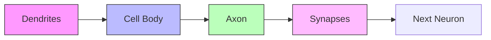
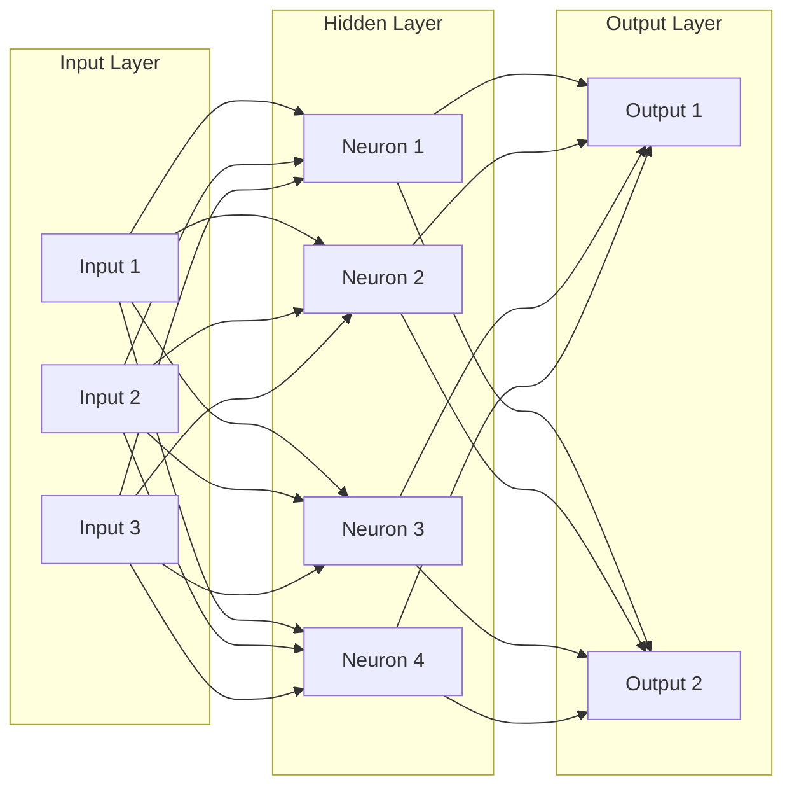
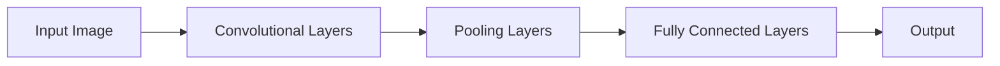
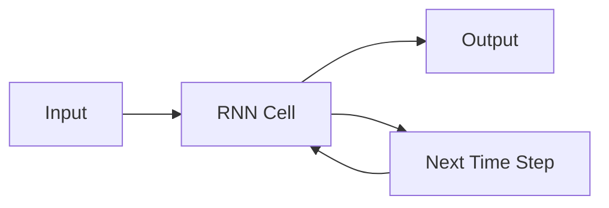

# Neural Networks Basics

## Introduction

Neural networks are the fundamental building blocks of modern artificial intelligence and deep learning systems. Inspired by the human brain's structure, they have revolutionized fields ranging from computer vision to natural language processing. If you're preparing for machine learning interviews, understanding neural networks is essential.

This guide will walk you through the basics of neural networks, their architecture, how they learn, and their applications. We'll cover everything you need to know to answer common interview questions about neural networks.

## What Are Neural Networks?

Neural networks are computational models designed to recognize patterns. They interpret sensory data through a kind of machine perception, labeling, or clustering of raw input. The models are built from interconnected processing elements called neurons that work together to process information.

### The Biological Inspiration

Neural networks were inspired by the biological neurons in the human brain:



While artificial neural networks are vastly simplified compared to their biological counterparts, they share the fundamental concept of taking inputs, processing them, and producing outputs.

## Basic Components of a Neural Network

### 1. Neurons (Nodes)

The neuron is the basic unit of a neural network. It takes input, processes it, and produces an output.

```python
# A simple representation of a neuron
def neuron(inputs, weights, bias):
    # Compute the weighted sum of inputs
    z = sum(w * x for w, x in zip(weights, inputs)) + bias
    
    # Apply an activation function (here using sigmoid)
    output = 1 / (1 + math.exp(-z))
    
    return output

# Example usage
inputs = [0.5, 0.3, 0.2]
weights = [0.4, 0.6, 0.9]
bias = -0.5
result = neuron(inputs, weights, bias)
print(f"Neuron output: {result}")
# Output: Neuron output: 0.5498339973124768
```

### 2. Weights and Biases

Every connection between neurons has an associated weight, which represents the strength of the connection. Biases are additional parameters that allow the model to fit the data better.

### 3. Activation Functions

Activation functions introduce non-linearity into the network, allowing it to learn complex patterns. Common activation functions include:

- **Sigmoid**: Maps values to range (0,1)
- **ReLU (Rectified Linear Unit)**: Returns max(0,x)
- **Tanh**: Maps values to range (-1,1)

```python
import numpy as np
import matplotlib.pyplot as plt

# Define activation functions
def sigmoid(x):
    return 1 / (1 + np.exp(-x))

def relu(x):
    return np.maximum(0, x)

def tanh(x):
    return np.tanh(x)

# Generate x values
x = np.linspace(-5, 5, 100)

# Calculate function values
y_sigmoid = sigmoid(x)
y_relu = relu(x)
y_tanh = tanh(x)

# Plot the activation functions
plt.figure(figsize=(10, 6))
plt.plot(x, y_sigmoid, label='Sigmoid')
plt.plot(x, y_relu, label='ReLU')
plt.plot(x, y_tanh, label='Tanh')
plt.grid(True)
plt.legend()
plt.title('Common Activation Functions')
plt.xlabel('x')
plt.ylabel('f(x)')
plt.show()
```

### 4. Layers

Neural networks are structured in layers:

- **Input Layer**: Receives the initial data
- **Hidden Layers**: Perform computations and feature extraction
- **Output Layer**: Produces the final result



## How Neural Networks Learn

Neural networks learn through a process called backpropagation along with an optimization algorithm like gradient descent.

### Forward Propagation

During forward propagation, input data passes through the network layer by layer, with each neuron applying weights, biases, and activation functions.

```python
import numpy as np

def forward_propagation(X, weights, biases):
    # Input to hidden layer
    Z1 = np.dot(X, weights[0]) + biases[0]
    A1 = np.maximum(0, Z1)  # ReLU activation
    
    # Hidden to output layer
    Z2 = np.dot(A1, weights[1]) + biases[1]
    A2 = 1 / (1 + np.exp(-Z2))  # Sigmoid activation
    
    return A2, (Z1, A1, Z2)

# Example usage
X = np.array([[0.1, 0.2, 0.3]])  # Sample input
weights = [np.random.randn(3, 4), np.random.randn(4, 1)]  # Weights for two layers
biases = [np.random.randn(4), np.random.randn(1)]  # Biases for two layers

output, cache = forward_propagation(X, weights, biases)
print(f"Network output: {output}")
```

### Loss Function

The loss function measures how far the network's predictions are from the actual values. Common loss functions include:

- **Mean Squared Error (MSE)**: For regression problems
- **Cross-Entropy Loss**: For classification problems

```python
def mean_squared_error(y_true, y_pred):
    return np.mean((y_true - y_pred) ** 2)

def binary_cross_entropy(y_true, y_pred):
    return -np.mean(y_true * np.log(y_pred) + (1 - y_true) * np.log(1 - y_pred))
```

### Backpropagation

Backpropagation calculates the gradient of the loss function with respect to each weight by applying the chain rule of calculus. This tells us how to adjust the weights to minimize the loss.

```python
def backpropagation(X, Y, output, cache, weights):
    m = X.shape[0]
    Z1, A1, Z2 = cache
    
    # Output layer error
    dZ2 = output - Y
    dW2 = (1/m) * np.dot(A1.T, dZ2)
    db2 = (1/m) * np.sum(dZ2, axis=0, keepdims=True)
    
    # Hidden layer error
    dA1 = np.dot(dZ2, weights[1].T)
    dZ1 = dA1 * (Z1 > 0)  # ReLU derivative
    dW1 = (1/m) * np.dot(X.T, dZ1)
    db1 = (1/m) * np.sum(dZ1, axis=0, keepdims=True)
    
    return [dW1, dW2], [db1, db2]
```

### Gradient Descent

Gradient descent iteratively adjusts the weights and biases to minimize the loss function.

```python
def update_parameters(weights, biases, gradients_w, gradients_b, learning_rate):
    for i in range(len(weights)):
        weights[i] -= learning_rate * gradients_w[i]
        biases[i] -= learning_rate * gradients_b[i]
    return weights, biases
```

## Implementing a Simple Neural Network

Let's implement a simple neural network from scratch in Python to solve a binary classification problem.

```python
import numpy as np

class SimpleNeuralNetwork:
    def __init__(self, input_size, hidden_size, output_size):
        # Initialize weights and biases
        self.weights = [
            np.random.randn(input_size, hidden_size) * 0.01,
            np.random.randn(hidden_size, output_size) * 0.01
        ]
        self.biases = [
            np.zeros((1, hidden_size)),
            np.zeros((1, output_size))
        ]
        
    def relu(self, Z):
        return np.maximum(0, Z)
    
    def sigmoid(self, Z):
        return 1 / (1 + np.exp(-Z))
    
    def forward_propagation(self, X):
        # Input to hidden layer
        Z1 = np.dot(X, self.weights[0]) + self.biases[0]
        A1 = self.relu(Z1)
        
        # Hidden to output layer
        Z2 = np.dot(A1, self.weights[1]) + self.biases[1]
        A2 = self.sigmoid(Z2)
        
        cache = (Z1, A1, Z2)
        return A2, cache
    
    def compute_cost(self, A2, Y):
        m = Y.shape[0]
        cost = -np.sum(Y * np.log(A2) + (1 - Y) * np.log(1 - A2)) / m
        return cost
    
    def backward_propagation(self, X, Y, A2, cache):
        m = X.shape[0]
        Z1, A1, Z2 = cache
        
        # Output layer error
        dZ2 = A2 - Y
        dW2 = np.dot(A1.T, dZ2) / m
        db2 = np.sum(dZ2, axis=0, keepdims=True) / m
        
        # Hidden layer error
        dA1 = np.dot(dZ2, self.weights[1].T)
        dZ1 = dA1 * (Z1 > 0)  # ReLU derivative
        dW1 = np.dot(X.T, dZ1) / m
        db1 = np.sum(dZ1, axis=0, keepdims=True) / m
        
        return [dW1, dW2], [db1, db2]
    
    def update_parameters(self, gradients_w, gradients_b, learning_rate):
        for i in range(len(self.weights)):
            self.weights[i] -= learning_rate * gradients_w[i]
            self.biases[i] -= learning_rate * gradients_b[i]
    
    def train(self, X, Y, learning_rate=0.01, epochs=1000):
        costs = []
        
        for i in range(epochs):
            # Forward propagation
            A2, cache = self.forward_propagation(X)
            
            # Compute cost
            cost = self.compute_cost(A2, Y)
            
            # Backpropagation
            gradients_w, gradients_b = self.backward_propagation(X, Y, A2, cache)
            
            # Update parameters
            self.update_parameters(gradients_w, gradients_b, learning_rate)
            
            # Print cost every 100 epochs
            if i % 100 == 0:
                costs.append(cost)
                print(f"Cost after epoch {i}: {cost}")
        
        return costs
    
    def predict(self, X):
        A2, _ = self.forward_propagation(X)
        predictions = A2 > 0.5
        return predictions

# Example usage
X = np.array([[0, 0], [0, 1], [1, 0], [1, 1]])  # XOR inputs
Y = np.array([[0], [1], [1], [0]])  # XOR outputs

# Create and train the network
nn = SimpleNeuralNetwork(input_size=2, hidden_size=4, output_size=1)
costs = nn.train(X, Y, learning_rate=0.1, epochs=10000)

# Test the network
predictions = nn.predict(X)
print("Predictions:")
for i in range(len(X)):
    print(f"Input: {X[i]}, Predicted: {predictions[i][0]}, Actual: {Y[i][0]}")

# Accuracy
accuracy = np.mean(predictions == Y) * 100
print(f"Accuracy: {accuracy}%")
```

## Common Neural Network Architectures

### 1. Feedforward Neural Networks

The basic neural network where connections only go forward, never backward. Information flows from input to output with no loops.

### 2. Convolutional Neural Networks (CNNs)

Specialized for processing grid-like data such as images. They use convolutional layers to capture spatial patterns.



### 3. Recurrent Neural Networks (RNNs)

Designed for sequential data where past information is important. They have connections that form cycles, allowing information to persist.



### 4. Long Short-Term Memory (LSTM) Networks

A special kind of RNN capable of learning long-term dependencies, useful for tasks like language modeling and speech recognition.

## Real-World Applications

Neural networks are applied across various domains:

### 1. Computer Vision

```python
import tensorflow as tf
from tensorflow.keras import layers, models

# Building a simple CNN for image classification
model = models.Sequential([
    layers.Conv2D(32, (3, 3), activation='relu', input_shape=(28, 28, 1)),
    layers.MaxPooling2D((2, 2)),
    layers.Conv2D(64, (3, 3), activation='relu'),
    layers.MaxPooling2D((2, 2)),
    layers.Conv2D(64, (3, 3), activation='relu'),
    layers.Flatten(),
    layers.Dense(64, activation='relu'),
    layers.Dense(10, activation='softmax')
])

# Compile the model
model.compile(optimizer='adam',
              loss='sparse_categorical_crossentropy',
              metrics=['accuracy'])

# The model can now be trained on image data like MNIST
```

### 2. Natural Language Processing

Neural networks have transformed how we process and understand text:

- **Word Embeddings**: Converting words to numerical vectors that capture semantic meaning
- **Sequence Models**: Processing text as sequences for translation, summarization, etc.
- **Transformer Models**: Architectures like BERT and GPT that have revolutionized NLP

### 3. Recommendation Systems

Companies like Netflix and Amazon use neural networks to provide personalized recommendations:

```python
# Simplified recommendation system using a neural network
def recommendation_model():
    # User features input
    user_input = layers.Input(shape=(num_user_features,))
    user_embed = layers.Dense(32, activation='relu')(user_input)
    
    # Item features input
    item_input = layers.Input(shape=(num_item_features,))
    item_embed = layers.Dense(32, activation='relu')(item_input)
    
    # Combine user and item embeddings
    concat = layers.Concatenate()([user_embed, item_embed])
    
    # Prediction layers
    dense1 = layers.Dense(16, activation='relu')(concat)
    output = layers.Dense(1, activation='sigmoid')(dense1)
    
    # Create and compile model
    model = models.Model(inputs=[user_input, item_input], outputs=output)
    model.compile(optimizer='adam', loss='binary_crossentropy')
    
    return model
```

## Common Interview Questions

1. **What is a neural network?**
   Answer: A computational model inspired by the human brain, consisting of connected nodes (neurons) organized in layers that process information to recognize patterns or make predictions.

2. **Explain the difference between activation functions like ReLU, sigmoid, and tanh.**
   Answer: 
   - ReLU (Rectified Linear Unit): f(x) = max(0, x), outputs the input for positive values and 0 for negative ones
   - Sigmoid: f(x) = 1/(1+e^(-x)), maps inputs to values between 0 and 1
   - Tanh: f(x) = (e^x - e^(-x))/(e^x + e^(-x)), maps inputs to values between -1 and 1

3. **What is backpropagation?**
   Answer: The algorithm used to train neural networks by calculating gradients of the loss function with respect to the network's weights, propagating error from the output layer back through the network to update weights and minimize the error.

4. **How do you handle overfitting in neural networks?**
   Answer: Techniques include regularization (L1/L2), dropout, early stopping, data augmentation, batch normalization, and using more training data.

5. **Explain the vanishing gradient problem.**
   Answer: A problem where gradients become extremely small during backpropagation in deep networks, causing weights in early layers to update very slowly or not at all, making training difficult. Solutions include using ReLU activation functions, batch normalization, and architectures like LSTMs and ResNets.

## Summary

Neural networks are powerful computational models that form the foundation of modern machine learning and artificial intelligence. Understanding their basic components, how they learn, and their various architectures is essential for anyone preparing for machine learning interviews.

We've covered:
- The basic components of neural networks: neurons, weights, biases, and activation functions
- How neural networks learn through forward propagation, loss calculation, and backpropagation
- Implementation of a simple neural network in Python
- Common neural network architectures and their applications
- Practical examples and interview questions

## Further Learning

To deepen your understanding of neural networks, consider exploring:

1. **Hands-on projects**: Implement neural networks for different tasks using frameworks like TensorFlow or PyTorch
2. **Advanced architectures**: Study more complex architectures like ResNets, Transformers, and GANs
3. **Mathematical foundations**: Strengthen your understanding of calculus and linear algebra that underpin neural networks
4. **Hyperparameter tuning**: Learn techniques for optimizing neural network performance

## Practice Exercises

1. Implement a neural network from scratch to solve a simple regression problem
2. Use TensorFlow or PyTorch to build and train a CNN for image classification
3. Create a recurrent neural network for a text generation task
4. Experiment with different activation functions and observe their effects on model performance
5. Implement techniques to prevent overfitting in a neural network