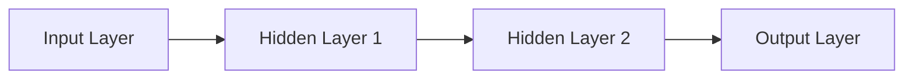

# Deep Learning Concepts

## Introduction

Deep learning represents a subset of machine learning that uses neural networks with multiple layers (hence "deep") to progressively extract higher-level features from raw input. For example, in image recognition, lower layers might identify edges, while higher layers might identify concepts relevant to human understanding like digits, letters, or faces.

This guide covers essential deep learning concepts you need to understand for machine learning interviews, from foundational neural network architecture to advanced techniques like transfer learning.

## Neural Network Fundamentals

At its core, a deep learning model consists of artificial neural networks inspired by the human brain's structure.

### Basic Structure

A neural network consists of:

1. **Input Layer**: Receives the raw data
2. **Hidden Layers**: Processes the information
3. **Output Layer**: Produces the final prediction



### Neurons and Activation Functions

Each neuron:
1. Receives inputs
2. Applies weights
3. Adds a bias
4. Passes through an activation function

```python
# Simple neuron calculation
def neuron_output(inputs, weights, bias):
    # Calculate weighted sum
    z = sum(i * w for i, w in zip(inputs, weights)) + bias
    
    # Apply activation function (ReLU in this case)
    return max(0, z)

# Example
inputs = [1.2, 0.5, -0.3]
weights = [0.7, -0.2, 0.4]
bias = 0.1

output = neuron_output(inputs, weights, bias)
print(f"Neuron output: {output}")
# Output: Neuron output: 0.67
```

### Common Activation Functions

Activation functions introduce non-linearity into the network:

- **ReLU (Rectified Linear Unit)**: `f(x) = max(0, x)`
- **Sigmoid**: `f(x) = 1 / (1 + e^(-x))`
- **Tanh**: `f(x) = tanh(x)`
- **Softmax**: Used for multi-class classification in output layer

```python
import numpy as np
import matplotlib.pyplot as plt

# Defining activation functions
def relu(x):
    return np.maximum(0, x)

def sigmoid(x):
    return 1 / (1 + np.exp(-x))

def tanh(x):
    return np.tanh(x)

# Visualizing activation functions
x = np.linspace(-5, 5, 100)
plt.figure(figsize=(10, 6))
plt.plot(x, relu(x), label='ReLU')
plt.plot(x, sigmoid(x), label='Sigmoid')
plt.plot(x, tanh(x), label='Tanh')
plt.legend()
plt.grid(True)
plt.title('Common Activation Functions')
plt.xlabel('x')
plt.ylabel('f(x)')
```

## Forward Propagation

Forward propagation is the process of passing input data through the network to generate predictions:

```python
def forward_propagation(X, weights, biases):
    # First hidden layer
    Z1 = np.dot(X, weights[0]) + biases[0]
    A1 = relu(Z1)
    
    # Second hidden layer
    Z2 = np.dot(A1, weights[1]) + biases[1]
    A2 = relu(Z2)
    
    # Output layer
    Z3 = np.dot(A2, weights[2]) + biases[2]
    A3 = sigmoid(Z3)  # For binary classification
    
    return A3, (Z1, A1, Z2, A2, Z3)
```

## Backpropagation and Gradient Descent

Backpropagation is the method of updating weights to minimize prediction error:

1. Calculate error at the output
2. Propagate this error backward
3. Update weights using gradient descent

```python
def compute_cost(y_pred, y_true):
    # Binary cross-entropy loss
    m = y_true.shape[0]
    cost = -1/m * np.sum(y_true * np.log(y_pred) + (1 - y_true) * np.log(1 - y_pred))
    return cost

def backpropagation(X, Y, cache, weights, learning_rate=0.01):
    m = X.shape[0]
    (Z1, A1, Z2, A2, Z3) = cache
    A3 = forward_propagation(X, weights, biases)[0]
    
    # Output layer error
    dZ3 = A3 - Y
    dW3 = 1/m * np.dot(A2.T, dZ3)
    db3 = 1/m * np.sum(dZ3, axis=0)
    
    # Hidden layer 2 error
    dZ2 = np.dot(dZ3, weights[2].T) * (A2 > 0)  # ReLU derivative
    dW2 = 1/m * np.dot(A1.T, dZ2)
    db2 = 1/m * np.sum(dZ2, axis=0)
    
    # Hidden layer 1 error
    dZ1 = np.dot(dZ2, weights[1].T) * (A1 > 0)  # ReLU derivative
    dW1 = 1/m * np.dot(X.T, dZ1)
    db1 = 1/m * np.sum(dZ1, axis=0)
    
    # Update weights using gradient descent
    weights[0] -= learning_rate * dW1
    weights[1] -= learning_rate * dW2
    weights[2] -= learning_rate * dW3
    
    return weights
```

## Optimizers

Different optimization algorithms exist to improve upon basic gradient descent:

1. **Stochastic Gradient Descent (SGD)**: Updates weights using a single training example
2. **Mini-batch Gradient Descent**: Updates using small batches
3. **Momentum**: Accelerates SGD by considering previous gradients
4. **Adam**: Adaptive learning rates for each parameter

```python
def sgd_update(weights, gradients, learning_rate=0.01):
    return weights - learning_rate * gradients

def momentum_update(weights, gradients, velocity, momentum=0.9, learning_rate=0.01):
    # Update velocity
    velocity = momentum * velocity - learning_rate * gradients
    # Update weights
    return weights + velocity, velocity

def adam_update(weights, gradients, m, v, t, learning_rate=0.001, beta1=0.9, beta2=0.999, epsilon=1e-8):
    # Update biased first moment estimate
    m = beta1 * m + (1 - beta1) * gradients
    # Update biased second raw moment estimate
    v = beta2 * v + (1 - beta2) * (gradients**2)
    
    # Bias correction
    m_corrected = m / (1 - beta1**t)
    v_corrected = v / (1 - beta2**t)
    
    # Update weights
    weights = weights - learning_rate * m_corrected / (np.sqrt(v_corrected) + epsilon)
    return weights, m, v
```

## Regularization Techniques

Regularization helps prevent overfitting:

### L1 and L2 Regularization

```python
# Cost function with L2 regularization
def compute_cost_with_l2(y_pred, y_true, weights, lambda_reg=0.01):
    m = y_true.shape[0]
    cross_entropy_cost = -1/m * np.sum(y_true * np.log(y_pred) + (1 - y_true) * np.log(1 - y_pred))
    
    # L2 regularization term
    l2_cost = 0
    for w in weights:
        l2_cost += np.sum(np.square(w))
    l2_cost = (lambda_reg / (2 * m)) * l2_cost
    
    return cross_entropy_cost + l2_cost
```

### Dropout

Randomly "drops" neurons during training:

```python
def apply_dropout(layer_output, keep_prob=0.8):
    # Generate dropout mask
    mask = np.random.binomial(1, keep_prob, size=layer_output.shape) / keep_prob
    # Apply mask
    return layer_output * mask
```

## Convolutional Neural Networks (CNNs)

CNNs excel at processing grid-like data (e.g., images):

### Key Components

1. **Convolutional Layers**: Apply filters to detect features
2. **Pooling Layers**: Reduce spatial dimensions
3. **Fully Connected Layers**: Make final predictions

```python
import tensorflow as tf
from tensorflow.keras.models import Sequential
from tensorflow.keras.layers import Conv2D, MaxPooling2D, Flatten, Dense, Dropout

# Building a simple CNN for image classification (MNIST)
def build_cnn_model(input_shape=(28, 28, 1), num_classes=10):
    model = Sequential([
        # First convolutional layer
        Conv2D(32, kernel_size=(3, 3), activation='relu', input_shape=input_shape),
        MaxPooling2D(pool_size=(2, 2)),
        
        # Second convolutional layer
        Conv2D(64, kernel_size=(3, 3), activation='relu'),
        MaxPooling2D(pool_size=(2, 2)),
        
        # Flatten and fully connected layers
        Flatten(),
        Dense(128, activation='relu'),
        Dropout(0.5),
        Dense(num_classes, activation='softmax')
    ])
    
    model.compile(optimizer='adam',
                  loss='categorical_crossentropy',
                  metrics=['accuracy'])
    
    return model

# Usage
model = build_cnn_model()
print(model.summary())
```

## Recurrent Neural Networks (RNNs)

RNNs are designed for sequential data:

### LSTM (Long Short-Term Memory)

```python
import tensorflow as tf
from tensorflow.keras.models import Sequential
from tensorflow.keras.layers import Embedding, LSTM, Dense

# Building a simple LSTM for sequence classification
def build_lstm_model(vocab_size=10000, embedding_dim=100, max_length=100, num_classes=2):
    model = Sequential([
        # Embedding layer
        Embedding(vocab_size, embedding_dim, input_length=max_length),
        
        # LSTM layer
        LSTM(128, dropout=0.2, recurrent_dropout=0.2),
        
        # Output layer
        Dense(num_classes, activation='softmax')
    ])
    
    model.compile(optimizer='adam',
                  loss='categorical_crossentropy',
                  metrics=['accuracy'])
    
    return model
```

## Transfer Learning

Transfer learning leverages pre-trained models for new tasks:

```python
import tensorflow as tf
from tensorflow.keras.applications import ResNet50
from tensorflow.keras.models import Model
from tensorflow.keras.layers import Dense, GlobalAveragePooling2D

def build_transfer_learning_model(input_shape=(224, 224, 3), num_classes=10):
    # Load pre-trained ResNet50
    base_model = ResNet50(weights='imagenet', include_top=False, input_shape=input_shape)
    
    # Freeze base model layers
    for layer in base_model.layers:
        layer.trainable = False
    
    # Add custom layers
    x = base_model.output
    x = GlobalAveragePooling2D()(x)
    x = Dense(256, activation='relu')(x)
    predictions = Dense(num_classes, activation='softmax')(x)
    
    # Create new model
    model = Model(inputs=base_model.input, outputs=predictions)
    
    model.compile(optimizer='adam',
                  loss='categorical_crossentropy',
                  metrics=['accuracy'])
    
    return model
```

## Practical Example: Image Classification

Let's implement a complete deep learning workflow for image classification using a popular dataset:

```python
import tensorflow as tf
from tensorflow.keras.datasets import cifar10
from tensorflow.keras.utils import to_categorical
import matplotlib.pyplot as plt

# Load and prepare data
(X_train, y_train), (X_test, y_test) = cifar10.load_data()

# Normalize pixel values
X_train = X_train.astype('float32') / 255.0
X_test = X_test.astype('float32') / 255.0

# Convert labels to one-hot encoding
y_train = to_categorical(y_train, 10)
y_test = to_categorical(y_test, 10)

# Create model
model = Sequential([
    Conv2D(32, (3, 3), padding='same', activation='relu', input_shape=(32, 32, 3)),
    Conv2D(32, (3, 3), activation='relu'),
    MaxPooling2D(pool_size=(2, 2)),
    Dropout(0.25),
    
    Conv2D(64, (3, 3), padding='same', activation='relu'),
    Conv2D(64, (3, 3), activation='relu'),
    MaxPooling2D(pool_size=(2, 2)),
    Dropout(0.25),
    
    Flatten(),
    Dense(512, activation='relu'),
    Dropout(0.5),
    Dense(10, activation='softmax')
])

# Compile model
model.compile(
    optimizer='adam',
    loss='categorical_crossentropy',
    metrics=['accuracy']
)

# Train model
history = model.fit(
    X_train, y_train,
    batch_size=64,
    epochs=10,
    validation_data=(X_test, y_test)
)

# Evaluate model
test_loss, test_acc = model.evaluate(X_test, y_test)
print(f"Test accuracy: {test_acc:.4f}")

# Plot learning curves
plt.figure(figsize=(12, 4))
plt.subplot(1, 2, 1)
plt.plot(history.history['accuracy'], label='Train')
plt.plot(history.history['val_accuracy'], label='Validation')
plt.title('Accuracy')
plt.xlabel('Epoch')
plt.legend()

plt.subplot(1, 2, 2)
plt.plot(history.history['loss'], label='Train')
plt.plot(history.history['val_loss'], label='Validation')
plt.title('Loss')
plt.xlabel('Epoch')
plt.legend()

plt.tight_layout()
```

## Interview Questions on Deep Learning

Here are some common deep learning interview questions:

1. **What's the difference between a shallow and deep neural network?**
   - A shallow network has only one hidden layer, while a deep network has multiple hidden layers, allowing it to learn hierarchical representations.

2. **Why do we need activation functions?**
   - Without activation functions, neural networks would only be able to learn linear relationships. Activation functions introduce non-linearity, enabling networks to learn complex patterns.

3. **Compare and contrast CNNs and RNNs.**
   - CNNs excel at grid-like data (images) using convolutional filters to capture spatial patterns. RNNs handle sequential data (text, time series) by maintaining internal memory of previous inputs.

4. **What is the vanishing gradient problem?**
   - As gradients flow backward through many layers, they can become extremely small, effectively preventing earlier layers from learning. This is addressed by architectures like LSTM and techniques like batch normalization.

5. **Explain overfitting and how to prevent it.**
   - Overfitting occurs when a model learns noise in training data instead of generalizable patterns. Prevention techniques include regularization, dropout, early stopping, and data augmentation.

## Summary

Deep learning has revolutionized machine learning with its ability to automatically learn hierarchical representations from data. Key concepts covered in this guide include:

- Neural network architecture and forward propagation
- Backpropagation and optimization algorithms
- Regularization techniques to prevent overfitting
- Specialized architectures like CNNs and RNNs
- Transfer learning for leveraging pre-trained models
- Practical implementation of deep learning models

Mastering these concepts will help you tackle deep learning questions in machine learning interviews and build effective models for various applications.

## Additional Resources

For further learning:

1. Books:
   - "Deep Learning" by Ian Goodfellow, Yoshua Bengio, and Aaron Courville
   - "Neural Networks and Deep Learning" by Michael Nielsen

2. Online Courses:
   - Deep Learning Specialization by Andrew Ng (Coursera)
   - Fast.ai Practical Deep Learning for Coders

3. Practice:
   - Implement models from scratch using NumPy
   - Participate in Kaggle competitions
   - Reproduce research papers using TensorFlow or PyTorch

## Exercises

1. Implement a simple neural network from scratch using only NumPy.
2. Build and train a CNN for the MNIST dataset. Experiment with different architectures.
3. Fine-tune a pre-trained model (e.g., ResNet) for a custom classification task.
4. Implement an LSTM model for sentiment analysis on a movie review dataset.
5. Create a GAN (Generative Adversarial Network) to generate new images.