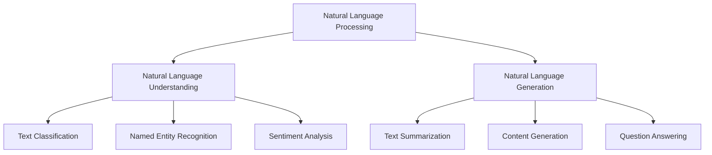

# NLP Interview Questions

## Introduction

Natural Language Processing (NLP) is a subfield of artificial intelligence that focuses on enabling computers to understand, interpret, and generate human language. As NLP continues to power many modern applications—from virtual assistants to sentiment analysis tools—it has become a critical skill for machine learning engineers and data scientists.

This guide covers common NLP interview questions you might encounter when applying for machine learning positions. We'll explore fundamental concepts, techniques, and practical applications to help you prepare effectively.

## Fundamental NLP Concepts

### 1. What is Natural Language Processing?

**Answer:** Natural Language Processing (NLP) is a field of artificial intelligence that gives computers the ability to understand, interpret, and generate human language in a valuable way. NLP combines computational linguistics, machine learning, and deep learning models to process and analyze large amounts of natural language data.

### 2. Explain the difference between NLP, NLU, and NLG

**Answer:**
- **Natural Language Processing (NLP)**: The overarching field that deals with interactions between computers and human language.
- **Natural Language Understanding (NLU)**: A subset of NLP focused on machine reading comprehension—understanding the meaning behind text.
- **Natural Language Generation (NLG)**: Another subset of NLP that focuses on producing human language text from structured data or meaning representations.



### 3. What are the main steps in an NLP pipeline?

**Answer:** A typical NLP pipeline includes:

1. **Text Collection/Input**: Gathering raw text data
2. **Text Preprocessing**: Cleaning and normalizing text
   - Tokenization
   - Lowercasing
   - Removing special characters and numbers
   - Removing stop words
   - Stemming/Lemmatization
3. **Feature Extraction**: Converting text to numerical representations
4. **Model Building**: Training algorithms on the features
5. **Evaluation**: Assessing model performance
6. **Deployment**: Putting the model into production

## Text Preprocessing Techniques

### 4. What is tokenization and why is it important?

**Answer:** Tokenization is the process of breaking down text into smaller units called tokens (usually words, but sometimes characters or subwords). It's important because it's usually the first step in text processing and converts raw text into a format that can be processed by NLP algorithms.

**Example:**

```python
# Word tokenization example
from nltk.tokenize import word_tokenize

text = "NLP is fascinating and powerful!"
tokens = word_tokenize(text)
print(tokens)
# Output: ['NLP', 'is', 'fascinating', 'and', 'powerful', '!']
```

### 5. Explain stemming and lemmatization. How do they differ?

**Answer:** Both stemming and lemmatization reduce words to their root form, but they differ in approach:

- **Stemming** uses a heuristic process to cut off the ends of words to achieve this goal. It's faster but can sometimes produce non-real words.
- **Lemmatization** uses a more sophisticated approach based on vocabulary and morphological analysis to return the proper base form (lemma) of a word. It's slower but more accurate.

**Example:**

```python
from nltk.stem import PorterStemmer
from nltk.stem import WordNetLemmatizer

# Initialize
stemmer = PorterStemmer()
lemmatizer = WordNetLemmatizer()

# Examples
words = ["running", "runs", "ran", "better", "studies", "studying"]

# Stemming
stems = [stemmer.stem(word) for word in words]
print("Stems:", stems)
# Output: Stems: ['run', 'run', 'ran', 'better', 'studi', 'studi']

# Lemmatization
lemmas = [lemmatizer.lemmatize(word) for word in words]
print("Lemmas:", lemmas)
# Output: Lemmas: ['running', 'run', 'ran', 'better', 'study', 'studying']
```

### 6. What are stop words and when would you remove them?

**Answer:** Stop words are common words that occur frequently in language but typically don't contribute much meaning (e.g., "the", "is", "and"). They're often removed during preprocessing when the focus is on content words, like in document classification or keyword extraction. However, they should be kept for tasks that depend on grammar or structure, such as sentiment analysis or language generation.

**Example:**

```python
from nltk.corpus import stopwords
from nltk.tokenize import word_tokenize

# Download stop words if not already downloaded
# import nltk
# nltk.download('stopwords')

stop_words = set(stopwords.words('english'))

text = "This is an example of removing stop words from a sentence."
tokens = word_tokenize(text)
filtered_text = [word for word in tokens if word.lower() not in stop_words]

print(filtered_text)
# Output: ['This', 'example', 'removing', 'stop', 'words', 'sentence', '.']
```

## Text Representation

### 7. What is a Bag of Words (BoW) model?

**Answer:** Bag of Words is a text representation method that describes the occurrence of words within a document. It creates a vocabulary of all unique words in the dataset and represents each document as a vector with the frequency of each word. It disregards grammar and word order but preserves multiplicity.

**Example:**

```python
from sklearn.feature_extraction.text import CountVectorizer

docs = [
    "I love NLP and machine learning.",
    "NLP is an exciting field of AI.",
]

vectorizer = CountVectorizer()
X = vectorizer.fit_transform(docs)

print("Feature names:", vectorizer.get_feature_names_out())
print("Document vectors:", X.toarray())

# Output:
# Feature names: ['ai' 'an' 'and' 'exciting' 'field' 'i' 'is' 'learning' 'love' 'machine' 'nlp' 'of']
# Document vectors: [[0 0 1 0 0 1 0 1 1 1 1 0]
#                    [1 1 0 1 1 0 1 0 0 0 1 1]]
```

### 8. What is TF-IDF and how does it improve on BoW?

**Answer:** TF-IDF (Term Frequency-Inverse Document Frequency) is a numerical statistic that reflects how important a word is to a document in a collection. Unlike BoW which only counts word frequencies, TF-IDF gives higher weight to terms that are frequent in a document but rare across the corpus, helping to highlight more distinctive words.

**Example:**

```python
from sklearn.feature_extraction.text import TfidfVectorizer

docs = [
    "I love NLP and machine learning.",
    "NLP is an exciting field of AI.",
    "Machine learning algorithms are important in NLP.",
]

vectorizer = TfidfVectorizer()
X = vectorizer.fit_transform(docs)

# Get feature names and tfidf values for the first document
feature_names = vectorizer.get_feature_names_out()
first_doc_vector = X[0]

# Print feature names and their tfidf scores for non-zero elements
for idx in first_doc_vector.indices:
    print(f"{feature_names[idx]}: {first_doc_vector[0, idx]:.4f}")

# Output might look like:
# love: 0.5000
# machine: 0.5000
# learning: 0.5000
# nlp: 0.3000
# and: 0.4000
```

### 9. Explain word embeddings and how they differ from BoW or TF-IDF

**Answer:** Word embeddings are dense vector representations of words in a lower-dimensional space, where semantically similar words are mapped to nearby points. Unlike BoW or TF-IDF which create sparse, high-dimensional vectors based on word frequencies, word embeddings:

1. Capture semantic relationships between words
2. Represent words in a dense, continuous vector space
3. Learn from the context in which words appear
4. Allow mathematical operations on words (e.g., "king" - "man" + "woman" ≈ "queen")

**Example using Word2Vec:**

```python
import gensim.downloader as api

# Load pre-trained word vectors
word_vectors = api.load('word2vec-google-news-300')

# Find similar words
similar_words = word_vectors.most_similar('computer')
print("Words similar to 'computer':")
for word, score in similar_words[:5]:
    print(f"{word}: {score:.4f}")

# Vector arithmetic
result = word_vectors.most_similar(positive=['king', 'woman'], negative=['man'])
print("king - man + woman =", result[0][0])

# Output might look like:
# Words similar to 'computer':
# computers: 0.7088
# pc: 0.6889
# computing: 0.6047
# desktop: 0.5845
# laptop: 0.5683
#
# king - man + woman = queen
```

### 10. What is a language model in NLP?

**Answer:** A language model is a probabilistic model that predicts the likelihood of a sequence of words or the next word in a sequence. Traditional language models estimate probabilities based on n-grams (sequences of n words), while modern approaches use neural networks to model more complex patterns and longer-term dependencies.

Language models serve as the foundation for many NLP tasks including:
- Text generation
- Machine translation
- Speech recognition
- Spelling correction
- Sentence completion

## Advanced NLP Techniques

### 11. What is the transformer architecture and why was it revolutionary for NLP?

**Answer:** The transformer architecture, introduced in the paper "Attention Is All You Need" (2017), is a neural network architecture that relies entirely on attention mechanisms rather than recurrence or convolution. It revolutionized NLP because:

1. It enabled parallel processing (unlike RNNs which are sequential)
2. It effectively captured long-range dependencies in text
3. It scaled better with computational resources
4. It led to state-of-the-art pre-trained models like BERT, GPT, and T5

The key innovation was the self-attention mechanism, which allows the model to weigh the importance of different words in a sentence regardless of their positions.

### 12. Explain BERT and how it changed NLP

**Answer:** BERT (Bidirectional Encoder Representations from Transformers) is a transformer-based model developed by Google in 2018. It changed NLP by:

1. **Bidirectional Context**: Unlike previous models that processed text in one direction, BERT considers context from both directions simultaneously.
2. **Pre-training and Fine-tuning**: BERT introduced a two-step process where the model is first pre-trained on vast amounts of text and then fine-tuned for specific tasks.
3. **Masked Language Modeling**: BERT uses a "masked language model" pre-training objective, where random words are masked and the model learns to predict them.
4. **Next Sentence Prediction**: BERT also learns to predict whether two sentences naturally follow each other.

BERT significantly improved performance on a wide range of NLP tasks with minimal task-specific architecture modifications.

### 13. What is transfer learning in NLP and why is it important?

**Answer:** Transfer learning in NLP is the practice of leveraging knowledge from a pre-trained model (trained on a large corpus) to improve performance on a downstream task with less labeled data. It's important because:

1. It reduces the need for large labeled datasets for specific tasks
2. It decreases training time and computational resources
3. It improves performance on tasks with limited data
4. It enables sharing of linguistic knowledge across different NLP applications

**Example of transfer learning with BERT:**

```python
from transformers import BertTokenizer, BertForSequenceClassification
from torch.nn import functional as F
import torch

# Load pre-trained model and tokenizer
tokenizer = BertTokenizer.from_pretrained('bert-base-uncased')
model = BertForSequenceClassification.from_pretrained('bert-base-uncased', num_labels=2)

# Prepare input
text = "This movie is fantastic! I really enjoyed it."
inputs = tokenizer(text, return_tensors="pt", padding=True, truncation=True, max_length=128)

# Make prediction
with torch.no_grad():
    outputs = model(**inputs)
    predictions = F.softmax(outputs.logits, dim=-1)

print(f"Positive sentiment probability: {predictions[0][1].item():.4f}")
print(f"Negative sentiment probability: {predictions[0][0].item():.4f}")
```

## NLP Applications and Tasks

### 14. What is Named Entity Recognition (NER) and how would you implement it?

**Answer:** Named Entity Recognition (NER) is the task of identifying and categorizing key information (entities) in text into predefined categories such as person names, organizations, locations, dates, etc.

A typical implementation approach:

1. **Data preparation**: Collect and annotate text with entity labels
2. **Feature extraction**: Extract features like word case, part-of-speech tags, surrounding words
3. **Model selection**: Choose between:
   - Rule-based approaches
   - Statistical models (CRF, HMM)
   - Neural networks (BiLSTM-CRF, Transformer-based models)
4. **Training**: Train the model on labeled data
5. **Evaluation**: Assess performance using metrics like precision, recall, and F1-score

**Example using spaCy:**

```python
import spacy

# Load English NER model
nlp = spacy.load("en_core_web_sm")

text = "Apple is looking at buying U.K. startup for $1 billion. The deal is expected to close by March 2023."
doc = nlp(text)

# Print entities
for ent in doc.ents:
    print(f"{ent.text} - {ent.label_} ({spacy.explain(ent.label_)})")

# Output:
# Apple - ORG (Companies, agencies, institutions)
# U.K. - GPE (Countries, cities, states)
# $1 billion - MONEY (Monetary values, including unit)
# March 2023 - DATE (Absolute or relative dates or periods)
```

### 15. What is sentiment analysis and what are the challenges involved?

**Answer:** Sentiment analysis is the process of determining the emotional tone or opinion expressed in a piece of text. It typically involves classifying text as positive, negative, or neutral, though more fine-grained analyses are also possible.

**Challenges in sentiment analysis:**

1. **Sarcasm and irony**: "Oh great, my flight is delayed again." appears positive but expresses negative sentiment
2. **Context dependency**: "The movie was unpredictable" could be positive or negative depending on genre
3. **Domain specificity**: Sentiment indicators in product reviews differ from those in financial news
4. **Negation handling**: "Not bad" is actually positive, not negative
5. **Implicit sentiment**: "The battery lasted two hours" implies negative sentiment without explicit negative words
6. **Multiple sentiments**: A review might be positive about some aspects but negative about others

**Example of basic sentiment analysis:**

```python
from transformers import pipeline

# Load sentiment analysis pipeline
classifier = pipeline('sentiment-analysis')

texts = [
    "I absolutely loved this product! Best purchase ever.",
    "The service was okay, but could be better.",
    "This is the worst experience I've ever had. Avoid at all costs."
]

for text in texts:
    result = classifier(text)[0]
    print(f"Text: '{text}'")
    print(f"Sentiment: {result['label']}, Score: {result['score']:.4f}")

# Output:
# Text: 'I absolutely loved this product! Best purchase ever.'
# Sentiment: POSITIVE, Score: 0.9994

# Text: 'The service was okay, but could be better.'
# Sentiment: NEGATIVE, Score: 0.6543

# Text: 'This is the worst experience I've ever had. Avoid at all costs.'
# Sentiment: NEGATIVE, Score: 0.9998
```

### 16. What approaches can be used for text summarization?

**Answer:** Text summarization involves creating a concise and coherent version of a longer text while preserving key information and overall meaning. There are two main approaches:

1. **Extractive Summarization**:
   - Selects and combines existing sentences from the original text
   - Uses techniques like frequency analysis, TextRank, or neural networks to score sentences
   - Faster and more reliable for factual accuracy
   - Example algorithms: TextRank, LexRank, BERT extractive summarizer

2. **Abstractive Summarization**:
   - Generates new text that captures the meaning of the original
   - Uses sequence-to-sequence models like LSTM, Transformers (BART, T5, etc.)
   - Can be more coherent and natural-sounding
   - Risks introducing factual errors or hallucinations

**Example using a pre-trained model:**

```python
from transformers import pipeline

# Load summarization pipeline
summarizer = pipeline("summarization", model="facebook/bart-large-cnn")

article = """
The field of artificial intelligence has seen remarkable progress in recent years. 
Machine learning models can now generate human-like text, create realistic images, 
and even compose music. Natural Language Processing, a subfield of AI, has particularly 
benefited from advances in deep learning and transformer architectures. Models like 
BERT, GPT, and T5 have set new standards in language understanding and generation. 
Despite these advances, challenges remain in areas such as common sense reasoning, 
causal understanding, and ensuring ethical use of AI technologies.
"""

summary = summarizer(article, max_length=75, min_length=30, do_sample=False)

print("Original length:", len(article.split()))
print("Summary length:", len(summary[0]['summary_text'].split()))
print("Summary:", summary[0]['summary_text'])

# Output might look like:
# Original length: 80
# Summary length: 32
# 
# Summary: The field of artificial intelligence has seen remarkable progress in recent years. 
# Natural Language Processing has benefited from advances in deep learning and transformer architectures. 
# Challenges remain in common sense reasoning, causal understanding, and ensuring ethical use of AI.
```

## Evaluation Metrics

### 17. What metrics are commonly used to evaluate NLP models?

**Answer:** The choice of evaluation metrics depends on the specific NLP task:

**Text Classification (including sentiment analysis):**
- Accuracy: Proportion of correct predictions
- Precision: TP / (TP + FP)
- Recall: TP / (TP + FN)
- F1 Score: Harmonic mean of precision and recall
- ROC-AUC: Area under ROC curve

**Language Modeling:**
- Perplexity: Measurement of how well a model predicts a sample
- BLEU, ROUGE, METEOR: Metrics for comparing generated text to references

**Named Entity Recognition:**
- Entity-level F1 score
- Span-level precision, recall, and F1

**Machine Translation/Text Generation:**
- BLEU: Measures n-gram overlap with reference translations
- ROUGE: Recall-oriented metric, useful for summarization
- METEOR: Considers stems, synonyms, and word order
- BERTScore: Uses contextual embeddings for semantic similarity

**Question Answering:**
- Exact Match (EM): Proportion of predictions matching ground truth exactly
- F1 Score: Word-level overlap between prediction and ground truth

### 18. Explain the BLEU score and when it's used

**Answer:** BLEU (Bilingual Evaluation Understudy) is an evaluation metric primarily used for machine translation and other text generation tasks. It measures the n-gram overlap between generated text and reference texts.

Key characteristics:
- Ranges from 0 to 1 (higher is better)
- Considers precision of n-grams (typically 1-4 grams)
- Applies a brevity penalty to penalize very short outputs
- Often reported as BLEU-1, BLEU-2, etc., or as a composite score

BLEU has limitations:
- Doesn't capture semantic similarity beyond n-gram matches
- Doesn't account for synonyms or paraphrasing
- Correlates with human judgment but isn't perfect

**Example calculation:**

```python
from nltk.translate.bleu_score import sentence_bleu

reference = ["The cat is on the mat".split()]
candidate1 = "The cat sits on the mat".split()
candidate2 = "On the mat there is a cat".split()

bleu1 = sentence_bleu(reference, candidate1)
bleu2 = sentence_bleu(reference, candidate2)

print(f"BLEU score for candidate 1: {bleu1:.4f}")
print(f"BLEU score for candidate 2: {bleu2:.4f}")

# Output:
# BLEU score for candidate 1: 0.6953
# BLEU score for candidate 2: 0.3659
```

## Common Challenges and Solutions

### 19. How would you handle misspellings and typos in text data?

**Answer:** Handling misspellings and typos is crucial for robust NLP systems. Here are several approaches:

1. **Spelling correction algorithms**:
   - Edit distance-based methods (Levenshtein, Jaro-Winkler)
   - Using dictionaries with tools like PySpellChecker
   - Context-sensitive spelling correction using language models

2. **Character-level modeling**:
   - Character-level embeddings or n-grams
   - Character-level CNN or RNN models

3. **Fuzzy matching**:
   - Phonetic algorithms (Soundex, Metaphone)
   - N-gram similarity

4. **Normalization**:
   - Converting text to lowercase
   - Removing excess characters (e.g., "soooo" → "so")

5. **Subword tokenization**:
   - BPE, WordPiece, or SentencePiece tokenizers break words into subword units, making models more robust to misspellings

**Example with basic spelling correction:**

```python
from spellchecker import SpellChecker

spell = SpellChecker()

misspelled = ["langauge", "proccesor", "naturaal", "lerning"]

for word in misspelled:
    corrected = spell.correction(word)
    print(f"Original: {word} -> Corrected: {corrected}")

# Output:
# Original: langauge -> Corrected: language
# Original: proccesor -> Corrected: processor 
# Original: naturaal -> Corrected: natural
# Original: lerning -> Corrected: learning
```

### 20. How do you handle multilingual NLP problems?

**Answer:** Approaches for multilingual NLP include:

1. **Multilingual models**:
   - Using pre-trained multilingual models like mBERT, XLM-R, or mT5
   - These models are trained on text from multiple languages and can handle cross-lingual tasks

2. **Translation-based approaches**:
   - Translating all text to a single language (usually English)
   - Applying monolingual models to the translated text

3. **Language-specific models**:
   - Training separate models for each language
   - Ensemble methods to combine their predictions

4. **Cross-lingual transfer learning**:
   - Training on a high-resource language and transferring to low-resource languages
   - Using language-agnostic features

5. **Character-level or subword models**:
   - These can work across languages with shared scripts

**Example using multilingual BERT:**

```python
from transformers import pipeline

# Load multilingual sentiment analysis model
classifier = pipeline('sentiment-analysis', model='nlptown/bert-base-multilingual-uncased-sentiment')

texts = [
    "This product is amazing. I love it!", # English
    "Ce produit est incroyable. Je l'adore !", # French
    "Dieses Produkt ist erstaunlich. Ich liebe es!", # German
    "Este producto es increíble. ¡Me encanta!" # Spanish
]

for text in texts:
    result = classifier(text)[0]
    print(f"Text: '{text}'")
    print(f"Sentiment: {result['label']}, Score: {result['score']:.4f}")

# Output:
# Text: 'This product is amazing. I love it!'
# Sentiment: 5 stars, Score: 0.9276
#
# Text: 'Ce produit est incroyable. Je l'adore !'
# Sentiment: 5 stars, Score: 0.8912
#
# (similar results for German and Spanish)
```

## Real-world Applications

### 21. How would you build a chatbot from scratch?

**Answer:** Building a chatbot involves several steps:

1. **Define the scope and purpose**:
   - Task-oriented (booking, support) vs. open-domain conversation
   - Domain knowledge requirements
   - User interaction patterns

2. **Choose the architecture**:
   - Rule-based: Pattern matching with predefined responses
   - Retrieval-based: Selects best response from a repository
   - Generative: Creates original responses (using seq2seq or transformer models)
   - Hybrid: Combines approaches

3. **Design conversation flow**:
   - Intent recognition: What does the user want?
   - Entity extraction: Key information from user input
   - Dialog management: Tracking conversation state
   - Response generation: Creating appropriate replies

4. **Implementation steps**:
   - Data collection/preparation
   - Intent classification model
   - Entity recognition component
   - Dialog state tracker
   - Response selector/generator
   - Integration with channels (web, messaging platforms)

5. **Testing and iterative improvement**:
   - User testing
   - Conversation logs analysis
   - Fine-tuning models

**Example of a simple intent classifier for a chatbot:**

```python
import pandas as pd
from sklearn.feature_extraction.text import TfidfVectorizer
from sklearn.svm import LinearSVC
from sklearn.pipeline import Pipeline

# Sample training data
training_data = pd.DataFrame({
    'text': [
        "What's the weather like today?",
        "Will it rain tomorrow?",
        "What's the forecast for this weekend?",
        "How do I reset my password?",
        "I forgot my login credentials",
        "Can't access my account",
        "What are your business hours?",
        "When do you open on weekends?",
        "Are you open on holidays?"
    ],
    'intent': [
        'weather', 'weather', 'weather',
        'account_access', 'account_access', 'account_access',
        'business_hours', 'business_hours', 'business_hours'
    ]
})

# Create a pipeline with TF-IDF and SVM
intent_classifier = Pipeline([
    ('tfidf', TfidfVectorizer(ngram_range=(1, 2))),
    ('clf', LinearSVC())
])

# Train the model
intent_classifier.fit(training_data['text'], training_data['intent'])

# Test with new queries
test_queries = [
    "What will the weather be like?",
    "I can't log into my account",
    "What time do you close today?"
]

for query in test_queries:
    intent = intent_classifier.predict([query])[0]
    print(f"Query: '{query}'")
    print(f"Predicted intent: {intent}")

# Output:
# Query: 'What will the weather be like?'
# Predicted intent: weather
#
# Query: "I can't log into my account"
# Predicted intent: account_access
#
# Query: 'What time do you close today?'
# Predicted intent: business_hours
```

### 22. How would you implement a document search engine using NLP?

**Answer:** Building a document search engine with NLP involves these key components:

1. **Document preprocessing**:
   - Tokenization, stop word removal
   - Stemming/lemmatization
   - Entity extraction

2. **Document representation**:
   - Classical: TF-IDF vectors
   - Modern: Dense vector embeddings using models like BERT, Universal Sentence Encoder

3. **Indexing**:
   - Inverted index for keyword search
   - Vector database (FAISS, Annoy, etc.) for semantic search

4. **Query processing**:
   - Apply same preprocessing to queries
   - Convert query to same representation as documents

5. **Retrieval and ranking**:
   - Keyword matching (BM25, TF-IDF)
   - Semantic similarity (cosine similarity between embeddings)
   - Learning-to-rank models

6. **Advanced features**:
   - Query expansion
   - Relevance feedback
   - Faceted search

**Example of a simple semantic search engine:**

```python
from sentence_transformers import SentenceTransformer
import numpy as np
from sklearn.metrics.pairwise import cosine_similarity

# Sample documents
documents = [
    "Python is a popular programming language for data science and machine learning.",
    "Natural Language Processing enables computers to understand human language.",
    "Deep learning models have revolutionized the field of computer vision.",
    "BERT is a transformer-based model for natural language understanding.",
    "Data preprocessing is an essential step in any machine learning pipeline."
]

# Load a pre-trained sentence transformer model
model = SentenceTransformer('all-MiniLM-L6-v2')

# Create document embeddings
document_embeddings = model.encode(documents)

# Function to search documents
def search(query, top_k=2):
    # Encode the query
    query_embedding = model.encode([query])
    
    # Calculate similarity
    similarities = cosine_similarity(query_embedding, document_embeddings)[0]
    
    # Get top results
    top_indices = similarities.argsort()[-top_k:][::-1]
    
    results = []
    for i in top_indices:
        results.append({
            'document': documents[i],
            'similarity': similarities[i]
        })
    
    return results

# Test the search engine
queries = [
    "How does NLP work?",
    "What is Python used for?",
    "Tell me about transformer models"
]

for query in queries:
    print(f"Query: '{query}'")
    results = search(query)
    for i, result in enumerate(results, 1):
        print(f"{i}. {result['document']} (Score: {result['similarity']:.4f})")
    print()

# Output:
# Query: 'How does NLP work?'
# 1. Natural Language Processing enables computers to understand human language. (Score: 0.7213)
# 2. BERT is a transformer-based model for natural language understanding. (Score: 0.5891)
#
# Query: 'What is Python used for?'
# 1. Python is a popular programming language for data science and machine learning. (Score: 0.8102)
# 2. Data preprocessing is an essential step in any machine learning pipeline. (Score: 0.5245)
#
# Query: 'Tell me about transformer models'
# 1. BERT is a transformer-based model for natural language understanding. (Score: 0.7634)
# 2. Natural Language Processing enables computers to understand human language. (Score: 0.5321)
```

## Advanced Topics and Recent Trends

### 23. What are prompt engineering techniques for large language models?

**Answer:** Prompt engineering refers to the practice of designing effective input prompts to guide large language models (LLMs) like GPT-4, Claude, or LLaMA to produce desired outputs. Key techniques include:

1. **Zero-shot prompting**: Directly asking the model to perform a task without examples
   - "Classify this review as positive or negative: [review text]"

2. **Few-shot prompting**: Including examples of the task in the prompt
   - "Positive: This movie was amazing! Negative: I hated this book. Classify: [new text]"

3. **Chain-of-thought prompting**: Instructing the model to explain its reasoning step-by-step
   - "Think step by step to solve this problem: [problem]"

4. **Role prompting**: Asking the model to assume a specific role or persona
   - "You are an expert mathematician. Solve this equation: [equation]"

5. **Format specification**: Explicitly defining the desired output format
   - "Return the answer as JSON in the format: `{\"sentiment\": \"positive/negative\"}"`

6. **Self-consistency prompting**: Having the model generate multiple solutions and selecting the most consistent one

7. **ReAct (Reasoning + Acting)**: Combining reasoning and action steps for complex tasks

These techniques