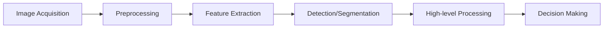
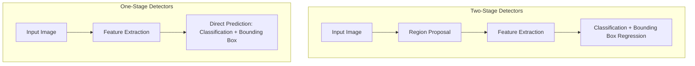

# Computer Vision Questions

## Introduction

Computer vision is a field of artificial intelligence that enables computers to derive meaningful information from digital images, videos, and other visual inputs. It's one of the most rapidly evolving areas in machine learning, with applications ranging from facial recognition to autonomous driving.

This guide covers common computer vision interview questions you might encounter during machine learning job interviews. We'll explore fundamental concepts, algorithms, deep learning approaches, and practical applications to help you prepare effectively.

## Fundamentals of Computer Vision

### What is Computer Vision?

Computer vision is a multidisciplinary field that aims to enable computers to "see" and interpret the visual world similar to human vision. It involves acquiring, processing, analyzing, and understanding digital images to produce numerical or symbolic information.

### Key Differences: Computer Vision vs. Image Processing

A common interview question differentiates these related fields:

| Computer Vision | Image Processing |
|-----------------|------------------|
| Focuses on understanding and interpreting images | Focuses on manipulating and enhancing images |
| Output is high-level understanding (object detection, scene understanding) | Output is typically another image (filtering, denoising) |
| Uses image processing as a preprocessing step | Is a prerequisite for computer vision |
| Examples: object recognition, facial detection | Examples: contrast enhancement, noise removal |

### Core Steps in Computer Vision Pipeline



## Feature Detection and Description

### What are Image Features?

Features are distinctive parts of an image that provide meaningful information for analysis. Good interview answers highlight that ideal features should be:

- Repeatable: Same feature can be found in different images of the same scene
- Distinctive: Features should be unique enough to be matched
- Local: Features should be local so they're robust to occlusion and clutter
- Numerous: Many features should be generated (even for small objects)
- Accurate: Features should be accurately localized
- Efficient: Feature detection should be computationally efficient

### Popular Feature Detectors and Descriptors

```python
# Example: Using SIFT (Scale-Invariant Feature Transform) with OpenCV
import cv2
import numpy as np
import matplotlib.pyplot as plt

# Read input image
img = cv2.imread('example.jpg')
gray = cv2.cvtColor(img, cv2.COLOR_BGR2GRAY)

# Create SIFT detector
sift = cv2.SIFT_create()

# Detect keypoints and compute descriptors
keypoints, descriptors = sift.detectAndCompute(gray, None)

# Draw keypoints
img_keypoints = cv2.drawKeypoints(gray, keypoints, None)

# Display results
plt.figure(figsize=(10, 8))
plt.imshow(img_keypoints)
plt.title('SIFT Features')
plt.axis('off')
plt.show()

print(f"Number of keypoints detected: {len(keypoints)}")
print(f"Shape of descriptor: {descriptors.shape}")

# Output:
# Number of keypoints detected: 1247
# Shape of descriptor: (1247, 128)
```

### Common Feature Detectors/Descriptors to Know

- **SIFT (Scale-Invariant Feature Transform)**: Robust to scale, rotation, and illumination changes
- **SURF (Speeded-Up Robust Features)**: Faster alternative to SIFT
- **ORB (Oriented FAST and Rotated BRIEF)**: Free alternative to SIFT/SURF, computationally efficient
- **FAST (Features from Accelerated Segment Test)**: Corner detector optimized for computational efficiency
- **BRIEF (Binary Robust Independent Elementary Features)**: Binary descriptor that's fast to compute and match
- **HOG (Histogram of Oriented Gradients)**: Feature descriptor used for object detection

## Image Classification Techniques

### Traditional vs. Deep Learning Approaches

Interviewers often ask you to compare traditional and modern approaches:

**Traditional Pipeline:**
1. Feature extraction (HOG, SIFT, etc.)
2. Feature representation
3. Classification (SVM, Random Forest, etc.)

**Deep Learning Pipeline:**
1. End-to-end learning with Convolutional Neural Networks (CNNs)
2. Automatic feature learning
3. Classification through fully connected layers

### Convolutional Neural Networks (CNNs)

CNNs are the backbone of modern computer vision. Be prepared to explain:

```python
# Example: Simple CNN for image classification with TensorFlow/Keras
import tensorflow as tf
from tensorflow.keras import layers, models

# Build a simple CNN
model = models.Sequential([
    # Convolutional layer with 32 filters, 3x3 kernel
    layers.Conv2D(32, (3, 3), activation='relu', input_shape=(32, 32, 3)),
    # Max pooling to reduce dimensions
    layers.MaxPooling2D((2, 2)),
    # Additional conv layers
    layers.Conv2D(64, (3, 3), activation='relu'),
    layers.MaxPooling2D((2, 2)),
    layers.Conv2D(64, (3, 3), activation='relu'),
    # Flatten the 3D output to 1D
    layers.Flatten(),
    # Fully connected layers
    layers.Dense(64, activation='relu'),
    # Output layer (e.g., for 10 classes)
    layers.Dense(10, activation='softmax')
])

# Display the model summary
model.summary()

# Output:
# Model: "sequential"
# _________________________________________________________________
# Layer (type)                 Output Shape              Param #   
# =================================================================
# conv2d (Conv2D)              (None, 30, 30, 32)        896       
# max_pooling2d (MaxPooling2D) (None, 15, 15, 32)        0         
# conv2d_1 (Conv2D)            (None, 13, 13, 64)        18496     
# max_pooling2d_1 (MaxPooling2 (None, 6, 6, 64)          0         
# conv2d_2 (Conv2D)            (None, 4, 4, 64)          36928     
# flatten (Flatten)            (None, 1024)              0         
# dense (Dense)                (None, 64)                65600     
# dense_1 (Dense)              (None, 10)                650       
# =================================================================
# Total params: 122,570
# Trainable params: 122,570
# Non-trainable params: 0
# _________________________________________________________________
```

### CNN Architecture Components

Be ready to explain each component:

1. **Convolutional Layer**: Applies filters to detect features
2. **Activation Function**: Introduces non-linearity (ReLU, Sigmoid, etc.)
3. **Pooling Layer**: Reduces spatial dimensions
4. **Fully Connected Layer**: Performs classification based on features
5. **Softmax**: Converts outputs to probability distribution

### Popular CNN Architectures

Know the landmark architectures:

- **LeNet-5** (1998): Pioneer CNN by Yann LeCun
- **AlexNet** (2012): Deeper architecture, ReLU activations, winner of ILSVRC 2012
- **VGG-16/19** (2014): Simplified architecture with 3×3 convolutions
- **GoogLeNet/Inception** (2014): Introduced inception modules
- **ResNet** (2015): Introduced residual connections to train very deep networks
- **MobileNet** (2017): Lightweight CNN for mobile and embedded devices
- **EfficientNet** (2019): Balanced network depth, width, and resolution

## Object Detection

### Two-Stage vs. One-Stage Detectors



### Common Object Detection Algorithms

- **R-CNN Family**:
  - R-CNN: Region-based CNN
  - Fast R-CNN: Shares computation of CNN features
  - Faster R-CNN: Uses Region Proposal Network (RPN)
  - Mask R-CNN: Extends Faster R-CNN for instance segmentation

- **Single-Shot Detectors**:
  - YOLO (You Only Look Once): Divides image into grid cells
  - SSD (Single Shot MultiBox Detector): Uses feature maps at different scales
  - RetinaNet: Addresses class imbalance with Focal Loss

### Evaluation Metrics for Object Detection

Be prepared to explain these metrics:

- **Intersection over Union (IoU)**:
  - Measures overlap between predicted and ground truth bounding boxes
  - Formula: IoU = Area of Overlap / Area of Union

- **Mean Average Precision (mAP)**:
  - Common metric for comparing object detectors
  - Calculated as the average of AP across all classes

```python
# Example: Calculating IoU
def calculate_iou(box1, box2):
    """
    Calculate IoU between two bounding boxes
    box format: [x_min, y_min, x_max, y_max]
    """
    # Determine coordinates of intersection
    x_min_inter = max(box1[0], box2[0])
    y_min_inter = max(box1[1], box2[1])
    x_max_inter = min(box1[2], box2[2])
    y_max_inter = min(box1[3], box2[3])
    
    # Calculate area of intersection
    intersection_area = max(0, x_max_inter - x_min_inter) * max(0, y_max_inter - y_min_inter)
    
    # Calculate area of both boxes
    box1_area = (box1[2] - box1[0]) * (box1[3] - box1[1])
    box2_area = (box2[2] - box2[0]) * (box2[3] - box2[1])
    
    # Calculate union area
    union_area = box1_area + box2_area - intersection_area
    
    # Calculate IoU
    iou = intersection_area / union_area if union_area > 0 else 0
    
    return iou

# Example usage
pred_box = [100, 100, 200, 200]  # [x_min, y_min, x_max, y_max]
gt_box = [130, 120, 210, 210]
iou = calculate_iou(pred_box, gt_box)
print(f"IoU between predicted and ground truth: {iou:.4f}")

# Output:
# IoU between predicted and ground truth: 0.3787
```

## Image Segmentation

### Types of Image Segmentation

- **Semantic Segmentation**: Assigns class labels to each pixel
- **Instance Segmentation**: Identifies each instance of objects
- **Panoptic Segmentation**: Combines semantic and instance segmentation

### Popular Segmentation Architectures

- **U-Net**: Encoder-decoder architecture with skip connections
- **FCN (Fully Convolutional Network)**: Replaced fully connected layers with convolutional layers
- **DeepLab**: Uses atrous (dilated) convolutions and atrous spatial pyramid pooling
- **Mask R-CNN**: Extends Faster R-CNN for instance segmentation

```python
# Example: Semantic segmentation using U-Net (pseudocode)
def build_unet(input_shape=(256, 256, 3), num_classes=1):
    # Input layer
    inputs = Input(input_shape)
    
    # Encoder path
    c1 = Conv2D(64, (3, 3), activation='relu', padding='same')(inputs)
    c1 = Conv2D(64, (3, 3), activation='relu', padding='same')(c1)
    p1 = MaxPooling2D((2, 2))(c1)
    
    c2 = Conv2D(128, (3, 3), activation='relu', padding='same')(p1)
    c2 = Conv2D(128, (3, 3), activation='relu', padding='same')(c2)
    p2 = MaxPooling2D((2, 2))(c2)
    
    # (More encoder blocks would continue)
    
    # Bridge
    c5 = Conv2D(1024, (3, 3), activation='relu', padding='same')(p4)
    c5 = Conv2D(1024, (3, 3), activation='relu', padding='same')(c5)
    
    # Decoder path with skip connections
    u6 = Conv2DTranspose(512, (2, 2), strides=(2, 2), padding='same')(c5)
    u6 = concatenate([u6, c4])
    c6 = Conv2D(512, (3, 3), activation='relu', padding='same')(u6)
    c6 = Conv2D(512, (3, 3), activation='relu', padding='same')(c6)
    
    # (More decoder blocks would continue)
    
    # Output layer
    outputs = Conv2D(num_classes, (1, 1), activation='sigmoid')(c9)
    
    # Create model
    model = Model(inputs=[inputs], outputs=[outputs])
    
    return model
```

## Advanced Topics

### Transfer Learning in Computer Vision

Transfer learning is crucial for modern computer vision:

1. **Pre-trained Models**: Use models trained on large datasets (ImageNet)
2. **Fine-tuning**: Adapt pre-trained models to new tasks
3. **Feature Extraction**: Use pre-trained networks as feature extractors

```python
# Example: Transfer learning with a pre-trained model
from tensorflow.keras.applications import VGG16
from tensorflow.keras import layers, models

# Load pre-trained VGG16 model without the top classification layer
base_model = VGG16(weights='imagenet', include_top=False, input_shape=(224, 224, 3))

# Freeze the base model layers
for layer in base_model.layers:
    layer.trainable = False

# Build new classification head
model = models.Sequential([
    base_model,
    layers.Flatten(),
    layers.Dense(256, activation='relu'),
    layers.Dropout(0.5),
    layers.Dense(10, activation='softmax')  # 10 classes example
])

# Compile the model
model.compile(optimizer='adam',
              loss='categorical_crossentropy',
              metrics=['accuracy'])

# Now you can train this model on your specific dataset
```

### Data Augmentation Techniques

Data augmentation helps improve model robustness:

- Geometric transformations: Rotation, scaling, flipping, cropping
- Color/intensity transformations: Brightness, contrast, saturation
- Noise addition: Gaussian noise, salt and pepper noise
- Advanced techniques: Mixup, CutMix, RandAugment

### Vision Transformers (ViT)

The newest paradigm in computer vision:

- Applies transformer architecture (from NLP) to images
- Divides images into patches treated as tokens
- Shows strong performance on image classification tasks
- Examples: ViT, DeiT, Swin Transformer

### Few-Shot and Zero-Shot Learning

These techniques address limited data scenarios:

- **Few-Shot Learning**: Train models to recognize new classes from few examples
- **Zero-Shot Learning**: Recognize objects never seen during training
- Methods: Siamese networks, prototypical networks, CLIP (Contrastive Language-Image Pre-Training)

## Real-World Applications

### Computer Vision in Autonomous Vehicles

CV technologies enable self-driving capabilities:

- Object detection and tracking
- Lane detection
- Traffic sign recognition
- Depth estimation
- SLAM (Simultaneous Localization and Mapping)

### Facial Recognition Systems

Components of modern face recognition:

- Face detection
- Face alignment
- Feature extraction
- Face verification/identification
- Liveness detection (anti-spoofing)

### Medical Image Analysis

Medical applications of computer vision:

- Disease detection in X-rays, MRIs, CT scans
- Cell counting and classification
- Surgical planning and assistance
- Anomaly detection

### Industrial Inspection and Quality Control

Manufacturing applications:

- Defect detection
- Assembly verification
- Dimensional measurement
- OCR for product identification

## Common Interview Questions

### Technical Questions

1. **How does backpropagation work in CNNs?**
   - Explain the chain rule and how gradients flow backward through the network.
   - Discuss challenges like vanishing/exploding gradients.

2. **What is the difference between batch normalization and layer normalization?**
   - Batch normalization: Normalizes across the batch dimension
   - Layer normalization: Normalizes across the feature dimension
   - When to use each approach

3. **How would you handle class imbalance in object detection?**
   - Hard negative mining
   - Focal Loss (RetinaNet)
   - Balanced sampling strategies
   - Data augmentation for minority classes

4. **Explain how YOLO works.**
   - Grid-based approach
   - Direct regression of bounding boxes
   - How confidence scores are calculated
   - Trade-offs compared to two-stage detectors

### Applied Questions

1. **How would you build a system to count people in a crowded scene?**
   - Detection vs. density estimation approaches
   - Handling occlusion
   - Tracking vs. frame-by-frame detection
   - Evaluation metrics

2. **How would you detect fake/deepfake images?**
   - Artifact detection
   - Inconsistency analysis
   - Frequency domain analysis
   - Deep learning-based approaches

3. **Design a system to help visually impaired people navigate.**
   - Object detection for obstacles
   - Scene understanding
   - Text recognition for signs
   - User interface considerations

## Optimization Techniques

### Model Efficiency

Interviewers often ask about making models deployable:

- **Quantization**: Reducing precision of weights (e.g., 32-bit to 8-bit)
- **Pruning**: Removing unnecessary connections
- **Knowledge Distillation**: Training smaller student models from larger teacher models
- **Model Architecture Search**: Finding optimal architectures

### Deployment Considerations

- Edge deployment vs. cloud-based solutions
- Latency vs. accuracy trade-offs
- Hardware acceleration (GPUs, TPUs, specialized hardware)
- Batch processing vs. real-time inference

## Summary

Computer vision is a vast field with rapidly evolving techniques. Key takeaways:

1. **Fundamentals matter**: Understanding feature extraction, convolution operations, and traditional approaches provides a solid foundation.

2. **Deep learning dominates**: Modern computer vision is primarily driven by CNNs and more recently transformers.

3. **Know the metrics**: Understanding evaluation metrics like IoU, mAP, and precision-recall is essential.

4. **Practical considerations**: Real-world deployment often involves trade-offs between accuracy, speed, and resource requirements.

5. **Stay current**: The field evolves quickly—follow recent papers and developments.

## Additional Resources

### Books
- "Computer Vision: Algorithms and Applications" by Richard Szeliski
- "Deep Learning" by Ian Goodfellow, Yoshua Bengio, and Aaron Courville

### Online Courses
- CS231n: Convolutional Neural Networks for Visual Recognition (Stanford)
- Deep Learning Specialization (Coursera) by Andrew Ng

### Research Papers
- Follow conferences like CVPR, ICCV, ECCV, and NeurIPS for latest developments

### Practice Exercises

1. Implement a simple CNN for the MNIST dataset
2. Fine-tune a pre-trained model (like ResNet) on a custom dataset
3. Build an object detection system using YOLO or Faster R-CNN
4. Create a simple face detection and recognition pipeline
5. Develop a semantic segmentation model for a specific domain