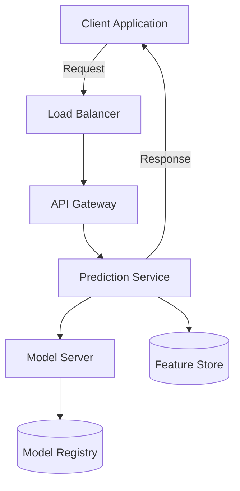
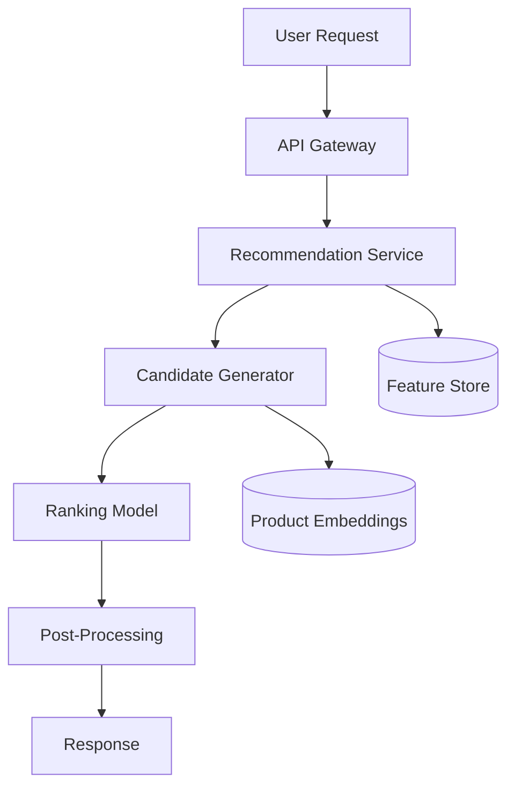
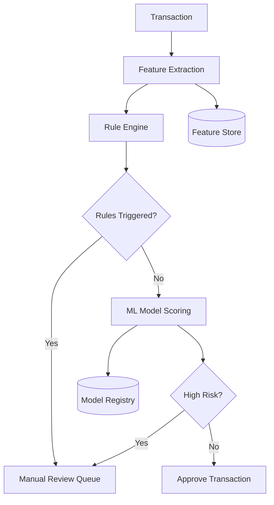

# ML System Design

## Introduction

Machine Learning System Design is a critical skill that bridges the gap between theoretical ML knowledge and practical implementation in production environments. Unlike coding interviews that test algorithmic knowledge or ML theory questions that assess understanding of concepts, ML system design challenges evaluate your ability to architect end-to-end solutions that solve real business problems.

In this guide, we'll explore the essential components, considerations, and best practices for designing robust machine learning systems that can scale and perform reliably in production.

## Why ML System Design Matters

Machine learning models don't exist in isolation. In real-world applications, they're part of larger systems with complex requirements:

- Processing data at scale
- Serving predictions with low latency
- Handling varying traffic patterns
- Monitoring model performance
- Managing model updates

A well-designed ML system addresses these challenges while delivering business value. This is why ML system design questions are increasingly common in interviews for ML engineer, data scientist, and ML research engineer positions.

## Core Components of ML System Design

Let's explore the key components that make up a typical ML system:


### 1. Data Collection and Management

Every ML system begins with data. This component addresses:

- **Data sources**: Where and how data is collected
- **Data storage**: How data is stored (databases, data lakes, etc.)
- **Data governance**: Policies for data access, security, and compliance

#### Example: Customer Churn Prediction System

For a customer churn prediction system, you might collect data from:
- Customer transactions
- Support ticket history
- Website/app usage logs
- Customer demographics

```python
# Example data collection pipeline using Python
def collect_customer_data():
    transaction_data = fetch_from_database("transactions")
    support_data = fetch_from_api("support_tickets")
    usage_data = fetch_from_logs("user_activity")
    
    # Combine data sources with customer IDs as keys
    combined_data = merge_data_sources(
        transaction_data, 
        support_data, 
        usage_data
    )
    
    return combined_data
```

### 2. Data Processing and Feature Engineering

Raw data must be transformed into features that ML models can use:

- **Data cleaning**: Handling missing values, outliers, duplicates
- **Feature transformation**: Scaling, encoding categorical variables
- **Feature selection**: Choosing relevant features

#### Code Example: Feature Engineering Pipeline

```python
import pandas as pd
from sklearn.preprocessing import StandardScaler, OneHotEncoder
from sklearn.compose import ColumnTransformer
from sklearn.pipeline import Pipeline
from sklearn.impute import SimpleImputer

# Define preprocessing for numerical columns
numerical_pipeline = Pipeline([
    ('imputer', SimpleImputer(strategy='median')),
    ('scaler', StandardScaler())
])

# Define preprocessing for categorical columns
categorical_pipeline = Pipeline([
    ('imputer', SimpleImputer(strategy='most_frequent')),
    ('onehot', OneHotEncoder(handle_unknown='ignore'))
])

# Combine preprocessing steps
def create_preprocessing_pipeline(numerical_cols, categorical_cols):
    preprocessor = ColumnTransformer(
        transformers=[
            ('num', numerical_pipeline, numerical_cols),
            ('cat', categorical_pipeline, categorical_cols)
        ])
    
    return preprocessor

# Example usage
numerical_features = ['account_age', 'transaction_count', 'avg_purchase_value']
categorical_features = ['subscription_type', 'device_type', 'customer_segment']

preprocessing_pipeline = create_preprocessing_pipeline(
    numerical_features, 
    categorical_features
)
```

### 3. Model Training and Selection

This component focuses on:

- **Model selection**: Choosing appropriate algorithms
- **Hyperparameter tuning**: Optimizing model parameters
- **Training infrastructure**: Managing computational resources

#### Code Example: Model Training with Cross-Validation

```python
from sklearn.ensemble import RandomForestClassifier
from sklearn.model_selection import GridSearchCV

def train_model(X_train, y_train):
    # Define model and hyperparameter space
    model = RandomForestClassifier(random_state=42)
    param_grid = {
        'n_estimators': [100, 200, 300],
        'max_depth': [None, 10, 20, 30],
        'min_samples_split': [2, 5, 10],
        'min_samples_leaf': [1, 2, 4]
    }
    
    # Set up cross-validation
    grid_search = GridSearchCV(
        estimator=model,
        param_grid=param_grid,
        cv=5,
        scoring='f1',
        n_jobs=-1
    )
    
    # Train model
    grid_search.fit(X_train, y_train)
    
    # Get best model
    best_model = grid_search.best_estimator_
    best_params = grid_search.best_params_
    
    print(f"Best parameters: {best_params}")
    return best_model
```

### 4. Model Evaluation

Before deployment, models must be rigorously evaluated:

- **Metrics selection**: Choosing appropriate evaluation metrics
- **Validation strategy**: Test sets, cross-validation, etc.
- **Business impact assessment**: Translating model performance to business value

#### Example: Evaluation for Different Business Contexts

```python
from sklearn.metrics import accuracy_score, precision_score, recall_score, f1_score
import numpy as np

def evaluate_model(model, X_test, y_test, cost_matrix=None):
    # Generate predictions
    y_pred = model.predict(X_test)
    
    # Calculate standard metrics
    metrics = {
        'accuracy': accuracy_score(y_test, y_pred),
        'precision': precision_score(y_test, y_pred),
        'recall': recall_score(y_test, y_pred),
        'f1_score': f1_score(y_test, y_pred)
    }
    
    # If cost matrix is provided, calculate business impact
    if cost_matrix is not None:
        # Example: cost_matrix[0,0]=TN, [0,1]=FP, [1,0]=FN, [1,1]=TP costs
        tn = np.sum((y_test == 0) & (y_pred == 0))
        fp = np.sum((y_test == 0) & (y_pred == 1))
        fn = np.sum((y_test == 1) & (y_pred == 0))
        tp = np.sum((y_test == 1) & (y_pred == 1))
        
        confusion_counts = [tn, fp, fn, tp]
        business_cost = sum(count * cost for count, cost in zip(
            confusion_counts, 
            cost_matrix.flatten()
        ))
        
        metrics['business_cost'] = business_cost
    
    return metrics

# Example usage for churn prediction
# Cost matrix: [TN cost, FP cost, FN cost, TP cost]
# FN is the most expensive (losing a customer without intervention)
churn_cost_matrix = np.array([
    [0, 10],    # TN: $0, FP: $10 (cost of retention offer to non-churning customer)
    [100, 5]    # FN: $100 (lost customer), TP: $5 (cost of successful retention)
])

evaluation_results = evaluate_model(
    churn_model, 
    X_test, 
    y_test, 
    churn_cost_matrix
)
```

### 5. Model Deployment

Deployment strategies vary based on use cases:

- **Batch prediction**: Generating predictions periodically
- **Online prediction**: Serving real-time predictions via APIs
- **Edge deployment**: Running models on edge devices

#### Example: Model Serving Architecture



#### Code Example: Flask API for Model Serving

```python
from flask import Flask, request, jsonify
import joblib
import numpy as np

app = Flask(__name__)

# Load model and preprocessing pipeline
model = joblib.load('churn_model.pkl')
preprocessor = joblib.load('preprocessor.pkl')

@app.route('/predict', methods=['POST'])
def predict():
    # Get request data
    data = request.get_json()
    
    # Convert to DataFrame
    input_df = pd.DataFrame([data])
    
    # Apply preprocessing
    processed_data = preprocessor.transform(input_df)
    
    # Make prediction
    prediction = model.predict_proba(processed_data)[0, 1]
    
    # Return result
    return jsonify({
        'customer_id': data.get('customer_id'),
        'churn_probability': float(prediction),
        'threshold': 0.5,
        'predicted_churn': bool(prediction > 0.5)
    })

if __name__ == '__main__':
    app.run(host='0.0.0.0', port=5000)
```

### 6. Monitoring and Maintenance

Once deployed, ML systems require continuous monitoring:

- **Performance monitoring**: Tracking model metrics over time
- **Drift detection**: Identifying changes in data patterns
- **Retraining strategy**: When and how to update models

#### Example: Data Drift Monitoring System

```python
import pandas as pd
from scipy.stats import ks_2samp

def detect_data_drift(reference_data, current_data, columns, threshold=0.05):
    """
    Detect data drift using Kolmogorov-Smirnov test
    
    Args:
        reference_data: Baseline data used for training
        current_data: New production data
        columns: Features to monitor
        threshold: p-value threshold for drift detection
    
    Returns:
        Dictionary of drifting features
    """
    drift_results = {}
    
    for column in columns:
        # Skip non-numeric columns
        if not pd.api.types.is_numeric_dtype(reference_data[column]):
            continue
            
        # Perform KS test
        ks_result = ks_2samp(
            reference_data[column].values,
            current_data[column].values
        )
        
        # Check if p-value indicates significant drift
        if ks_result.pvalue < threshold:
            drift_results[column] = {
                'p_value': ks_result.pvalue,
                'statistic': ks_result.statistic
            }
    
    return drift_results
```

## ML System Design Interview Framework

When tackling ML system design problems in interviews, follow this structured approach:

### 1. Clarify Requirements (3-5 minutes)

Start by asking questions to understand:
- Business objectives
- Constraints (latency, scale, etc.)
- Available data
- Success criteria

Example questions:
- "What's the primary business goal of this ML system?"
- "What's the expected scale in terms of data volume and request rate?"
- "Are there any latency requirements?"
- "What data is available to us?"

### 2. Define Metrics (2-3 minutes)

Propose appropriate evaluation metrics, considering:
- Technical metrics (accuracy, F1-score, etc.)
- Business metrics (revenue impact, user satisfaction, etc.)

Always explain why you chose each metric in the context of the problem.

### 3. Design Data Pipeline (5-7 minutes)

Outline how you'll:
- Collect and store data
- Clean and preprocess data
- Generate features
- Handle data splits (train/validation/test)

Be prepared to discuss:
- Data quality issues and solutions
- Feature engineering approaches
- Data versioning and lineage

### 4. Model Selection and Training (5-7 minutes)

Propose appropriate models considering:
- Problem type (classification, regression, ranking, etc.)
- Data characteristics
- Complexity vs. interpretability tradeoffs
- Training infrastructure needed

Discuss training details:
- Loss functions
- Optimization methods
- Hyperparameter tuning approach

### 5. Serving Infrastructure (5-7 minutes)

Design the deployment architecture considering:
- Inference latency requirements
- Scaling needs
- Batch vs. real-time serving

Discuss components like:
- Model servers
- Caching strategies
- Load balancing

### 6. Monitoring and Maintenance (3-5 minutes)

Explain how you'll:
- Monitor model performance
- Detect and handle data/concept drift
- Implement retraining pipelines
- Ensure model/data version control

### 7. Challenges and Mitigations (3-5 minutes)

Proactively discuss:
- Potential failure points
- Edge cases
- Scaling challenges
- Ethical considerations
- Mitigation strategies for each

## Real-World ML System Design Examples

### Example 1: Product Recommendation System

#### Problem Statement
Design an ML system to provide personalized product recommendations for an e-commerce platform.

#### Solution Approach

**1. Requirements Analysis**
- Business goal: Increase conversion rate and average order value
- Scale: 10M users, 100K products, 1000 requests/second at peak
- Latency: Recommendations must be served in `<200ms`

**2. Metrics**
- Technical: Precision@k, Recall@k, NDCG@k
- Business: Click-through rate, Conversion rate, Revenue lift

**3. Data Pipeline**
- Data sources:
  - User browsing history
  - Purchase history
  - Product metadata
  - User demographic information
- Feature engineering:
  - User embeddings from browsing patterns
  - Product embeddings from descriptions and categories
  - Temporal features (recency, frequency)

**4. Model Selection**
- Two-stage approach:
  - Candidate generation: Collaborative filtering or matrix factorization
  - Ranking: Gradient boosted decision trees or deep learning models
- Training strategy:
  - Offline training on historical data
  - Online fine-tuning with recent interactions

**5. Serving Infrastructure**



**6. Monitoring and Maintenance**
- A/B testing framework for new models
- Daily monitoring of recommendation diversity
- Weekly retraining pipeline

### Example 2: Fraud Detection System

#### Problem Statement
Design a real-time fraud detection system for a payment processing platform.

#### Solution Approach

**1. Requirements Analysis**
- Business goal: Reduce fraud while minimizing false positives
- Scale: Processing 1000 transactions per second
- Latency: Decisions needed in `<100ms`
- High cost of false negatives (fraud passes through)

**2. Metrics**
- Technical: Precision, Recall, F1-score, AUC-ROC
- Business: Fraud detection rate, False positive rate, Money saved

**3. Data Pipeline**
- Data sources:
  - Transaction details
  - User account information
  - Device information
  - Historical transaction patterns
- Feature engineering:
  - Aggregation features (transaction velocity)
  - Graph-based features (network connections)
  - Geospatial features (unusual locations)

**4. Model Selection**
- Ensemble approach:
  - Rule-based filters for known patterns
  - Anomaly detection for unusual behavior
  - Gradient boosted trees for classification
- Semi-supervised learning for adapting to new fraud patterns

**5. Serving Infrastructure**



**6. Monitoring and Maintenance**
- Real-time dashboards for fraud analysts
- Model retraining triggered by performance degradation
- Feedback loop from manual reviews

## Best Practices for ML System Design

### 1. Start Simple and Iterate

Begin with baseline models and simple architectures, then gradually add complexity as needed:

```python
# Start with a simple model as baseline
from sklearn.linear_model import LogisticRegression

baseline_model = LogisticRegression()
baseline_model.fit(X_train, y_train)
baseline_score = baseline_model.score(X_test, y_test)

print(f"Baseline model accuracy: {baseline_score:.4f}")

# Iterate with more complex models only if needed
```

### 2. Design for Scalability

Consider how your system will handle growing data volumes and user bases:

- Use distributed processing frameworks (Spark, Dask)
- Implement horizontal scaling for serving infrastructure
- Optimize heavy computations with caching

### 3. Plan for Monitoring from the Start

Build observability into your ML system from day one:

- Log predictions and features
- Track data distributions
- Monitor model performance metrics
- Set up alerts for drift or degradation

### 4. Consider the Entire ML Lifecycle

Address all phases of the ML lifecycle in your design:


### 5. Handle Edge Cases

Identify and address potential edge cases:

- Missing or corrupted data
- Extreme input values
- Unexpected user behavior
- System failures

## Common ML System Design Challenges

### Challenge 1: Data Quality Issues

**Problem**: Real-world data is often messy, incomplete, or biased.

**Solutions**:
- Implement robust data validation pipelines
- Create alerting for data quality issues
- Design fallback mechanisms for missing features

### Challenge 2: Model Staleness

**Problem**: Data patterns change over time, causing model performance to degrade.

**Solutions**:
- Implement data drift detection
- Schedule regular retraining
- Use online learning when appropriate

### Challenge 3: Serving at Scale

**Problem**: Serving ML models to millions of users with low latency.

**Solutions**:
- Model optimization (quantization, pruning)
- Efficient serving frameworks (TensorFlow Serving, ONNX Runtime)
- Caching strategies for common predictions

## Summary

ML System Design is about creating end-to-end solutions that solve business problems using machine learning. It requires a combination of ML expertise, software engineering skills, and system design knowledge.

Key takeaways:
1. Always start by clarifying the business requirements and constraints
2. Choose appropriate metrics that align with business goals
3. Design robust data pipelines that handle real-world data challenges
4. Select models that balance performance, complexity, and explainability
5. Create scalable serving infrastructure with appropriate latency
6. Implement comprehensive monitoring and maintenance systems
7. Plan for the entire ML lifecycle from the start

By following these principles and practices, you'll be well-prepared for ML system design interviews and able to build effective machine learning systems in production.

## Additional Resources

For further learning, consider exploring:

- **Books**:
  - "Designing Machine Learning Systems" by Chip Huyen
  - "Machine Learning Engineering" by Andriy Burkov
  - "Designing Data-Intensive Applications" by Martin Kleppmann

- **Online Courses**:
  - Full Stack Deep Learning
  - MLOps Specialization (Coursera)
  - Machine Learning Engineering for Production (Coursera)

- **Tools to Explore**:
  - MLflow for experiment tracking
  - Kubeflow for orchestration
  - TensorFlow Extended (TFX) for pipelines
  - Weights & Biases for experiment tracking

## Practice Exercises

1. Design a content recommendation system for a streaming platform
2. Create an ML system for predictive maintenance in manufacturing
3. Design a real-time pricing system for a ride-sharing application
4. Develop a system for detecting toxic comments in an online community
5. Design a demand forecasting system for a retail chain

By working through these exercises, you'll build the practical experience needed to excel in ML system design interviews and real-world ML engineering roles.