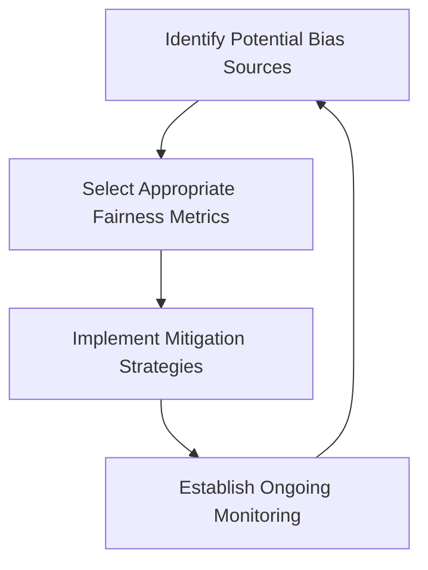

# Ethical AI Questions

## Introduction

As artificial intelligence systems become increasingly integrated into our daily lives, the ethical implications of these technologies have gained significant attention. Machine learning engineers and AI practitioners are now expected to not only understand technical concepts but also to thoughtfully consider the ethical dimensions of the systems they build.

This guide examines common ethical AI questions you might encounter during machine learning interviews, equipping you with frameworks to approach these complex topics thoughtfully and comprehensively.

## Why Ethics Matter in AI Interviews

Companies are increasingly concerned about the ethical implications of their AI systems for several reasons:

1. **Public Trust** - Ethical failures can severely damage brand reputation and user trust
2. **Regulatory Compliance** - Growing legislation around AI governance and transparency
3. **Risk Mitigation** - Preventing harmful outcomes that could lead to legal liability
4. **Stakeholder Expectations** - Investors, employees, and customers increasingly demand ethical AI practices

Demonstrating ethical awareness in interviews shows that you understand the full impact of your technical decisions.

## Common Ethical AI Interview Questions

### 1. Bias and Fairness

#### Sample Question:
*"How would you ensure a machine learning model is fair and doesn't discriminate against certain groups?"*

#### Approach:
When answering questions about bias and fairness, consider the following framework:



#### Example Answer:
"I would approach fairness in ML systems through multiple stages:

First, I'd identify potential sources of bias in our data, which might include:
- Underrepresented groups in training data
- Historical biases reflected in data collection
- Proxy variables that correlate with protected attributes

Second, I'd select appropriate fairness metrics relevant to the problem context. For example:

```python
# Example of calculating demographic parity
from aif360.metrics import BinaryLabelDatasetMetric

privileged_groups = [{'race': 1}]
unprivileged_groups = [{'race': 0}]

metric = BinaryLabelDatasetMetric(dataset, 
                                 unprivileged_groups=unprivileged_groups,
                                 privileged_groups=privileged_groups)

# Statistical parity difference (should be close to 0 for fairness)
print(f"Statistical parity difference: {metric.statistical_parity_difference()}")
```

Third, I'd implement mitigation strategies appropriate for our system:
- Pre-processing techniques to balance training data
- In-processing constraints during model training
- Post-processing adjustments to model outputs

Finally, I'd establish ongoing monitoring since fairness isn't a one-time fix but requires continuous evaluation."

### 2. Privacy and Data Protection

#### Sample Question:
*"How would you design a recommendation system that respects user privacy?"*

#### Example Answer:
"When designing privacy-preserving recommendation systems, I'd consider several approaches:

**Federated Learning**: Train models on user devices without transferring raw data to central servers.

```python
# Pseudocode for federated learning approach
def train_federated_model():
    global_model = initialize_model()
    
    for round in range(num_rounds):
        # Select subset of user devices
        selected_users = select_users(available_users)
        
        # Each user trains locally on their data
        user_models = []
        for user in selected_users:
            local_model = train_locally(global_model.copy(), user.data)
            user_models.append(local_model)
        
        # Aggregate user models (e.g., using weighted averaging)
        global_model = aggregate_models(user_models)
    
    return global_model
```

**Differential Privacy**: Add calibrated noise to data or model outputs to provide mathematical privacy guarantees.

**Data Minimization**: Only collect and use the minimum amount of data necessary for the recommendation task.

**Transparent Controls**: Give users clear information about what data is being used and provide opt-out mechanisms.

I'd also ensure compliance with relevant regulations like GDPR or CCPA, implementing data retention policies, encryption, and access controls."

### 3. Transparency and Explainability

#### Sample Question:
*"When would you choose an interpretable model over a black-box model with higher accuracy?"*

#### Example Answer:
"The decision between interpretability and accuracy involves several considerations:

I would favor interpretable models when:

- **High-Stakes Decisions**: Applications involving healthcare, criminal justice, or financial lending where understanding the 'why' behind decisions is crucial
- **Regulatory Requirements**: Industries with legal requirements for explanations (like GDPR's 'right to explanation')
- **Debugging Necessity**: When we need to understand model failures to improve performance
- **Trust Building**: When user or stakeholder trust is paramount

For example, in a lending decision system, a slightly less accurate but interpretable model might be preferable:

```python
# Example of an interpretable model with LIME explanation
from lime.lime_tabular import LimeTabularExplainer

# Train a model (e.g., Random Forest instead of a deep neural network)
model = RandomForestClassifier()
model.fit(X_train, y_train)

# Create explainer
explainer = LimeTabularExplainer(X_train, 
                                feature_names=feature_names,
                                class_names=['Deny', 'Approve'])

# Get explanation for a specific prediction
explanation = explainer.explain_instance(X_test[0], model.predict_proba)

# Visualize the explanation
explanation.show_in_notebook()
```

Conversely, I might accept lower interpretability when:
- The task has minimal risk (e.g., product recommendations)
- Performance differences are extremely significant
- We can implement other guardrails like human oversight

The key is balancing these factors contextually rather than treating it as a binary choice."

### 4. Accountability and Governance

#### Sample Question:
*"How would you implement an AI governance framework for a new ML project?"*

#### Example Answer:
"Implementing AI governance requires a structured approach across the entire ML lifecycle:

**1. Risk Assessment and Classification**
- Categorize the project based on potential impact (low, medium, high risk)
- Conduct stakeholder analysis to identify affected groups

**2. Documentation Requirements**
- Create model cards documenting intended use cases, limitations, and performance characteristics
- Implement data provenance tracking

```python
# Example model card documentation structure
model_card = {
    "model_details": {
        "name": "Customer Churn Predictor v1.0",
        "type": "XGBoost Classification Model",
        "version": "1.0",
        "owners": ["Data Science Team"]
    },
    "intended_use": {
        "primary_uses": ["Predict customer churn risk"],
        "out_of_scope_uses": ["Automated account closure without human review"]
    },
    "factors": {
        "relevant_factors": ["Usage patterns", "Customer service interactions"],
        "evaluation_factors": ["Performance across customer segments"]
    },
    "metrics": {
        "performance_measures": ["Accuracy", "F1-score", "AUC"],
        "decision_thresholds": "Default: 0.75"
    },
    "evaluation_data": {
        "datasets": ["Internal customer dataset 2023Q1-Q2"],
        "motivation": "Representative of current customer base",
        "preprocessing": "Standard scaling, null imputation"
    },
    "training_data": {
        "datasets": ["Internal customer dataset 2020-2022"],
        "motivation": "Historical patterns of churn behavior"
    },
    "ethical_considerations": {
        "potential_biases": ["Lower accuracy for new customers with limited history"],
        "mitigation_strategies": ["Separate models for different customer tenure"]
    }
}
```

**3. Review and Approval Processes**
- Establish cross-functional review teams (technical and domain experts)
- Create staged approval gates before deployment

**4. Monitoring and Maintenance**
- Implement drift detection and performance degradation alerts
- Schedule regular audits and reassessments

**5. Incident Response Plan**
- Create clear procedures for addressing failures or unintended consequences
- Establish responsibility chains for quick response

This framework should be right-sized to the organization and project—more rigorous for high-risk applications but streamlined enough to not impede innovation for lower-risk use cases."

### 5. Environmental Impact

#### Sample Question:
*"How would you address the carbon footprint of training large ML models?"*

#### Example Answer:
"The environmental impact of ML is an increasingly important ethical consideration. To address the carbon footprint of large model training, I would implement several strategies:

**1. Efficiency-Focused Architecture Design**
- Prefer efficient architectures over brute-force scaling
- Utilize techniques like knowledge distillation to create smaller models that approximate larger ones

**2. Compute-Efficient Training Methods**
- Implement transfer learning to leverage pre-trained models
- Use mixed precision training to reduce computational requirements

```python
# Example of mixed precision training with PyTorch
from torch.cuda.amp import autocast, GradScaler

# Create gradient scaler
scaler = GradScaler()

for epoch in range(num_epochs):
    for data, target in train_loader:
        data, target = data.to(device), target.to(device)
        optimizer.zero_grad()
        
        # Use autocast to enable mixed precision
        with autocast():
            output = model(data)
            loss = loss_function(output, target)
        
        # Scale gradients and perform optimization
        scaler.scale(loss).backward()
        scaler.step(optimizer)
        scaler.update()
```

**3. Hardware Selection and Scheduling**
- Choose energy-efficient hardware (e.g., newer GPU generations)
- Schedule training during periods of lower energy demand or when renewable energy availability is higher
- Use cloud providers with strong sustainability commitments

**4. Carbon Tracking and Reporting**
- Implement tools to measure and report carbon emissions from training
- Set carbon budgets for projects and track against them

**5. Research Investment**
- Allocate resources to research on more efficient algorithms and training methods
- Participate in industry initiatives focused on sustainable AI

This multi-faceted approach acknowledges that environmental impact is a system-level concern requiring both technical and organizational solutions."

## Philosophical Frameworks for Ethical AI

When approaching ethical questions in interviews, it can be helpful to reference established ethical frameworks:

### Consequentialism
Focuses on the outcomes and impacts of AI systems. Are the benefits greater than the harms?

### Deontological Ethics
Emphasizes rules and duties. What principles should AI systems never violate?

### Virtue Ethics 
Centers on the character and intentions behind AI development. What values should guide our work?

### Justice and Fairness
Considers the distribution of benefits and harms. Who benefits and who is burdened by this technology?

Referencing these frameworks demonstrates depth of thinking beyond superficial ethical considerations.

## How to Prepare for Ethical AI Questions

1. **Study Real Cases**: Familiarize yourself with well-known AI ethics failures and successes
2. **Practice Structured Responses**: Develop frameworks for addressing common ethical scenarios
3. **Consider Multiple Perspectives**: Think through how different stakeholders might view the same issue
4. **Stay Current**: Follow developments in AI ethics and regulation
5. **Reflect on Your Values**: Understand your own ethical principles regarding technology

## Summary

Ethical considerations are becoming increasingly important in machine learning interviews as organizations recognize the potential impacts of AI systems. Being prepared to thoughtfully address questions about bias, privacy, transparency, accountability, and environmental impact demonstrates your maturity as an AI practitioner.

Remember that ethical questions rarely have simple "right answers." Instead, interviewers are typically looking for:
- Your ability to recognize ethical dimensions of technical decisions
- Structured approaches to addressing complex ethical challenges
- Awareness of relevant frameworks, tools, and techniques
- Balanced consideration of different stakeholder perspectives

By approaching these topics thoughtfully, you show potential employers that you understand that building AI systems is not just a technical challenge but also a responsibility to users and society.

## Additional Resources

### Books
- "Ethics of Artificial Intelligence and Robotics" by Vincent C. Müller
- "Weapons of Math Destruction" by Cathy O'Neil
- "Algorithms of Oppression" by Safiya Umoja Noble

### Organizations
- The IEEE Global Initiative on Ethics of Autonomous and Intelligent Systems
- AI Ethics Lab
- The Partnership on AI

### Technical Tools
- Fairness Indicators (TensorFlow)
- AI Fairness 360 (IBM)
- InterpretML (Microsoft)
- What-If Tool (Google)

### Practice Exercise

Analyze an AI system you're familiar with (or one you've built) using the following questions:

1. Who could be harmed or benefited by this system?
2. What assumptions are embedded in the training data?
3. How transparent are the system's decisions to end users?
4. What monitoring would detect if the system begins acting unfairly?
5. How would you explain the system's decisions to someone affected by them?

Document your analysis and consider how you might redesign aspects of the system to address any ethical concerns you identify.