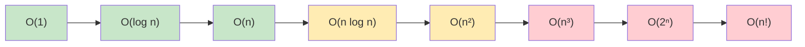

# Algorithm Analysis

## Introduction

Algorithm analysis is the process of evaluating an algorithm's efficiency and performance characteristics. When solving programming problems, there are often multiple solutions with varying levels of efficiency. Understanding how to analyze algorithms helps you choose the best solution for your specific needs.

In this guide, we'll explore how to analyze algorithms in terms of:
- Time complexity (how long an algorithm takes to run)
- Space complexity (how much memory an algorithm uses)
- Big O notation (a mathematical way to describe algorithm efficiency)

## Why Algorithm Analysis Matters

Imagine you have two algorithms that solve the same problem:
- Algorithm A takes 1 second to process 100 elements
- Algorithm B takes 10 seconds to process 100 elements

For small inputs, the difference might seem negligible. But what happens when we scale up?

- With 10,000 elements, Algorithm A might take 10 seconds
- With 10,000 elements, Algorithm B might take 27 hours!

This dramatic difference demonstrates why algorithm analysis is crucial for building efficient software, especially at scale.

## Time Complexity

Time complexity measures how the runtime of an algorithm grows as the input size increases.

### Common Time Complexities

Here are the most common time complexities, from most to least efficient:

| Notation | Name | Description |
|----------|------|-------------|
| O(1) | Constant | Runtime doesn't change with input size |
| O(log n) | Logarithmic | Runtime grows logarithmically with input size |
| O(n) | Linear | Runtime grows linearly with input size |
| O(n log n) | Linearithmic | Common in efficient sorting algorithms |
| O(n²) | Quadratic | Common in nested loops |
| O(n³) | Cubic | Common in algorithms with three nested loops |
| O(2ⁿ) | Exponential | Runtime doubles with each additional element |
| O(n!) | Factorial | Runtime grows factorially with input size |

### Visualizing Growth Rates



## Big O Notation

Big O notation is a mathematical notation that describes the limiting behavior of a function when the argument tends towards a particular value or infinity. In algorithm analysis, it represents the **worst-case** time complexity.

### Basic Rules of Big O

1. **Ignore constants**: O(2n) simplifies to O(n)
2. **Ignore lower-order terms**: O(n² + n) simplifies to O(n²)
3. **Focus on dominant terms**: When operations are performed sequentially, we take the largest complexity

### Examples of Big O Analysis

Let's analyze some simple code snippets:

#### Example 1: Constant Time O(1)

```javascript
function getFirstElement(array) {
  return array[0]; // Always takes the same amount of time regardless of array size
}
```

**Explanation**: This function accesses an array element directly by index, which takes the same amount of time regardless of the array's size.

#### Example 2: Linear Time O(n)

```javascript
function findElement(array, target) {
  for (let i = 0; i < array.length; i++) {
    if (array[i] === target) {
      return i;
    }
  }
  return -1;
}
```

**Explanation**: In the worst case, we might need to check every element in the array, so the time complexity grows linearly with the input size.

#### Example 3: Quadratic Time O(n²)

```javascript
function hasDuplicates(array) {
  for (let i = 0; i < array.length; i++) {
    for (let j = i + 1; j < array.length; j++) {
      if (array[i] === array[j]) {
        return true;
      }
    }
  }
  return false;
}
```

**Explanation**: This function has nested loops where each loop iterates through the array, resulting in n × n = n² comparisons in the worst case.

#### Example 4: Logarithmic Time O(log n)

```javascript
function binarySearch(sortedArray, target) {
  let left = 0;
  let right = sortedArray.length - 1;
  
  while (left <= right) {
    let mid = Math.floor((left + right) / 2);
    
    if (sortedArray[mid] === target) {
      return mid;
    } else if (sortedArray[mid] < target) {
      left = mid + 1;
    } else {
      right = mid - 1;
    }
  }
  
  return -1;
}
```

**Explanation**: Binary search cuts the search space in half with each iteration, resulting in logarithmic time complexity.

## Space Complexity

Space complexity measures how much additional memory an algorithm needs as input size increases.

### Common Space Complexities

- **O(1) - Constant Space**: Uses a fixed amount of memory regardless of input size
- **O(n) - Linear Space**: Memory use grows linearly with input size
- **O(n²) - Quadratic Space**: Memory use grows quadratically with input size

### Example: Analyzing Space Complexity

```javascript
function createPairs(array) {
  const pairs = []; // This array will grow based on input size
  
  for (let i = 0; i < array.length; i++) {
    for (let j = 0; j < array.length; j++) {
      pairs.push([array[i], array[j]]);
    }
  }
  
  return pairs;
}
```

**Explanation**: For an input array of size n, this function creates n² pairs, requiring O(n²) additional space.

## Real-World Applications

### Case Study: Choosing the Right Sorting Algorithm

Imagine you're developing:
1. A real-time data processing system for millions of records
2. A small educational app that sorts a list of student names

For the first case, you'd need an efficient algorithm like Merge Sort or Quick Sort (O(n log n)).
For the second case, simpler algorithms like Insertion Sort might be acceptable despite being O(n²) for small inputs.

### Optimizing a Search Function

Consider a social media app that needs to find users by name:

**Naive Approach (O(n)):**
```javascript
function findUser(users, name) {
  for (const user of users) {
    if (user.name === name) {
      return user;
    }
  }
  return null;
}
```

**Optimized Approach (O(1) average case with hash tables):**
```javascript
function findUserOptimized(userMap, name) {
  return userMap.get(name) || null;
}

// Setup (done once)
const userMap = new Map();
for (const user of users) {
  userMap.set(user.name, user);
}
```

By using a hash map data structure, we can achieve constant-time lookups in the average case, dramatically improving performance for large user bases.

## Common Algorithm Complexities

| Algorithm | Time Complexity (Average) | Time Complexity (Worst) | Space Complexity |
|-----------|---------------------------|-------------------------|------------------|
| Binary Search | O(log n) | O(log n) | O(1) |
| Bubble Sort | O(n²) | O(n²) | O(1) |
| Merge Sort | O(n log n) | O(n log n) | O(n) |
| Quick Sort | O(n log n) | O(n²) | O(log n) |
| Breadth-First Search | O(V + E)* | O(V + E)* | O(V) |
| Depth-First Search | O(V + E)* | O(V + E)* | O(V) |

*V = number of vertices, E = number of edges in a graph

## Tips for Writing Efficient Algorithms

1. **Understand the problem domain**: Sometimes domain knowledge can lead to shortcuts
2. **Choose appropriate data structures**: The right data structure can drastically improve performance
3. **Avoid unnecessary work**: Don't recalculate values you already have
4. **Look for mathematical properties**: Many problems have mathematical shortcuts
5. **Consider space-time tradeoffs**: Sometimes using more memory can reduce processing time

## Analyzing Your Own Algorithms

Follow these steps to analyze any algorithm:

1. Identify the input and what causes the algorithm to do more work
2. Count the basic operations for each input size
3. Express this count as a function of the input size
4. Simplify the function using Big O notation

## Summary

Algorithm analysis is essential for writing efficient code, especially as applications scale. Understanding time and space complexity helps you:

- Compare different solutions to the same problem
- Predict how your code will perform with larger inputs
- Make informed decisions about algorithm selection
- Optimize critical parts of your application

By mastering algorithm analysis, you can write more efficient code and become a more effective programmer.

## Exercises

1. What is the time complexity of the following function?
```javascript
function mystery(n) {
  let count = 0;
  for (let i = 0; i < n; i++) {
    for (let j = 0; j < i; j++) {
      count++;
    }
  }
  return count;
}
```

2. Implement a function to find the maximum element in an array with O(n) time complexity.

3. Compare the time complexity of bubble sort and merge sort for arrays of different sizes.

4. Design an algorithm to check if a string is a palindrome with O(1) space complexity (excluding the input).

## Further Reading

- "Introduction to Algorithms" by Cormen, Leiserson, Rivest, and Stein
- "Algorithms" by Robert Sedgewick and Kevin Wayne
- "Grokking Algorithms" by Aditya Bhargava (for beginners)