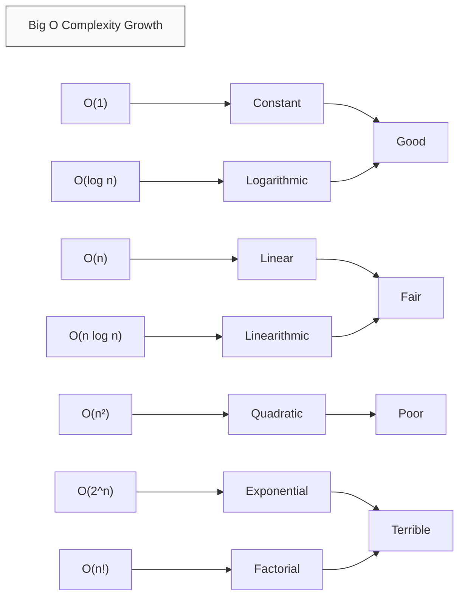

# Big O Notation

## Introduction

Have you ever wondered why some code runs lightning-fast while other code takes forever? Or why your program works fine with small inputs but crashes with larger ones? The answer lies in understanding **Big O Notation** - a fundamental concept in computer science that helps us analyze and compare the efficiency of algorithms.

Big O Notation gives us a standardized language to talk about how an algorithm's performance scales as the input size grows. It focuses on the worst-case scenario and helps us identify potential bottlenecks before they become problems.

## What is Big O Notation?

Big O Notation describes the upper bound of an algorithm's time or space requirements relative to its input size. It answers questions like:

- How does execution time increase as data size grows?
- How much memory will my algorithm need for larger inputs?
- Which of these two implementations is more efficient?

Instead of measuring time in seconds (which varies by hardware), Big O measures the number of basic operations (comparisons, assignments, etc.) as a function of input size.

## Common Big O Complexities

Let's explore the most common time complexities, from fastest to slowest:

### O(1) - Constant Time

An algorithm with O(1) complexity takes the same amount of time regardless of input size. These are the most efficient algorithms possible.

```javascript
function getFirstElement(array) {
  return array[0]; // Always one operation, regardless of array size
}
```

### O(log n) - Logarithmic Time

These algorithms reduce the problem size by a fraction (usually half) in each step. They're commonly found in divide-and-conquer strategies.

```javascript
function binarySearch(sortedArray, target) {
  let left = 0;
  let right = sortedArray.length - 1;
  
  while (left <= right) {
    let mid = Math.floor((left + right) / 2);
    
    if (sortedArray[mid] === target) {
      return mid; // Found the target
    } else if (sortedArray[mid] < target) {
      left = mid + 1; // Search in the right half
    } else {
      right = mid - 1; // Search in the left half
    }
  }
  
  return -1; // Target not found
}

// Input: [1, 3, 5, 7, 9, 11, 13, 15], 7
// Output: 3 (index of the target)
```

### O(n) - Linear Time

These algorithms process each input element exactly once. The time increases linearly with input size.

```javascript
function findMaximum(array) {
  let max = array[0];
  
  for (let i = 1; i < array.length; i++) {
    if (array[i] > max) {
      max = array[i];
    }
  }
  
  return max;
}

// Input: [3, 7, 2, 9, 1]
// Output: 9
```

### O(n log n) - Linearithmic Time

Often seen in efficient sorting algorithms, these combine linear and logarithmic behaviors.

```javascript
function mergeSort(array) {
  // Base case
  if (array.length <= 1) {
    return array;
  }
  
  // Divide array in half
  const middle = Math.floor(array.length / 2);
  const left = array.slice(0, middle);
  const right = array.slice(middle);
  
  // Recursively sort both halves and merge
  return merge(mergeSort(left), mergeSort(right));
}

function merge(left, right) {
  let result = [];
  let leftIndex = 0;
  let rightIndex = 0;
  
  // Compare elements and merge
  while (leftIndex < left.length && rightIndex < right.length) {
    if (left[leftIndex] < right[rightIndex]) {
      result.push(left[leftIndex]);
      leftIndex++;
    } else {
      result.push(right[rightIndex]);
      rightIndex++;
    }
  }
  
  // Add remaining elements
  return result.concat(left.slice(leftIndex)).concat(right.slice(rightIndex));
}

// Input: [38, 27, 43, 3, 9, 82, 10]
// Output: [3, 9, 10, 27, 38, 43, 82]
```

### O(n²) - Quadratic Time

These algorithms have nested iterations over the input, making them inefficient for large datasets.

```javascript
function bubbleSort(array) {
  for (let i = 0; i < array.length; i++) {
    for (let j = 0; j < array.length - i - 1; j++) {
      if (array[j] > array[j + 1]) {
        // Swap elements
        [array[j], array[j + 1]] = [array[j + 1], array[j]];
      }
    }
  }
  return array;
}

// Input: [5, 3, 8, 4, 2]
// Output: [2, 3, 4, 5, 8]
```

### O(2^n) - Exponential Time

The runtime doubles with each additional input element. These algorithms become impractical very quickly.

```javascript
function fibonacci(n) {
  if (n <= 1) return n;
  return fibonacci(n - 1) + fibonacci(n - 2);
}

// Input: 6
// Output: 8 (The 6th Fibonacci number)
```

### O(n!) - Factorial Time

These are the slowest algorithms, often involving generating all permutations of the input.

```javascript
function permutations(array) {
  // Base case
  if (array.length <= 1) {
    return [array];
  }
  
  let result = [];
  
  // Try each element as first item
  for (let i = 0; i < array.length; i++) {
    // Get current element
    const current = array[i];
    
    // Get array without current element
    const remaining = array.slice(0, i).concat(array.slice(i + 1));
    
    // Generate all permutations of remaining elements
    const remainingPerms = permutations(remaining);
    
    // Add current element to beginning of each permutation
    for (const perm of remainingPerms) {
      result.push([current, ...perm]);
    }
  }
  
  return result;
}

// Input: [1, 2, 3]
// Output: [[1,2,3], [1,3,2], [2,1,3], [2,3,1], [3,1,2], [3,2,1]]
```

## Visualizing Big O Complexities

Let's visualize how different complexities grow with input size:



## Big O Complexity Chart

Let's see how different algorithms scale with input size:

| Complexity | n=10 | n=100  | n=1000  | Example Algorithm  |
|------------|------|--------|---------|--------------------|
| O(1)       | 1    | 1      | 1       | Array access       |
| O(log n)   | 3    | 7      | 10      | Binary search      |
| O(n)       | 10   | 100    | 1000    | Linear search      |
| O(n log n) | 30   | 700    | 10000   | Merge sort         |
| O(n²)      | 100  | 10000  | 10^6    | Bubble sort        |
| O(2^n)     | 1024 | 2^100  | 2^1000  | Fibonacci (naive)  |
| O(n!)      | 3.6M | 10^158 | 10^2567 | Traveling salesman |

## Analyzing Your Own Code

Here's a step-by-step process to determine the Big O complexity of your code:

1. Identify the input(s) that affect running time
2. Count operations for each input size
3. Express the count as a function of input size
4. Drop coefficients and lower-order terms
5. Keep only the highest-order term

Let's practice with an example:

```javascript
function exampleFunction(array) {
  let sum = 0;                        // O(1)
  
  // First loop
  for (let i = 0; i < array.length; i++) {
    sum += array[i];                  // O(n)
  }
  
  // Second loop
  for (let i = 0; i < array.length; i++) {
    for (let j = 0; j < array.length; j++) {
      console.log(array[i], array[j]); // O(n²)
    }
  }
  
  return sum;                         // O(1)
}
```

Analysis:
1. The first loop runs n times, giving O(n)
2. The nested loop runs n² times, giving O(n²)
3. Total: O(1 + n + n² + 1) = O(n²)

## Common Pitfalls and Tips

### 1. Focus on the Dominant Term

When analyzing complex code, focus on the part that grows fastest. For example, if you have O(n) + O(n²), the overall complexity is O(n²).

### 2. Beware of Hidden Loops

Some operations have hidden complexity:
- `Array.sort()` is usually O(n log n)
- `Array.indexOf()` is O(n)
- String concatenation can be O(n²) if done repeatedly in a loop

### 3. Consider Average vs. Worst Case

Big O focuses on worst-case scenarios, but sometimes average-case performance is more relevant:
- QuickSort: Worst case O(n²), Average case O(n log n)
- Hash table lookup: Worst case O(n), Average case O(1)

## Real-World Applications

### Example 1: Social Media Feed

When building a social media app, you might consider:

```javascript
// O(n) - Linear approach (check every post)
function findPostsWithHashtag(posts, hashtag) {
  return posts.filter(post => post.hashtags.includes(hashtag));
}

// O(1) - Constant time approach (using a hashmap)
function findPostsWithHashtag(hashtagIndex, hashtag) {
  return hashtagIndex[hashtag] || [];
}
```

The second approach requires preprocessing to build the index but makes retrieval much faster.

### Example 2: E-commerce Product Search

In an e-commerce platform:

```javascript
// O(n²) implementation - Checks every product against every filter
function filterProducts(products, filters) {
  return products.filter(product => {
    for (const filter of filters) {
      if (!matchesFilter(product, filter)) {
        return false;
      }
    }
    return true;
  });
}

// O(n) implementation using indexed data
function filterProducts(productIndexes, filters) {
  // Start with all products
  let matchingProductIds = new Set(productIndexes.allIds);
  
  // Intersect with each filter's matches
  for (const filter of filters) {
    const filterMatches = productIndexes.byFilter[filter.type][filter.value];
    matchingProductIds = new Set(
      [...matchingProductIds].filter(id => filterMatches.has(id))
    );
  }
  
  return Array.from(matchingProductIds).map(id => productIndexes.byId[id]);
}
```

The second approach allows for much faster filtering when dealing with thousands of products.

## Space Complexity

So far, we've focused on time complexity, but space complexity (memory usage) is equally important. The same Big O notation applies:

```javascript
// O(n) space complexity
function createDoubledArray(array) {
  const doubled = [];                    // New array
  for (let i = 0; i < array.length; i++) {
    doubled.push(array[i] * 2);          // Grows linearly with input
  }
  return doubled;
}

// O(1) space complexity
function sumArray(array) {
  let sum = 0;                           // Single variable, fixed space
  for (let i = 0; i < array.length; i++) {
    sum += array[i];                     // No extra space needed
  }
  return sum;
}
```

## Trade-offs: Time vs. Space

Often, you can trade time for space:

```javascript
// Time: O(n²), Space: O(1)
function hasDuplicatesSlow(array) {
  for (let i = 0; i < array.length; i++) {
    for (let j = i + 1; j < array.length; j++) {
      if (array[i] === array[j]) return true;
    }
  }
  return false;
}

// Time: O(n), Space: O(n)
function hasDuplicatesFast(array) {
  const seen = new Set();
  for (let item of array) {
    if (seen.has(item)) return true;
    seen.add(item);
  }
  return false;
}
```

The second approach is faster but requires more memory.

## Summary

Big O Notation provides a standardized way to analyze and compare algorithm efficiency. Here's what we've learned:

- Big O describes how performance scales with input size
- Common complexities: O(1), O(log n), O(n), O(n log n), O(n²), O(2^n), O(n!)
- When analyzing code, focus on the dominant term and be aware of hidden operations
- Consider both time and space complexity when designing algorithms
- Often, you can trade time complexity for space complexity (or vice versa)

Understanding Big O helps you write more efficient code, make better algorithmic choices, and predict performance issues before they occur.

## Practice Exercises

1. Determine the time complexity of the following function:
   ```javascript
   function mystery(n) {
     let result = 0;
     for (let i = 1; i <= n; i *= 2) {
       result += i;
     }
     return result;
   }
   ```

2. Improve the time complexity of this function:
   ```javascript
   function findDuplicate(array) {
     for (let i = 0; i < array.length; i++) {
       for (let j = i + 1; j < array.length; j++) {
         if (array[i] === array[j]) {
           return array[i];
         }
       }
     }
     return null;
   }
   ```

3. Write a function to find the pair of numbers in an array that sum to a given target. Aim for O(n) time complexity.

## Additional Resources

For deeper learning, explore these topics:

- Amortized analysis
- Big Theta and Big Omega notation
- Algorithm design paradigms (divide and conquer, dynamic programming)
- Data structure efficiency

Remember, the goal isn't always to achieve the theoretically optimal solution. In real-world programming, readability, maintainability, and development time are also important considerations. Use Big O as a tool to make informed decisions, not as an absolute rule.